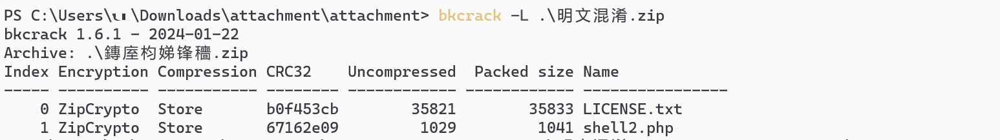
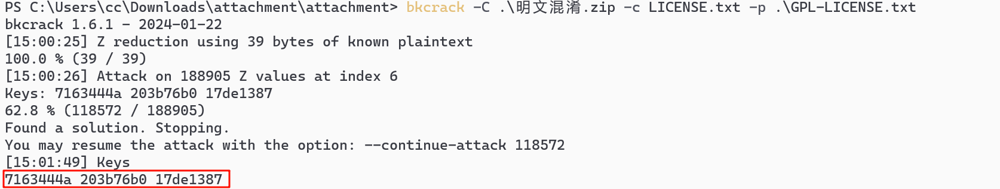
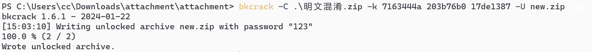
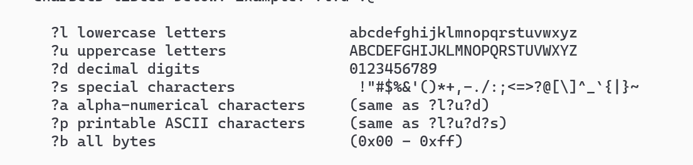
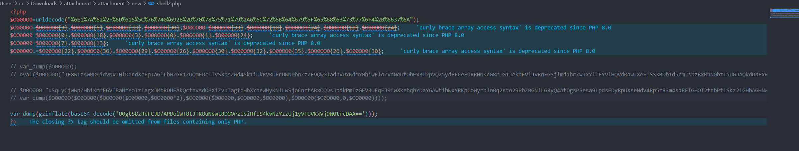
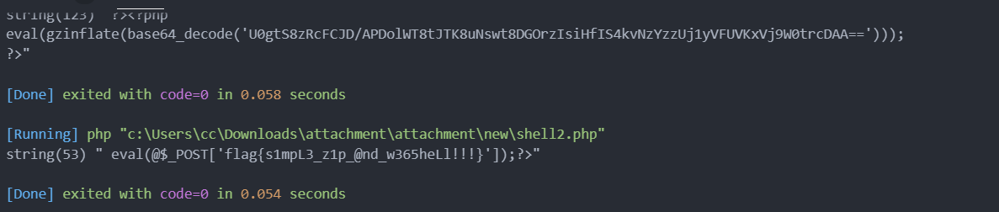

# 明文混淆

## 知识点

`明文攻击`

`webshell分析`

`bkcrack`

## 解题

首先拿到一个`attachment.zip的压缩包`，根据题目提示猜测为`明文攻击`

但是没有给已知明文文件，看一下里面有什么文件



可以看到有`LICENSE.txt`和`shell2.php`文件

`LICENSE.txt`文件大小为`35821`，一般来说`license`文件区别不大，我们就可以按照文件大小去对应`google`查一下

找到一个`GPL`的`license`文件，下载下来后进行明文攻击

注:完整的文件破解不出来之后删除到只剩共性的`GNU GENERAL PUBLIC LICENSE`，继续破解



找到`key`之后可以破解密码也可以直接重写压缩包并自定义密码，一般重写压缩包即可

### 重写压缩包

以下命令代表根据爆破出来的`key`重写压缩包，压缩包名为`new.zip`,密码为`123`

```bash
bkcrack -C .\明文混淆.zip -k 7163444a 203b76b0 17de1387 -U new.zip 123
```



### 破解密码

以下命令代表获取压缩包密码，`10-14`位之间，`?p`为全部密码字符集，`?a`为字符串密码字符集



```
bkcrack -C .\明文混淆.zip -k 7163444a 203b76b0 17de1387 -r 10..14 ?p
# 部分地方会用到转义符
bkcrack -C .\明文混淆.zip -k 7163444a 203b76b0 17de1387 -r 10..14 \?p
```

最后分析`shell.php`时逐步输出变量，最后即可获取`flag`



