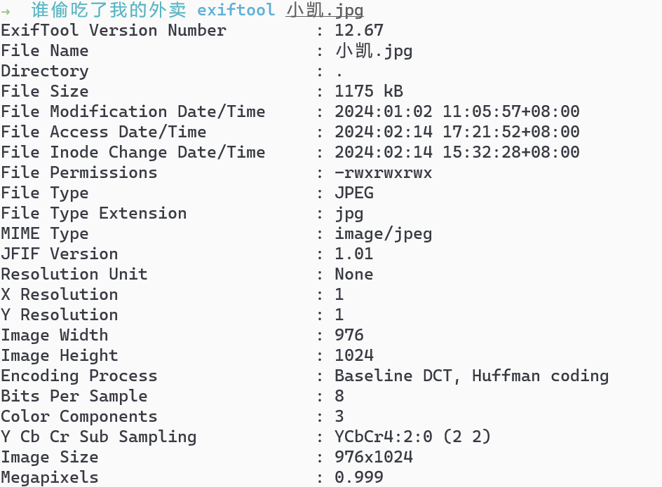
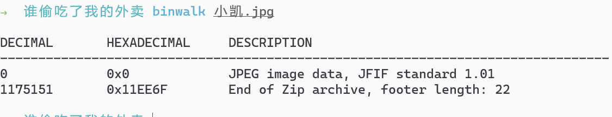
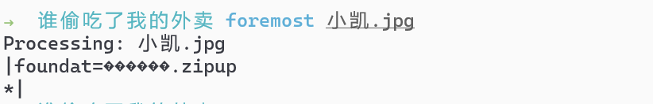
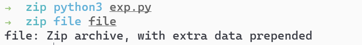
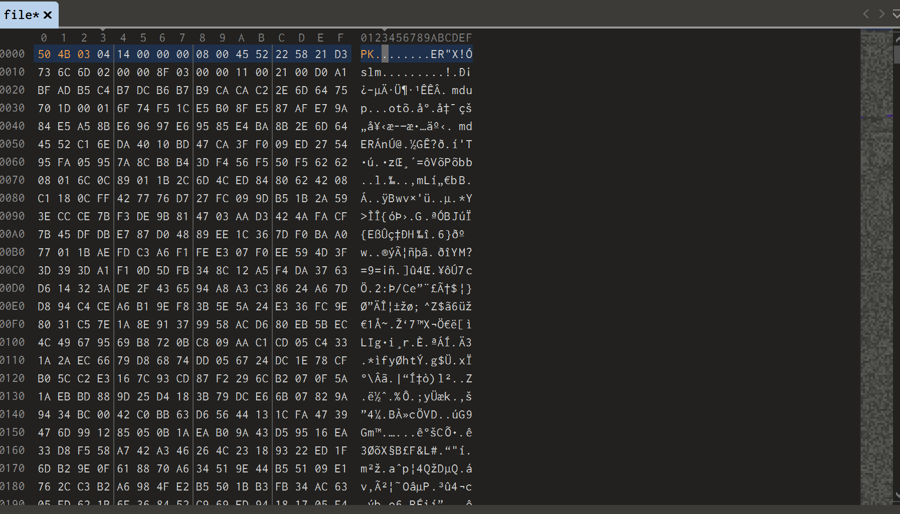
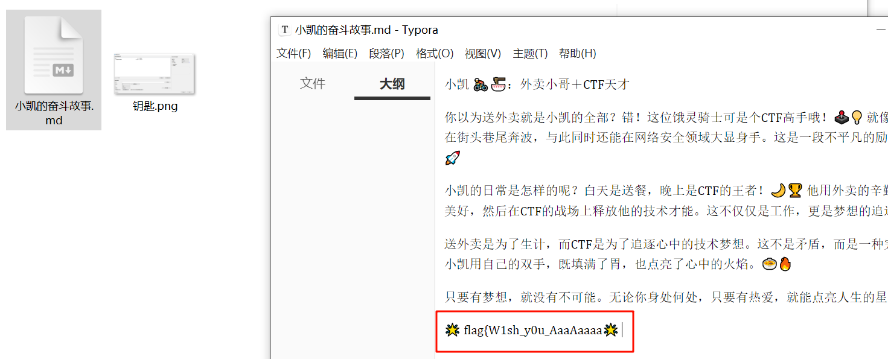
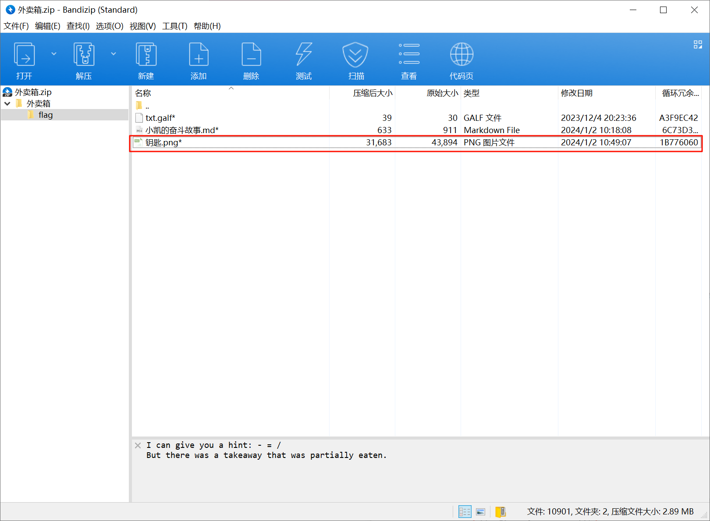
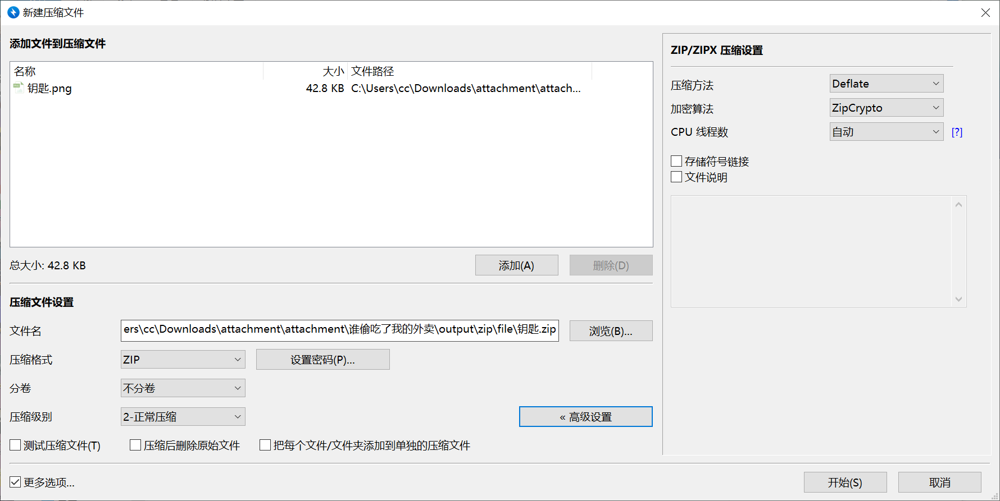
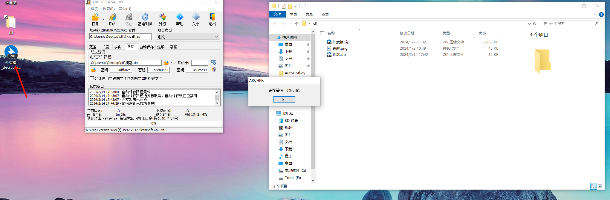
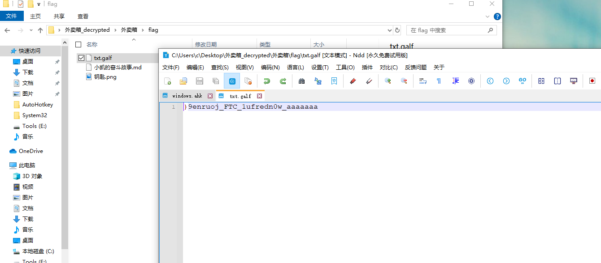

# 谁偷吃了我的外卖

## 知识点

`明文攻击`

`python zipfile`

## 解题

解压后获得了一张照片`小凯.jpg`,`exiftool`看一下有没有其他信息



然后`binwalk`看一下有没有隐藏的拼接文件



用`foremost`分离出来



解压出压缩包`外卖箱.zip`，预览发现文件并有提示，在压缩文件最后发现`==`猜测为`base64`编码，将所有文件名按照顺序排序的字符进行拼接出的字符串将`-`替换为`/`并进行`base64`解密

首先用脚本获取压缩包中的所有`zip`文件名并进行处理,处理后将文本保存进行数据处理并写入到文件

```python
import zipfile
import base64

zip_path = '外卖箱.zip'

def write_filenames(zip_path):
    with zipfile.ZipFile(zip_path, 'r') as zip_ref:
        with open('filename.txt', 'w', encoding='utf-8') as f:
            for i, zip_info in enumerate(zip_ref.infolist()):
                filename = zip_info.filename
                f.write(filename + '\n')
                
                
def file_data(filename):
    arr = []
    with open(filename, 'r') as f:
        data = f.readlines()
        for line in data:
            num = int(line.strip().split('_')[0])
            value = line.strip().split('_')[1]
            arr.append([num, value])
        sorted_arr = sorted(arr, key=lambda x: x[0])
        # print(sorted_arr)
        text = ''
        for i, v in enumerate(sorted_arr):
            text += v[1]
        text = text.replace('-', '/')
        with open('file', 'wb') as f:
            f.write(base64.b64decode(text.encode()))
                
                
if __name__ == '__main__':
    # write_filenames(zip_path)
    file_data('./filename.txt')
```



然后`010editor`打开并补全文件头，更改文件后缀名后解压



即可获取`flag`前半部分



然后继续看`外卖箱.zip`，发现了相同文件名的文件



且与当前目录下`钥匙.png`的`crc`相同，即可进行明文攻击


先将`钥匙.png`按照图片压缩方式压缩







后半部分`flag`需要`reverse`一下