# easy_rawraw

## 知识点

`内存取证`

`volatility`

## 解题

> 题目提示:easy raw! many passwords! 

解压后发现当前目录有两个文件

`mysecretfile.rar`和` rawraw.raw`，`mysecretfile.rar`需要密码，猜测是要从`rawraw.raw`中找,首先使用命令查看镜像信息

```bash
python vol.py -f rawraw.raw imageinfo
```

然后尝试配合`mimikatz`抓取用户密码

```bash
python .\vol.py -f rawraw.raw --profile=Win7SP1x64 mimikatz
```

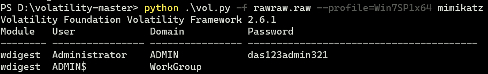

用这个密码解压后发现密码错误，继续找

将扫描的文件保存到`file.txt`

```bash
python .\vol.py -f rawraw.raw --profile=Win7SP1x64 filescan > file.txt
```

因为是找密码，所以找一下关键字`pass`

```bash
cat .\file.txt | findstr -i "pass"
```

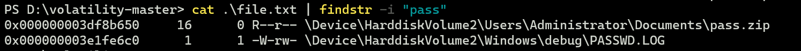

发现了`pass.zip`,导出看一下

```bash
 python .\vol.py -f rawraw.raw --profile=Win7SP1x64 dumpfiles -Q 0x000000003df8b650 -D ./filedump
```

解压后发现`pass.png`


使用`010editor`的时候发现了一个拼接的压缩包，`foremost`分离后发现还是需要密码解压

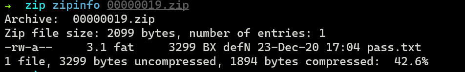

发现`明文攻击`和`crc`攻击都行不通，试试`爆破`一下

```
zip2john 00000019.zip > zip.hash
john zip.hash
john --show zip.hash
```

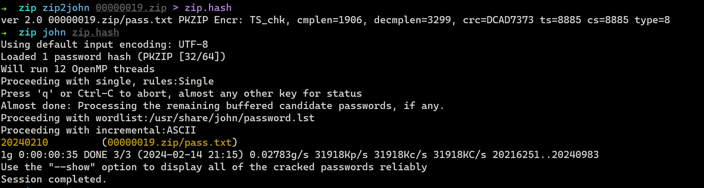

发现密码为`20240210`，`pass.txt`看起来是`hash`加密后的结果

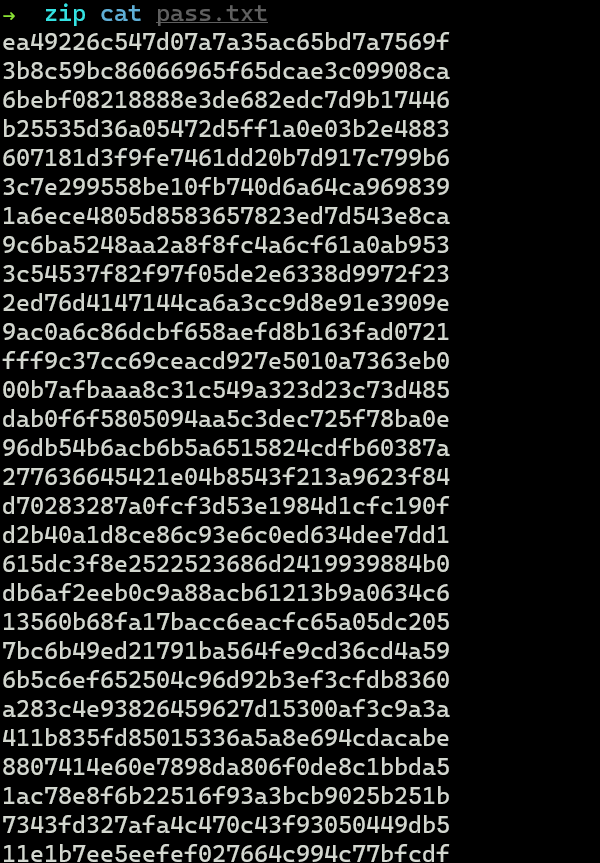

`cmd5`解密也没有结果，作为字典解密压缩包也不行，继续看其他的内容

查看一下异常进程

```bash
python .\vol.py -f rawraw.raw --profile=Win7SP1x64 pstree
```

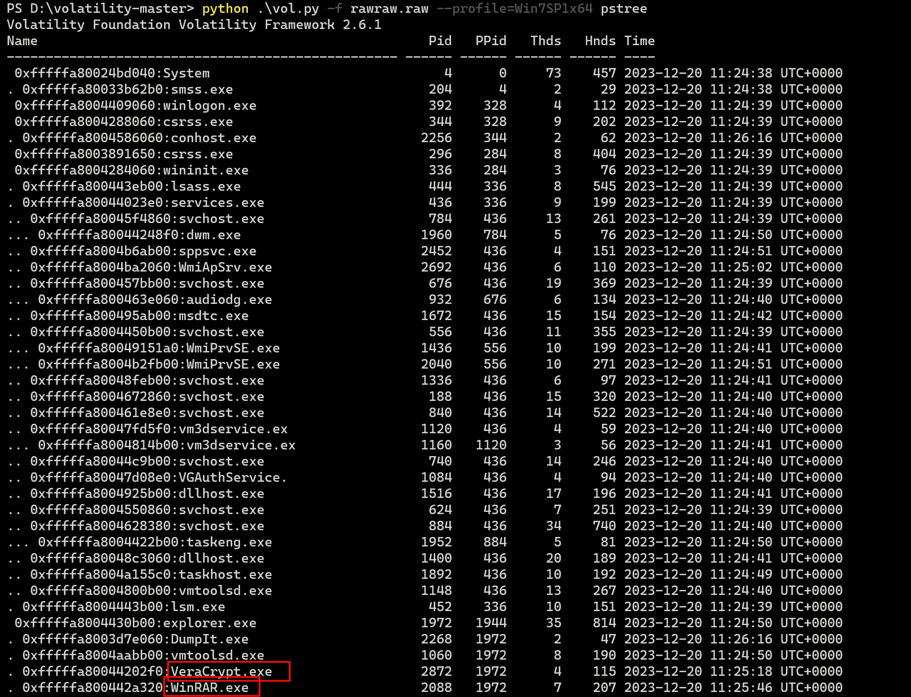

看看`winrar`有没有使用命令泄露密码

```bash
python .\vol.py -f rawraw.raw --profile=Win7SP1x64 cmdline
```

没有发现密码，把`winRAR`的进程`dump`出来

```bash
python .\vol.py -f rawraw.raw --profile=Win7SP1x64 memdump -p 2088 -D 2088
```

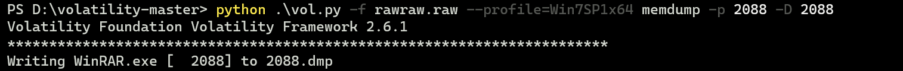

```bash
strings -e l 2088.dmp | grep -i "password"
```

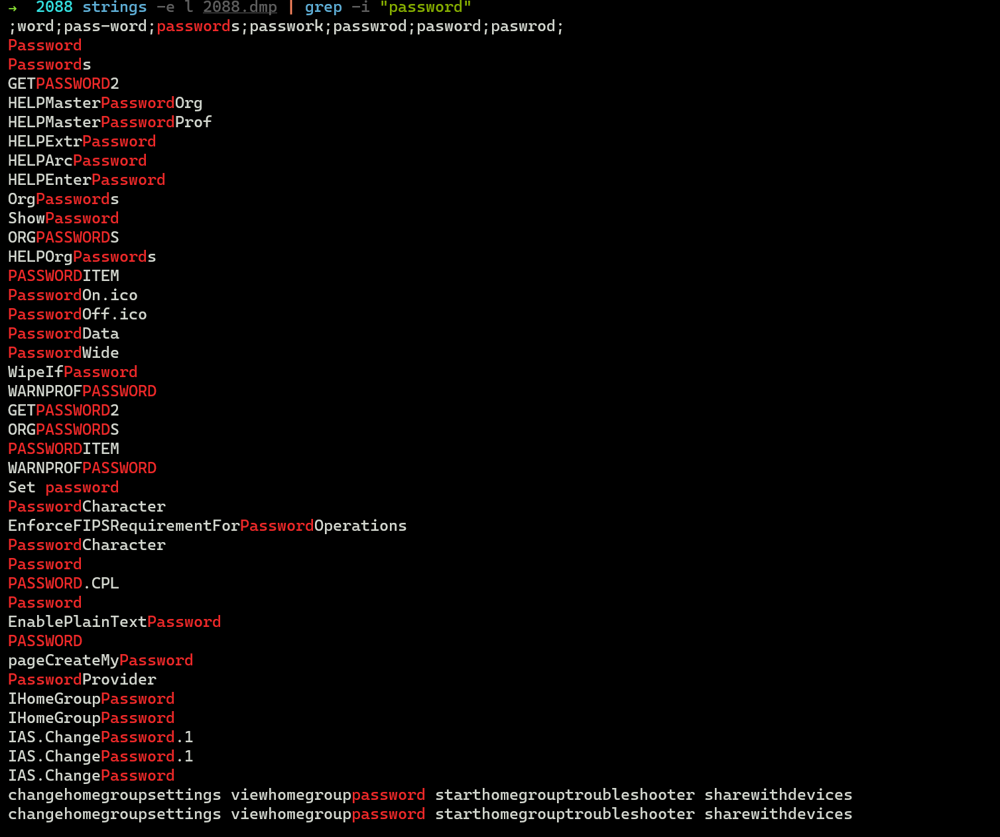

没有找到什么东西，用`010editor`搜索一下

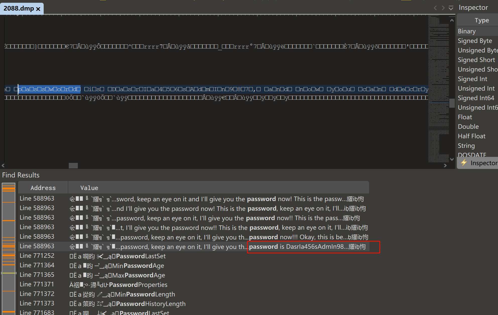

密码找到了，就是这个乱码怪烦人，密码为`DasrIa456sAdmIn987`，然后说我可以解密这个磁盘，所以大概意思就是`mysecretfile`是磁盘，解密磁盘之前就看到了`veracrypt.exe`这个进程，使用它来加载

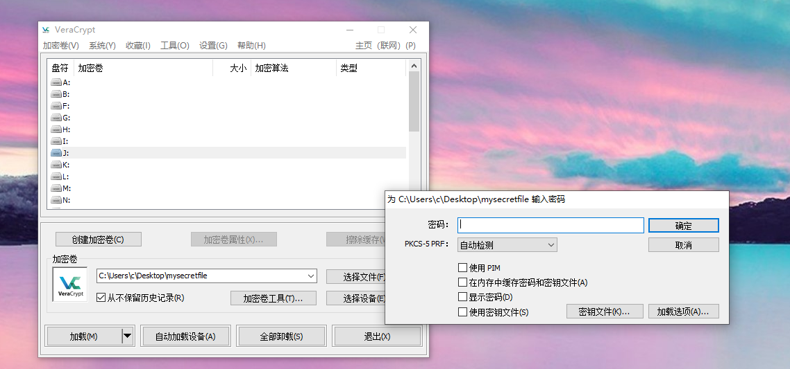

发现需要密码，猜测应该是之前的`pass.txt`里的密码或者`mimikatz`导出来的密码，发现使用`pass.txt`的密码正确


然后进入磁盘发现隐藏的`data.xlsx`文件，用`wps`打开需要密码，正好使用`mimikatz`导出的密码`das123admin321`即可

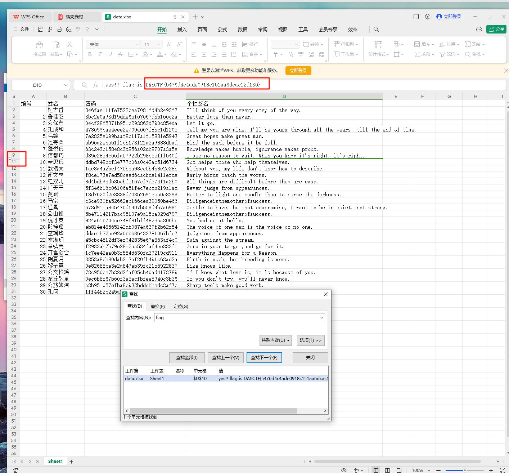

搜索`flag`即可获得`flag`


