# CTF Write-Ups

buuctf、ctfhub、xctf已经各比赛真题刷题记录

[![Contributors][contributors-shield]][contributors-url]
[![Forks][forks-shield]][forks-url]
[![Stargazers][stars-shield]][stars-url]
[![Issues][issues-shield]][issues-url]
[![MIT License][license-shield]][license-url]
[![LinkedIn][linkedin-shield]][linkedin-url]

## 目录

- [BUUCTF](#1. BUUCTF)
  - [web](#1.1 web)
  - [misc](#1.2 misc)
- [CTFHUB](#1. CTFHUB)
  - [web](#2.1 web)
  - [misc](#2.2 misc)
- [XCTF 功放世界](#XCTF)
  - [web](#3.1 web)
  - [misc](#3.2 misc)
- [版本控制](#版本控制)
- [作者](#作者)
- [版权说明](#版权说明)

## 1. BUUCTF

### 1.1 web

|                             题目                             |                             图片                             | 类型                                                         |
| :----------------------------------------------------------: | :----------------------------------------------------------: | :----------------------------------------------------------- |
| [[极客大挑战 2019]EasySQL](<buuctf/Web/[极客大挑战 2019]Easysql.md>) | 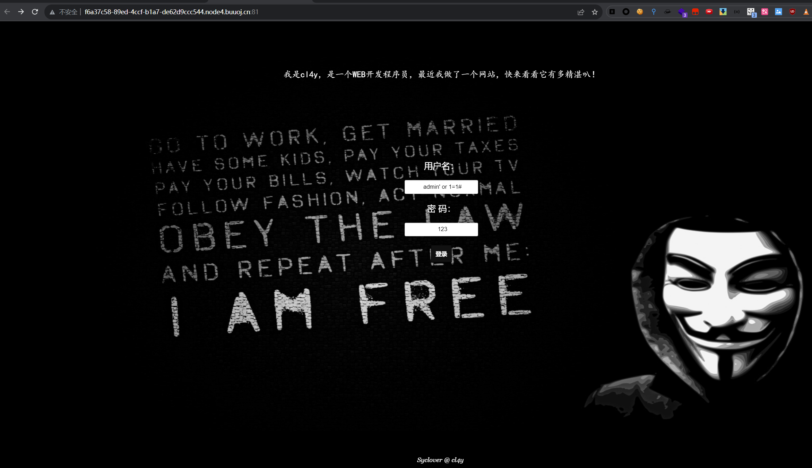 | `sql注入`                                                    |
| [[极客大挑战 2019]Havefun.md](<buuctf/Web/[极客大挑战 2019]Havefun.md>) |  | `传参`                                                       |
|  [[HCTF 2018]WarmUp.md](<buuctf/Web/[HCTF 2018]WarmUp.md>)   |  | `PHP代码审计`                                                |
| [[ACTF2020 新生赛]Include](<buuctf/Web/[ACTF2020 新生赛]Include.md>) |                                                              | `文件包含`                                                   |
| [[ACTF2020 新生赛]Exec](<buuctf/Web/[ACTF2020 新生赛]Exec.md>) |                                                              | `命令执行`                                                   |
| [[GXYCTF2019]Ping Ping Ping](<buuctf/Web/[GXYCTF2019]Ping Ping Ping.md>) |                             ?ip=                             | `命令执行`                                                   |
|  [[强网杯 2019]随便注](<buuctf/Web/[强网杯 2019]随便注.md>)  | 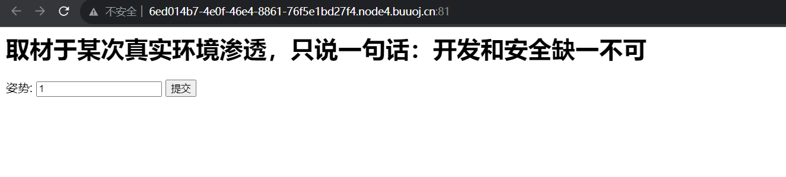 | `sql注入` `堆叠注入`                                         |
|  [[SUCTF 2019]EasySQL](<buuctf/Web/[SUCTF 2019]EasySQL.md>)  |  | `堆叠注入` `sql_mode管道符`                                  |
| [[极客大挑战 2019]Secret File](<buuctf/Web/[极客大挑战 2019]Secret File.md>) |  | `文件包含` `php伪协议` `php命令执行`                         |
| [[极客大挑战 2019]LoveSQL](<buuctf/Web/[极客大挑战 2019]LoveSQL.md>) |                                                              | `sql注入`                                                    |
| [[极客大挑战 2019]Upload](<buuctf/Web/[极客大挑战 2019]Upload.md>) |                                                              | `文件上传` `phtml`                                           |
| [[ACTF2020 新生赛]Upload](<buuctf/Web/[ACTF2020 新生赛]Upload.md>) |                                                              | `文件上传` `phtml`                                           |
| [[极客大挑战 2019]BabySQL](<buuctf/Web/[极客大挑战 2019]BabySQL.md>) |                                                              | `sql注入` `双写绕过`                                         |
| [[极客大挑战 2019]PHP](<buuctf/Web/[极客大挑战 2019]PHP.md>) |  | `php反序列化` `php代码审计`                                  |
| [[ACTF2020 新生赛]BackupFile](<buuctf/Web/[ACTF2020 新生赛]BackupFile.md>) |                                                              | `备份文件` `php弱类型比较`                                   |
| [[极客大挑战 2019]BuyFlag](<buuctf/Web/[极客大挑战 2019]BuyFlag.md>) |                                                              | `php弱类型比较`                                              |
| [[BJDCTF2020]Easy MD5](<buuctf/Web/[BJDCTF2020]Easy MD5.md>) |  | `sql注入`                                                    |
| [[护网杯 2018]easy_tornado](buuctf/Web/[护网杯 2018]easy_tornado.md) |  | `tornado模板注入`                                            |
|     [[HCTF 2018]admin](<buuctf/Web/[HCTF 2018]admin.md>)     |  | `flask` `本地session`                                        |
| [[MRCTF2020]你传你🐎呢](<buuctf/Web/[MRCTF2020]你传你🐎呢.md>) |                                                              | `文件上传` `.htaccess`                                       |
| [[ZJCTF 2019]NiZhuanSiWei](<buuctf/Web/[ZJCTF 2019]NiZhuanSiWei.md>) |                                                              | `php代码审计` `php伪协议`                                    |
| [[极客大挑战 2019]HardSQL](<buuctf/Web/[极客大挑战 2019]HardSQL.md>) |  | `sql注入` `报错注入`                                         |
| [[MRCTF2020]Ez_bypass](<buuctf/Web/[MRCTF2020]Ez_bypass.md>) |                                                              | `php代码审计` `php弱类型比较`                                |
| [[网鼎杯 2020 青龙组]AreUSerialz](<buuctf/Web/[网鼎杯 2020 青龙组]AreUSerialz.md>) |                                                              | `php代码审计` `php反序列化`                                  |
|  [[SUCTF 2019]CheckIn](<buuctf/Web/[SUCTF 2019]CheckIn.md>)  |  | `文件上传` `.user.ini`                                       |
| [[GXYCTF2019]BabyUpload](<buuctf/Web/[GXYCTF2019]BabyUpload.md>) |                                                              | `文件上传` `.htaccess` `system函数过滤`                      |
| [[GXYCTF2019]BabySQli](<buuctf/Web/[GXYCTF2019]BabySQli.md>) | 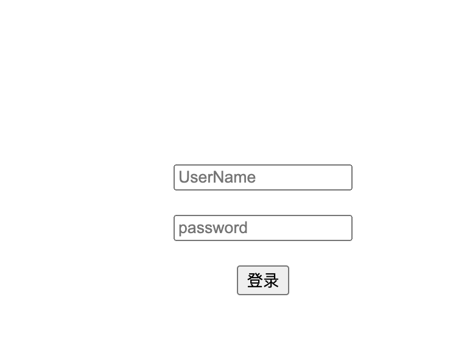 | `sql注入` `联合注入` `绕过md5密码认证`                       |
| [[GYCTF2020]Blacklist](<buuctf/Web/[GYCTF2020]Blacklist.md>) | 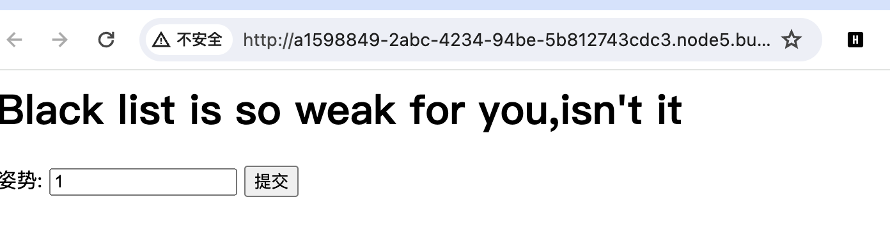 | `堆叠注入` `handler`                                         |
| [[CISCN2019 华北赛区 Day2 Web1]Hack World](<buuctf/Web/[CISCN2019 华北赛区 Day2 Web1]Hack World.md>) |  | `sql注入` `布尔盲注` `二分法`                                |
| [[网鼎杯 2018]Fakebook](<buuctf/Web/[网鼎杯 2018]Fakebook.md>) |  | `sql注入` `php代码审计` `robots.txt`                         |
| [[RoarCTF 2019]Easy Java](<buuctf/Web/[RoarCTF 2019]Easy Java.md>) |  | `java web` `任意文件下载` `反编译class文件`                  |
| [[BJDCTF2020]The mystery of ip](buuctf/Web/[BJDCTF2020]The mystery of ip.md) |  | `ssti`                                                       |
| [[网鼎杯 2020 朱雀组]phpweb](buuctf/Web/[网鼎杯 2020 朱雀组]phpweb.md) |  | `php反序列化`                                                |
| [[BSidesCF 2020]Had a bad day](buuctf/Web/[BSidesCF 2020]Had a bad day.md) |                                                              | `文件包含`                                                   |
| [[BJDCTF2020]ZJCTF，不过如此](buuctf/Web/[BJDCTF2020]ZJCTF，不过如此.md) |                                                              | `php文件包含`   `php伪协议 `   `preg_replace的RCE漏洞`       |
| [[BUUCTF 2018]Online Tool](buuctf/Web/[BUUCTF 2018]Online Tool.md) |  | `escapeshellarg`   `escapeshellcmd`   `php代码审计`  `nmap写入shell` |
|  [[GXYCTF2019]禁止套娃](buuctf/Web/[GXYCTF2019]禁止套娃.md)  |                                                              | `无参RCE` `git泄露`                                          |
| [[NCTF2019]Fake XML cookbook](buuctf/Web/[NCTF2019]Fake XML cookbook.md) |  | `xxe`                                                        |
| [[GWCTF 2019]我有一个数据库](buuctf/Web/[GWCTF 2019]我有一个数据库.md) |  | `phpmyadmin CVE`   `文件包含漏洞`                            |
| [[BJDCTF2020]Mark loves cat](buuctf/Web/[BJDCTF2020]Mark loves cat.md) |  | `git泄露`   `php变量覆盖`                                    |
| [[WUSTCTF2020]朴实无华](buuctf/Web/[WUSTCTF2020]朴实无华.md) |                                                              | `php代码审计`   `命令执行绕过`   `md5 0e`   `科学计数法弱类型` |
| [[BJDCTF2020]Cookie is so stable](buuctf/Web/[BJDCTF2020]Cookie is so stable.md) |  | `SSTI`    `twig`                                             |
| [[安洵杯 2019]easy_web](buuctf/Web/[安洵杯 2019]easy_web.md) |  | `md5强碰撞`                                                  |
|      [[MRCTF2020]Ezpop](buuctf/Web/[MRCTF2020]Ezpop.md)      |                                                              | `php反序列化`    `preg_replace调用__toString`                |
| [[强网杯 2019]高明的黑客](buuctf/Web/[强网杯 2019]高明的黑客.md) |                                                              | `乱序php文件找webshell`                                      |
| [[安洵杯 2019]easy_serialize_php](buuctf/Web/[安洵杯 2019]easy_serialize_php.md) |                                                              | `php反序列化字符串逃逸(变短)`   `SESSION变量覆盖`            |
|  [[MRCTF2020]PYWebsite](buuctf/Web/[MRCTF2020]PYWebsite.md)  |                                                              | `X-Forwarded-For` `脑洞`                                     |
| [[WesternCTF2018]shrine](buuctf/Web/[WesternCTF2018]shrine.md) |                                                              | `python沙箱逃逸`   `flask`                                   |
| [[ASIS 2019]Unicorn shop](buuctf/Web/[ASIS 2019]Unicorn shop.md) |  | `python`   `unicode`                                         |
| [[网鼎杯 2020 朱雀组]Nmap](buuctf/Web/[网鼎杯 2020 朱雀组]Nmap.md) |  | `nmap写入shell`                                              |
| [[NPUCTF2020]ReadlezPHP](buuctf/Web/[NPUCTF2020]ReadlezPHP.md) | 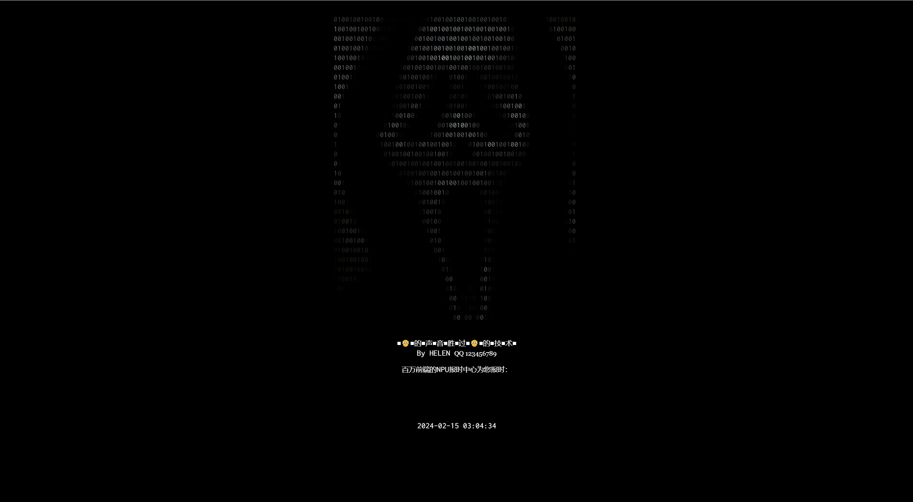 | `php反序列化`                                                |
| [[CISCN2019 华东南赛区]Web11](buuctf/Web/[CISCN2019 华东南赛区]Web11.md) |  | `SSTI`   `smarty`                                            |
|        [[SWPU2019]Web1](buuctf/Web/[SWPU2019]Web1.md)        | 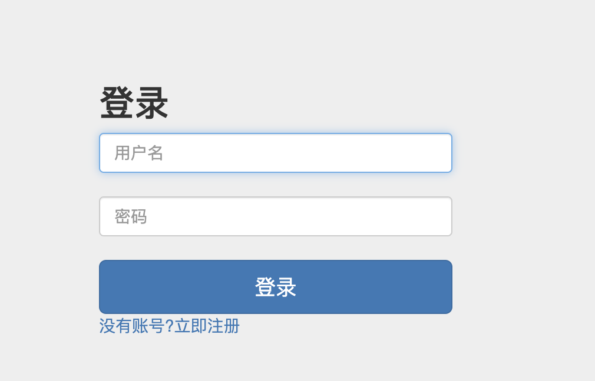 | `sql注入`   `无列名注入`    `二次注入`    `mysql.innodb_table_stats` |
| [[CISCN 2019 初赛]Love Math](buuctf/Web/[CISCN 2019 初赛]Love Math.md) |                                                              | `白名单函数构造RCE`    `php代码审计`                         |
| [[极客大挑战 2019]FinalSQL](buuctf/Web/[极客大挑战 2019]FinalSQL.md) |                                                              | `sql注入`    `异或注入` `布尔盲注`                           |
| [[BSidesCF 2019]Kookie](buuctf/Web/[BSidesCF 2019]Kookie.md) |  | `Cookie`                                                     |
| [[BSidesCF 2019]Futurella](buuctf/Web/[BSidesCF 2019]Futurella.md) |  | `源码`                                                       |
|  [[De1CTF 2019]SSRF Me](buuctf/Web/[De1CTF 2019]SSRF Me.md)  |                                                              | `flask`   `python代码审计`                                   |
| [[BJDCTF2020]EasySearch](buuctf/Web/[BJDCTF2020]EasySearch.md) | 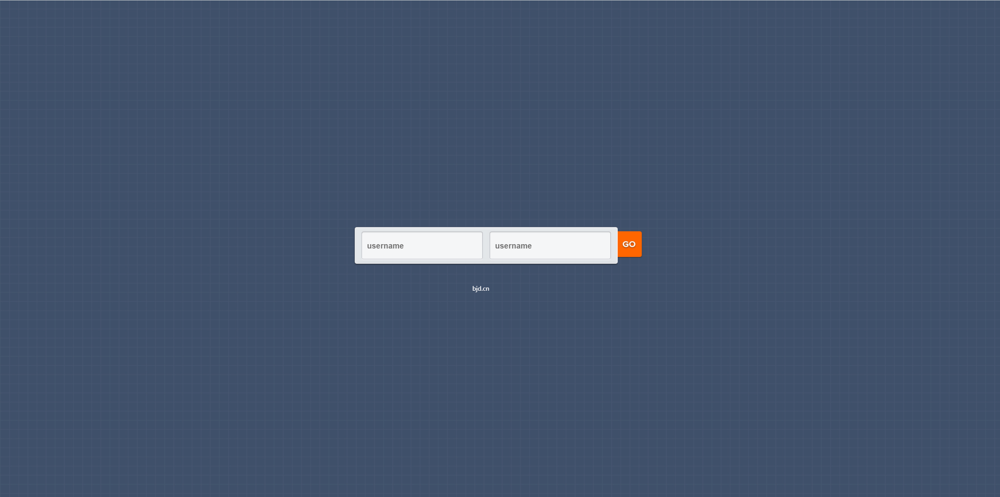 | `index.php.swf`   `python md5生成` `SSI注入`                 |
| [[极客大挑战 2019]RCE ME](buuctf/Web/[极客大挑战 2019]RCE ME.md) |                                                              | `正则表达式绕过` `异或绕过` `取反绕过`                       |
| [[SUCTF 2019]Pythonginx](buuctf/Web/[SUCTF 2019]Pythonginx.md) |                                                              | `IDNA编码` `unicode` `flask`                                 |
|   [[GYCTF2020]FlaskApp](buuctf/Web/[GYCTF2020]FlaskApp.md)   |  | `flask`     `SSTI`                                           |
|  [[0CTF 2016]piapiapia](buuctf/Web/[0CTF 2016]piapiapia.md)  |                                                              | `php反序列化字符串逃逸(变长)`                                |
| [[FBCTF2019]RCEService](buuctf/Web/[FBCTF2019]RCEService.md) |  | `preg_match多行绕过` `PCRE回溯次数限制绕过`                  |
| [[WUSTCTF2020]颜值成绩查询](buuctf/Web/[WUSTCTF2020]颜值成绩查询.md) | 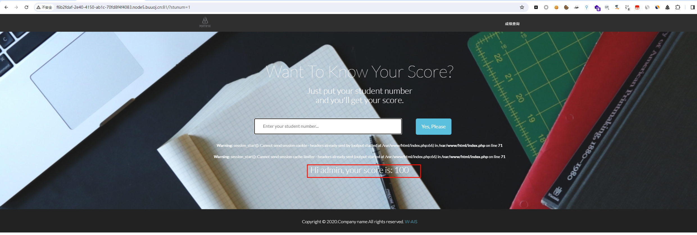 | `sql注入` `异或注入` `布尔盲注`                              |
|       [[MRCTF2020]套娃](buuctf/Web/[MRCTF2020]套娃.md)       | 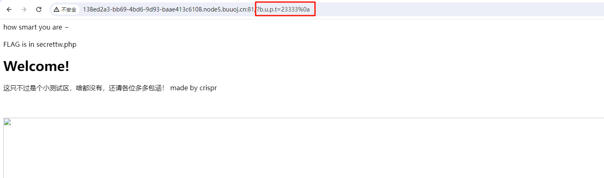 | `_传参` `php之data伪协议` `preg_match多行绕过`               |
| [[Zer0pts2020]Can you guess it?](buuctf/Web/[Zer0pts2020]Can you guess it.md) |                                                              | `php代码审计` `basename绕过` `空字符绕过\/*正则`             |
| [[CSCCTF 2019 Qual]FlaskLight](buuctf/Web/[CSCCTF 2019 Qual]FlaskLight.md) |                                                              | `flask`   `SSTI`                                             |
| [[CISCN2019 华北赛区 Day1 Web2]ikun](buuctf/Web/[CISCN2019 华北赛区 Day1 Web2]ikun.md) | 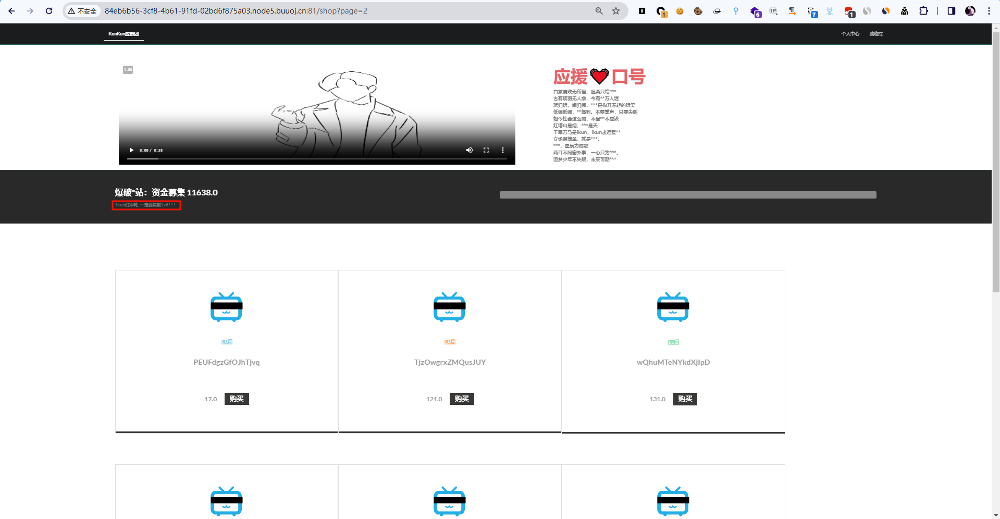 | `JWT`    `pickle`                                            |
| [[WUSTCTF2020]CV Maker](buuctf/Web/[WUSTCTF2020]CV Maker.md) |  | `头像处文件上传`                                             |
| [[watevrCTF-2019]Cookie Store](buuctf/Web/[watevrCTF-2019]Cookie Store.md) |                                                              | `Cookie`                                                     |
| [[GWCTF 2019]枯燥的抽奖](buuctf/Web/[GWCTF 2019]枯燥的抽奖.md) |  | `mt_srand seed爆破`                                          |
| [[红明谷CTF 2021]write_shell](buuctf/Web/[红明谷CTF 2021]write_shell.md) |                                                              | `php代码审计`   `命令执行绕过`                               |
| [[NCTF2019]True XML cookbook](buuctf/Web/[NCTF2019]True XML cookbook.md) |  | `xxe`    `内网探测`                                          |
|     [[RCTF2015]EasySQL](buuctf/Web/[RCTF2015]EasySQL.md)     |  | `sql注入`   `二次注入`                                       |
| [[CISCN2019 华北赛区 Day1 Web5]CyberPunk](buuctf/Web/[CISCN2019 华北赛区 Day1 Web5]CyberPunk.md) |  | `文件包含`   `sql注入`    `二次注入`                         |
| [[CISCN2019 华北赛区 Day1 Web1]Dropbox](buuctf/Web/[CISCN2019 华北赛区 Day1 Web1]Dropbox.md) |  | `phar反序列化`   `任意文件下载`                              |
| [[网鼎杯 2020 白虎组]PicDown](buuctf/Web/[网鼎杯 2020 白虎组]PicDown.md) |  | `linux系统使用open()函数未关闭导致可读取内容` `flask SECRET_KEY` `任意文件读取` |
|   [[HITCON 2017]SSRFme](buuctf/Web/[HITCON 2017]SSRFme.md)   |                                                              | `linux系统使用open()函数未关闭导致可读取内容` `flask SECRET_KEY` `任意文件读取` |
| [[b01lers2020]Welcome to Earth](buuctf/Web/[b01lers2020]Welcome to Earth.md) |                                                              | `javascript逆向`                                             |
|  [[HFCTF2020]EasyLogin](buuctf/Web/[HFCTF2020]EasyLogin.md)  |                                                              | `JWT none`   `javascript代码审计`                            |
| [[CISCN2019 总决赛 Day2 Web1]Easyweb](buuctf/Web/[CISCN2019 总决赛 Day2 Web1]Easyweb.md) |  | ``sql注入hex绕过引号``   `盲注`   `文件上传`                 |
|     [[GYCTF2020]Ezsqli](buuctf/Web/[GYCTF2020]Ezsqli.md)     | 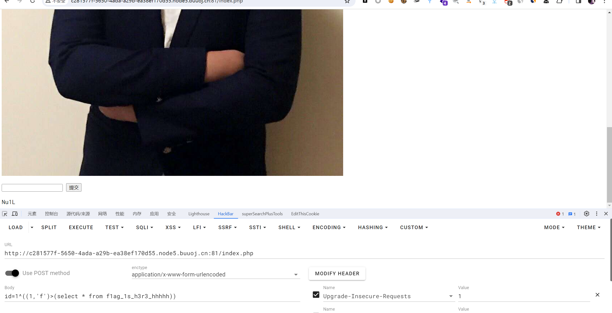 | `SQL注入`    `异或注入`    `布尔盲注`    `无列名注入`        |
| [[SWPUCTF 2018]SimplePHP](buuctf/Web/[SWPUCTF 2018]SimplePHP.md) |                                                              | `phar反序列化`                                               |
| [[RootersCTF2019]I_<3_Flask](buuctf/Web/[RootersCTF2019]I_3_Flask.md) |                                                              | `flask`   `SSTI`                                             |
|        [[NCTF2019]SQLi](buuctf/Web/[NCTF2019]SQLi.md)        | 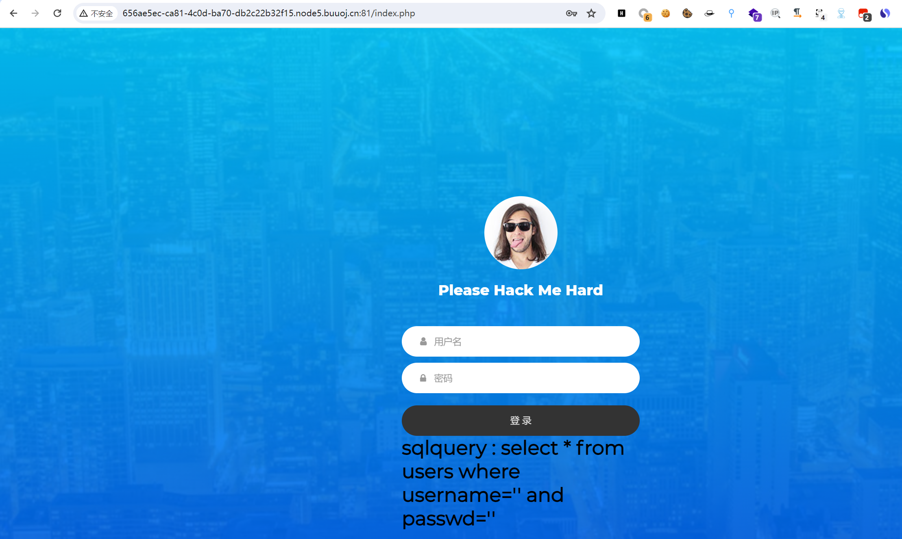 | `SQL注入`   `转义注入`   `正则regexp`                        |
| [[NPUCTF2020]ezinclude](buuctf/Web/[NPUCTF2020]ezinclude.md) |                                                              | `php文件包含临时文件getshell`                                |
|  [[网鼎杯 2018]Comment](buuctf/Web/[网鼎杯 2018]Comment.md)  |  | `SQL注入`    `二次注入 `   `git泄露`    `.DS_Store找flag`    |
| [[HarekazeCTF2019]encode_and_encode](buuctf/Web/[HarekazeCTF2019]encode_and_encode.md) |                                                              | `json unicode解析绕过`    `php伪协议`                        |
|   [[SUCTF 2019]EasyWeb](buuctf/Web/[SUCTF 2019]EasyWeb.md)   |                                                              | `php代码审计`    `无字符RCE`     `.htaccess文件利用`         |
| [[CISCN2019 华东南赛区]Double Secret](buuctf/Web/[CISCN2019 华东南赛区]Double Secret.md) |  | `flask debug`    `RC4`                                       |
|  [[网鼎杯2018]Unfinish](buuctf/Web/[网鼎杯2018]Unfinish.md)  | 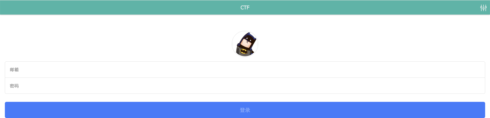 | `SQL注入`    `二次注入`                                      |
| [October 2019 Twice SQL Injection](buuctf/Web/October 2019 Twice SQL Injection.md) |  | `SQL注入`     `二次注入`                                     |
| [[网鼎杯 2020 半决赛]AliceWebsite](buuctf/Web/[网鼎杯 2020 半决赛]AliceWebsite.md) |  | `文件包含`                                                   |
| [[GYCTF2020]EasyThinking](buuctf/Web/[GYCTF2020]EasyThinking.md) | 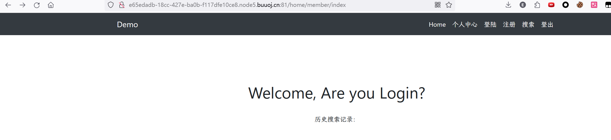 | `ThinkPHP6.0任意文件写`    `disable_functions`               |
|     [[BJDCTF2020]EzPHP](buuctf/Web/[BJDCTF2020]EzPHP.md)     |                                                              | `php代码审计`    `$_SERVER`   `preg_match`   `$_REQUEST`   `file_get_contents`   `extract变量覆盖`   `create_function` |
|   [[GKCTF 2021]easycms](buuctf/Web/[GKCTF 2021]easycms.md)   |  | `弱口令`    `模板库文件包含`                                 |
| [[GXYCTF2019]StrongestMind](buuctf/Web/[GXYCTF2019]StrongestMind.md) |  | `python`                                                     |
| [[HFCTF2020]JustEscape](buuctf/Web/[HFCTF2020]JustEscape.md) | 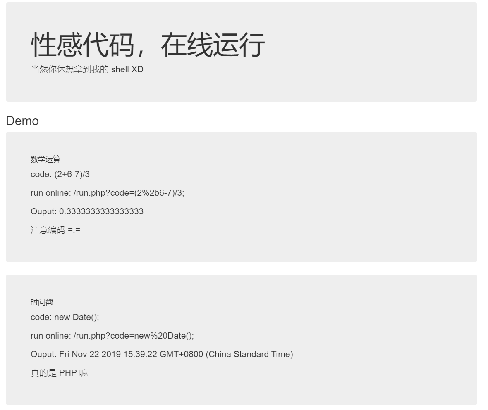 | `vm2沙箱逃逸`                                                |
|  [[SUCTF 2018]GetShell](buuctf/Web/[SUCTF 2018]GetShell.md)  |                                                              | `文件上传汉字取反绕过`                                       |
| [[b01lers2020]Life on Mars](buuctf/Web/[b01lers2020]Life on Mars.md) |  | `sql注入`                                                    |
| [[WMCTF2020]Make PHP Great Again](buuctf/Web/[WMCTF2020]Make PHP Great Again.md) |                                                              | `文件包含`   `绕过文件包含次数限制`                          |
| [[极客大挑战 2020]Roamphp1-Welcome](buuctf/Web/[极客大挑战 2020]Roamphp1-Welcome.md) |                                                              | `http请求方式修改`    `弱类型数组绕过`                       |
|    [[MRCTF2020]Ezaudit](buuctf/Web/[MRCTF2020]Ezaudit.md)    |  | `源码泄露`    `mt_srand seed爆破`    `万能密码`              |
| [[CSAWQual 2019]Web_Unagi](buuctf/Web/[CSAWQual 2019]Web_Unagi.md) |  | `xxe`    `编码绕过WAF保护的XXE`                              |
|            [EasyBypass](buuctf/Web/EasyBypass.md)            |                                                              | `php代码审计`    `命令执行`                                  |
| [[极客大挑战 2020]Greatphp](buuctf/Web/[极客大挑战 2020]Greatphp.md) |                                                              | `php反序列化类md5绕过`    `error类`                          |
| [[BSidesCF 2019]SVGMagic](buuctf/Web/[BSidesCF 2019]SVGMagic.md) |  | `svg渲染xxe`                                                 |
|   [[SCTF2019]Flag Shop](buuctf/Web/[SCTF2019]Flag Shop.md)   |  | `jwt`    `ruby EBR`    `SSTI`                                |
| [[FireshellCTF2020]Caas](buuctf/Web/[FireshellCTF2020]Caas.md) |  | `c语言预处理`                                                |
| [[HarekazeCTF2019]Avatar Uploader 1](buuctf/Web/[HarekazeCTF2019]Avatar Uploader 1.md) |  | `文件上传绕过getimagesize`                                   |
| [[ISITDTU 2019]EasyPHP](buuctf/Web/[ISITDTU 2019]EasyPHP.md) |                                                              | `preg_match字符数量限制绕过`    `无参数RCE绕过`              |
|   [[羊城杯2020]easyphp](buuctf/Web/[羊城杯2020]easyphp.md)   |                                                              | `file_put_contents`   `php代码审计`                          |
|    [[GYCTF2020]Easyphp](buuctf/Web/[GYCTF2020]Easyphp.md)    |                                                              | `php反序列化字符串逃逸(变长)`                                |
| [[N1CTF 2018]eating_cms](buuctf/Web/[N1CTF2018]eating_cms.md) |  | `任意文件读取`   `php代码审计`                               |
|  [[GYCTF2020]Ez_Express](buuctf/Web/[GYCTF2020]Ez_Express)   |  | `javascript大小写绕过`  `nodejs原型链污染`                   |
|  [[SUCTF 2018]MultiSQL](buuctf/Web/[SUCTF 2018]MultiSQL.md)  |  | `堆叠注入`  `异或注入`  `sql预编译写入shell`                 |
|                     [强网杯 2019]Upload                      |                                                              | `php反序列化`                                                |
|                  [安洵杯 2019]不是文件上传                   |                                                              | `php反序列化`                                                |
| [[SUCTF 2018]annonymous](buuctf/Misc/[SUCTF 2018]annonymous.md) |                                                              | `create_function函数名`                                      |
| [[CISCN2019 华东南赛区]Web4](buuctf/Web/[CISCN2019 华东南赛区]Web4.md) |                                                              | `flask默认路径`  `flask session伪造`                         |
| [[WMCTF2020]Make PHP Great Again 2.0](buuctf/Web/[WMCTF2020]Make PHP Great Again 2.0.md) |                                                              | `require_once 软链接包含漏洞`                                |
|                  [pasecactf_2019]flask_ssti                  |                                                              | `hex绕过`                                                    |
| [[GoogleCTF2019 Quals]Bnv](buuctf/Web/[GoogleCTF2019 Quals]Bnv.md) |                                                              | `利用linux本身XXE`                                           |
|   [[NPUCTF2020]ezlogin](buuctf/Web/[NPUCTF2020]ezlogin.md)   |                                                              | `xpath注入（盲注）`                                          |
|                    [PASECA2019]honey_shop                    |                                                              | `/proc/self/environ`  `flask-session`                        |
|                     [GWCTF 2019]你的名字                     |                                                              | `flask `                                          |
| [[watevrCTF-2019]Pickle Store](buuctf/Web/[watevrCTF-2019]Pickle Store.md) |                                                              | `pickle反序列化`                                             |
|                   virink_2019_files_share                    |                                                              | `....//双写绕过目录穿越`                                     |
|                   [RootersCTF2019]ImgXweb                    |                                                              | `flask session伪造`                                          |
| [[羊城杯 2020]Blackcat](buuctf/Web/[羊城杯 2020]Blackcat.md) |  | `hash_hmac伪造`                                              |
|                 [网鼎杯 2020 青龙组]filejava                 |                                                              | `java excel漏洞`  `Apache POI XML外部实体（XML External Entity，XXE）攻击详解` |
|                  [watevrCTF-2019]Supercalc                   |                                                              | `SSTI配合flask-session 1/0#{{config}}`                       |
| [[CSAWQual 2016]i_got_id](buuctf/Web/[CSAWQual 2016]i_got_id.md) |  | `Perl ARGV文件上传导致任意文件读取`                          |
| [[HFCTF 2021 Final]easyflask](buuctf/Web/[HFCTF 2021 Final]easyflask.md) |                                                              | `pickle __reduce__`                                          |
|                  [PwnThyBytes 2019]Baby_SQL                  |                                                              | `PHP_SESSION_UPLOAD_PROGRESS`                                |
|                        [SWPU2019]Web3                        |                                                              | `ln -s /proc/self/cwd/flag/flag.jpg test zip -ry test.zip test` |
|      [[FBCTF2019]Event](buuctf/Web/[FBCTF2019]Event.md)      |                                                              | `flask已知secret生成cookie`                                  |
|                 [BSidesCF 2019]Pick Tac Toe                  |                                                              | `抓改包实现连线`                                             |
|  [[HITCON 2016]Leaking](buuctf/Web/[HITCON 2016]Leaking.md)  |                                                              | `沙箱逃逸`                                                   |
|                  [网鼎杯 2020 玄武组]SSRFMe                  |                                                              | `redis主从复制`                                              |
|               [2021祥云杯]Package Manager 2021               |                                                              | `mongodb sql注入`                                            |
|                 [蓝帽杯 2021]One Pointer PHP                 |                                                              | `php数组key溢出`                                             |
| [[WMCTF2020]Web Check in 2.0](buuctf/Web/[WMCTF2020]Web Check in 2.0.md) |                                                              | `死亡exit绕过`                                               |

### 1.2 misc

|                             题目                             |                             类型                             |
| :----------------------------------------------------------: | :----------------------------------------------------------: |
|               [金三胖](buuctf/Misc/金三胖.md)                |                   `stegsolve`    `视频帧`                    |
|         [你竟然赶我走](buuctf/Misc/你竟然赶我走.md)          |                   `strings`    `010editor`                   |
|               [二维码](buuctf/Misc/二维码.md)                | `二维码`    `文件分离binwalk`    `压缩包密码爆破`    `john`  |
|                 [大白](buuctf/Misc/大白.md)                  |                      `IDHR CRC爆破宽高`                      |
|         [乌镇峰会种图](buuctf/Misc/乌镇峰会种图.md)          |                     `图片隐写可见字符串`                     |
|          [N种办法解决](buuctf/Misc/N种办法解决.md)           |         `文件后缀名隐藏文件类型 `  `base64图片编码`          |
|            [wireshark](buuctf/Misc/wireshark.md)             |                        `HTTP流量分析`                        |
|             [基础破解](buuctf/Misc/基础破解.md)              |              `rar压缩包密码爆破`    `字典生成`               |
|         [文件中的秘密](buuctf/Misc/文件中的秘密.md)          |                           `元数据`                           |
|                  [LSB](buuctf/Misc/LSB.md)                   |                          `LSB隐写`                           |
|            [zip伪加密](buuctf/Misc/zip伪加密.md)             |                         `zip伪加密`                          |
|         [被嗅探的流量](buuctf/Misc/被嗅探的流量.md)          |                        `HTTP流量分析`                        |
|        rar [参考基础破解wp](buuctf/Misc/基础破解.md)         |              `rar压缩包密码爆破`    `字典生成`               |
|                              qr                              |                         `扫描二维码`                         |
|       [镜子里面的世界](buuctf/Misc/镜子里面的世界.md)        |                          `图片隐写`                          |
|               [ningen](buuctf/Misc/ningen.md)                |               `binwalk`   `zip压缩包密码爆破`                |
|             [爱因斯坦](buuctf/Misc/爱因斯坦.md)              |                    `详细信息`   `binwalk`                    |
|    小明的保险箱 [参考基础破解wp](buuctf/Misc/基础破解.md)    |                  `压缩包密码爆破`    `john`                  |
|                           easycap                            |                      `流量包追踪TCP流`                       |
|           [隐藏的钥匙](buuctf/Misc/隐藏的钥匙.md)            |             `strings`    `010editor `  `base64`              |
|         [另外一个世界](buuctf/Misc/另外一个世界.md)          |                       `图片隐藏binary`                       |
|           [神秘龙卷风](buuctf/Misc/神秘龙卷风.md)            |              `rar压缩包密码爆破`   `brainfuck`               |
|                 [FLAG](buuctf/Misc/FLAG.md)                  |                      `lsb低位图片隐写`                       |
|       [数据包中的线索](buuctf/Misc/数据包中的线索.md)        |                  `HTTP流量分析`   `base64`                   |
|     [假如给我三天光明](buuctf/Misc/假如给我三天光明.md)      |              `盲文`   `音频隐写`   `morse编码`               |
|             [后门查杀](buuctf/Misc/后门查杀.md)              |                        `webshell查找`                        |
|         [webshell后门](buuctf/Misc/webshell后门.md)          |                        `webshell查找`                        |
|             [来首歌吧](buuctf/Misc/来首歌吧.md)              |                  `音频隐写`    `morse编码`                   |
|     [荷兰宽带数据泄露](buuctf/Misc/荷兰宽带数据泄露.md)      |                       `RoutePassView`                        |
|         [面具下的flag](buuctf/Misc/面具下的flag.md)          |                      `binwalk`   `vmdk`                      |
|               [九连环](buuctf/Misc/九连环.md)                |                   `zip伪加密`   `steghide`                   |
|     [被劫持的神秘礼物](buuctf/Misc/被劫持的神秘礼物.md)      |                        `HTTP流量分析`                        |
| [[BJDCTF2020]认真你就输了](buuctf/Misc/[BJDCTF2020]认真你就输了.md) |                          `foremost`                          |
|   [[BJDCTF2020]藏藏藏](buuctf/Misc/[BJDCTF2020]藏藏藏.md)    |                          `foremost`                          |
|         [被偷走的文件](buuctf/Misc/被偷走的文件.md)          |             `FTP流量分析`   `rar压缩包密码爆破`              |
|         [刷新过的图片](buuctf/Misc/刷新过的图片.md)          |                           `F5隐写`                           |
| [[GXYCTF2019]佛系青年](buuctf/Misc/[GXYCTF2019]佛系青年.md)  |                    `zip伪加密` `与佛论禅`                    |
| [[BJDCTF2020]你猜我是个啥](buuctf/Misc/[BJDCTF2020]你猜我是个啥.md) |                `文件后缀名`   `图片隐藏信息`                 |
|                [snake](buuctf/Misc/snake.md)                 |                        `图片隐藏信息`                        |
|             [秘密文件](buuctf/Misc/秘密文件.md)              |             `FTP流量分析`   `rar压缩包密码破解`              |
| [[BJDCTF2020]just_a_rar](buuctf/Misc/[BJDCTF2020]just_a_rar.md) |                     `rar压缩包密码破解`                      |
| [[BJDCTF2020]鸡你太美](buuctf/Misc/[BJDCTF2020]鸡你太美.md)  |                         `缺少文件头`                         |
|              [菜刀666](buuctf/Misc/菜刀666.md)               |                        `菜刀流量分析`                        |
| [[BJDCTF2020]一叶障目](buuctf/Misc/[BJDCTF2020]一叶障目.md)  |                        `图片高度隐藏`                        |
| [[SWPU2019]神奇的二维码](buuctf/Misc/[SWPU2019]神奇的二维码.md) |                   `foremost`   `音频隐写`                    |
|     [[BJDCTF2020]纳尼](buuctf/Misc/[BJDCTF2020]纳尼.md)      |                         `缺少文件头`                         |
|       [梅花香之苦寒来](buuctf/Misc/梅花香之苦寒来.md)        |                          `hex坐标`                           |
| [[HBNIS2018]excel破解](buuctf/Misc/[HBNIS2018]excel破解.md)  |                        `图片隐藏信息`                        |
| [[HBNIS2018]来题中等的吧](buuctf/Misc/[HBNIS2018]来题中等的吧.md) |                         `Morse编码`                          |
| [[ACTF新生赛2020]outguess](buuctf/Misc/[ACTF新生赛2020]outguess.md) |            `outguess`   `社会主义核心价值观编码`             |
|         [谁赢了比赛？](buuctf/Misc/谁赢了比赛？.md)          |          `foremost`   `rar压缩包密码爆破`   `gif帧`          |
| [[WUSTCTF2020]find_me](buuctf/Misc/[WUSTCTF2020]find_me.md)  |                            `盲文`                            |
| [[SWPU2019]我有一只马里奥](buuctf/Misc/[SWPU2019]我有一只马里奥.md) |                 `binwalk`   `NTFS流隐藏文件`                 |
|                       [GUET-CTF2019]KO                       |                      `brainfuck` `ook`                       |
|    [[GXYCTF2019]gakki](buuctf/Misc/[GXYCTF2019]gakki.md)     |               `zip压缩包密码爆破`   `字频分析`               |
| [[ACTF新生赛2020]base64隐写](buuctf/Misc/[ACTF新生赛2020]base64隐写.md) |                       `python数据处理`                       |
|                      [MRCTF2020]ezmisc                       |                        `图片高度隐藏`                        |
|                      [HBNIS2018]caesar                       |                          `凯撒加密`                          |
| [[SWPU2019]伟大的侦探](buuctf/Misc/[SWPU2019]伟大的侦探.md)  |               `ebcdlc编码`   `跳舞的小人加密`                |
|    [[HBNIS2018]低个头](buuctf/Misc/[HBNIS2018]低个头.md)     |                            `键盘`                            |
|             [黑客帝国](buuctf/Misc/黑客帝国.md)              |          `hex编码`   `rar压缩包密码爆破`   `文件头`          |
| [[MRCTF2020]你能看懂音符吗](buuctf/Misc/[MRCTF2020]你能看懂音符吗.md) |                    `文件头`   `音符加密`                     |
| [[SUCTF2018]single dog](buuctf/Misc/[SUCTF2018]single dog.md) |                    `binwalk`   `AAEncode`                    |
|           [我吃三明治](buuctf/Misc/我吃三明治.md)            |                           `base32`                           |
| [[SWPU2019]你有没有好好看网课](buuctf/Misc/[SWPU2019]你有没有好好看网课.md) |         `zip密码爆破`   `kinovea逐帧观看`   `敲击码`         |
| [[ACTF新生赛2020]NTFS数据流](buuctf/Misc/[ACTF新生赛2020]NTFS数据流.md) |                         `ntfs数据流`                         |
|              [sqltest](buuctf/Misc/sqltest.md)               |                     `SQL盲注数据包分析`                      |
|   [john-in-the-middle](buuctf/Misc/john-in-the-middle.md)    |                  `流量包分析`   `图片组合`                   |
|  [[ACTF新生赛2020]swp](buuctf/Misc/[ACTF新生赛2020]swp.md)   |                           `伪加密`                           |
|      [[UTCTF2020]docx](buuctf/Misc/[UTCTF2020]docx.md)       |                          `doc解压`                           |
| [[GXYCTF2019]SXMgdGhpcyBiYXNlPw==](buuctf/Misc/[GXYCTF2019]SXMgdGhpcyBiYXNlPw==.md) |                         `base64隐写`                         |
|               [喵喵喵](buuctf/Misc/喵喵喵.md)                | `lsb低位隐写`   `图片高度隐藏`   `NTFS流隐藏文件`   `uncompyle6 pyc` |
|           [间谍启示录](buuctf/Misc/间谍启示录.md)            |                      `iso`   `binwalk`                       |
| [[RoarCTF2019]黄金6年](buuctf/Misc/[RoarCTF2019]黄金6年.md)  |           `kinovea逐帧观看`   `图片隐藏文件base64`           |
|            [小易的U盘](buuctf/Misc/小易的U盘.md)             |                        `iso`   `ida`                         |
|      [[WUSTCTF2020]爬](buuctf/Misc/[WUSTCTF2020]爬.md)       |                  `python binascii hex转str`                  |
|           [Mysterious](buuctf/Misc/Mysterious.md)            |                            `ida`                             |
| [[WUSTCTF2020]alison_likes_jojo](buuctf/Misc/[WUSTCTF2020]alison_likes_jojo.md) |               `binwalk`   `zip压缩包密码爆破`                |
|               [弱口令](buuctf/Misc/弱口令.md)                |           `lsb隐写+弱口令`   `压缩包空格隐藏备注`            |
| [[安洵杯 2019]吹着贝斯扫二维码](buuctf/Misc/.[安洵杯 2019]吹着贝斯扫二维码.md) |       `批处理加后缀`   `photoshop拼接二维码`   `base`        |
|                  [zip](buuctf/Misc/zip.md)                   |             `CRC32爆破`   `根据文件尾添加文件头`             |
|           [从娃娃抓起](buuctf/Misc/从娃娃抓起.md)            |                     `中文电码`   `五笔`                      |
|   [[GUET-CTF2019]zips](buuctf/Misc/[GUET-CTF2019]zips.md)    |                   `压缩包及时间戳密码爆破`                   |
| [[WUSTCTF2020]girlfriend](buuctf/Misc/[WUSTCTF2020]girlfriend.md) |              `DTMF拨号音识别`   `手机键盘密码`               |
|                    [UTCTF2020]file header                    |                         `缺少文件头`                         |
|   [[DDCTF2018](╯°□°）╯︵ ┻━┻](buuctf/Misc/DDCTF2018-1.md)    |                          `移位密码`                          |
| [[XMAN2018排位赛]通行证](buuctf/Misc/[XMAN2018排位赛]通行证.md) |                     `栅栏密码`   `rot13`                     |
|  [[MRCTF2020]千层套路](buuctf/Misc/[MRCTF2020]千层套路.md)   |                       `嵌套多层压缩包`                       |
|             [百里挑一](buuctf/Misc/百里挑一.md)              |                  `exiftool`   `流量包分析`                   |
| [[MRCTF2020]CyberPunk](buuctf/Misc/[MRCTF2020]CyberPunk.md)  |                        `修改系统时间`                        |
|  [[SUCTF2018]followme](buuctf/Misc/[SUCTF2018]followme.md)   |                        `HTTP流量分析`                        |
|  [[安洵杯 2019]Attack](buuctf/Misc/[安洵杯 2019]Attack.md)   |                `dmp文件`   `mimikatz读取密码`                |
|     [[SUCTF 2019]Game](buuctf/Misc/[SUCTF 2019]Game.md)      |             `lsb低位隐写`   `3DES密文特征Salted`             |
|                  [USB](buuctf/Misc/USB.md)                   |    `图片隐写`   `USB流量分析`   `维吉尼亚解密后栅栏解密`     |
|                  [UTCTF2020]basic-forensics                  |                      `隐写可打印字符串`                      |
|  [[BSidesSF2019]zippy](buuctf/Misc/[BSidesSF2019]zippy.md)   |                       `流量包分离文件`                       |
|         [虚假的压缩包](buuctf/Misc/虚假的压缩包.md)          |                `伪加密`   `rsa`   `文件异或`                 |
|       [[RCTF2019]draw](buuctf/Misc/[RCTF2019]draw.md)        |                        `logo语言编程`                        |
| [[ACTF新生赛2020]明文攻击](buuctf/Misc/[ACTF新生赛2020]明文攻击.md) |                `hex进制识别文件`   `明文攻击`                |
|    [[SWPU2019]Network](buuctf/Misc/[SWPU2019]Network.md)     |           `TTL隐写`   `伪加密`   `多层base64解密`            |
| [[MRCTF2020]Hello_ misc](buuctf/Misc/[MRCTF2020]Hello_ misc.md) |              `图片隐写`   `TTL隐写`   `大文字`               |
|      [[UTCTF2020]zero](buuctf/Misc/[UTCTF2020]zero.md)       |                       `零宽度字符隐写`                       |
| [[WUSTCTF2020]spaceclub](buuctf/Misc/[WUSTCTF2020]spaceclub.md) |                       `空格隐藏二进制`                       |
|     [[GKCTF 2021]签到](buuctf/Misc/[GKCTF 2021]签到.md)      |                        `HTTP流量分析`                        |
| [[ACTF新生赛2020]music](buuctf/Misc/[ACTF新生赛2020]music.md) |                          `文件异或`                          |
| [[MRCTF2020]Unravel!!](buuctf/Misc/[MRCTF2020]Unravel!!.md)  |                   `AES解密`   `SilentEye`                    |
| [[CFI-CTF 2018]webLogon capture](buuctf/Misc/[CFI-CTF 2018]webLogon capture.md) |                        `HTTP流量分析`                        |
|  [[DDCTF2018]流量分析](buuctf/Misc/[DDCTF2018]流量分析.md)   |                    `HTTP流量分析`   `SSL`                    |
|    [[MRCTF2020]pyFlag](buuctf/Misc/[MRCTF2020]pyFlag.md)     |   `图片隐藏文件`   `zip压缩包密码爆破`      `base家族解密`   |
| [[GKCTF 2021]excel 骚操作](buuctf/Misc/[GKCTF 2021]excel 骚操作.md) |                       `excel及汉信码`                        |
| [[UTCTF2020]File Carving](buuctf/Misc/[UTCTF2020]File Carving.md) |                  `图片隐写文件`   `ELF文件`                  |
|                [watevrCTF 2019]Evil Cuteness]                |                          `binwalk`                           |
|         [派大星的烦恼](buuctf/Misc/派大星的烦恼.md)          |                         `二进制转换`                         |
| [[QCTF2018]X-man-A face](buuctf/Misc/[QCTF2018]X-man-A face.md) |                          `图片拼接`                          |
|  [[MRCTF2020]不眠之夜](buuctf/Misc/[MRCTF2020]不眠之夜.md)   |                        `碎片图片拼接`                        |
|                     [INSHack2017]sanity                      |                          `markdown`                          |
|           [粽子的来历](buuctf/Misc/粽子的来历.md)            |                       `文本长短二进制`                       |
|          [key不在这里](buuctf/Misc/key不在这里.md)           |                           `ASCII`                            |
|              [hashcat](buuctf/Misc/hashcat.md)               |                        `office2john`                         |
|             [蜘蛛侠呀](buuctf/Misc/蜘蛛侠呀.md)              |           `HTTP流量分析`  `数据处理`   `时间隐写`            |
|                 [voip](buuctf/Misc/voip.md)                  |                            `voip`                            |
|     [[SCTF2019]电单车](buuctf/Misc/[SCTF2019]电单车.md)      |                         `PT2242信号`                         |
|      [[UTCTF2020]sstv](buuctf/Misc/[UTCTF2020]sstv.md)       |                            `sstv`                            |
| [[GUET-CTF2019]soul sipse](buuctf/Misc/[GUET-CTF2019]soul sipse.md) |               `steghide无密码分解`   `Unicode`               |
| [[UTCTF2020]spectogram](buuctf/Misc/[UTCTF2020]spectogram.md) |                  `Sonic Visualiser分析音频`                  |
| [[安洵杯 2019]easy misc](buuctf/Misc/[安洵杯 2019]easy misc.md) |             `字符串掩码`   `盲水印`   `词频统计`             |
| [Business Planning Group](buuctf/Misc/Business Planning Group.md) |                            `BPG`                             |
| [[湖南省赛2019]Findme](buuctf/Misc/[湖南省赛2019]Findme.md)  |                      `各文件16进制特征`                      |
| [[GKCTF 2021]你知道apng吗](buuctf/Misc/[GKCTF 2021]你知道apng吗.md) |                            `apng`                            |
| [[ACTF新生赛2020]剑龙](buuctf/Misc/[ACTF新生赛2020]剑龙.md)  |                        `stegosaurus`                         |
| [[HDCTF2019]你能发现什么蛛丝马迹吗](buuctf/Misc/[HDCTF2019]你能发现什么蛛丝马迹吗.md) |                       `volatility取证`                       |
|          [greatescape](buuctf/Misc/greatescape.md)           |                    `FTP流量分析`   `TLS`                     |
|                    [INSHack2019]INSAnity                     |                          `markdown`                          |
|                     [INSHack2019]Sanity                      |                          `markdown`                          |
|         [很好的色彩呃](buuctf/Misc/很好的色彩呃.md)          |                          `颜色进制`                          |
| [[INSHack2018]Self Congratulation](buuctf/Misc/[INSHack2018]Self Congratulation.md) |                      `黑白二维码二进制`                      |
| [[ACTF新生赛2020]frequency](buuctf/Misc/[ACTF新生赛2020]frequency.md) |                          `字频分析`                          |
| [[BSidesSF2019]table-tennis](buuctf/Misc/[BSidesSF2019]table-tennis.md) |                          `流量分析`                          |
| [[2022红包题]虎年大吉](buuctf/Misc/[2022红包题]虎年大吉.md)  |                           `base85`                           |
| [[MRCTF2020]小O的考研复试](buuctf/Misc/[MRCTF2020]小O的考研复试.md) |                          `数学计算`                          |
|             [真的很杂](buuctf/Misc/真的很杂.md)              |                  `dex反编译`   `jar反编译`                   |
|   [[INSHack2019]gflag](buuctf/Misc/[INSHack2019]gflag.md)    |                           `G代码`                            |
| [[GKCTF 2021]FireFox Forensics](buuctf/Misc/[GKCTF 2021]FireFox Forensics.md) |                      `firefox登录凭证`                       |
|       [[RCTF2019]disk](buuctf/Misc/[RCTF2019]disk.md)        |                    `不同密码挂载内容不同`                    |
|                    [INSHack2018]INSanity                     |                          `markdown`                          |
|     [[GWCTF2019]huyao](buuctf/Misc/[GWCTF2019]huyao.md)      |                           `盲水印`                           |
| [[MRCTF2020]摇滚DJ（建议大声播放](buuctf/Misc/[MRCTF2020]摇滚DJ（建议大声播放.md) |                       `sstv慢扫描电视`                       |
| [[GUET-CTF2019]520的暗示](buuctf/Misc/[GUET-CTF2019]520的暗示.md) |                        `文件xor异或`                         |
| [[XMAN2018排位赛]file](buuctf/Misc/[XMAN2018排位赛]file.md)  |                       `lost+found恢复`                       |
|            [我爱Linux](buuctf/Misc/我爱Linux.md)             |                `trid分析文件数据`   `pickle`                 |
| [[DDCTF2018]第四扩展FS](buuctf/Misc/[DDCTF2018]第四扩展FS.md) |                 `foremost分离`   `字频统计`                  |
|                  [SCTF2019]Ready_Player_One                  |                                                              |
|       [Beautiful_Side](buuctf/Misc/Beautiful_Side.md)        |                       `半张二维码补全`                       |
| [[INSHack2018]42.tar.xz](buuctf/Misc/[INSHack2018]42.tar.xz.md) |                     `解压递归的.tar.xz`                      |
| [[BSidesSF2019]diskimage](buuctf/Misc/[BSidesSF2019]diskimage.md) |      `图片隐藏镜像`   `zsteg导出`   `testdisk分析镜像`       |
|              [INSHack2017]hiding-in-plain-sight              |                          `foremost`                          |
| [[INSHack2017]remote-multimedia-controller](buuctf/Misc/[INSHack2017]remote-multimedia-controller.md) |                          `流量分析`                          |
| [[XMAN2018排位赛]AutoKey](buuctf/Misc/[XMAN2018排位赛]AutoKey.md) |                  `USB流量分析`   `autokey`                   |
|   [[WMCTF2020]行为艺术](buuctf/Misc/WMCTF2020]行为艺术.md)   |               `IHDR`   `伪加密`   `brainfuck`                |
| [[QCTF2018]X-man-Keyword](buuctf/Misc/[QCTF2018]X-man-Keyword.md) |                  `lsb隐写`   `Nihilist加密`                  |
| [[INSHack2018]not so deep](buuctf/Misc/NSHack2018]not so deep.md) |         `audacity`   `DeepSound`   `DeepSound2John`          |
|   [[MRCTF2020]寻找xxx](buuctf/Misc/[MRCTF2020]寻找xxx.md)    |          `频谱图`   `dtmf2num`   `sonic visualier`           |
|             [一路到底](buuctf/Misc/一路到底.md)              |                   `python提取压缩包文件名`                   |
| [[INSHack2017]10-cl0v3rf13ld-lane-signal](buuctf/Misc/[INSHack2017]10-cl0v3rf13ld-lane-signal.md) |                     `.ogg`   `摩丝编码`                      |
|  [[羊城杯 2020]signin](buuctf/Misc/[羊城杯 2020]signin.md)   |                         `toy cipher`                         |
|  [[HDCTF2019]信号分析](buuctf/Misc/[HDCTF2019]信号分析.md)   |                           `PT2262`                           |
| [[SUCTF2018]dead_z3r0](buuctf/Misc/[SUCTF2018]dead_z3r0.md)  |                    `pyc`   `剑龙隐写pyc`                     |
| [[watevrCTF 2019]Unspaellablle](buuctf/Misc/[watevrCTF 2019]Unspaellablle.md) |                          `bcompare`                          |
| [[NPUCTF2020]碰上彩虹，吃定彩虹！](buuctf/Misc/[NPUCTF2020]碰上彩虹，吃定彩虹.md) |        `autokey`   `零宽度字符隐写`   `encrypto软件`         |
|  [[羊城杯 2020]TCP_IP](buuctf/Misc/[羊城杯 2020]TCP_IP.md)   |                  `HTTP流量分析`   `base91`                   |
| [[BSidesSF2019]thekey](buuctf/Misc/[BSidesSF2019]thekey.md)  |                        `USB流量分析`                         |
| [[INSHack2019]Passthru](buuctf/Misc/[INSHack2019]Passthru.md) |                        `TLS加密流量`                         |
|     [[GKCTF 2021]0.03](buuctf/Misc/[GKCTF 2021]0.03.md)      |               `NtfsStreamEditor`   `文件挂载`                |
|     [[QCTF2018]picture](buuctf/Misc/QCTF2018]picture.md)     |                          `lsb隐写`                           |
|   [[CTF2019]babyflash](buuctf/Misc/[CTF2019]babyflash.md)    |     `JPEXS Free Flash Decompiler`   `黑白图片组合二维码`     |
| [[b01lers2020]image_adjustments](buuctf/Misc/[b01lers2020]image_adjustments.md) |                       `python图像处理`                       |
| [[watevrCTF 2019]Polly](buuctf/Misc/[watevrCTF 2019]Polly.md) |                         `python公式`                         |
|                                                              |                                                              |

## 2. CTFHUB

### 2.1 web

| 题目 | 类型 |
| :--: | :--: |
|      |      |

### 2.2 misc

|                          题目                           |                 类型                 |
| :-----------------------------------------------------: | :----------------------------------: |
|     [特殊的工控流量](ctfhub/Misc/特殊的工控流量.md)     |  `工控流量分析`   `s7comm异常流量`   |
|     [异常的流量分析](ctfhub/Misc/异常的流量分析.md)     |       `strings`   `base64图片`       |
|       [简单流量分析](ctfhub/Misc/简单流量分析.md)       | `工控流量分析`   `icmp包长度转ASCII` |
|       [病毒文件恢复](ctfhub/Misc/病毒文件恢复.md)       |            `病毒文件恢复`            |
| [上位机通讯异常分析](ctfhub/Misc/上位机通讯异常分析.md) |           `s7comm异常流量`           |
|   [工控协议数据分析](ctfhub/Misc/工控协议数据分析.md)   |          `s7comm 获取信息`           |
| [TCP-urgent-pointer](ctfhub/Misc/TCP-urgent-pointer.md) |          `流量分析 python`           |
|         [Flask SSTI](ctfhub/Misc/Flask SSTI.md)         |         `SSTI UTF8编码绕过`          |

## 3.XCTF

### 3.1 web

### 3.2 misc

|                             题目                             |                             类型                             |  解决文件后缀  | 难度 |
| :----------------------------------------------------------: | :----------------------------------------------------------: | :------------: | :--: |
|        [来自银河的信号](xctf/misc/来自银河的信号.md)         |                          `rx-sstv`                           |     `.mp3`     |  1   |
|            [steg没有py](xctf/misc/steg没有py.md)             |                          `steg-py`                           |     `.png`     |  1   |
|          [看雪看雪看雪](xctf/misc/看雪看雪看雪.md)           |                          `snow加密`                          |     `.jpg`     |  1   |
|             [流量分析2](xctf/misc/流量分析2.md)              |                     `流量分析`  `tshark`                     |   `.pcapng`    |  1   |
|               [fakezip](xctf/misc/fakezip.md)                |                         `zip伪加密`                          |     `.zip`     |  1   |
|                 [check](xctf/misc/check.md)                  |                          `html编码`                          |     `.png`     |  1   |
|                 [Wire1](xctf/misc/Wire1.md)                  |                  `python对sql注入流量分析`                   |   `.pcapng`    |  1   |
|                [Encode](xctf/misc/Encode.md)                 |                      `rot13`  `base85`                       |     `.txt`     |  1   |
|                [1-misc](xctf/misc/1-misc.md)                 |                   `crunch生日字典`  `john`                   |                |  1   |
|              [碎纸机11](xctf/misc/碎纸机11.md)               |          `图片横向拼接`   `pillow`  `亮度、对比度`           |     `.png`     |  1   |
|               [misc2-1](xctf/misc/misc2-1.md)                |                        `hex四位反转`                         |     `.jpg`     |  1   |
|                 [pcap1](xctf/misc/pcap1.md)                  |                                                              |                |      |
|               [running](xctf/misc/running.md)                |                                                              |                |      |
|             [流量分析1](xctf/misc/流量分析1.md)              |                          `流量分析`                          |   `.pcapng`    |  1   |
|         [津门杯2021-m1](xctf/misc/津门杯2021-m1.md)          |                          `lsb隐写`                           |     `.bmp`     |  1   |
|                  [m0_01](xctf/misc/m001.md)                  |                  `usb流量分析`  `云影密码`                   |   `.pcapng`    |  1   |
|               [miss_01](xctf/misc/miss_01.md)                |                `rabbit`   `base32`  `unicode`                | `.zip`  `.doc` |  1   |
|            [Banmabanma](xctf/misc/Banmabanma.md)             |                           `条形码`                           |     `.png`     |  1   |
|          [适合作为桌面](xctf/misc/适合作为桌面.md)           |                            `pyc`                             |     `.png`     |  1   |
|            [心仪的公司](xctf/misc/心仪的公司.md)             |                          `流量分析`                          |   `.pcapng`    |  1   |
|            [pure_color](xctf/misc/pure_color.md)             |                          `图片隐藏`                          |     `.png`     |  1   |
| [2017_Dating_in_Singapore](xctf/misc/2017_Dating_in_Singapore.md) |                            `日历`                            |     `.pdf`     |  1   |
|       [simple_transfer](xctf/misc/simple_transfer.md)        |                    `流量分析`  `文件隐藏`                    |   `.pcapng`    |  1   |
|    [Training-Stegano-1](xctf/misc/Training-Stegano-1.md)     |                          `strings`                           |     `.bmp`     |  1   |
|         [can_has_stdio](xctf/misc/can_has_stdio.md)          |                         `brainfuck`                          |                |  1   |
|      [János-the-Ripper](xctf/misc/János-the-Ripper.md)       |                            `john`                            |                |  1   |
|                   Test-flag-please-ignore                    |                            `hex`                             |                |  1   |
|                             hong                             |                          `binwalk`                           |                |  1   |
|        [misc_pic_again](xctf/misc/misc_pic_again.md)         |                          `lsb隐写`                           |     `.png`     |  1   |
|                          reverseMe                           |                          `水平翻转`                          |     `.jpg`     |  1   |
|          [hit-the-core](xctf/misc/hit-the-core.md)           |                        `core内存镜像`                        |    `.core`     |  1   |
|                          glance-50                           |           https://tu.sioe.cn/gj/fenjie/ `gif分解`            |     `.gif`     |  1   |
|            [normal_png](xctf/misc/normal_png.md)             |                        `图片隐藏宽高`                        |     `.png`     |  1   |
|          [Aesop_secret](xctf/misc/Aesop_secret.md)           |                         `AES加解密`                          |     `.gif`     |  1   |
|                  [Ditf](xctf/misc/Ditf.md)                   |                  `图片隐藏高度` `流量分析`                   |     `.png`     |  1   |
|          [MeowMeowMeow](xctf/misc/MeowMeowMeow.md)           |                   `strings`  `ascii小地图`                   |     `.png`     |  2   |
|            [真是阳间题](xctf/misc/真是阳间题.md)             |                        `10进制转hex`                         |                |  2   |
|           [Simple-Math](xctf/misc/Simple-Math.md)            |                       `python矩阵运算`                       |                |  2   |
|                 [BotW-](xctf/misc/BotW-.md)                  |                          `希卡文字`                          |     `.png`     |  2   |
|                 [misc1](xctf/misc/misc1.md)                  |                       `16进制凯撒加密`                       |                |  2   |
|                   [low](xctf/misc/low.md)                    |                       `python像素处理`                       |     `.bmp`     |  2   |
|                         神奇的Modbus                         |                     `流量分析搜索字符串`                     |   `.pcapng`    |  2   |
|                          小小的PDF                           |                      `foremost文件分离`                      |     `.pdf`     |  2   |
|            [Cephalopod](xctf/misc/Cephalopod.md)             |             `Ceph流量分析`  `tcpxtract文件分离`              |   `.pcapng`    |  2   |
|                          Excaliflag                          |                          `图层隐藏`                          |     `.png`     |  2   |
|                             4-2                              |                    `字频分析` `qiupqiup`                     |     `.txt`     |  2   |
|                           easycap                            |                           `追踪流`                           |   `.pcapng`    |  2   |
|     [Miscellaneous-200](xctf/misc/Miscellaneous-200.md)      |                          `坐标绘图`                          |     `.txt`     |  2   |
|                     Hear-with-your-Eyes                      |                       `audacity多视图`                       |     `.wav`     |  2   |
|        [Hidden-Message](xctf/misc/Hidden-Message.md)         |                     `UDP流量端口二进制`                      |   `.pcapng`    |  2   |
|  [Recover-Deleted-File](xctf/misc/Recover-Deleted-File.md)   |                       `文件恢复`  `gz`                       |     `.gz`      |  2   |
|          [What-is-this](xctf/misc/What-is-this.md)           |                          `图片隐藏`                          |     `.png`     |  2   |
|                                                              |                                                              |                |      |
|         [很普通的Disco](xctf/misc/很普通的Disco.md)          |                  `音频波形隐藏` `7位ASCII`                   |     `.wav`     |  2   |
|              [就在其中](xctf/misc/就在其中.md)               |                       `流量分析` `rsa`                       |   `.pcapng`    |  2   |
|              [再见李华](xctf/misc/再见李华.md)               |                   `binwalk`  `压缩包暴破`                    |     `.jpg`     |  2   |
|                          embarrass                           |                       `FTP流量包搜索`                        |   `.pcapng`    |  2   |
|               [MISCall](xctf/misc/MISCall.md)                |                         `git stash`                          |                |  2   |
|           [Get-the-key](xctf/misc/Get-the-key.md)            |                       `文件挂载`  `gz`                       |                |  2   |
|                             2-1                              |                `png文件头修复`  `crc爆破宽高`                |     `.png`     |  2   |
|                  [3-11](xctf/misc/3-11.md)                   |                  `图片隐写`  `base64转图片`                  |     `.png`     |  2   |
|                                                              |                                                              |                |      |
|                            intoU                             |                         `音频多视图`                         |     `.wav`     |  2   |
|                         Just-No-One                          |                         `读安装协议`                         |     `.exe`     |  2   |
|                          red_green                           |                          `低位隐写`                          |     `.jpg`     |  2   |
|                         funny_video                          |             `MKVToolNix`  `ffmpeg for audacity`              |     `.mkv`     |  2   |
|                           base64÷4                           |                            `hex`                             |                |  2   |
|                        flag_universe                         |                    `ftp文件导出`  `zsteg`                    |   `.pcapng`    |  2   |
|                      something_in_image                      |                        `extundelete`                         |                |  2   |
|                             打野                             |                           `zsteg`                            |     `.png`     |  2   |
|                  [halo](xctf/misc/halo.md)                   |                        `base64和异或`                        |                |  2   |
|                            倒立屋                            |                       `zsteg flag翻转`                       |                |  2   |
|                      Become_a_Rockstar                       | `rockstar-py -i Become_a_Rockstar.rock -o res.py && python3 res.py` |    `.rock`     |  2   |
|         [不确定,再看看](xctf/misc/不确定,再看看.md)          |                         `base64隐写`                         |     `.wav`     |  2   |
|                          [中等] QR1                          |                     `GIMP 调整图片阈值`                      |     `.png`     |  2   |
|          [Misc文件类型](xctf/misc/Misc文件类型.md)           |                          `Hex文件`                           |     `.txt`     |  2   |
|                          打开电动车                          |          `PT2242=4bit同步码+20bit地址码+4bit功能码`          |     `.wav`     |  3   |
|              [Py-Py-Py](xctf/misc/Py-Py-Py.md)               |                   `pyc隐写`  `stegosaurus`                   |     `.pyc`     |  3   |
|            [肥宅快乐题](xctf/misc/肥宅快乐题.md)             |                         `flash游戏`                          |     `.swf`     |  3   |
|                   [3-1](xctf/misc/3-1.md)                    |                        `python2 AES`                         |   `.pcapng`    |  2   |
|                             4-1                              |                         `图片盲水印`                         |     `.png`     |  2   |
|                   [5-1](xctf/misc/5-1.md)                    |                          `xortool`                           |                |  2   |
|               [latlong](xctf/misc/latlong.md)                |                          `multimon`                          |     `.wav`     |  2   |
|                 challenge_how_many_Vigenère                  |                     `维吉尼亚长密钥加密`                     |     `.txt`     |  3   |
|                      Miscellaneous-300                       |                    `ZIP套娃`  `音频隐写`                     |     `.zip`     |  3   |
|                            warmup                            |                `zip压缩包明文攻击`  `盲水印`                 |     `.zip`     |  3   |
|                           传感器1                            |                        `差分曼彻斯特`                        |                |  3   |
|                         互相伤害!!!                          |                    `文件导出扫描解码套娃`                    |     `.png`     |  3   |
|                            签到题                            |                   `base64 -> 凯撒 -> 栅栏`                   |                |  3   |
|                             pdf                              |              `pdf后缀名为word` `在图片上看鼠标`              |     `.pdf`     |  3   |
|                          如来十三掌                          |                          `佛曰加密`                          |     `.doc`     |  3   |
|         [奇怪的TTL字段](xctf/misc/奇怪的TTL字段.md)          |                        `TTL拼接图片`                         |     `.txt`     |  3   |
|                          隐藏的信息                          |                           `8进制`                            |     `.txt`     |  3   |
|                         Keyes_secret                         |                          `键盘密码`                          |     `.txt`     |  3   |
|                            saleae                            |                     `saleae逻辑分析工具`                     |  `.logicdata`  |  3   |
|                        信号不好先挂了                        |                     `图片隐写`  `盲水印`                     |     `.png`     |  3   |
|                           Cat_Jump                           |                          `strings`                           |    `.vmdk`     |  4   |
|                            miao~                             |                     `DeepSound`  `兽音`                      |     `.jpg`     |  4   |
|                            catnim                            |                                                              |                |  4   |
|           [Time_losing](xctf/misc/Time_losing.md)            |                        `时间差ASCII`                         |   `多个.txt`   |  4   |
|                           Keyword                            |   `LSB加密隐写 clocked-pixel-master`  `关键字加密Nihilist`   |     `.png`     |  4   |
|                           picture2                           |             `binwalk`  `Error 信息`  `UUEncode`              |     `.jpg`     |  4   |
|                           test.pyc                           |               `gmbh -> flag ASCII uncompyle6`                |     `.pyc`     |  4   |
|                            Avatar                            |                `outguess -r xxx.jpg res.txt`                 |     `.jpg`     |  4   |
|                 [mysql](xctf/misc/mysql.md)                  |                `undrop-for-innodb`  `sql恢复`                |                |  4   |
|                           message                            |                 `转为二进制后按73一行共23行`                 |     `.txt`     |  4   |
|                             gif                              |                         `颜色二进制`                         |                |  4   |
|                            掀桌子                            |                     `hex转7位ASCII-128`                      |                |  4   |
|                [双色块](xctf/misc/双色块.md)                 |                    `GIF动图分离转二进制`                     |                |  4   |
|                             crc                              |                          `crc爆破`                           |                |      |
|                                                              |                                                              |                |      |
|                          简单的图片                          |                        `xsctf五进制`                         |     `.png`     |  5   |
|                           misc_xor                           |                     `cyberchef xor爆破`                      |     `.txt`     |  5   |
|      [我们生活在南京-1](xctf/misc/我们生活在南京-1.md)       |                 `音频倒放`  `业余无线电通联`                 |     `.mp3`     |  5   |
|                       你猜他是什么文件                       |          `文件尾识别文件`  `压缩包爆破`  `明文攻击`          |     `.png`     |  5   |
|                             ext3                             |       `ext3 mount find ./ -type f -exec strings {} \;`       |                |  5   |
|                           MulTzor                            |                      `xortool -x -c 20`                      |     `.txt`     |  5   |
|                         恶臭的数据包                         |                     `aircrack airdecap`                      |     `.cap`     |  5   |
|                      A-Weird-C-Program                       | `tr -c '\t \n' '_' < 23bf9cc9da7542e3bbad8a559ee6b8ba.cpp ｜ tr '\t' 1 ｜ tr ' ' 0 | tr -d '_' | strings -n 3` |     `.cpp`     |  5   |
|             [regexpire](xctf/misc/regexpire.md)              |                    `python 正则regex计算`                    |                |  5   |
|                                                              |                                                              |                |      |

### 版本控制

该项目使用Git进行版本管理。您可以在repository参看当前可用版本。

### 作者

Email:emailforgty@163.com

 *您也可以在贡献者名单中参看所有参与该项目的开发者。*

### 版权说明

该项目签署了MIT 授权许可，详情请参阅 [LICENSE]([CTFWriteUp](https://github.com/cmacckk/CTFWriteUp/license)