## 一眼就解密

题目如图


```
ZmxhZ3tUSEVfRkxBR19PRl9USElTX1NUUklOR30=
```

一般看到`=`号基本都是`base64`,`CyberChef`解密

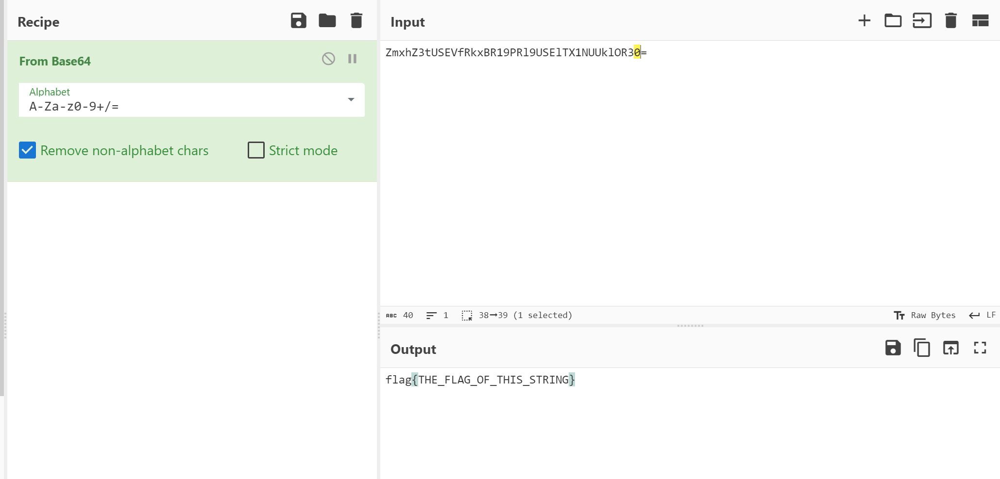

## MD5

题目首页

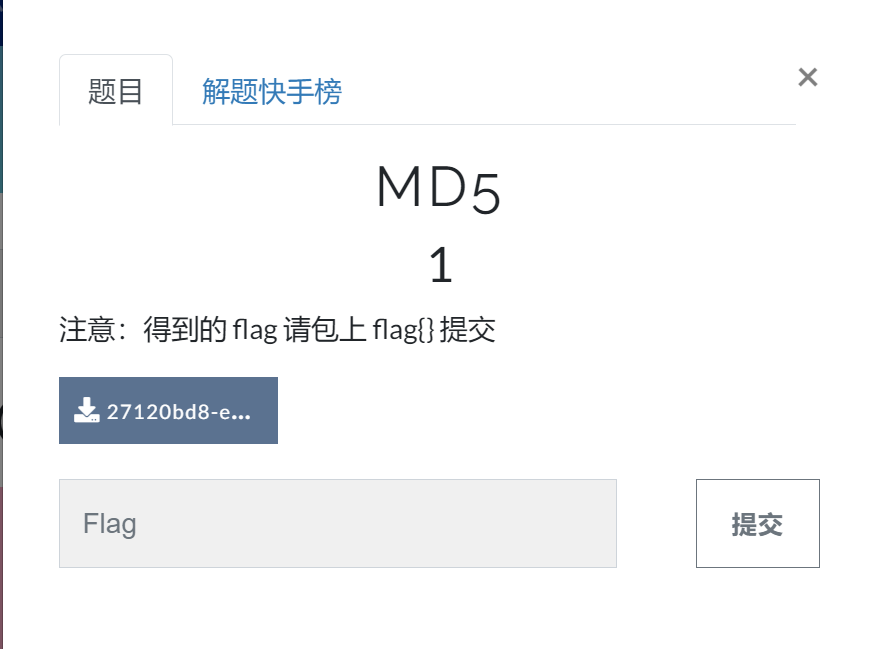

下载解压后得到字符串``

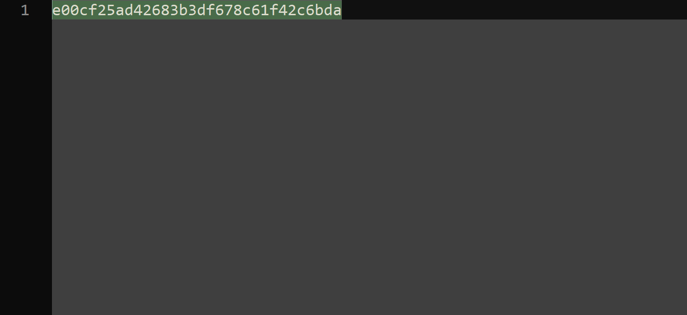

左右加上`flag{}`即可

## Url编码

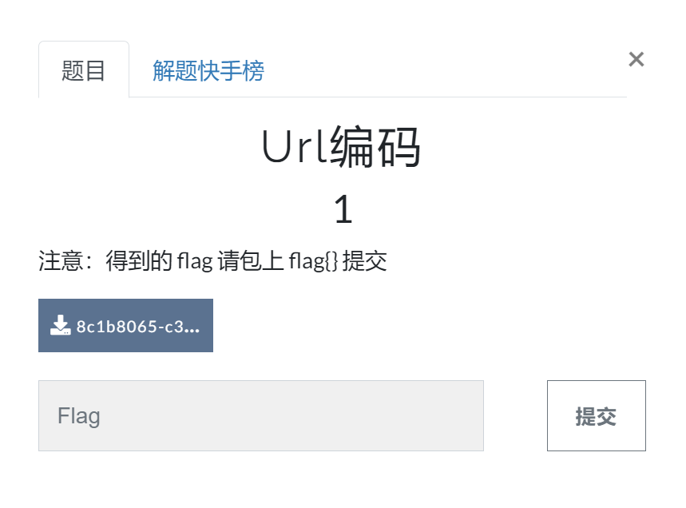


`CyberChef`解码

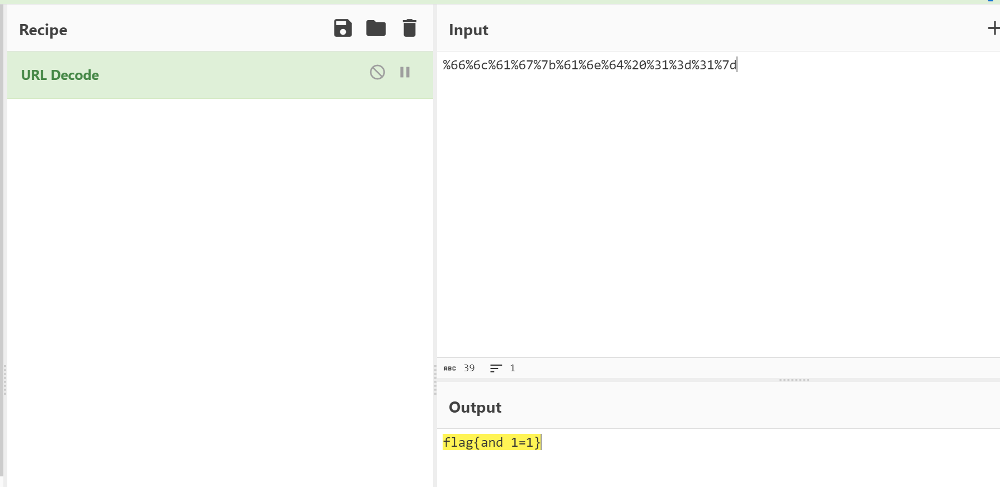

## 看我回旋踢

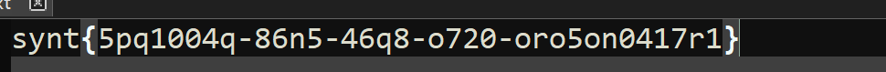

一看就是`凯撒加密`，使用工具解密即可

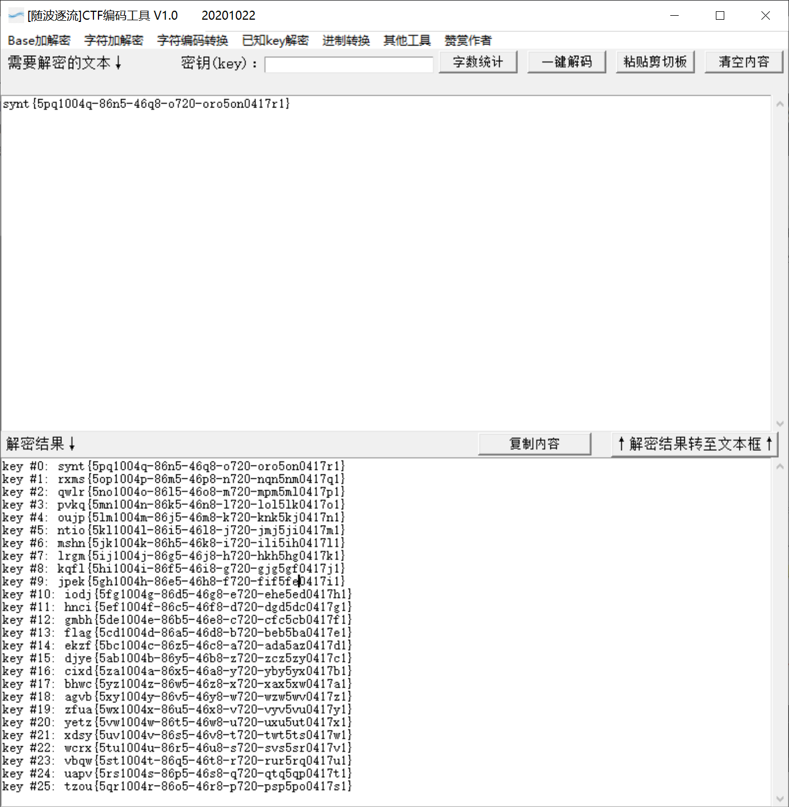

## 变异凯撒

```
加密密文：afZ_r9VYfScOeO_UL^RWUc
格式：flag{ }
```

既然是凯撒，那么解密后前四位应该为`flag`

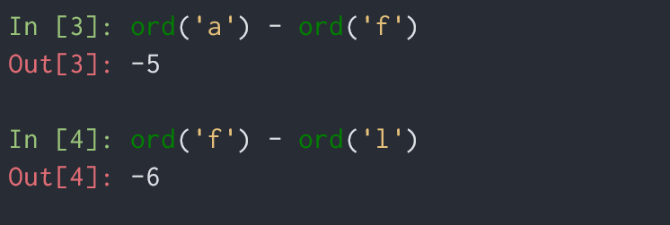

解密过程`-5 -6 -7 -8`依次递减，

则加密过程偏移为`5 6 7 8`依次递增

```python
def decode_mutations_caesar(cipher_text: str, start_iv: int):
    """ 解密变异凯撒 """
    plain_text = ""
    for i, _ in enumerate(cipher_text):
        plain_text += chr(ord(cipher_text[i]) + start_iv)
        start_iv += 1

    return plain_text

if __name__ == '__main__':
    cipher_text = 'afZ_r9VYfScOeO_UL^RWUc'
    plain_text = decode_mutations_caesar(cipher_text, 5)
    print(plain_text)
```

```
最终结果: flag{Caesar_variation}
```

## Quoted-printable

```
cipher_text = "=E9=82=A3=E4=BD=A0=E4=B9=9F=E5=BE=88=E6=A3=92=E5=93=A6"

import quopri

print(quopri.decodestring(cipher_text))
```

## Rabbit

学一下关于`Rabbit`的加密特征

`AES`、`DES`、`RC4`、`Rabbit`、`Triple DES（3DES）`

这些算法可以引入密钥，密文特征与`base64`相似，明显区别是密文里`+号`比较多，并且经常出现`/`

[参考文章](https://blog.csdn.net/m0_63253040/article/details/123671338)

## 篱笆墙的影子

猜测栅栏密码

```
felhaagv{ewtehtehfilnakgw}
```

`13`栏

```
flag{wethinkwehavetheflag}
```

## RSA

```python
import gmpy2

p = 473398607161
q = 4511491
e = 17

d = gmpy2.invert(e, (p - 1) * (q - 1))

print("flag{%s}"%d)
```

## Alice与Bob

> 密码学历史中，有两位知名的杰出人物，Alice和Bob。他们的爱情经过置换和轮加密也难以混淆，即使是没有身份认证也可以知根知底。就像在数学王国中的素数一样，孤傲又热情。下面是一个大整数:98554799767,请分解为两个素数，分解后，小的放前面，大的放后面，合成一个新的数字，进行md5的32位小写哈希，提交答案

`yafu`分解大整数

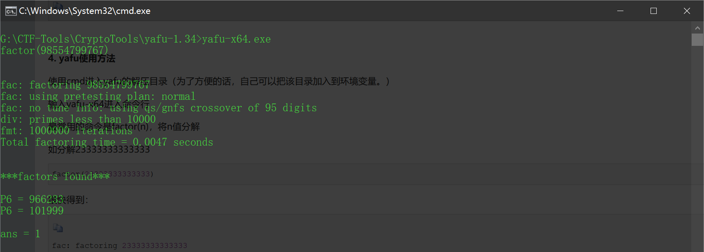

## 大帝的密码武器

> 公元前一百年，在罗马出生了一位对世界影响巨大的人物，他生前是罗马三巨头之一。他率先使用了一种简单的加密函，因此这种加密方法以他的名字命名。
> 以下密文被解开后可以获得一个有意义的单词：FRPHEVGL
> 你可以用这个相同的加密向量加密附件中的密文，作为答案进行提交。

将`FRPHEVGL`凯撒解密看看

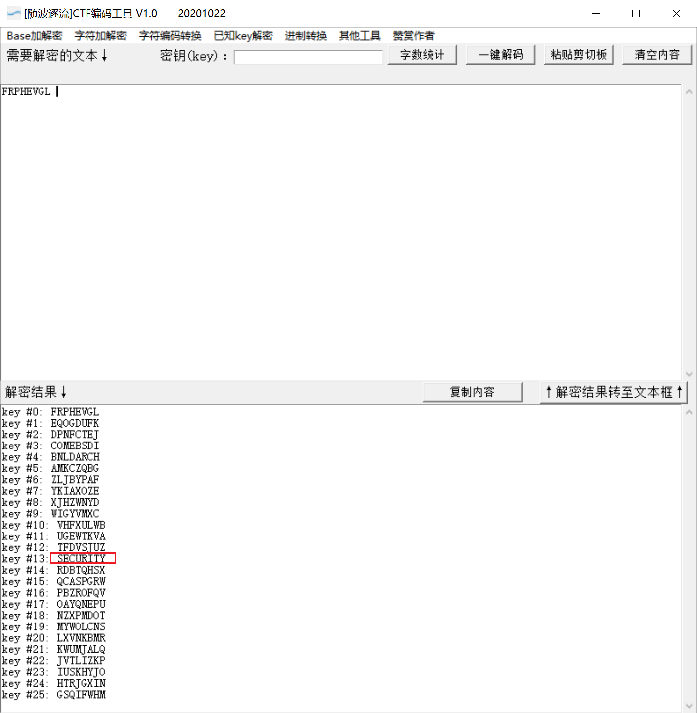

发现一个特殊的单词，猜测密文是同样`转13位`

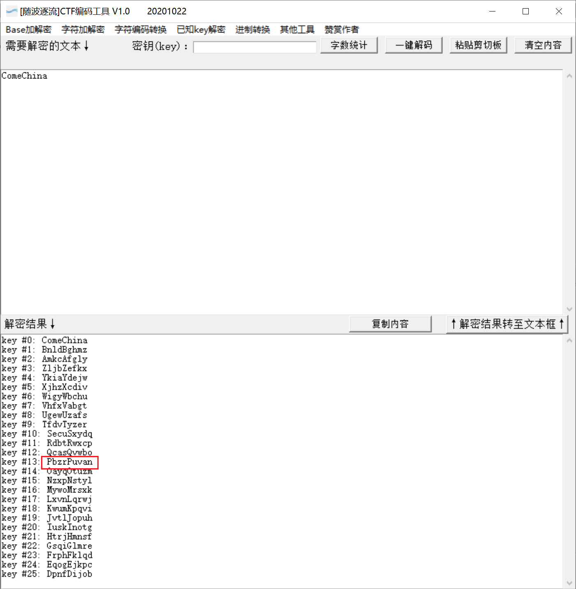

## rsarsa

```python
import gmpy2
# from Crypto.Util.number import long_to_bytes

p =  9648423029010515676590551740010426534945737639235739800643989352039852507298491399561035009163427050370107570733633350911691280297777160200625281665378483
q =  11874843837980297032092405848653656852760910154543380907650040190704283358909208578251063047732443992230647903887510065547947313543299303261986053486569407
e = 65537
c = 83208298995174604174773590298203639360540024871256126892889661345742403314929861939100492666605647316646576486526217457006376842280869728581726746401583705899941768214138742259689334840735633553053887641847651173776251820293087212885670180367406807406765923638973161375817392737747832762751690104423869019034

d = gmpy2.invert(e, (p - 1) * (q - 1))

m = pow(c, d, p * q)

print(m)
```

## Windows系统密码

```bash
john --show --format=LM pass.hash
```

## 信息化时代的步伐

中文电码

http://code.mcdvisa.com/

## 萌萌哒的八戒

下载下来解压不了，用`010editor`看了之后发现在`rar`文件，更改文件后缀为`.rar`

解压发现是猪圈密码


对应照片内容解密即可

## 传统知识+古典密码

**甲子 = 60**

辛卯，为干支之一，顺序为第28个 –> 88 –> X （对应的ASCII码）

癸巳，为干支之一，顺序为第30个 –> 90 –> Z

丙戌，为干支之一，顺序为第23个 –> 93 –> S

辛未，为干支之一，顺序为第8个 –> 68 –> D

庚辰，为干支之一，顺序为第17个 –> 77 –> M

癸酉，为干支之一,顺序为第10个 –> 70 –> F

己卯，为干支之一，顺序为第16个 –> 76 –> L

癸巳，为干支之一，顺序为第30个 –> 90 –> Z

待解密字符串为： **XZSDMFLZ** ，而古典加密基本的就是移位和替换。

比如**凯撒**（在线解密：http://planetcalc.com/1434/）和**栅栏**（在线解密：http://www.qqxiuzi.cn/bianma/zhalanmima.php）。

这里的答案是首先用栅栏密码（两栏）解密得到**XMZFSLDZ**

然后再用凯撒解密得到**SHUANGYU**

[参考原文](https://metang326.github.io/2017/11/11/[CTF]%E4%BC%A0%E7%BB%9F%E7%9F%A5%E8%AF%86+%E5%8F%A4%E5%85%B8%E5%AF%86%E7%A0%81/)

## RSA1

> 已知 dq，dp，q，p，c，求 m ，一个中国剩余定理扩展的题，原理咱也不太懂，用就完事了

已知：
d = dp mod (p-1)
d = dq mod (q-1)
令：
m1 = cd mod p
m2 = cd mod q
有：cd = k*p + m1
故：m2 = ( k*p + m1 ）mod q –> m2 - m1 = k*p mod q

取 p 逆模 ： ( m2 - m1 ) * p-1 = k mod q

k = ( m2 - m1 ) * p-1 mod q —-> k = ( k1 * q + [ ( m2 - m1 ) * p-1 mod q ] )
cd = k*p + m1
cd = ( k1 * q + [ ( m2 - m1 ) * p-1 mod q ] ) * p + m1
cd = k1 * q *p + [ ( m2 - m1 ) * p-1 mod q ] * p + m1

m = cd mod n = { k1 * q *p + [ ( m2 - m1 ) \* p-1 mod q ] \* p + m1 } mod n (n = p*q)

故：m = { [ ( m2 - m1 ) * p-1 mod q ] * p + m1 } mod n —— ①

d = k*( p-1 ) + dp

故：cd = ck*( p-1 ) + dp

m1 = cd mod p = ck*( p-1 ) + dp mod p

由于 **费马小定理** :

m1 = c dp mod p

同理 ：m2 = c dq mod q

```python
import gmpy2
import libnum
# from Crypto.Util.number import fromhex

p = 8637633767257008567099653486541091171320491509433615447539162437911244175885667806398411790524083553445158113502227745206205327690939504032994699902053229 
q = 12640674973996472769176047937170883420927050821480010581593137135372473880595613737337630629752577346147039284030082593490776630572584959954205336880228469 
dp = 6500795702216834621109042351193261530650043841056252930930949663358625016881832840728066026150264693076109354874099841380454881716097778307268116910582929 
dq = 783472263673553449019532580386470672380574033551303889137911760438881683674556098098256795673512201963002175438762767516968043599582527539160811120550041 
c = 24722305403887382073567316467649080662631552905960229399079107995602154418176056335800638887527614164073530437657085079676157350205351945222989351316076486573599576041978339872265925062764318536089007310270278526159678937431903862892400747915525118983959970607934142974736675784325993445942031372107342103852

invq = gmpy2.invert(p, q)
mp = pow(c, dp, p)
mq = pow(c, dq, q)
m = (((mp - mq) * invq ) % p) * q + mq
print(int(m))
print(libnum.n2s(int(m)))
```

运行结果

```
b'noxCTF{W31c0m3_70_Ch1n470wn}'
```

[参考原文](https://ljahum.gitee.io/2020/04/08/rsa1/)

## 世上无难事

[qiupqiup](http://quipqiup.com/)爆破

找到`key`之后提交小写字母即可

## Unencode

密文

```
89FQA9WMD<V1A<V1S83DY.#<W3$Q,2TM]
```

`UUencode`解码

http://www.hiencode.com/uu.html

## RSA3

```
c1=22322035275663237041646893770451933509324701913484303338076210603542612758956262869640822486470121149424485571361007421293675516338822195280313794991136048140918842471219840263536338886250492682739436410013436651161720725855484866690084788721349555662019879081501113222996123305533009325964377798892703161521852805956811219563883312896330156298621674684353919547558127920925706842808914762199011054955816534977675267395009575347820387073483928425066536361482774892370969520740304287456555508933372782327506569010772537497541764311429052216291198932092617792645253901478910801592878203564861118912045464959832566051361
n=22708078815885011462462049064339185898712439277226831073457888403129378547350292420267016551819052430779004755846649044001024141485283286483130702616057274698473611149508798869706347501931583117632710700787228016480127677393649929530416598686027354216422565934459015161927613607902831542857977859612596282353679327773303727004407262197231586324599181983572622404590354084541788062262164510140605868122410388090174420147752408554129789760902300898046273909007852818474030770699647647363015102118956737673941354217692696044969695308506436573142565573487583507037356944848039864382339216266670673567488871508925311154801
e1=11187289
c2=18702010045187015556548691642394982835669262147230212731309938675226458555210425972429418449273410535387985931036711854265623905066805665751803269106880746769003478900791099590239513925449748814075904017471585572848473556490565450062664706449128415834787961947266259789785962922238701134079720414228414066193071495304612341052987455615930023536823801499269773357186087452747500840640419365011554421183037505653461286732740983702740822671148045619497667184586123657285604061875653909567822328914065337797733444640351518775487649819978262363617265797982843179630888729407238496650987720428708217115257989007867331698397
e2=9647291
```

这题已知`c1`,`c2`,`e1`,`e2`，那么就是`共模攻击`了

```python
import libnum
from gmpy2 import invert
def egcd(a, b):
  if a == 0:
    return (b, 0, 1)
  else:
    g, y, x = egcd(b % a, a)
    return (g, x - (b // a) * y, y)

def main():
  n = 22708078815885011462462049064339185898712439277226831073457888403129378547350292420267016551819052430779004755846649044001024141485283286483130702616057274698473611149508798869706347501931583117632710700787228016480127677393649929530416598686027354216422565934459015161927613607902831542857977859612596282353679327773303727004407262197231586324599181983572622404590354084541788062262164510140605868122410388090174420147752408554129789760902300898046273909007852818474030770699647647363015102118956737673941354217692696044969695308506436573142565573487583507037356944848039864382339216266670673567488871508925311154801
  c1 = 22322035275663237041646893770451933509324701913484303338076210603542612758956262869640822486470121149424485571361007421293675516338822195280313794991136048140918842471219840263536338886250492682739436410013436651161720725855484866690084788721349555662019879081501113222996123305533009325964377798892703161521852805956811219563883312896330156298621674684353919547558127920925706842808914762199011054955816534977675267395009575347820387073483928425066536361482774892370969520740304287456555508933372782327506569010772537497541764311429052216291198932092617792645253901478910801592878203564861118912045464959832566051361
  c2 = 18702010045187015556548691642394982835669262147230212731309938675226458555210425972429418449273410535387985931036711854265623905066805665751803269106880746769003478900791099590239513925449748814075904017471585572848473556490565450062664706449128415834787961947266259789785962922238701134079720414228414066193071495304612341052987455615930023536823801499269773357186087452747500840640419365011554421183037505653461286732740983702740822671148045619497667184586123657285604061875653909567822328914065337797733444640351518775487649819978262363617265797982843179630888729407238496650987720428708217115257989007867331698397
  e1 = 11187289
  e2 = 9647291
  s = egcd(e1, e2)
  s1 = s[1]
  s2 = s[2]
  if s1<0:
    s1 = - s1
    c1 = invert(c1, n)
  elif s2<0:
    s2 = - s2
    c2 = invert(c2, n)

  m = pow(c1,s1,n)*pow(c2,s2,n) % n
  print (libnum.n2s(int(m)))

if __name__ == '__main__':
  main()
```

[参考文章](https://www.onctf.com/posts/d38358f9.html)

## [AFCTF2018]Morse

```python
import base64
import binascii
c = '-..../.----/-..../-..../-..../...--/--.../....-/-..../-..../--.../-.../...--/.----/--.../...--/..---/--.../--.../....-/...../..-./--.../...--/...--/-----/...../..-./...--/...--/...--/....-/...--/...../--.../----./--.../-..'
no_space_c = c.replace('/', ' ')

morse_decode_c = '61666374667B317327745F73305F333435797D'
print(base64.b16decode(morse_decode_c))
print(binascii.unhexlify(morse_decode_c))
```

## RSA2

```
e = 65537
n = 248254007851526241177721526698901802985832766176221609612258877371620580060433101538328030305219918697643619814200930679612109885533801335348445023751670478437073055544724280684733298051599167660303645183146161497485358633681492129668802402065797789905550489547645118787266601929429724133167768465309665906113
dp = 905074498052346904643025132879518330691925174573054004621877253318682675055421970943552016695528560364834446303196939207056642927148093290374440210503657

c = 140423670976252696807533673586209400575664282100684119784203527124521188996403826597436883766041879067494280957410201958935737360380801845453829293997433414188838725751796261702622028587211560353362847191060306578510511380965162133472698713063592621028959167072781482562673683090590521214218071160287665180751
```

这是一题`dp`泄露

```python
import gmpy2
from Crypto.Util.number import long_to_bytes


e = 65537
n = 248254007851526241177721526698901802985832766176221609612258877371620580060433101538328030305219918697643619814200930679612109885533801335348445023751670478437073055544724280684733298051599167660303645183146161497485358633681492129668802402065797789905550489547645118787266601929429724133167768465309665906113
dp = 905074498052346904643025132879518330691925174573054004621877253318682675055421970943552016695528560364834446303196939207056642927148093290374440210503657

c = 140423670976252696807533673586209400575664282100684119784203527124521188996403826597436883766041879067494280957410201958935737360380801845453829293997433414188838725751796261702622028587211560353362847191060306578510511380965162133472698713063592621028959167072781482562673683090590521214218071160287665180751

for x in range(1,e):		#遍历X
    if (dp*e-1)%x==0:
        p=(dp*e-1)//x +1
        if n%p==0:
            q=n//p			#得到q
            phi=(p-1)*(q-1)		#欧拉函数
            d=gmpy2.invert(e,phi)		#求逆元
            m=pow(c,d,n)	#幂取模，m=c^d mod n
            print(long_to_bytes(m))
```

## 还原大师

```python
import hashlib
from string import digits, ascii_letters, printable

def calc_md5(c):
    md5 = hashlib.md5()
    md5.update(c.encode())
    md5_hex = md5.hexdigest()
    return md5_hex

def crack(strings):
    for i in strings:
        for j in strings:
            for k in strings:
                c = f"TASC{i}O3RJMV{j}WDJKX{k}ZM"
                # print(c)
                res = calc_md5(c).upper()
                # print(res)
                if res.startswith('E903'):
                    print(res)
    

if __name__ == '__main__':
    strings = digits + ascii_letters
    crack(printable)
```

## 异性相吸

`二进制异或`

```python
string1 = open('./key.txt', 'rb').read()
string2 = open('./密文.txt', 'rb').read()

# print(len(string1))
# print(len(string2))
for i in range(len(string1)):
    print(chr(string1[i] ^ string2[i]), end='')
```

## RSA

这种形式很像`.pem`的格式（`PEM`是`OpenSSL`和许多其他`ssl`工具的标准格式，`OpenSSL`使用`PEM`文件格式存储证书和密钥）

将`pub.key`和`flag.enc`一起放入`kali`中，接下来

①使用`openssl`命令

```bash
openssl rsa -pubin -text -modulus -in warmup -in pub.key
```

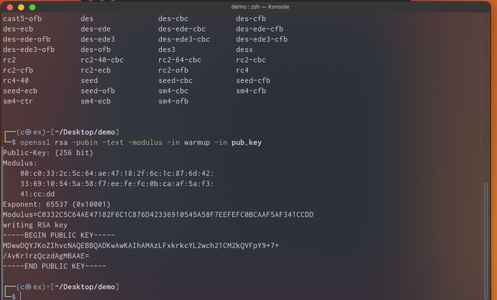

其中的`Moudulus`即为`n`,`e`为`65537`，然后求解`p`和`q`

　　有以下三种方法：

　　1). 使用在线工具[http://www.factordb.com ](http://www.factordb.com/index.php?query=3349683240683303752040100187123245076775802838668125325785318315004398778586538866210198083573169673444543518654385038484177110828274648967185831623610409867689938609495858551308025785883804091)

　　2). 使用`yafu`工具（需下载）

　　3). 使用`python`模块（需安装， `pip3 install factordb-pycli`）


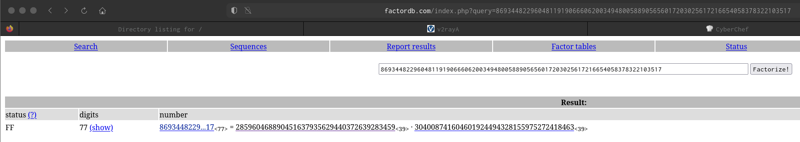


```bash
openssl rsautl -decrypt -in flag.enc -inkey private.pem
```

或者

```python
import gmpy2
import rsa
e = 65537
n = 86934482296048119190666062003494800588905656017203025617216654058378322103517
p = 285960468890451637935629440372639283459
q = 304008741604601924494328155975272418463

phin = (q-1)*(p-1)
d = gmpy2.invert(e, phin)

key = rsa.PrivateKey(n, e, int(d), p, q)

with open("flag.enc", "rb+") as f:
    f = f.read()
    print(rsa.decrypt(f, key))

```

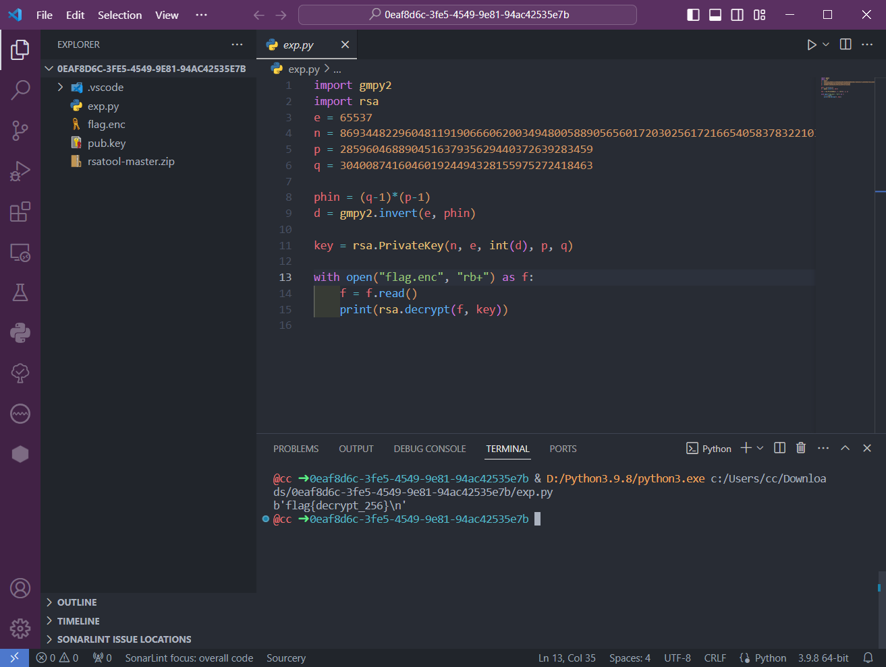

## RSAROLL


左边应该是`n`,右边是`e`

```python
from factordb.factordb import FactorDB
import gmpy2

n = 920139713
e = 19
c_content = open('./c.txt', 'r').read()
cl = c_content.split('\n')

cls = [c for c in cl if c.strip() != '']

conn = FactorDB(n)
conn.connect()
p, q = conn.get_factor_list()

d = gmpy2.invert(e, (p-1) * (q-1))

flag = ''

for c in cls:
    flag += chr(pow(int(c), d, n))

print(flag)
```

## Dangerous RSA

在 `RSA` 中 e 也称为加密指数。由于 e 是可以随意选取的，选取小一点的 e 可以缩短加密时间（比如 3），但是选取不当的话，就会造成安全问题

已经有了n,e,c

这题我们发现一个问题，N太大了，不可能分解出来。但是这里有个特点即e很小，只有3

这就需要用到低加密指数攻击。

我们重新看RSA的原理图


我们看加密过程，现在N,e,c都有了，但是m是需要求的，分解N的方法是不可行的，但是有另一种方法

这里分两张情况，当M^e < N的时候，M^e就等于c，比如2^3 mod 100=2^3，那么m就只需要把c开e次方就得到了。

另一种情况就是当M^e ＞ N的时候，可以用爆破的方法，我们列方程，假设Ｍ^e / n 的商为 k 余数为C，那么Ｍ^e = k*n + C，这个时候就可以对k进行爆破，*只要k满足 k*n + C能够开e次方就可以得明文

我们再看这两种情况，可以发现前提都是e必须小，越小越好，因为两张情况都需要开e次方，这就是这类题目的特点。

```python
import gmpy2
from Crypto.Util.number import long_to_bytes

n = 0x52d483c27cd806550fbe0e37a61af2e7cf5e0efb723dfc81174c918a27627779b21fa3c851e9e94188eaee3d5cd6f752406a43fbecb53e80836ff1e185d3ccd7782ea846c2e91a7b0808986666e0bdadbfb7bdd65670a589a4d2478e9adcafe97c6ee23614bcb2ecc23580f4d2e3cc1ecfec25c50da4bc754dde6c8bfd8d1fc16956c74d8e9196046a01dc9f3024e11461c294f29d7421140732fedacac97b8fe50999117d27943c953f18c4ff4f8c258d839764078d4b6ef6e8591e0ff5563b31a39e6374d0d41c8c46921c25e5904a817ef8e39e5c9b71225a83269693e0b7e3218fc5e5a1e8412ba16e588b3d6ac536dce39fcdfce81eec79979ea6872793
e = 0x3
c = 0x10652cdfaa6b63f6d7bd1109da08181e500e5643f5b240a9024bfa84d5f2cac9310562978347bb232d63e7289283871efab83d84ff5a7b64a94a79d34cfbd4ef121723ba1f663e514f83f6f01492b4e13e1bb4296d96ea5a353d3bf2edd2f449c03c4a3e995237985a596908adc741f32365

k = 0

while 1:
    res = gmpy2.iroot(c + k * n, e)
    if res:
        print(long_to_bytes(res[0]))
        break
    k += 1
```

## [HDCTF2019]basic rsa

```python
from binascii import a2b_hex, unhexlify
import gmpy2

p = 262248800182277040650192055439906580479
q = 262854994239322828547925595487519915551

phin = (p-1) * (q-1)
e = 65533
n = p*q

d = gmpy2.invert(e, phin)
# print(d)

c = 27565231154623519221597938803435789010285480123476977081867877272451638645710

m1 = a2b_hex(hex(pow(c, d, n))[2:])
m2 = unhexlify(hex(pow(c, d, n))[2:])
print(m1)
print(m2)
```

## [GXYCTF2019]CheckIn

`rot47`解码

```
dikqTCpfRjA8fUBIMD5GNDkwMjNARkUwI0BFTg==

base64 -> v)*L*_F0<}@H0>F49023@FE0#@EN

rot47 -> GXY{Y0u_kNow_much_about_Rot}
```

## Cipher

`playfair`密码

https://rumkin.com/tools/cipher/playfair/

密钥为`playfair`


## [GUET-CTF2019]BabyRSA

$$
(p-1)*(q-1)=p*q+p+q+1
$$

$$
n = (p-1) * (q-1) - (p + 1) - 1
$$

```python3
from libnum import n2s

p_add_q = 0x1232fecb92adead91613e7d9ae5e36fe6bb765317d6ed38ad890b4073539a6231a6620584cea5730b5af83a3e80cf30141282c97be4400e33307573af6b25e2ea
phin = 0x5248becef1d925d45705a7302700d6a0ffe5877fddf9451a9c1181c4d82365806085fd86fbaab08b6fc66a967b2566d743c626547203b34ea3fdb1bc06dd3bb765fd8b919e3bd2cb15bc175c9498f9d9a0e216c2dde64d81255fa4c05a1ee619fc1fc505285a239e7bc655ec6605d9693078b800ee80931a7a0c84f33c851740
e = 0xe6b1bee47bd63f615c7d0a43c529d219
d = 0x2dde7fbaed477f6d62838d55b0d0964868cf6efb2c282a5f13e6008ce7317a24cb57aec49ef0d738919f47cdcd9677cd52ac2293ec5938aa198f962678b5cd0da344453f521a69b2ac03647cdd8339f4e38cec452d54e60698833d67f9315c02ddaa4c79ebaa902c605d7bda32ce970541b2d9a17d62b52df813b2fb0c5ab1a5
enc_flag = 0x50ae00623211ba6089ddfae21e204ab616f6c9d294e913550af3d66e85d0c0693ed53ed55c46d8cca1d7c2ad44839030df26b70f22a8567171a759b76fe5f07b3c5a6ec89117ed0a36c0950956b9cde880c575737f779143f921d745ac3bb0e379c05d9a3cc6bf0bea8aa91e4d5e752c7eb46b2e023edbc07d24a7c460a34a9a

n = phin - p_add_q - 1

m = pow(enc_flag, d, n)

print(n2s(int(m)))
```

## [BJDCTF2020]这是base??

更换`base64`编码表

```python
import base64
import string
str1='FlZNfnF6Qol6e9w17WwQQoGYBQCgIkGTa9w3IQKw'
string1='JKLMNOxyUVzABCDEFGH789PQIabcdefghijklmWXYZ0123456RSTnopqrstuvw+/'
string2='ABCDEFGHIJKLMNOPQRSTUVWXYZabcdefghijklmnopqrstuvwxyz0123456789+/'
print(base64.b64decode(str1.translate(str.maketrans(string1,string2))))
```

## rsa2

`低解密指数攻击`，题目：

```python
N = 101991809777553253470276751399264740131157682329252673501792154507006158434432009141995367241962525705950046253400188884658262496534706438791515071885860897552736656899566915731297225817250639873643376310103992170646906557242832893914902053581087502512787303322747780420210884852166586717636559058152544979471
e = 46731919563265721307105180410302518676676135509737992912625092976849075262192092549323082367518264378630543338219025744820916471913696072050291990620486581719410354385121760761374229374847695148230596005409978383369740305816082770283909611956355972181848077519920922059268376958811713365106925235218265173085

import hashlib
flag = "flag{" + hashlib.md5(hex(d)).hexdigest() + "}"
```

这题给了`N`和`e`，需要我们求`d`，一般情况下我们是分解`N`，但是`N`太大了，我们还可以`低加密指数攻击`，但是`e`也太大了。

所以这里要用到低解密指数攻击，前提就是`e`很大，`d`很小，因为`d`是解密指数，所以低解密指数就是`d`很小，`d`和`e`是相对的，`d`越小`e`越大

解这种题目需要一个工具：https://github.com/pablocelayes/rsa-wiener-attack

[参考文章](https://www.onctf.com/posts/d38358f9.html#11%E3%80%81rsa2%EF%BC%88%E4%BD%8E%E8%A7%A3%E5%AF%86%E6%8C%87%E6%95%B0%E6%94%BB%E5%87%BB%EF%BC%89)

需要把整个工具都下载下来，然后在这个文件夹里面新建我们的脚本文件——低解密指数攻击`main.py`

```python
import RSAwienerHacker
import hashlib

N = 101991809777553253470276751399264740131157682329252673501792154507006158434432009141995367241962525705950046253400188884658262496534706438791515071885860897552736656899566915731297225817250639873643376310103992170646906557242832893914902053581087502512787303322747780420210884852166586717636559058152544979471
e = 46731919563265721307105180410302518676676135509737992912625092976849075262192092549323082367518264378630543338219025744820916471913696072050291990620486581719410354385121760761374229374847695148230596005409978383369740305816082770283909611956355972181848077519920922059268376958811713365106925235218265173085

d = RSAwienerHacker.hack_RSA(e, N)
print("flag{%s}"%hashlib.md5(hex(d).encode()).hexdigest())
```

用`python2`跑

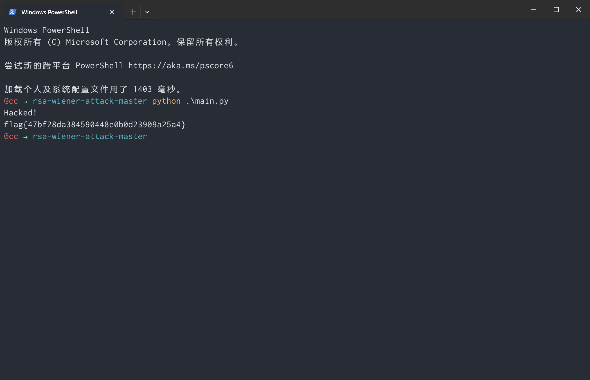

## RSA5（低加密指数广播攻击）

这题有很多的`n`和`c`

是低加密指数广播攻击

就是说`e`比较小，并且都是用同一个加密指数`e`来加密，但是`N`不一样，这时就可以根据广播攻击得到明文

介绍一下什么是广播，假如我们需要将一份明文进行多份加密，但是每份使用不同的密钥，密钥中的模数`n`不同但指数`e`相同且很小，我们只要拿到多份密文和对应的`n`就可以利用中国剩余定理进行解密。

这篇专门讲了[中国剩余定理的原理](https://www.cnblogs.com/freinds/p/6388992.html)，下面摘录下来了，防止原文挂了

> 问题：今有物不知其数，三三数之剩二，五五数之剩三，七七数之剩二。问物几何？
>
> **简单点说就是，存在一个数x，除以3余2，除以5余三，除以7余二，然后求这个数。上面给出了解法。再明白这个解法的原理之前，需要先知道一下两个定理。**
>
> **定理1：两个数相加，如果存在一个加数，不能被整数a整除，那么它们的和，就不能被整数a整除。**
>
> **定理2：两数不能整除，若除数扩大（或缩小）了几倍，而被除数不变，则其商和余数也同时扩大（或缩小）相同的倍数（余数必小于除数）。**
>
> 以上两个定理随便个例子即可证明！
>
> 现给出求解该问题的具体步骤：
>
> 1、求出最小公倍数
>
> **lcm=3\*5\*7=105**
>
> 2、求各个数所对应的基础数
>
> **（1）105÷3=35**
>
> ```
> 35÷3=11......2 //基础数35
> Copy
> ```
>
> **（2）105÷5=21**
>
>  21÷5=4……1
>
> **定理2把1扩大3倍得到3，那么被除数也扩大3倍，得到21\*3=63//基础数63**
>
> **（3）105÷7=15**
>
>  15÷7=2……1
>
>  **定理2把1扩大2倍得到2，那么被除数也扩大2倍，得到15\*2=30//基础数30**
>
>  **把得到的基础数加和（注意：基础数不一定就是正数）**
>
>  **35+63+30=128**
>
> **4、减去最小公倍数lcm（在比最小公倍数大的情况下）**
>
> **x=128-105=23**
>
> **那么满足题意得最小的数就是23了。一共有四个步骤。下面详细解释每一步的原因。**
>
> **（1）最小公倍数就不解释了，跳过（记住，这里讨论的都是两两互质的情况）**
>
> **（2）观察求每个数对应的基础数时候的步骤，比如第一个。105÷3=35。显然这个35是除了当前这个数不能整除以外都能够被其他数整除，就是其他数的最小公倍数。相当于找到了最小的起始值，用它去除以3发现正好余2。那么这个基础数就是35。记住35的特征，可以整除其他数但是不能被3整除，并且余数是2。体现的还不够明显，再看下5对应的基础数。21是其他数的最小公倍数，但是不能被5整除，用21除以5得到的余数是1，而要求的数除以5应该是余1的。所以余数被扩大，就得到了相应的基础数63。记住这个数的特征，可以被其他数整除但是被5除应该余三。同理，我们得到了第三个基础数23，那么他的特征就是：可以被其他数整除，但是不能被7整除，并且余数为2。**
>
> **（3）第三步基础数加和，为什么要这样做呢？利用就是上面提到的定理1。**
>
> **35+63+30=128。对于3来说，可以把63+30的和看作一个整体，应该他们都可以被3整除。看着上面写出的三个数的特征，运用定理1来说，就是在35的基础上加上一个可以被3整除的倍数，那么得到的结果依然还是满足原先的性质的，就是128除以同样还是余2的。同理，对于5还说，这个数被除之后会剩余3；对于7来说，被除之后剩余2。所以说，我们当前得到的这个数是满足题目要求的一个数。但是这个数是不是最小的，那就不一定了。
> **
>
> **（4）应该不能确定是不是最小的数，这个时候就要用到他们的最小公倍数了。最小公倍数顾名思义，一定是一个同时被几个数整除的最小的一个数，所以减去它剩余下来的余数还是符合题意要求的。当然也同样可以运用定理1来解释，只不过是加法变成了减法，道理还是一样的。当然具体要不要剪还是要看和lcm的大小关系的。**
>
> **稍微的总结一下：就是已知m1,m2,m3是两两互质的正整数，求最小的正整数x，使它被m1,m2,m3除所得的余数分别是c1,c2,c3。孙子定理的思想便是线分别求出被其中数mi整除余1而被另外两个数整除的数Mi(i=1,2,3)，则所求数之一的便是c1M1+c2M2+c3M3。由此我们可以得到n个两两互质数的情况。证明上面已经一步一步给出。**
>
> **那么，到此为止基本的中国剩余定理的内容我们以及了解了，包括解答方法。那么如何编码呢？按照上面这个思路去编码，其实并不难。一共分为四大步。但是，大多数人的困惑在于如何求取基础数。这里呢，提供两种方法：**
>
> **（1）第一种就是一直递增，直到找到。例如：3的基础数，35是其他数的最小公倍数。那么就从35开始，一直自增，直到余数为2，便停止（利用while循环）。**
>
> **（2）第二种方法呢就是辗转相除法上得来的。这里的例子体现的不够明显，应当看看去求取乘法逆元的过程，下面讲的内容和乘法逆元有很大的关系，所以还是看看的好。简单举个例子：**
>
> **假设现在三个数分别是14，3，5，它们两两互质，且要求的数除以5余3。求5对应的基础数。有：**
>
> **42÷5=8……2**
>
> **5÷2=2……1**
>
> **所以1=5-2\*2=5-2\*（42-8\*5）=-2\*42+17\*5**
>
> **那么-2\*42=-84 17\*5=85 -84+85=1**
>
> **把1扩大3倍变成3，则有-84\*3=-252也就是5对应的基础数。**
>
> **第一点： 基础数可以是负数，这个之前点到过。//并且下面的解法就是有这样的。**
>
> **第二点： 当得到余数为1的时候后面的算式相当于是一个回溯的过程，最后解到-2\*42。 但是还只不过是余数是1的情况对应的数，再运用定理2我们就得到了-252这个基础数。实际上要是看过乘法逆元，这里实际就是乘法逆元的求解过程，而-2也就是42关于15取模的乘法逆元。**

用中国剩余定理解这道题的代码是这样的

[参考原文](https://www.onctf.com/posts/d38358f9.html#12%E3%80%81RSA5%EF%BC%88%E4%BD%8E%E5%8A%A0%E5%AF%86%E6%8C%87%E6%95%B0%E5%B9%BF%E6%92%AD%E6%94%BB%E5%87%BB%EF%BC%89)

用中国剩余定理解这道题的代码是这样的

```python
# -*- coding: cp936 -*-
import gmpy2
import time
def CRT(items):
    N = reduce(lambda x, y: x * y, (i[1] for i in items))
    result = 0
    for a, n in items:
        m = N / n
        d, r, s = gmpy2.gcdext(n, m)
        if d != 1: raise Exception("Input not pairwise co-prime")
        result += a * s * m
    return result % N, N
# 读入 e, n, c
e = 
n = [...L,...L] #n是一个数组因为加密的是群消息
c = [...L,...L]
data = zip(c, n)
x, n = CRT(data)
m = gmpy2.iroot(gmpy2.mpz(x), e)[0]
print m
```

但是本题`e`较大，不建议使用中国剩余定理求解，这题的方法是：

因为不同的模数`n`中可能存在相同的`p`或者相同的`q`，那么我们就求出不同`n`之间的最大公约数` gcd()`，即可得到`p`或者是`q`，再求得`d`，最后得到明文

```python
import  gmpy2
import libnum
from Crypto.Util.number import long_to_bytes 
n1 = 20474918894051778533305262345601880928088284471121823754049725354072477155873778848055073843345820697886641086842612486541250183965966001591342031562953561793332341641334302847996108417466360688139866505179689516589305636902137210185624650854906780037204412206309949199080005576922775773722438863762117750429327585792093447423980002401200613302943834212820909269713876683465817369158585822294675056978970612202885426436071950214538262921077409076160417436699836138801162621314845608796870206834704116707763169847387223307828908570944984416973019427529790029089766264949078038669523465243837675263858062854739083634207
c1 = 974463908243330865728978769213595400782053398596897741316275722596415018912929508637393850919224969271766388710025195039896961956062895570062146947736340342927974992616678893372744261954172873490878805483241196345881721164078651156067119957816422768524442025688079462656755605982104174001635345874022133045402344010045961111720151990412034477755851802769069309069018738541854130183692204758761427121279982002993939745343695671900015296790637464880337375511536424796890996526681200633086841036320395847725935744757993013352804650575068136129295591306569213300156333650910795946800820067494143364885842896291126137320
 
n2 = 20918819960648891349438263046954902210959146407860980742165930253781318759285692492511475263234242002509419079545644051755251311392635763412553499744506421566074721268822337321637265942226790343839856182100575539845358877493718334237585821263388181126545189723429262149630651289446553402190531135520836104217160268349688525168375213462570213612845898989694324269410202496871688649978370284661017399056903931840656757330859626183773396574056413017367606446540199973155630466239453637232936904063706551160650295031273385619470740593510267285957905801566362502262757750629162937373721291789527659531499435235261620309759
c2 = 15819636201971185538694880505120469332582151856714070824521803121848292387556864177196229718923770810072104155432038682511434979353089791861087415144087855679134383396897817458726543883093567600325204596156649305930352575274039425470836355002691145864435755333821133969266951545158052745938252574301327696822347115053614052423028835532509220641378760800693351542633860702225772638930501021571415907348128269681224178300248272689705308911282208685459668200507057183420662959113956077584781737983254788703048275698921427029884282557468334399677849962342196140864403989162117738206246183665814938783122909930082802031855
 
n3 = 25033254625906757272369609119214202033162128625171246436639570615263949157363273213121556825878737923265290579551873824374870957467163989542063489416636713654642486717219231225074115269684119428086352535471683359486248203644461465935500517901513233739152882943010177276545128308412934555830087776128355125932914846459470221102007666912211992310538890654396487111705385730502843589727289829692152177134753098649781412247065660637826282055169991824099110916576856188876975621376606634258927784025787142263367152947108720757222446686415627479703666031871635656314282727051189190889008763055811680040315277078928068816491
c3 = 4185308529416874005831230781014092407198451385955677399668501833902623478395669279404883990725184332709152443372583701076198786635291739356770857286702107156730020004358955622511061410661058982622055199736820808203841446796305284394651714430918690389486920560834672316158146453183789412140939029029324756035358081754426645160033262924330248675216108270980157049705488620263485129480952814764002865280019185127662449318324279383277766416258142275143923532168798413011028271543085249029048997452212503111742302302065401051458066585395360468447460658672952851643547193822775218387853623453638025492389122204507555908862
 
n4 = 21206968097314131007183427944486801953583151151443627943113736996776787181111063957960698092696800555044199156765677935373149598221184792286812213294617749834607696302116136745662816658117055427803315230042700695125718401646810484873064775005221089174056824724922160855810527236751389605017579545235876864998419873065217294820244730785120525126565815560229001887622837549118168081685183371092395128598125004730268910276024806808565802081366898904032509920453785997056150497645234925528883879419642189109649009132381586673390027614766605038951015853086721168018787523459264932165046816881682774229243688581614306480751
c4 = 4521038011044758441891128468467233088493885750850588985708519911154778090597136126150289041893454126674468141393472662337350361712212694867311622970440707727941113263832357173141775855227973742571088974593476302084111770625764222838366277559560887042948859892138551472680654517814916609279748365580610712259856677740518477086531592233107175470068291903607505799432931989663707477017904611426213770238397005743730386080031955694158466558475599751940245039167629126576784024482348452868313417471542956778285567779435940267140679906686531862467627238401003459101637191297209422470388121802536569761414457618258343550613
 
n5 = 22822039733049388110936778173014765663663303811791283234361230649775805923902173438553927805407463106104699773994158375704033093471761387799852168337898526980521753614307899669015931387819927421875316304591521901592823814417756447695701045846773508629371397013053684553042185725059996791532391626429712416994990889693732805181947970071429309599614973772736556299404246424791660679253884940021728846906344198854779191951739719342908761330661910477119933428550774242910420952496929605686154799487839923424336353747442153571678064520763149793294360787821751703543288696726923909670396821551053048035619499706391118145067
c5 = 15406498580761780108625891878008526815145372096234083936681442225155097299264808624358826686906535594853622687379268969468433072388149786607395396424104318820879443743112358706546753935215756078345959375299650718555759698887852318017597503074317356745122514481807843745626429797861463012940172797612589031686718185390345389295851075279278516147076602270178540690147808314172798987497259330037810328523464851895621851859027823681655934104713689539848047163088666896473665500158179046196538210778897730209572708430067658411755959866033531700460551556380993982706171848970460224304996455600503982223448904878212849412357
 
n6 = 21574139855341432908474064784318462018475296809327285532337706940126942575349507668289214078026102682252713757703081553093108823214063791518482289846780197329821139507974763780260290309600884920811959842925540583967085670848765317877441480914852329276375776405689784571404635852204097622600656222714808541872252335877037561388406257181715278766652824786376262249274960467193961956690974853679795249158751078422296580367506219719738762159965958877806187461070689071290948181949561254144310776943334859775121650186245846031720507944987838489723127897223416802436021278671237227993686791944711422345000479751187704426369
c6 = 20366856150710305124583065375297661819795242238376485264951185336996083744604593418983336285185491197426018595031444652123288461491879021096028203694136683203441692987069563513026001861435722117985559909692670907347563594578265880806540396777223906955491026286843168637367593400342814725694366078337030937104035993569672959361347287894143027186846856772983058328919716702982222142848848117768499996617588305301483085428547267337070998767412540225911508196842253134355901263861121500650240296746702967594224401650220168780537141654489215019142122284308116284129004257364769474080721001708734051264841350424152506027932
 
n7 = 25360227412666612490102161131174584819240931803196448481224305250583841439581008528535930814167338381983764991296575637231916547647970573758269411168219302370541684789125112505021148506809643081950237623703181025696585998044695691322012183660424636496897073045557400768745943787342548267386564625462143150176113656264450210023925571945961405709276631990731602198104287528528055650050486159837612279600415259486306154947514005408907590083747758953115486124865486720633820559135063440942528031402951958557630833503775112010715604278114325528993771081233535247118481765852273252404963430792898948219539473312462979849137
c7 = 19892772524651452341027595619482734356243435671592398172680379981502759695784087900669089919987705675899945658648623800090272599154590123082189645021800958076861518397325439521139995652026377132368232502108620033400051346127757698623886142621793423225749240286511666556091787851683978017506983310073524398287279737680091787333547538239920607761080988243639547570818363788673249582783015475682109984715293163137324439862838574460108793714172603672477766831356411304446881998674779501188163600664488032943639694828698984739492200699684462748922883550002652913518229322945040819064133350314536378694523704793396169065179
 
n8 = 22726855244632356029159691753451822163331519237547639938779517751496498713174588935566576167329576494790219360727877166074136496129927296296996970048082870488804456564986667129388136556137013346228118981936899510687589585286517151323048293150257036847475424044378109168179412287889340596394755257704938006162677656581509375471102546261355748251869048003600520034656264521931808651038524134185732929570384705918563982065684145766427962502261522481994191989820110575981906998431553107525542001187655703534683231777988419268338249547641335718393312295800044734534761692799403469497954062897856299031257454735945867491191
c8 = 6040119795175856407541082360023532204614723858688636724822712717572759793960246341800308149739809871234313049629732934797569781053000686185666374833978403290525072598774001731350244744590772795701065129561898116576499984185920661271123665356132719193665474235596884239108030605882777868856122378222681140570519180321286976947154042272622411303981011302586225630859892731724640574658125478287115198406253847367979883768000812605395482952698689604477719478947595442185921480652637868335673233200662100621025061500895729605305665864693122952557361871523165300206070325660353095592778037767395360329231331322823610060006
 
n9 = 23297333791443053297363000786835336095252290818461950054542658327484507406594632785712767459958917943095522594228205423428207345128899745800927319147257669773812669542782839237744305180098276578841929496345963997512244219376701787616046235397139381894837435562662591060768476997333538748065294033141610502252325292801816812268934171361934399951548627267791401089703937389012586581080223313060159456238857080740699528666411303029934807011214953984169785844714159627792016926490955282697877141614638806397689306795328344778478692084754216753425842557818899467945102646776342655167655384224860504086083147841252232760941
c9 = 5418120301208378713115889465579964257871814114515046096090960159737859076829258516920361577853903925954198406843757303687557848302302200229295916902430205737843601806700738234756698575708612424928480440868739120075888681672062206529156566421276611107802917418993625029690627196813830326369874249777619239603300605876865967515719079797115910578653562787899019310139945904958024882417833736304894765433489476234575356755275147256577387022873348906900149634940747104513850154118106991137072643308620284663108283052245750945228995387803432128842152251549292698947407663643895853432650029352092018372834457054271102816934
 
n10 = 28873667904715682722987234293493200306976947898711255064125115933666968678742598858722431426218914462903521596341771131695619382266194233561677824357379805303885993804266436810606263022097900266975250431575654686915049693091467864820512767070713267708993899899011156106766178906700336111712803362113039613548672937053397875663144794018087017731949087794894903737682383916173267421403408140967713071026001874733487295007501068871044649170615709891451856792232315526696220161842742664778581287321318748202431466508948902745314372299799561625186955234673012098210919745879882268512656931714326782335211089576897310591491
c10 = 9919880463786836684987957979091527477471444996392375244075527841865509160181666543016317634963512437510324198702416322841377489417029572388474450075801462996825244657530286107428186354172836716502817609070590929769261932324275353289939302536440310628698349244872064005700644520223727670950787924296004296883032978941200883362653993351638545860207179022472492671256630427228461852668118035317021428675954874947015197745916918197725121122236369382741533983023462255913924692806249387449016629865823316402366017657844166919846683497851842388058283856219900535567427103603869955066193425501385255322097901531402103883869
 
n11 = 22324685947539653722499932469409607533065419157347813961958075689047690465266404384199483683908594787312445528159635527833904475801890381455653807265501217328757871352731293000303438205315816792663917579066674842307743845261771032363928568844669895768092515658328756229245837025261744260614860746997931503548788509983868038349720225305730985576293675269073709022350700836510054067641753713212999954307022524495885583361707378513742162566339010134354907863733205921845038918224463903789841881400814074587261720283879760122070901466517118265422863420376921536734845502100251460872499122236686832189549698020737176683019
c11 = 1491527050203294989882829248560395184804977277747126143103957219164624187528441047837351263580440686474767380464005540264627910126483129930668344095814547592115061057843470131498075060420395111008619027199037019925701236660166563068245683975787762804359520164701691690916482591026138582705558246869496162759780878437137960823000043988227303003876410503121370163303711603359430764539337597866862508451528158285103251810058741879687875218384160282506172706613359477657215420734816049393339593755489218588796607060261897905233453268671411610631047340459487937479511933450369462213795738933019001471803157607791738538467
 
n12 = 27646746423759020111007828653264027999257847645666129907789026054594393648800236117046769112762641778865620892443423100189619327585811384883515424918752749559627553637785037359639801125213256163008431942593727931931898199727552768626775618479833029101249692573716030706695702510982283555740851047022672485743432464647772882314215176114732257497240284164016914018689044557218920300262234652840632406067273375269301008409860193180822366735877288205783314326102263756503786736122321348320031950012144905869556204017430593656052867939493633163499580242224763404338807022510136217187779084917996171602737036564991036724299
c12 = 21991524128957260536043771284854920393105808126700128222125856775506885721971193109361315961129190814674647136464887087893990660894961612838205086401018885457667488911898654270235561980111174603323721280911197488286585269356849579263043456316319476495888696219344219866516861187654180509247881251251278919346267129904739277386289240394384575124331135655943513831009934023397457082184699737734388823763306805326430395849935770213817533387235486307008892410920611669932693018165569417445885810825749609388627231235840912644654685819620931663346297596334834498661789016450371769203650109994771872404185770230172934013971
 
n13 = 20545487405816928731738988374475012686827933709789784391855706835136270270933401203019329136937650878386117187776530639342572123237188053978622697282521473917978282830432161153221216194169879669541998840691383025487220850872075436064308499924958517979727954402965612196081404341651517326364041519250125036424822634354268773895465698920883439222996581226358595873993976604699830613932320720554130011671297944433515047180565484495191003887599891289037982010216357831078328159028953222056918189365840711588671093333013117454034313622855082795813122338562446223041211192277089225078324682108033843023903550172891959673551
c13 = 14227439188191029461250476692790539654619199888487319429114414557975376308688908028140817157205579804059783807641305577385724758530138514972962209062230576107406142402603484375626077345190883094097636019771377866339531511965136650567412363889183159616188449263752475328663245311059988337996047359263288837436305588848044572937759424466586870280512424336807064729894515840552404756879590698797046333336445465120445087587621743906624279621779634772378802959109714400516183718323267273824736540168545946444437586299214110424738159957388350785999348535171553569373088251552712391288365295267665691357719616011613628772175
 
n14 = 27359727711584277234897157724055852794019216845229798938655814269460046384353568138598567755392559653460949444557879120040796798142218939251844762461270251672399546774067275348291003962551964648742053215424620256999345448398805278592777049668281558312871773979931343097806878701114056030041506690476954254006592555275342579529625231194321357904668512121539514880704046969974898412095675082585315458267591016734924646294357666924293908418345508902112711075232047998775303603175363964055048589769318562104883659754974955561725694779754279606726358588862479198815999276839234952142017210593887371950645418417355912567987
c14 = 3788529784248255027081674540877016372807848222776887920453488878247137930578296797437647922494510483767651150492933356093288965943741570268943861987024276610712717409139946409513963043114463933146088430004237747163422802959250296602570649363016151581364006795894226599584708072582696996740518887606785460775851029814280359385763091078902301957226484620428513604630585131511167015763190591225884202772840456563643159507805711004113901417503751181050823638207803533111429510911616160851391754754434764819568054850823810901159821297849790005646102129354035735350124476838786661542089045509656910348676742844957008857457
 
n15 = 27545937603751737248785220891735796468973329738076209144079921449967292572349424539010502287564030116831261268197384650511043068738911429169730640135947800885987171539267214611907687570587001933829208655100828045651391618089603288456570334500533178695238407684702251252671579371018651675054368606282524673369983034682330578308769886456335818733827237294570476853673552685361689144261552895758266522393004116017849397346259119221063821663280935820440671825601452417487330105280889520007917979115568067161590058277418371493228631232457972494285014767469893647892888681433965857496916110704944758070268626897045014782837
c15 = 14069112970608895732417039977542732665796601893762401500878786871680645798754783315693511261740059725171342404186571066972546332813667711135661176659424619936101038903439144294886379322591635766682645179888058617577572409307484708171144488708410543462972008179994594087473935638026612679389759756811490524127195628741262871304427908481214992471182859308828778119005750928935764927967212343526503410515793717201360360437981322576798056276657140363332700714732224848346808963992302409037706094588964170239521193589470070839790404597252990818583717869140229811712295005710540476356743378906642267045723633874011649259842
 
n16 = 25746162075697911560263181791216433062574178572424600336856278176112733054431463253903433128232709054141607100891177804285813783247735063753406524678030561284491481221681954564804141454666928657549670266775659862814924386584148785453647316864935942772919140563506305666207816897601862713092809234429096584753263707828899780979223118181009293655563146526792388913462557306433664296966331469906428665127438829399703002867800269947855869262036714256550075520193125987011945192273531732276641728008406855871598678936585324782438668746810516660152018244253008092470066555687277138937298747951929576231036251316270602513451
c16 = 17344284860275489477491525819922855326792275128719709401292545608122859829827462088390044612234967551682879954301458425842831995513832410355328065562098763660326163262033200347338773439095709944202252494552172589503915965931524326523663289777583152664722241920800537867331030623906674081852296232306336271542832728410803631170229642717524942332390842467035143631504401140727083270732464237443915263865880580308776111219718961746378842924644142127243573824972533819479079381023103585862099063382129757560124074676150622288706094110075567706403442920696472627797607697962873026112240527498308535903232663939028587036724
 
n17 = 23288486934117120315036919418588136227028485494137930196323715336208849327833965693894670567217971727921243839129969128783853015760155446770590696037582684845937132790047363216362087277861336964760890214059732779383020349204803205725870225429985939570141508220041286857810048164696707018663758416807708910671477407366098883430811861933014973409390179948577712579749352299440310543689035651465399867908428885541237776143404376333442949397063249223702355051571790555151203866821867908531733788784978667478707672984539512431549558672467752712004519300318999208102076732501412589104904734983789895358753664077486894529499
c17 = 10738254418114076548071448844964046468141621740603214384986354189105236977071001429271560636428075970459890958274941762528116445171161040040833357876134689749846940052619392750394683504816081193432350669452446113285638982551762586656329109007214019944975816434827768882704630460001209452239162896576191876324662333153835533956600295255158377025198426950944040643235430211011063586032467724329735785947372051759042138171054165854842472990583800899984893232549092766400510300083585513014171220423103452292891496141806956300396540682381668367564569427813092064053993103537635994311143010708814851867239706492577203899024
 
n18 = 19591441383958529435598729113936346657001352578357909347657257239777540424811749817783061233235817916560689138344041497732749011519736303038986277394036718790971374656832741054547056417771501234494768509780369075443550907847298246275717420562375114406055733620258777905222169702036494045086017381084272496162770259955811174440490126514747876661317750649488774992348005044389081101686016446219264069971370646319546429782904810063020324704138495608761532563310699753322444871060383693044481932265801505819646998535192083036872551683405766123968487907648980900712118052346174533513978009131757167547595857552370586353973
c18 = 3834917098887202931981968704659119341624432294759361919553937551053499607440333234018189141970246302299385742548278589896033282894981200353270637127213483172182529890495903425649116755901631101665876301799865612717750360089085179142750664603454193642053016384714515855868368723508922271767190285521137785688075622832924829248362774476456232826885801046969384519549385428259591566716890844604696258783639390854153039329480726205147199247183621535172450825979047132495439603840806501254997167051142427157381799890725323765558803808030109468048682252028720241357478614704610089120810367192414352034177484688502364022887
 
n19 = 19254242571588430171308191757871261075358521158624745702744057556054652332495961196795369630484782930292003238730267396462491733557715379956969694238267908985251699834707734400775311452868924330866502429576951934279223234676654749272932769107390976321208605516299532560054081301829440688796904635446986081691156842271268059970762004259219036753174909942343204432795076377432107630203621754552804124408792358220071862369443201584155711893388877350138023238624566616551246804054720492816226651467017802504094070614892556444425915920269485861799532473383304622064493223627552558344088839860178294589481899206318863310603
c19 = 6790553533991297205804561991225493105312398825187682250780197510784765226429663284220400480563039341938599783346724051076211265663468643826430109013245014035811178295081939958687087477312867720289964506097819762095244479129359998867671811819738196687884696680463458661374310994610760009474264115750204920875527434486437536623589684519411519100170291423367424938566820315486507444202022408003879118465761273916755290898112991525546114191064022991329724370064632569903856189236177894007766690782630247443895358893983735822824243487181851098787271270256780891094405121947631088729917398317652320497765101790132679171889
 
n20 = 26809700251171279102974962949184411136459372267620535198421449833298448092580497485301953796619185339316064387798092220298630428207556482805739803420279056191194360049651767412572609187680508073074653291350998253938793269214230457117194434853888765303403385824786231859450351212449404870776320297419712486574804794325602760347306432927281716160368830187944940128907971027838510079519466846176106565164730963988892400240063089397720414921398936399927948235195085202171264728816184532651138221862240969655185596628285814057082448321749567943946273776184657698104465062749244327092588237927996419620170254423837876806659
c20 = 386213556608434013769864727123879412041991271528990528548507451210692618986652870424632219424601677524265011043146748309774067894985069288067952546139416819404039688454756044862784630882833496090822568580572859029800646671301748901528132153712913301179254879877441322285914544974519727307311002330350534857867516466612474769753577858660075830592891403551867246057397839688329172530177187042229028685862036140779065771061933528137423019407311473581832405899089709251747002788032002094495379614686544672969073249309703482556386024622814731015767810042969813752548617464974915714425595351940266077021672409858645427346
e = 65537
n=[]
c=[]
p=[]
for i in range(1,20):
	n.append(eval('n'+str(i)))
	c.append(eval('c'+str(i)))
data=list(zip(n,c))
for i in range(len(n)):
	for j in range(i+1,len(n)):
		if gmpy2.gcd(n[i],n[j])!=1:
			print(i,j)#i=4,j=17
			print(gmpy2.gcd(n[i],n[j]))
p=gmpy2.gcd(n5,n18)
q=n5//p
d = gmpy2.invert(e, (p-1)*(q-1))
print(d)
m = pow(c5,d,n5)
print(long_to_bytes(m))

```

[参考文章](https://blog.csdn.net/jsbbd12/article/details/132868032)

## 达芬奇密码

怀疑是斐波那契数列的变形。从数字列中挨个取出数字，查询其在斐波那契数列中的位置，将密文c对应位置的数字，移到相应的位置即可。

```python
a = "0 1 2 3 5 8 13 21 34 55 89 144 233 377 610 987 1597 2584 4181 6765 10946 17711 28657 46368 75025 121393 196418 317811 514229 832040 1346269 2178309"
b = "0 233 3 2584 1346269 144 5 196418 21 1597 610 377 10946 89 514229 987 8 55 6765 2178309 121393 317811 46368 4181 1 832040 2 28657 75025 34 13 17711"
a = a.split(" ")
b = b.split(" ")
flag = []
m = "36968853882116725547342176952286"
for i in range(len(a)):
    for j in range(len(a)):    
        if a[i] == b[j]:
            flag.append(m[j])
            break
print("flag{%s}"%''.join(flag))
```

[参考文章](https://juejin.cn/post/7135737075365576712)

## rot

题目

```
破解下面的密文：

83 89 78 84 45 86 96 45 115 121 110 116 136 132 132 132 108 128 117 118 134 110 123 111 110 127 108 112 124 122 108 118 128 108 131 114 127 134 108 116 124 124 113 108 76 76 76 76 138 23 90 81 66 71 64 69 114 65 112 64 66 63 69 61 70 114 62 66 61 62 69 67 70 63 61 110 110 112 64 68 62 70 61 112 111 112

flag格式flag{}
```

编写`exp`

```python
string = '83 89 78 84 45 86 96 45 115 121 110 116 136 132 132 132 108 128 117 118 134 110 123 111 110 127 108 112 124 122 108 118 128 108 131 114 127 134 108 116 124 124 113 108 76 76 76 76 138 23 90 81 66 71 64 69 114 65 112 64 66 63 69 61 70 114 62 66 61 62 69 67 70 63 61 110 110 112 64 68 62 70 61 112 111 112'

a = string.split(' ')

res = ''.join([chr(int(i) - 13) for i in a])
print(res)
```

运行结果

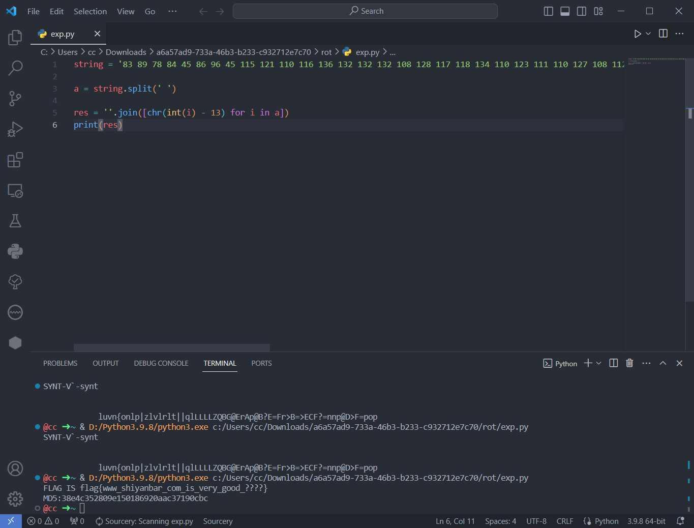

`exp.py`

```python
import hashlib
from string import ascii_letters, digits, punctuation
import itertools

string = '83 89 78 84 45 86 96 45 115 121 110 116 136 132 132 132 108 128 117 118 134 110 123 111 110 127 108 112 124 122 108 118 128 108 131 114 127 134 108 116 124 124 113 108 76 76 76 76 138 23 90 81 66 71 64 69 114 65 112 64 66 63 69 61 70 114 62 66 61 62 69 67 70 63 61 110 110 112 64 68 62 70 61 112 111 112'

a = string.split(' ')

res = ''.join([chr(int(i) - 13) for i in a])
print(res)


def calc_md5(m):
    return hashlib.md5(m.encode()).hexdigest()


def crack():
    md5_value = '38e4c352809e150186920aac37190cbc'
    for i, j, k, l in itertools.product(range(32, 126), range(32, 126), range(32, 126), range(32, 126)):
        res = calc_md5("flag{www_shiyanbar_com_is_very_good_%s%s%s%s}"%(chr(i), chr(j), chr(k), chr(l)))
        if res == md5_value:
            print("flag{www_shiyanbar_com_is_very_good_%s%s%s%s}"%(chr(i), chr(j), chr(k), chr(l)))
            exit(0)

if __name__ == '__main__':
    crack()
```

## [NCTF2019]childRSA

```python
from factordb.factordb import FactorDB
import gmpy2
import libnum

e = 0x10001
n = 32849718197337581823002243717057659218502519004386996660885100592872201948834155543125924395614928962750579667346279456710633774501407292473006312537723894221717638059058796679686953564471994009285384798450493756900459225040360430847240975678450171551048783818642467506711424027848778367427338647282428667393241157151675410661015044633282064056800913282016363415202171926089293431012379261585078566301060173689328363696699811123592090204578098276704877408688525618732848817623879899628629300385790344366046641825507767709276622692835393219811283244303899850483748651722336996164724553364097066493953127153066970594638491950199605713033004684970381605908909693802373826516622872100822213645899846325022476318425889580091613323747640467299866189070780620292627043349618839126919699862580579994887507733838561768581933029077488033326056066378869170169389819542928899483936705521710423905128732013121538495096959944889076705471928490092476616709838980562233255542325528398956185421193665359897664110835645928646616337700617883946369110702443135980068553511927115723157704586595844927607636003501038871748639417378062348085980873502535098755568810971926925447913858894180171498580131088992227637341857123607600275137768132347158657063692388249513
c = 26308018356739853895382240109968894175166731283702927002165268998773708335216338997058314157717147131083296551313334042509806229853341488461087009955203854253313827608275460592785607739091992591431080342664081962030557042784864074533380701014585315663218783130162376176094773010478159362434331787279303302718098735574605469803801873109982473258207444342330633191849040553550708886593340770753064322410889048135425025715982196600650740987076486540674090923181664281515197679745907830107684777248532278645343716263686014941081417914622724906314960249945105011301731247324601620886782967217339340393853616450077105125391982689986178342417223392217085276465471102737594719932347242482670320801063191869471318313514407997326350065187904154229557706351355052446027159972546737213451422978211055778164578782156428466626894026103053360431281644645515155471301826844754338802352846095293421718249819728205538534652212984831283642472071669494851823123552827380737798609829706225744376667082534026874483482483127491533474306552210039386256062116345785870668331513725792053302188276682550672663353937781055621860101624242216671635824311412793495965628876036344731733142759495348248970313655381407241457118743532311394697763283681852908564387282605279108

def get_p_q(n):
    conn = FactorDB(n)
    conn.connect()
    return conn.get_factor_list()

if __name__ == "__main__":
    p, q = get_p_q(n)
    phin = (p-1) * (q-1)
    d = gmpy2.invert(e, phin)
    m = pow(c, d, n)
    print(libnum.n2s(int(m)))
```

## [HDCTF2019]bbbbbbrsa

```python
import base64
import gmpy2
from Crypto.Util.number import long_to_bytes
import libnum


p = 177077389675257695042507998165006460849
n = 37421829509887796274897162249367329400988647145613325367337968063341372726061
c = "==gMzYDNzIjMxUTNyIzNzIjMyYTM4MDM0gTMwEjNzgTM2UTN4cjNwIjN2QzM5ADMwIDNyMTO4UzM2cTM5kDN2MTOyUTO5YDM0czM3MjM"


q = n // p
phin = (p-1) * (q-1)

dec = base64.b64decode(c[::-1])
print(dec)


for e in range(50000, 70000):
    if gmpy2.gcd(e, phin) == 1:
        d = gmpy2.invert(e, phin)
        m = pow(int(dec), d, n)
        # print(m)
        if b'flag' in long_to_bytes(m):
            print(long_to_bytes(m))
            exit(0)
```

## RSA4

低指数加密广播攻击

e选取的很小 对同一个明文 M 进行了多次加密 且知道 Ni 和 Ci
用中国剩余定理 结合 ni ci 算出 m^e 然后用小指数 e 开方即可

```python
import gmpy2
import  binascii

#利用中国剩余定理求解同余方程，aList：余数，mList：模数
def CRT(aList, mList):
    M = 1
    for i in mList:
        M = M * i   #计算M = ∏ mi
    #print(M)
    x = 0
    for i in range(len(mList)):
        Mi = M // mList[i]   #计算Mi
        Mi_inverse = gmpy2.invert(Mi, mList[i]) #计算Mi的逆元
        x += aList[i] * Mi * Mi_inverse #构造x各项
    x = x % M
    return x

if __name__ == "__main__":
    #========== n c ==========
    n1 = "331310324212000030020214312244232222400142410423413104441140203003243002104333214202031202212403400220031202142322434104143104244241214204444443323000244130122022422310201104411044030113302323014101331214303223312402430402404413033243132101010422240133122211400434023222214231402403403200012221023341333340042343122302113410210110221233241303024431330001303404020104442443120130000334110042432010203401440404010003442001223042211442001413004"
    c1 = "310020004234033304244200421414413320341301002123030311202340222410301423440312412440240244110200112141140201224032402232131204213012303204422003300004011434102141321223311243242010014140422411342304322201241112402132203101131221223004022003120002110230023341143201404311340311134230140231412201333333142402423134333211302102413111111424430032440123340034044314223400401224111323000242234420441240411021023100222003123214343030122032301042243"
    n2 = "302240000040421410144422133334143140011011044322223144412002220243001141141114123223331331304421113021231204322233120121444434210041232214144413244434424302311222143224402302432102242132244032010020113224011121043232143221203424243134044314022212024343100042342002432331144300214212414033414120004344211330224020301223033334324244031204240122301242232011303211220044222411134403012132420311110302442344021122101224411230002203344140143044114"
    c2 = "112200203404013430330214124004404423210041321043000303233141423344144222343401042200334033203124030011440014210112103234440312134032123400444344144233020130110134042102220302002413321102022414130443041144240310121020100310104334204234412411424420321211112232031121330310333414423433343322024400121200333330432223421433344122023012440013041401423202210124024431040013414313121123433424113113414422043330422002314144111134142044333404112240344"
    n3 = "332200324410041111434222123043121331442103233332422341041340412034230003314420311333101344231212130200312041044324431141033004333110021013020140020011222012300020041342040004002220210223122111314112124333211132230332124022423141214031303144444134403024420111423244424030030003340213032121303213343020401304243330001314023030121034113334404440421242240113103203013341231330004332040302440011324004130324034323430143102401440130242321424020323"
    c3 = "10013444120141130322433204124002242224332334011124210012440241402342100410331131441303242011002101323040403311120421304422222200324402244243322422444414043342130111111330022213203030324422101133032212042042243101434342203204121042113212104212423330331134311311114143200011240002111312122234340003403312040401043021433112031334324322123304112340014030132021432101130211241134422413442312013042141212003102211300321404043012124332013240431242"
    
    cList = [int(c1,5), int(c2,5), int(c3,5)]
    nList = [int(n1,5), int(n2,5), int(n3,5)]
    m_e = CRT(cList, nList) #计算m^e
    for e in range(1, 10):  #遍历e求解
        m, f = gmpy2.iroot(m_e, e) #m_e开e次根
        print("加密指数e = %d："%e)
        m = hex(m)[2:]
        if len(m)%2 == 1:
            m = m + '0' #binascii.unhexlify()参数长度必须为偶数，因此做一下处理
        flag = binascii.unhexlify(m)
        print(flag)
```

[参考文章](https://blog.csdn.net/xiao_han_a/article/details/118603490)

## [MRCTF2020]天干地支+甲子

```python
jinian = ['甲子','乙丑','丙寅','丁卯','戊辰','己巳','庚午','辛未','壬申','癸酉','甲戌','乙亥','丙子','丁丑','戊寅','己卯','庚辰','辛巳','壬午','癸未','甲申','乙酉','丙戌','丁亥','戊子','己丑','庚寅','辛卯','壬辰','癸巳','甲午','乙未','丙申','丁酉','戊戌','己亥','庚子','辛丑','壬寅','癸卯','甲辰','乙巳','丙午','丁未','戊申','己酉','庚戌','辛亥','壬子','癸丑','甲寅','乙卯','丙辰','丁巳','戊午','己未','庚申','辛酉','壬戌','癸亥']
num = [1,2,3,4,5,6,7,8,9,10,11,12,13,14,15,16,17,18,19,20,21,22,23,24,25,26,27,28,29,30,31,32,33,34,35,36,37,38,39,40,41,42,43,44,45,46,47,48,49,50,51,52,53,54,55,56,57,58,59,60]
mappings = dict(zip(jinian,num))
question = ['甲戌', '甲寅', '甲寅', '癸卯', '己酉', '甲寅', '辛丑']

jinian_num = []
for i in question:
    for key,value in mappings.items():
        if i == key:
            jinian_num.append(value+60)
for i in jinian_num:
    print(''.join(chr(i)),end='')
```

[参考文章](https://www.cnblogs.com/Konmu/p/14503133.html#mrctf2020%E5%A4%A9%E5%B9%B2%E5%9C%B0%E6%94%AF%E7%94%B2%E5%AD%90)

## [BJDCTF2020]RSA

爆破`e`

```python
import gmpy2
from Crypto.Util.number import bytes_to_long, long_to_bytes
import libnum

c1 = 12641635617803746150332232646354596292707861480200207537199141183624438303757120570096741248020236666965755798009656547738616399025300123043766255518596149348930444599820675230046423373053051631932557230849083426859490183732303751744004874183062594856870318614289991675980063548316499486908923209627563871554875612702079100567018698992935818206109087568166097392314105717555482926141030505639571708876213167112187962584484065321545727594135175369233925922507794999607323536976824183162923385005669930403448853465141405846835919842908469787547341752365471892495204307644586161393228776042015534147913888338316244169120
n1 = 13508774104460209743306714034546704137247627344981133461801953479736017021401725818808462898375994767375627749494839671944543822403059978073813122441407612530658168942987820256786583006947001711749230193542370570950705530167921702835627122401475251039000775017381633900222474727396823708695063136246115652622259769634591309421761269548260984426148824641285010730983215377509255011298737827621611158032976420011662547854515610597955628898073569684158225678333474543920326532893446849808112837476684390030976472053905069855522297850688026960701186543428139843783907624317274796926248829543413464754127208843070331063037
pow_v = 381631268825806469518166370387352035475775677163615730759454343913563615970881967332407709901235637718936184198930226303761876517101208677107311006065728014220477966000620964056616058676999878976943319063836649085085377577273214792371548775204594097887078898598463892440141577974544939268247818937936607013100808169758675042264568547764031628431414727922168580998494695800403043312406643527637667466318473669542326169218665366423043579003388486634167642663495896607282155808331902351188500197960905672207046579647052764579411814305689137519860880916467272056778641442758940135016400808740387144508156358067955215018
c2 = 979153370552535153498477459720877329811204688208387543826122582132404214848454954722487086658061408795223805022202997613522014736983452121073860054851302343517756732701026667062765906277626879215457936330799698812755973057557620930172778859116538571207100424990838508255127616637334499680058645411786925302368790414768248611809358160197554369255458675450109457987698749584630551177577492043403656419968285163536823819817573531356497236154342689914525321673807925458651854768512396355389740863270148775362744448115581639629326362342160548500035000156097215446881251055505465713854173913142040976382500435185442521721
n2 = 12806210903061368369054309575159360374022344774547459345216907128193957592938071815865954073287532545947370671838372144806539753829484356064919357285623305209600680570975224639214396805124350862772159272362778768036844634760917612708721787320159318432456050806227784435091161119982613987303255995543165395426658059462110056431392517548717447898084915167661172362984251201688639469652283452307712821398857016487590794996544468826705600332208535201443322267298747117528882985955375246424812616478327182399461709978893464093245135530135430007842223389360212803439850867615121148050034887767584693608776323252233254261047

q = gmpy2.gcd(n1, n2)
p1 = n1 / q
p2 = n2 / q

m = bytes_to_long(b'BJD' * 32)
print(m)
phi1 = (p1 - 1) * (q - 1)
phi2 = (p2 - 1) * (q - 1)


for e in range(65538):
    try:
        d2 = gmpy2.invert(int(e), int(phi2))
        cc = pow(m, e, n2)
        if cc == c2:
            d1 = gmpy2.invert(int(e), int(phi1))
            print(e)
            print(long_to_bytes(pow(c1, d1, n1)))
            print(libnum.n2s(pow(c1, d1, n1)))
    except Exception as e:
        # print(e)
        continue
```

使用`python2`运行即可

## [BJDCTF2020]rsa_output

`共模攻击`

```python
import gmpy2
from Crypto.Util.number import long_to_bytes

n1 = 21058339337354287847534107544613605305015441090508924094198816691219103399526800112802416383088995253908857460266726925615826895303377801614829364034624475195859997943146305588315939130777450485196290766249612340054354622516207681542973756257677388091926549655162490873849955783768663029138647079874278240867932127196686258800146911620730706734103611833179733264096475286491988063990431085380499075005629807702406676707841324660971173253100956362528346684752959937473852630145893796056675793646430793578265418255919376323796044588559726703858429311784705245069845938316802681575653653770883615525735690306674635167111
e1 = 2767
n2 = 21058339337354287847534107544613605305015441090508924094198816691219103399526800112802416383088995253908857460266726925615826895303377801614829364034624475195859997943146305588315939130777450485196290766249612340054354622516207681542973756257677388091926549655162490873849955783768663029138647079874278240867932127196686258800146911620730706734103611833179733264096475286491988063990431085380499075005629807702406676707841324660971173253100956362528346684752959937473852630145893796056675793646430793578265418255919376323796044588559726703858429311784705245069845938316802681575653653770883615525735690306674635167111
e2 = 3659

c1=20152490165522401747723193966902181151098731763998057421967155300933719378216342043730801302534978403741086887969040721959533190058342762057359432663717825826365444996915469039056428416166173920958243044831404924113442512617599426876141184212121677500371236937127571802891321706587610393639446868836987170301813018218408886968263882123084155607494076330256934285171370758586535415136162861138898728910585138378884530819857478609791126971308624318454905992919405355751492789110009313138417265126117273710813843923143381276204802515910527468883224274829962479636527422350190210717694762908096944600267033351813929448599
c2=11298697323140988812057735324285908480504721454145796535014418738959035245600679947297874517818928181509081545027056523790022598233918011261011973196386395689371526774785582326121959186195586069851592467637819366624044133661016373360885158956955263645614345881350494012328275215821306955212788282617812686548883151066866149060363482958708364726982908798340182288702101023393839781427386537230459436512613047311585875068008210818996941460156589314135010438362447522428206884944952639826677247819066812706835773107059567082822312300721049827013660418610265189288840247186598145741724084351633508492707755206886202876227

d, d1, d2 = gmpy2.gcdext(e1, e2)
m = (pow(c1, d1, n1) * pow(c2, d2, n2)) % n1

print(long_to_bytes(m))
```

## 传感器

题目

```
5555555595555A65556AA696AA6666666955
这是某压力传感器无线数据包解调后但未解码的报文(hex)
  
已知其ID为0xFED31F，请继续将报文完整解码，提交hex。

提示1：曼联
```

`曼彻斯特编码`

```python
cipher='5555555595555A65556AA696AA6666666955'
def iee(cipher):
    tmp=''
    for i in range(len(cipher)):
        a=bin(eval('0x'+cipher[i]))[2:].zfill(4)
        tmp=tmp+a[1]+a[3]
        print(tmp)
    plain=[hex(int(tmp[i:i+8][::-1],2))[2:] for i in range(0,len(tmp),8)]
    print(''.join(plain).upper())


iee(cipher)
```

[参考原文](https://juejin.cn/post/7136507868756312101)

## [ACTF新生赛2020]crypto-rsa0

`zip伪加密`

改掉加密位 得到代码

```python
from Cryptodome.Util.number import *
import random

FLAG=#hidden, please solve it
flag=int.from_bytes(FLAG,byteorder = 'big')


p=getPrime(512)
q=getPrime(512)

print(p)
print(q)
N=p*q
e=65537
enc = pow(flag,e,N)
print (enc)

```

最简单的`rsa`

编写`exp`

```python
import gmpy2
from Crypto.Util.number import long_to_bytes

p = 9018588066434206377240277162476739271386240173088676526295315163990968347022922841299128274551482926490908399237153883494964743436193853978459947060210411
q = 7547005673877738257835729760037765213340036696350766324229143613179932145122130685778504062410137043635958208805698698169847293520149572605026492751740223
c = 50996206925961019415256003394743594106061473865032792073035954925875056079762626648452348856255575840166640519334862690063949316515750256545937498213476286637455803452890781264446030732369871044870359838568618176586206041055000297981733272816089806014400846392307742065559331874972274844992047849472203390350
e=65537

phi = (p - 1) * (q - 1)

n = p*q

d = gmpy2.invert(e, phi)

m = pow(c, d, n)
print(long_to_bytes(m))
```

## [MRCTF2020]vigenere

爆破即可

https://www.guballa.de/vigenere-solver

## [WUSTCTF2020]babyrsa

`简单rsa`

```python
from factordb.factordb import FactorDB
import gmpy2
from Crypto.Util.number import long_to_bytes

def get_p_q(n):
    conn = FactorDB(n)
    conn.connect()
    return conn.get_factor_list()

c = 28767758880940662779934612526152562406674613203406706867456395986985664083182
n = 73069886771625642807435783661014062604264768481735145873508846925735521695159
e = 65537

p, q = get_p_q(n)

phi = (p-1) * (q-1)
d = gmpy2.invert(e, phi)

m = pow(c, d, n)
print(long_to_bytes(m))
```

## 一张谍报

```
国家能源时报2015年3月5日
平时要针对性的吃些防辐射菜
对于和电脑“朝夕相处”的人们来说,辐射的确是个让人忧心的“副产物”。因此,平时针对性的吃些可以防辐射的菜是很有好处的。特别是现在接近年底，加班加点是家常便饭，对着电脑更是辐射吸收得满满的，唯有趁一日三餐进食的时候吃点防辐射的食物了。

朝歌区梆子公司三更放炮
老小区居民大爷联合抵制

今天上午，朝歌区梆子公司决定，在每天三更天不亮免费在各大小区门口设卡为全城提供二次震耳欲聋的敲更提醒，呼吁大家早睡早起，不要因为贪睡断送大好人生，时代的符号是前进。为此，全区老人都蹲在该公司东边树丛合力抵制，不给公司人员放行，场面混乱。李罗鹰住进朝歌区五十年了，人称老鹰头，几年孙子李虎南刚从东北当猎户回来，每月还寄回来几块鼹鼠干。李罗鹰当年遇到的老婆是朝歌一枝花，所以李南虎是长得非常秀气的一个汉子。李罗鹰表示：无论梆子公司做的对错，反正不能打扰他孙子睡觉，子曰：‘睡觉乃人之常情’。梆子公司这是连菩萨睡觉都不放过啊。李南虎表示：梆子公司智商捉急，小心居民猴急跳墙！这三伏天都不给睡觉，这不扯淡么！
到了中午人群仍未离散，更有人提议要烧掉这个公司，公司高层似乎恨不得找个洞钻进去。直到治安人员出现才疏散人群归家，但是李南虎仍旧表示爷爷年纪大了，睡不好对身体不好。
朝歌区梆子公司三更放炮
老小区居民大爷联合抵制
喵天上午，汪歌区哞叽公司决定，在每天八哇天不全免费在各大小区门脑设卡为全城提供双次震耳欲聋的敲哇提醒，呼吁大家早睡早起，不要因为贪睡断送大好人生，时代的编号是前进。为此，全区眠人都足在该公司流边草丛合力抵制，不给公司人员放行，场面混乱。李罗鸟住进汪歌区五十年了，人称眠鸟顶，几年孙叽李熬值刚从流北当屁户回来，每月还寄回来几块报信干。李罗鸟当年遇到的眠婆是汪歌一枝花，所以李值熬是长得非常秀气的一个汉叽。李罗鸟表示：无论哞叽公司做的对错，反正不能打扰他孙叽睡觉，叽叶：‘睡觉乃人之常情’。哞叽公司这是连衣服睡觉都不放过啊。李值熬表示：哞叽公司智商捉急，小心居民猴急跳墙！这八伏天都不给睡觉，这不扯淡么！
到了中午人群仍未离散，哇有人提议要烧掉这个公司，公司高层似乎恨不得找个洞钻进去。直到治安人员出现才疏散人群归家，但是李值熬仍旧表示爷爷年纪大了，睡不好对身体不好。

听书做作业

喵汪哞叽双哇顶，眠鸟足屁流脑，八哇报信断流脑全叽，眠鸟进北脑上草，八枝遇孙叽，孙叽对熬编叶：值天衣服放鸟捉猴顶。鸟对：北汪罗汉伏熬乱天门。合编放行，卡编扯呼。人离烧草，报信归洞，孙叽找爷爷。
```

`exp`

```python
# -*- coding: utf-8 -*
src = "今天上午，朝歌区梆子公司决定，在每天三更天不亮免费在各大小区门口设卡为全城提供二次震耳欲聋的敲更提醒，呼吁大家早睡早起，不要因为贪睡断送大好人生，时代的符号是前进。为此，全区老人都蹲在该公司东边树丛合力抵制，不给公司人员放行，场面混乱。李罗鹰住进朝歌区五十年了，人称老鹰头，几年孙子李虎南刚从东北当猎户回来，每月还寄回来几块鼹鼠干。李罗鹰当年遇到的老婆是朝歌一枝花，所以李南虎是长得非常秀气的一个汉子。李罗鹰表示：无论梆子公司做的对错，反正不能打扰他孙子睡觉，子曰：‘睡觉乃人之常情’。梆子公司这是连菩萨睡觉都不放过啊。李南虎表示：梆子公司智商捉急，小心居民猴急跳墙！这三伏天都不给睡觉，这不扯淡么！到了中午人群仍未离散，更有人提议要烧掉这个公司，公司高层似乎恨不得找个洞钻进去。直到治安人员出现才疏散人群归家，但是李南虎仍旧表示爷爷年纪大了，睡不好对身体不好。"
dst = "喵天上午，汪歌区哞叽公司决定，在每天八哇天不全免费在各大小区门脑设卡为全城提供双次震耳欲聋的敲哇提醒，呼吁大家早睡早起，不要因为贪睡断送大好人生，时代的编号是前进。为此，全区眠人都足在该公司流边草丛合力抵制，不给公司人员放行，场面混乱。李罗鸟住进汪歌区五十年了，人称眠鸟顶，几年孙叽李熬值刚从流北当屁户回来，每月还寄回来几块报信干。李罗鸟当年遇到的眠婆是汪歌一枝花，所以李值熬是长得非常秀气的一个汉叽。李罗鸟表示：无论哞叽公司做的对错，反正不能打扰他孙叽睡觉，叽叶：‘睡觉乃人之常情’。哞叽公司这是连衣服睡觉都不放过啊。李值熬表示：哞叽公司智商捉急，小心居民猴急跳墙！这八伏天都不给睡觉，这不扯淡么！到了中午人群仍未离散，哇有人提议要烧掉这个公司，公司高层似乎恨不得找个洞钻进去。直到治安人员出现才疏散人群归家，但是李值熬仍旧表示爷爷年纪大了，睡不好对身体不好。"
c = "喵汪哞叽双哇顶，眠鸟足屁流脑，八哇报信断流脑全叽，眠鸟进北脑上草，八枝遇孙叽，孙叽对熬编叶：值天衣服放鸟捉猴顶。鸟对：北汪罗汉伏熬乱天门。合编放行，卡编扯呼。人离烧草，报信归洞，孙叽找爷爷。"
 
for i in c:
    index = dst.index(i)
    print(src[index], end = '')
```

运行结果

```
今朝梆子二更头，老鹰蹲猎东口，三更鼹鼠断东口亮子，老鹰进北口上树，三枝遇孙子，孙子对虎符曰：南天菩萨放鹰捉猴头。鹰对：北朝罗汉伏虎乱天门。合符放行，卡符扯呼。人离烧树，鼹鼠归洞，孙子找爷爷。
```

`flag{南天菩萨放鹰捉猴头}`

[参考](https://blog.csdn.net/wp568/article/details/132631135)

## [GWCTF 2019]BabyRSA

题目

```python
import hashlib
import sympy
from Crypto.Util.number import *

flag = 'GWHT{******}'
secret = '******'

assert(len(flag) == 38)

half = len(flag) / 2

flag1 = flag[:half]
flag2 = flag[half:]

secret_num = getPrime(1024) * bytes_to_long(secret)

p = sympy.nextprime(secret_num)
q = sympy.nextprime(p)

N = p * q

e = 0x10001

F1 = bytes_to_long(flag1)
F2 = bytes_to_long(flag2)

c1 = F1 + F2
c2 = pow(F1, 3) + pow(F2, 3)
assert(c2 < N)

m1 = pow(c1, e, N)
m2 = pow(c2, e, N)

output = open('secret', 'w')
output.write('N=' + str(N) + '\n')
output.write('m1=' + str(m1) + '\n')
output.write('m2=' + str(m2) + '\n')
output.close()
```

`exp`

```python
n=636585149594574746909030160182690866222909256464847291783000651837227921337237899651287943597773270944384034858925295744880727101606841413640006527614873110651410155893776548737823152943797884729130149758279127430044739254000426610922834573094957082589539445610828279428814524313491262061930512829074466232633130599104490893572093943832740301809630847541592548921200288222432789208650949937638303429456468889100192613859073752923812454212239908948930178355331390933536771065791817643978763045030833712326162883810638120029378337092938662174119747687899484603628344079493556601422498405360731958162719296160584042671057160241284852522913676264596201906163
c1=90009974341452243216986938028371257528604943208941176518717463554774967878152694586469377765296113165659498726012712288670458884373971419842750929287658640266219686646956929872115782173093979742958745121671928568709468526098715927189829600497283118051641107305128852697032053368115181216069626606165503465125725204875578701237789292966211824002761481815276666236869005129138862782476859103086726091860497614883282949955023222414333243193268564781621699870412557822404381213804026685831221430728290755597819259339616650158674713248841654338515199405532003173732520457813901170264713085107077001478083341339002069870585378257051150217511755761491021553239
c2=487443985757405173426628188375657117604235507936967522993257972108872283698305238454465723214226871414276788912058186197039821242912736742824080627680971802511206914394672159240206910735850651999316100014691067295708138639363203596244693995562780286637116394738250774129759021080197323724805414668042318806010652814405078769738548913675466181551005527065309515364950610137206393257148357659666687091662749848560225453826362271704292692847596339533229088038820532086109421158575841077601268713175097874083536249006018948789413238783922845633494023608865256071962856581229890043896939025613600564283391329331452199062858930374565991634191495137939574539546

import gmpy2
from Crypto.Util.number import long_to_bytes
import sympy

def get_p_q(n):
    from factordb.factordb import FactorDB
    conn = FactorDB(n)
    conn.connect()
    return conn.get_factor_list()

e = 0x10001
q = 797862863902421984951231350430312260517773269684958456342860983236184129602390919026048496119757187702076499551310794177917920137646835888862706126924088411570997141257159563952725882214181185531209186972351469946269508511312863779123205322378452194261217016552527754513215520329499967108196968833163329724620251096080377748737
p = 797862863902421984951231350430312260517773269684958456342860983236184129602390919026048496119757187702076499551310794177917920137646835888862706126924088411570997141257159563952725882214181185531209186972351469946269508511312863779123205322378452194261217016552527754513215520329499967108196968833163329724620251096080377747699
phi = (p-1) * (q-1)
d = gmpy2.invert(e, phi)
m1 = pow(c1, d, n)
m2 = pow(c2, d, n)

F1 = sympy.Symbol('F1')#方程组定义变量
F2 = sympy.Symbol('F2')
f1 = F1+F2-m1
f2 = pow(F1,3)+pow(F2,3)-m2
result = sympy.solve([f1,f2],[F1,F2])

flag1 = long_to_bytes(result[0][1])
flag2 = long_to_bytes(result[0][0])

print(flag1 + flag2)
```

## [ACTF新生赛2020]crypto-rsa3

题目

```python
from flag import FLAG
from Cryptodome.Util.number import *
import gmpy2
import random

e=65537
p = getPrime(512)
q = int(gmpy2.next_prime(p))
n = p*q
m = bytes_to_long(FLAG)
c = pow(m,e,n)
print(n)
print(c)
```

`exp`

```python
n = 177606504836499246970959030226871608885969321778211051080524634084516973331441644993898029573612290095853069264036530459253652875586267946877831055147546910227100566496658148381834683037366134553848011903251252726474047661274223137727688689535823533046778793131902143444408735610821167838717488859902242863683
c = 1457390378511382354771000540945361168984775052693073641682375071407490851289703070905749525830483035988737117653971428424612332020925926617395558868160380601912498299922825914229510166957910451841730028919883807634489834128830801407228447221775264711349928156290102782374379406719292116047581560530382210049

import gmpy2
from Crypto.Util.number import long_to_bytes


def get_p_q(n):
    from factordb.factordb import FactorDB
    conn = FactorDB(n)
    conn.connect()
    return conn.get_factor_list()
e = 65537
p, q = get_p_q(n)
phi = (p-1) * (q-1)
d = gmpy2.invert(e, phi)
m = pow(c, d, n)
print(long_to_bytes(m))
```

## [NPUCTF2020]这是什么觅🐎


1. 图片底部有

> F1 W1 S22 S21 T12 S11 W1 S13

1. 发现其中包含的字母都是星期*的首字母。其中，由于T和S开头的都有两个，所以按先后顺序有T1=TUE，T2=THU，S1=SAT，S2=SUN。
2. 所以以上得到的密文应该是从日历中找对应数字。

| 密文 | 查表 |          含义          |
| :--: | :--: | :--------------------: |
|  F1  |  3   | 第一个Friday表示的数字 |
|  W1  |  1   |                        |
| S22  |  12  |  第二个SUN表示的数字   |
| S21  |  5   |                        |
| T12  |  14  |                        |
| S11  |  4   |                        |
|  W1  |  1   |                        |
| S13  |  18  |                        |

1. 找到数字对应的字母，则有

> calendar

flag{calendar}

## SameMod

`共模攻击`转`ascii`码

```python
n1 = 6266565720726907265997241358331585417095726146341989755538017122981360742813498401533594757088796536341941659691259323065631249
e1 = 773
n2 = 6266565720726907265997241358331585417095726146341989755538017122981360742813498401533594757088796536341941659691259323065631249
e2 = 839
c1=3453520592723443935451151545245025864232388871721682326408915024349804062041976702364728660682912396903968193981131553111537349
c2=5672818026816293344070119332536629619457163570036305296869053532293105379690793386019065754465292867769521736414170803238309535
import libnum

import gmpy2
from Crypto.Util.number import long_to_bytes

d, d1, d2 = gmpy2.gcdext(e1, e2)
m = (pow(c1, d1, n1) * pow(c2, d2, n2)) % n1

print(m)

m=str(m)
flag=''
i=0
while i<len(m):
    if m[i]=='1':
        flag+=chr(int(m[i:i+3]))
        i+=3
    else:
        flag+=chr(int(m[i:i+2]))
        i+=2
print(flag)
```

## [BJDCTF2020]easyrsa

题目

```python
from Crypto.Util.number import getPrime,bytes_to_long
from sympy import Derivative
from fractions import Fraction
from secret import flag

p=getPrime(1024)
q=getPrime(1024)
e=65537
n=p*q
z=Fraction(1,Derivative(arctan(p),p))-Fraction(1,Derivative(arth(q),q))
m=bytes_to_long(flag)
c=pow(m,e,n)
print(c,z,n)
'''
output:
7922547866857761459807491502654216283012776177789511549350672958101810281348402284098310147796549430689253803510994877420135537268549410652654479620858691324110367182025648788407041599943091386227543182157746202947099572389676084392706406084307657000104665696654409155006313203957292885743791715198781974205578654792123191584957665293208390453748369182333152809882312453359706147808198922916762773721726681588977103877454119043744889164529383188077499194932909643918696646876907327364751380953182517883134591810800848971719184808713694342985458103006676013451912221080252735948993692674899399826084848622145815461035
32115748677623209667471622872185275070257924766015020072805267359839059393284316595882933372289732127274076434587519333300142473010344694803885168557548801202495933226215437763329280242113556524498457559562872900811602056944423967403777623306961880757613246328729616643032628964072931272085866928045973799374711846825157781056965164178505232524245809179235607571567174228822561697888645968559343608375331988097157145264357626738141646556353500994924115875748198318036296898604097000938272195903056733565880150540275369239637793975923329598716003350308259321436752579291000355560431542229699759955141152914708362494482
15310745161336895413406690009324766200789179248896951942047235448901612351128459309145825547569298479821101249094161867207686537607047447968708758990950136380924747359052570549594098569970632854351825950729752563502284849263730127586382522703959893392329333760927637353052250274195821469023401443841395096410231843592101426591882573405934188675124326997277775238287928403743324297705151732524641213516306585297722190780088180705070359469719869343939106529204798285957516860774384001892777525916167743272419958572055332232056095979448155082465977781482598371994798871917514767508394730447974770329967681767625495394441

'''
```

`exp`

```python
import gmpy2
from Crypto.Util.number import long_to_bytes


def get_p_q(n):
    from factordb.factordb import FactorDB
    conn = FactorDB(n)
    conn.connect()
    return conn.get_factor_list()
c = 7922547866857761459807491502654216283012776177789511549350672958101810281348402284098310147796549430689253803510994877420135537268549410652654479620858691324110367182025648788407041599943091386227543182157746202947099572389676084392706406084307657000104665696654409155006313203957292885743791715198781974205578654792123191584957665293208390453748369182333152809882312453359706147808198922916762773721726681588977103877454119043744889164529383188077499194932909643918696646876907327364751380953182517883134591810800848971719184808713694342985458103006676013451912221080252735948993692674899399826084848622145815461035
n = 15310745161336895413406690009324766200789179248896951942047235448901612351128459309145825547569298479821101249094161867207686537607047447968708758990950136380924747359052570549594098569970632854351825950729752563502284849263730127586382522703959893392329333760927637353052250274195821469023401443841395096410231843592101426591882573405934188675124326997277775238287928403743324297705151732524641213516306585297722190780088180705070359469719869343939106529204798285957516860774384001892777525916167743272419958572055332232056095979448155082465977781482598371994798871917514767508394730447974770329967681767625495394441
e = 65537
z = 32115748677623209667471622872185275070257924766015020072805267359839059393284316595882933372289732127274076434587519333300142473010344694803885168557548801202495933226215437763329280242113556524498457559562872900811602056944423967403777623306961880757613246328729616643032628964072931272085866928045973799374711846825157781056965164178505232524245809179235607571567174228822561697888645968559343608375331988097157145264357626738141646556353500994924115875748198318036296898604097000938272195903056733565880150540275369239637793975923329598716003350308259321436752579291000355560431542229699759955141152914708362494482
p, q = get_p_q(n)
phi = (p-1) * (q-1)
d = gmpy2.invert(e, phi)
m = pow(c, d, n)
print(long_to_bytes(m))
```

## 浪里淘沙

`词频统计`

`exp`

```python
# -*- coding:utf-8 -*-
# Author: Konmu

f=open("C:/Users/xxx/Desktop/浪里淘沙.txt",'r')
data=f.read()

statistics={}
frequency=[]
num=[4,8,11,15,16]
def zipin(lsit):
    for i in lsit:
        statistics.setdefault(data.count(i),str(i))
        frequency.append(data.count(i))
    frequency.sort()
    for i in num:
        print(''.join(statistics.get(frequency[i-1])),end='')
    print('\n')
    return(statistics)

if __name__ == '__main__':
    letters=["tonight","success","notice","example","should","crypto","backspace","learn","found","morning","we","system","sublim","the","user","enter"]
    print(zipin(letters))
```

## [NCTF2019]babyRSA

题目

```python
from Crypto.Util.number import *
from flag import flag

def nextPrime(n):
    n += 2 if n & 1 else 1
    while not isPrime(n):
        n += 2
    return n

p = getPrime(1024)
q = nextPrime(p)
n = p * q
e = 0x10001
d = inverse(e, (p-1) * (q-1))
c = pow(bytes_to_long(flag.encode()), e, n)

# d = 19275778946037899718035455438175509175723911466127462154506916564101519923603308900331427601983476886255849200332374081996442976307058597390881168155862238533018621944733299208108185814179466844504468163200369996564265921022888670062554504758512453217434777820468049494313818291727050400752551716550403647148197148884408264686846693842118387217753516963449753809860354047619256787869400297858568139700396567519469825398575103885487624463424429913017729585620877168171603444111464692841379661112075123399343270610272287865200880398193573260848268633461983435015031227070217852728240847398084414687146397303110709214913
# c = 5382723168073828110696168558294206681757991149022777821127563301413483223874527233300721180839298617076705685041174247415826157096583055069337393987892262764211225227035880754417457056723909135525244957935906902665679777101130111392780237502928656225705262431431953003520093932924375902111280077255205118217436744112064069429678632923259898627997145803892753989255615273140300021040654505901442787810653626524305706316663169341797205752938755590056568986738227803487467274114398257187962140796551136220532809687606867385639367743705527511680719955380746377631156468689844150878381460560990755652899449340045313521804
```

`exp`

```python
e=0x10001
d = 19275778946037899718035455438175509175723911466127462154506916564101519923603308900331427601983476886255849200332374081996442976307058597390881168155862238533018621944733299208108185814179466844504468163200369996564265921022888670062554504758512453217434777820468049494313818291727050400752551716550403647148197148884408264686846693842118387217753516963449753809860354047619256787869400297858568139700396567519469825398575103885487624463424429913017729585620877168171603444111464692841379661112075123399343270610272287865200880398193573260848268633461983435015031227070217852728240847398084414687146397303110709214913
c = 5382723168073828110696168558294206681757991149022777821127563301413483223874527233300721180839298617076705685041174247415826157096583055069337393987892262764211225227035880754417457056723909135525244957935906902665679777101130111392780237502928656225705262431431953003520093932924375902111280077255205118217436744112064069429678632923259898627997145803892753989255615273140300021040654505901442787810653626524305706316663169341797205752938755590056568986738227803487467274114398257187962140796551136220532809687606867385639367743705527511680719955380746377631156468689844150878381460560990755652899449340045313521804
import sympy.crypto
import gmpy2
e_d_1=e*d-1
p=0
q=0
for k in range(pow(2,15),pow(2,16)):
    if e_d_1%k==0:
        p=sympy.prevprime(gmpy2.iroot(e_d_1//k,2)[0])
        q=sympy.nextprime(p)
        if (p-1)*(q-1)*k==e_d_1:
            break
n=p*q
print(n)
m=gmpy2.powmod(c,d,n)
print(m)
import binascii
print(binascii.unhexlify(hex(m)[2:]))
```

[参考文章](https://www.cnblogs.com/lhq-2000/p/14130500.html)

## yxx

给了一个明文和密文

`异或`

`exp.py`

```python
string1 = open('./明文.txt', 'rb').read()
string2 = open('./密文.txt', 'rb').read()

# print(len(string1))
# print(len(string2))
for i in range(len(string1)):
    print(chr(string1[i] ^ string2[i]), end='')
```

## [AFCTF2018]你能看出这是什么加密么

题目

```
p=0x928fb6aa9d813b6c3270131818a7c54edb18e3806942b88670106c1821e0326364194a8c49392849432b37632f0abe3f3c52e909b939c91c50e41a7b8cd00c67d6743b4f

q=0xec301417ccdffa679a8dcc4027dd0d75baf9d441625ed8930472165717f4732884c33f25d4ee6a6c9ae6c44aedad039b0b72cf42cab7f80d32b74061

e=0x10001

c=0x70c9133e1647e95c3cb99bd998a9028b5bf492929725a9e8e6d2e277fa0f37205580b196e5f121a2e83bc80a8204c99f5036a07c8cf6f96c420369b4161d2654a7eccbdaf583204b645e137b3bd15c5ce865298416fd5831cba0d947113ed5be5426b708b89451934d11f9aed9085b48b729449e461ff0863552149b965e22b6
```

`exp.py`

```python
p=0x928fb6aa9d813b6c3270131818a7c54edb18e3806942b88670106c1821e0326364194a8c49392849432b37632f0abe3f3c52e909b939c91c50e41a7b8cd00c67d6743b4f

q=0xec301417ccdffa679a8dcc4027dd0d75baf9d441625ed8930472165717f4732884c33f25d4ee6a6c9ae6c44aedad039b0b72cf42cab7f80d32b74061

e=0x10001

c=0x70c9133e1647e95c3cb99bd998a9028b5bf492929725a9e8e6d2e277fa0f37205580b196e5f121a2e83bc80a8204c99f5036a07c8cf6f96c420369b4161d2654a7eccbdaf583204b645e137b3bd15c5ce865298416fd5831cba0d947113ed5be5426b708b89451934d11f9aed9085b48b729449e461ff0863552149b965e22b6

import gmpy2
from Crypto.Util.number import long_to_bytes


def get_p_q(n):
    from factordb.factordb import FactorDB
    conn = FactorDB(n)
    conn.connect()
    return conn.get_factor_list()
n = p * q
# p, q = get_p_q(n)
phi = (p-1) * (q-1)
d = gmpy2.invert(e, phi)
m = pow(c, d, n)
print(long_to_bytes(m))
```

## [AFCTF2018]可怜的RSA

目录下有`flag.enc`和`public.key`

`exp.py`

```python
from Crypto.PublicKey import RSA
from Crypto.Cipher import PKCS1_OAEP
import base64
import gmpy2

f = open('./public.key', 'rb').read()

pub_key = RSA.importKey(f)

n = pub_key.n

e = pub_key.e

print('n=%s\ne=%s'%(n, e))

def get_p_q(n):
    from factordb.factordb import FactorDB
    conn = FactorDB(n)
    conn.connect()
    return conn.get_factor_list()

p, q = get_p_q(n)
print('p=%s\nq=%s'%(p, q))

d = gmpy2.invert(e, (p-1)*(q-1))

print('d=%s'%d)

key_info = RSA.construct((int(n), int(e), int(d), int(p), int(q)))
key = RSA.importKey(key_info.exportKey())
key = PKCS1_OAEP.new(key)

f = open('./flag.enc', 'r').read()
c = base64.b64decode(f)
flag = key.decrypt(c)
print(flag)
```

## [网鼎杯 2020 青龙组]boom

运行程序


```
first:this string md5:46e5efe6165a5afb361217446a2dbd01
```

`cmd5`解密一下

`en5oy`

下一关

```
This time:Here are have some formulas
3x-y+z=185
2x+3y-z=321
x+y+z=173
input: x =
```

编写代码

```python
from sympy import *

x = Symbol('x')
y = Symbol('y')
z = Symbol('z')

print(solve([3*x-y+z-185, 2*x+3*y-z-321, x+y+z-173], [x, y, z]))
```

```
{x: 74, y: 68, z: 31}
```

下一关

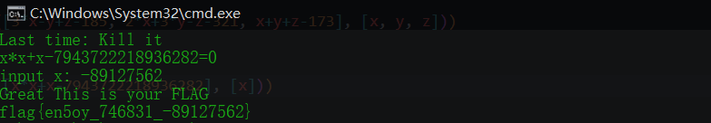

```
Last time: Kill it
x*x+x-7943722218936282=0
```

同样的

```python
from sympy import *

print(solve([x*x+x-7943722218936282], [x]))
```

## [RoarCTF2019]babyRSA

题目

```python
import sympy
import random

def myGetPrime():
    A= getPrime(513)
    print(A)
    B=A-random.randint(1e3,1e5)
    print(B)
    return sympy.nextPrime((B!)%A)
p=myGetPrime()
#A1=21856963452461630437348278434191434000066076750419027493852463513469865262064340836613831066602300959772632397773487317560339056658299954464169264467234407
#B1=21856963452461630437348278434191434000066076750419027493852463513469865262064340836613831066602300959772632397773487317560339056658299954464169264467140596

q=myGetPrime()
#A2=16466113115839228119767887899308820025749260933863446888224167169857612178664139545726340867406790754560227516013796269941438076818194617030304851858418927
#B2=16466113115839228119767887899308820025749260933863446888224167169857612178664139545726340867406790754560227516013796269941438076818194617030304851858351026

r=myGetPrime()

n=p*q*r
#n=85492663786275292159831603391083876175149354309327673008716627650718160585639723100793347534649628330416631255660901307533909900431413447524262332232659153047067908693481947121069070451562822417357656432171870951184673132554213690123308042697361969986360375060954702920656364144154145812838558365334172935931441424096270206140691814662318562696925767991937369782627908408239087358033165410020690152067715711112732252038588432896758405898709010342467882264362733
c=pow(flag,e,n)
#e=0x1001
#c=75700883021669577739329316795450706204502635802310731477156998834710820770245219468703245302009998932067080383977560299708060476222089630209972629755965140317526034680452483360917378812244365884527186056341888615564335560765053550155758362271622330017433403027261127561225585912484777829588501213961110690451987625502701331485141639684356427316905122995759825241133872734362716041819819948645662803292418802204430874521342108413623635150475963121220095236776428
#so,what is the flag?
```

`exp`

```python
from sympy import nextprime
from Crypto.Util.number import *
from gmpy2 import invert

def get_p_q(A,B):
    tmp = 1
    # calculate remain value (mod A) of (A−1)(A−2)(A−3)...(B+1)
    for i in range(B+1,A-1):
        tmp *= i
        tmp %= A

    tmp_inv = invert(tmp,A)
    result = nextprime(tmp_inv)
    return result

A1=21856963452461630437348278434191434000066076750419027493852463513469865262064340836613831066602300959772632397773487317560339056658299954464169264467234407
B1=21856963452461630437348278434191434000066076750419027493852463513469865262064340836613831066602300959772632397773487317560339056658299954464169264467140596

A2=16466113115839228119767887899308820025749260933863446888224167169857612178664139545726340867406790754560227516013796269941438076818194617030304851858418927
B2=16466113115839228119767887899308820025749260933863446888224167169857612178664139545726340867406790754560227516013796269941438076818194617030304851858351026

n=85492663786275292159831603391083876175149354309327673008716627650718160585639723100793347534649628330416631255660901307533909900431413447524262332232659153047067908693481947121069070451562822417357656432171870951184673132554213690123308042697361969986360375060954702920656364144154145812838558365334172935931441424096270206140691814662318562696925767991937369782627908408239087358033165410020690152067715711112732252038588432896758405898709010342467882264362733
e=0x1001
c=75700883021669577739329316795450706204502635802310731477156998834710820770245219468703245302009998932067080383977560299708060476222089630209972629755965140317526034680452483360917378812244365884527186056341888615564335560765053550155758362271622330017433403027261127561225585912484777829588501213961110690451987625502701331485141639684356427316905122995759825241133872734362716041819819948645662803292418802204430874521342108413623635150475963121220095236776428

p = get_p_q(A1,B1)
q = get_p_q(A2,B2)
print(p)
print(q)
# p = 1276519424397216455160791032620569392845781005616561979809403385593761615670426423039762716291920053306063214548359656555809123127361539475238435285654851
# q = 13242175493583584108411324143773780862426183382017753129633978933213674770487765387985282956574197274056162861584407275172775868763712231230219112670015751

r = n // p // q
print(r)
# r = 5057572094237208127867754008134739503717927865750318894982404287656747895573075881186030840558129423864679886646066477437020450654848839861455661385205433

phn = (p - 1) * (q - 1) * (r - 1)
d = invert(e, phn)
print(d)
# d = 23245991568931089935575398139533179902151911325504278186895368123724684132878362590745372016987963378102056924287587028702166372731411906405181410326380814220943063812165970658883369631308421395770179828382024820676516261188276456737434776404340381374859304944884947772697915445301641449023374627214573292539161320959779418043275889202421521069705878414823578781441160766914068377017428380775625886023385019623499784980822629415795884228504498888092721097658433
m = pow(c,d,n)
print(m)
# 49562188096458630410563044417358818341913265571373725266976612126526106528404944745044614126232074073813936259453
print(long_to_bytes(m))
```

## [ACTF新生赛2020]crypto-classic0

所在目录

```
-a----          2020/3/5     18:03             24 cipher
-a----          2020/3/5     18:03             57 hint.txt
-a----          2020/3/5     18:03            469 howtoencrypt.zip
```

`hint.txt`里面的内容

```
哼，压缩包的密码？这是小Z童鞋的生日吧==
```

`ARCHAR`破解一下

发现密码是`19990306`

获得了加密脚本`classic0.c`

```c
#include<stdio.h>

char flag[25] = ***

int main()
{
	int i;
	for(i=0;i<25;i++)
	{
		flag[i] -= 3;
		flag[i] ^= 0x7;
		printf("%c",flag[i]);
	}
	return 0; 
}
```

`exp`

```python
f = open('./cipher', 'r').read()

for i, v in enumerate(f.strip()):
    print(chr((ord(v) ^ 0x7) + 3), end='')
```

`flag{my_naive_encrytion}`

