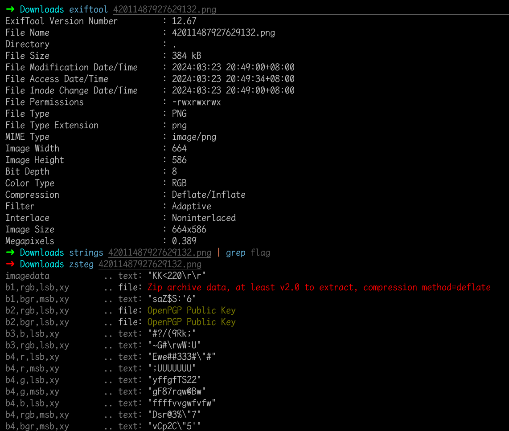
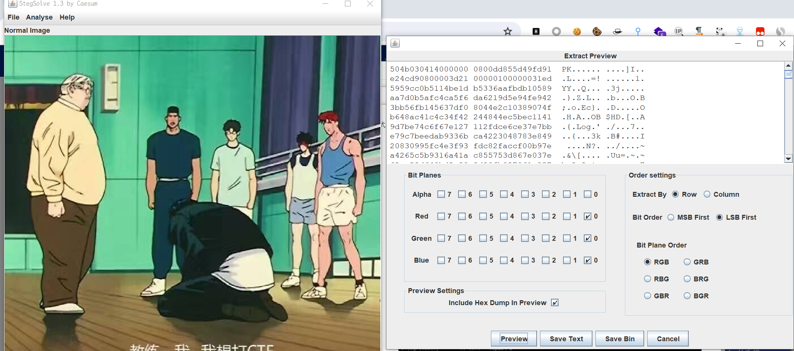
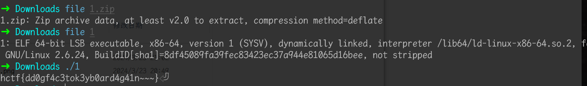

# FLAG

## 知识点

`lsb低位图片隐写`

## 解题

`exiftool`和`strings`没有发现什么东西

使用`zsteg`在`lsb`低位发现了一个`zip`压缩包，使用`StegSolve`保存为二进制文件，`Save Bin`文件名为`1.zip`

解压会报错，继续解压即可，发现`1`文件，`file`发现是`ELF`，`linux`执行看下，直接给了`flag`

