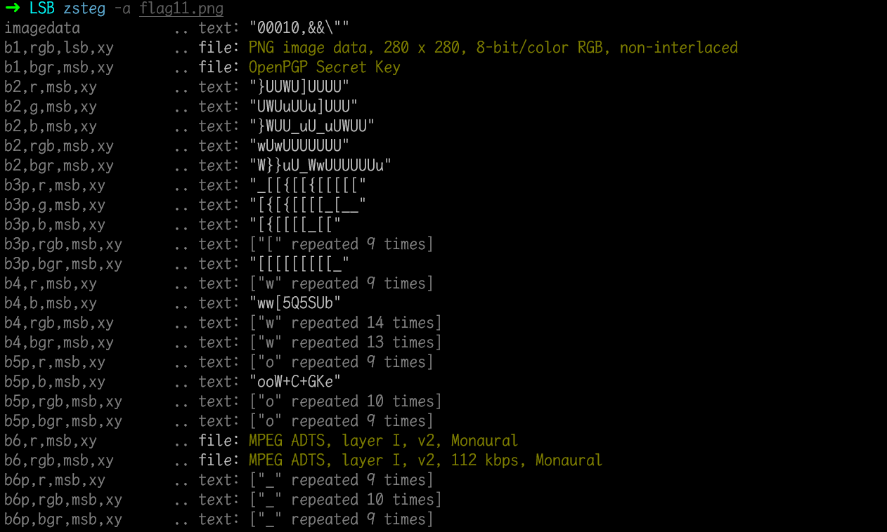
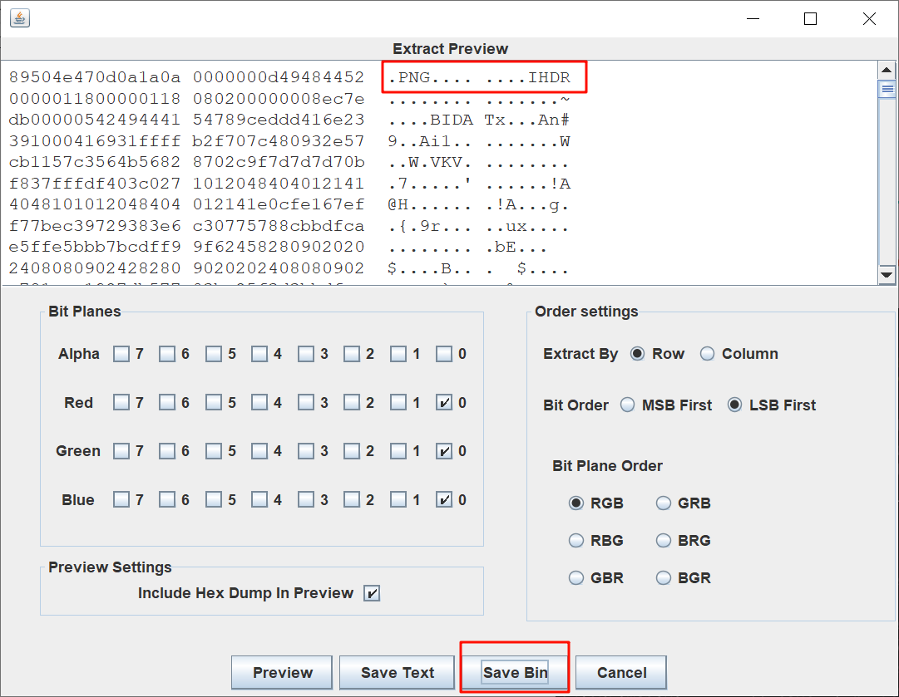
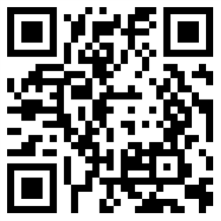
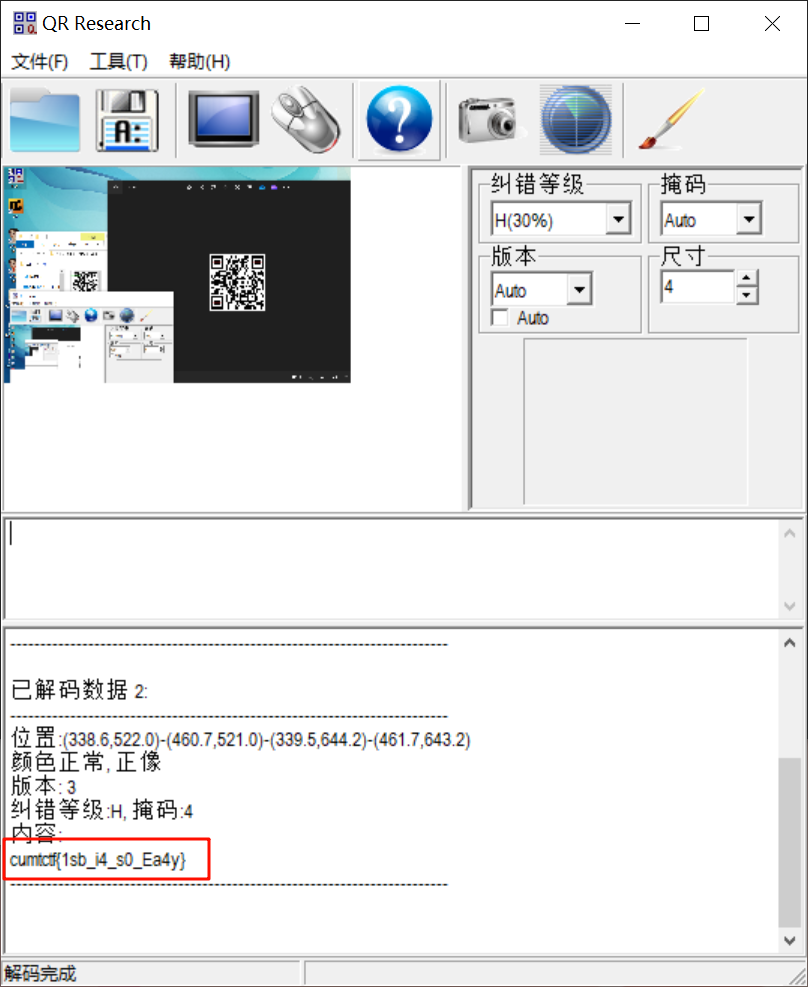

# LSB

## 知识点

`LSB隐写`

## 解题

既然是`LSB隐写`，那么首先就通过`zsteg`看看有没有隐藏文本

没有发现`flag`文本，但是发现在`b1`,`lsb`,`rgb`处发现图片，使用`stegsolve`来查看`hex`内容,发现了一张图片，`Save Bin`保存图片二进制内容

保存后为一个二维码

扫码获得`flag`

`flag`为`flag{1sb_i4_s0_Ea4y}`