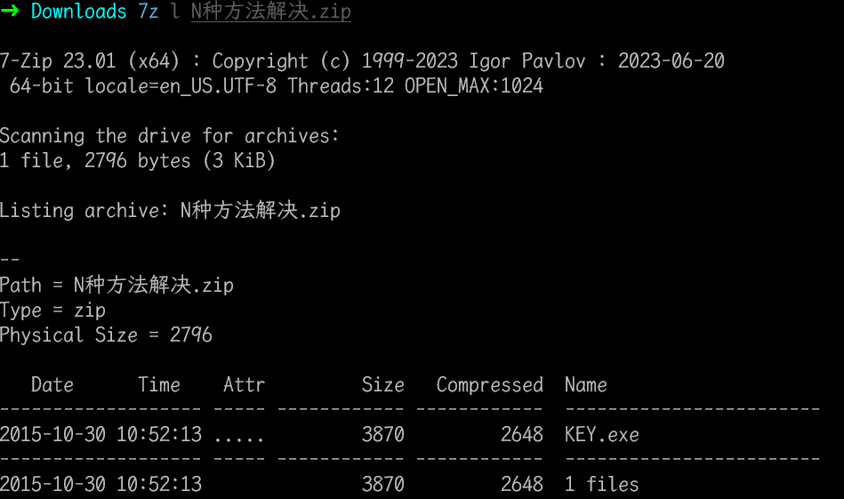
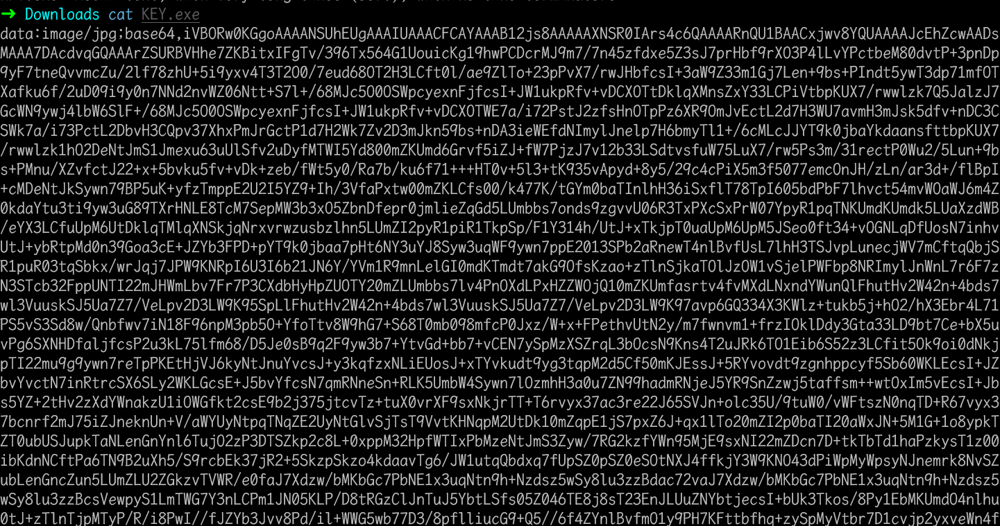
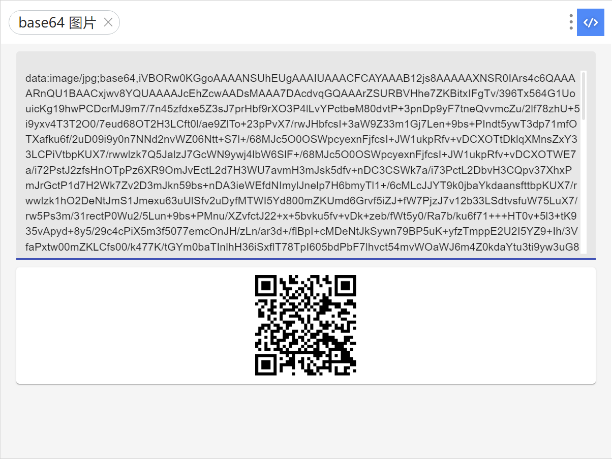
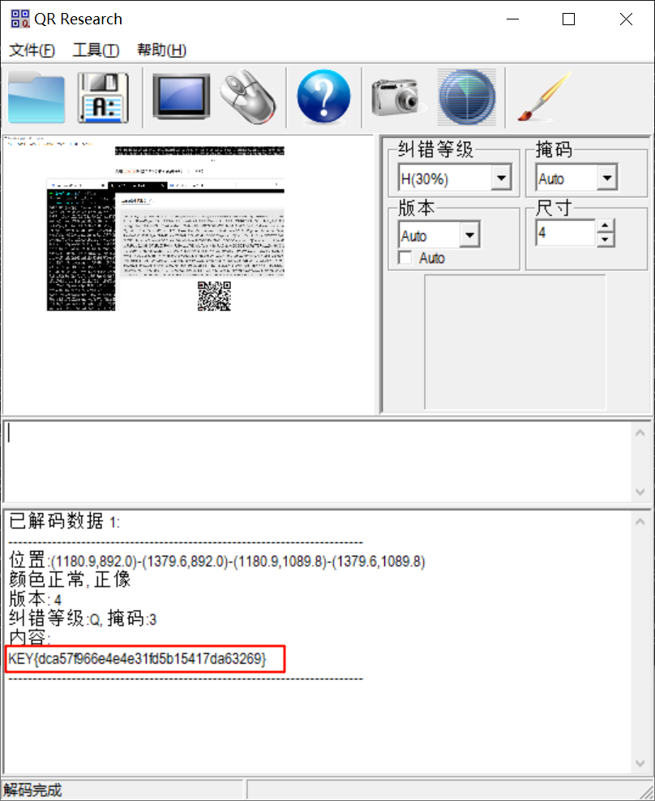

# N种办法解决

## 知识点

`文件后缀名隐藏文件类型`

`base64图片编码`

## 解题

首先获得一个压缩包，使用`7z`查看一下压缩包里面的文件

```bash
7z l N种方法解决.zip
```



发现有`KEY.exe`，然后`7z x N种办法解决.zip`解压文件，解压出`KEY.exe`，刚开始还以为是`PE`文件，直接执行，发现执行失败，拖到`die`查看，发现报错没有信息，然后`file`查看文件类型


发现是`ASCII`字符串，`cat`看看内容，发现是`base64`编码后的图片



使用`utools`的插件解码即可获得得到一个二维码



`CQR`扫码即可获得`flag`



`flag`为`flag{dca57f966e4e4e31fd5b15417da63269}`