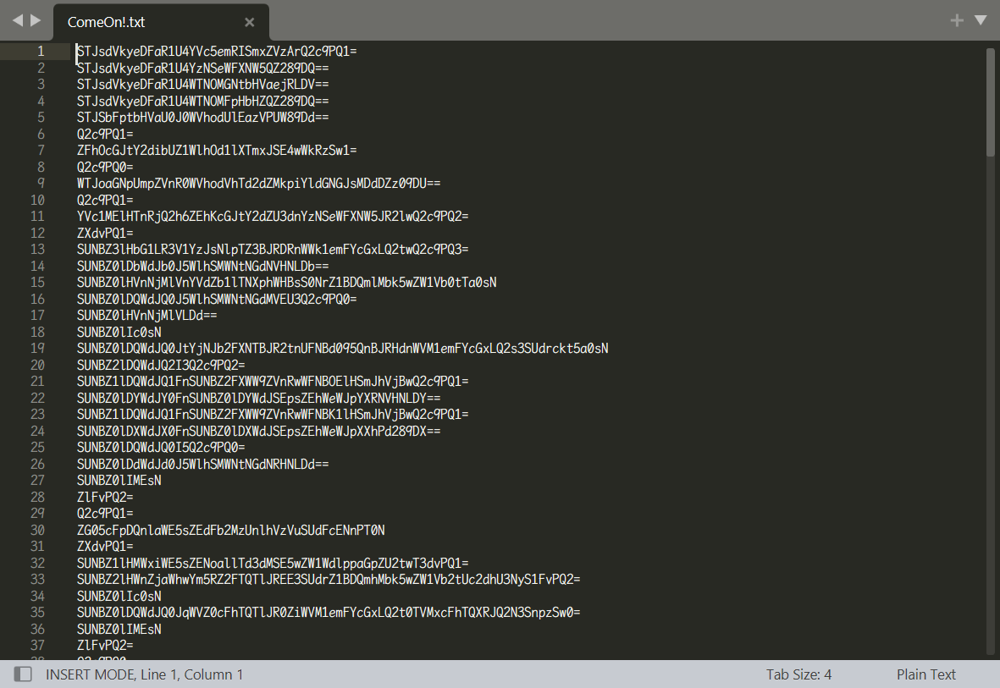

# [ACTF新生赛2020]base64隐写

## 知识点

`python数据处理`

## 解题

每行给了一个`base64`编码的字符串



`python3`

```python
import base64
b64chars = 'ABCDEFGHIJKLMNOPQRSTUVWXYZabcdefghijklmnopqrstuvwxyz0123456789+/'
with open('ComeOn!.txt', 'rb') as f:
    flag = ''
    bin_str = ''
    for line in f.readlines():
        stegb64 = str(line, "utf-8").strip("\n")
        rowb64 = str(base64.b64encode(base64.b64decode(stegb64)), "utf-8").strip("\n")
        offset = abs(b64chars.index(stegb64.replace('=', '')[-1]) - b64chars.index(rowb64.replace('=', '')[-1]))
        equalnum = stegb64.count('=')  # no equalnum no offset
        if equalnum:
            bin_str += bin(offset)[2:].zfill(equalnum * 2)
            # flag += chr(int(bin(offset)[2:].zfill(equalnum * 2), 2))
            # print(flag) 这样写得不出正确结果
        print([chr(int(bin_str[i:i + 8], 2)) for i in range(0, len(bin_str), 8)])
```

