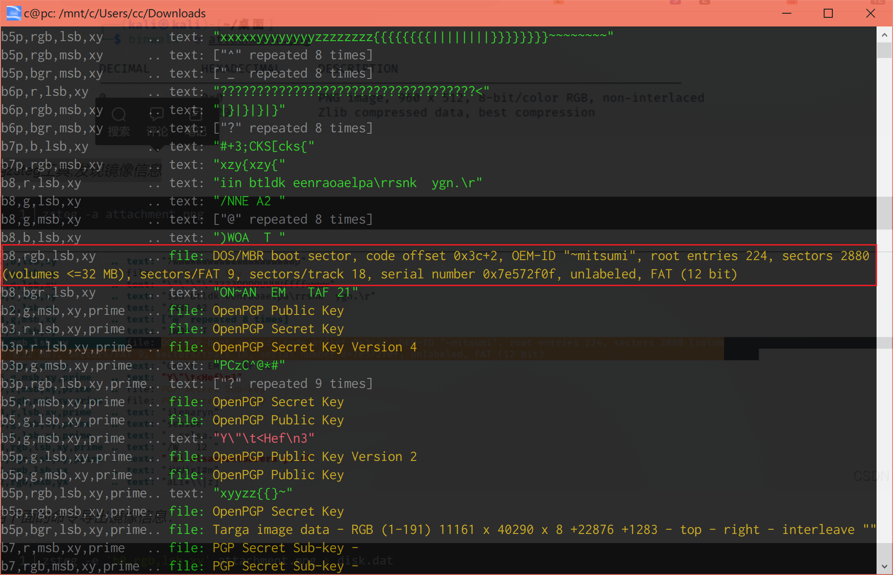
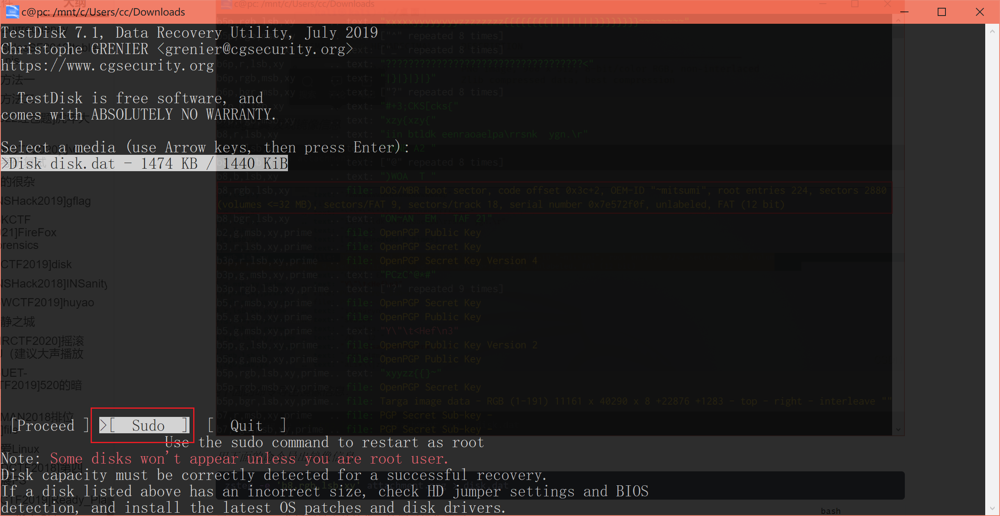
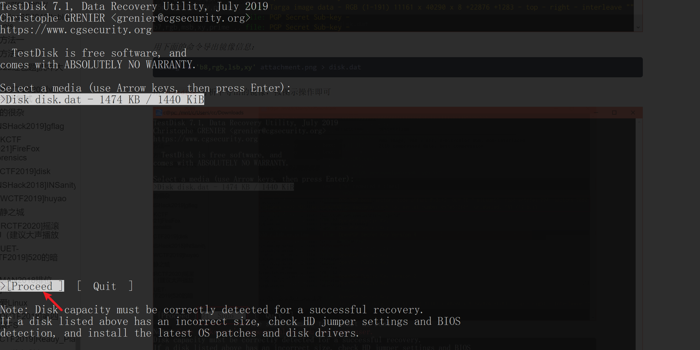
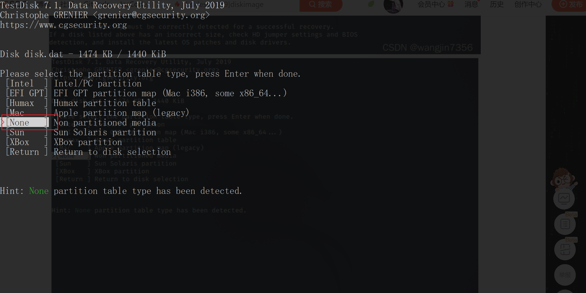
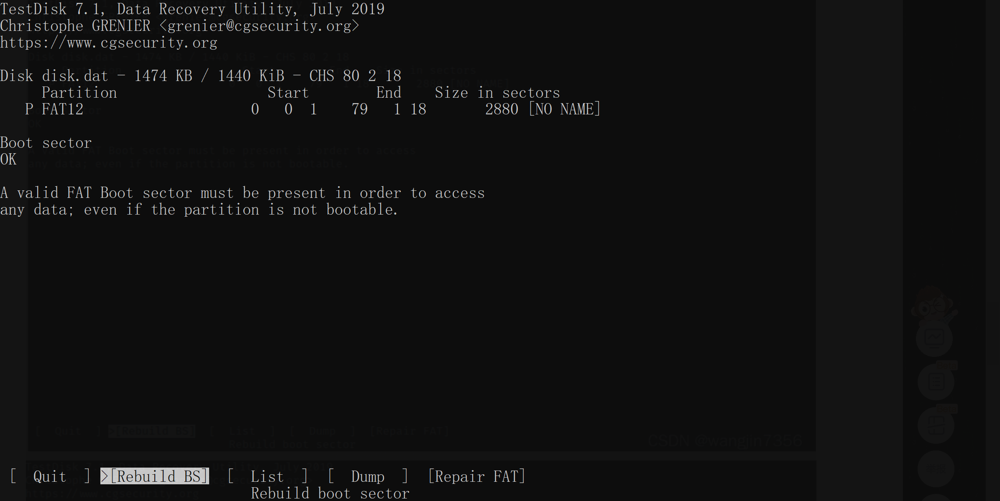
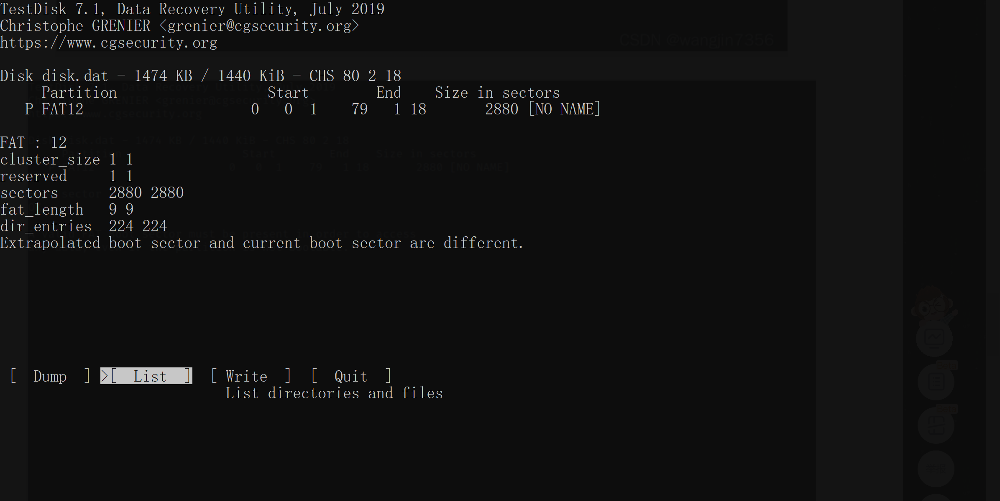
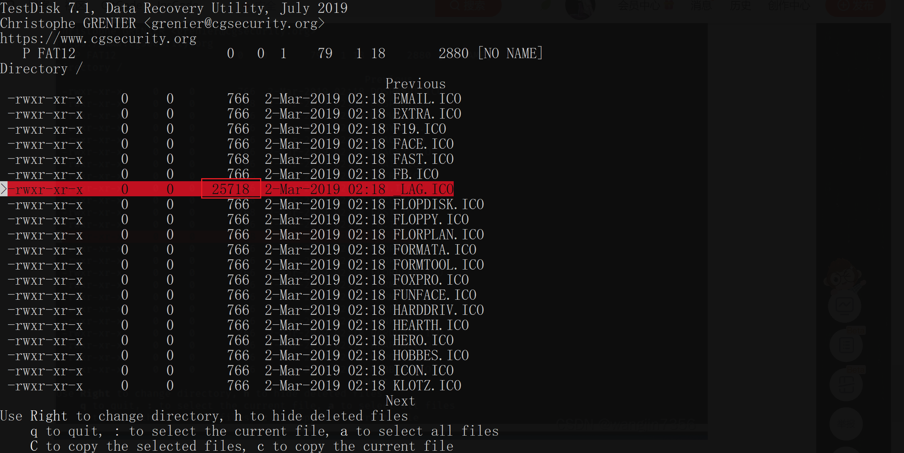
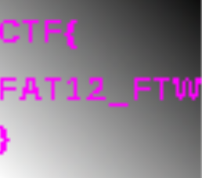

# [BSidesSF2019]diskimage

## 知识点

`图片隐藏镜像`

`zsteg导出`

`testdisk分析镜像`

## 解题

给了我们一个`png`文件,用`zsteg`发现了一个文件



*用下面的命令导出镜像信息：*

```bash
zsteg -e 'b8,rgb,lsb,xy' attachment.png > disk.dat
```

用`testdisk`分析下导出的镜像，按图示操作即可














看到字节数较大的`_LAG.ICO`,按`c`然后再按`c`复制出来，得到`flag`。

