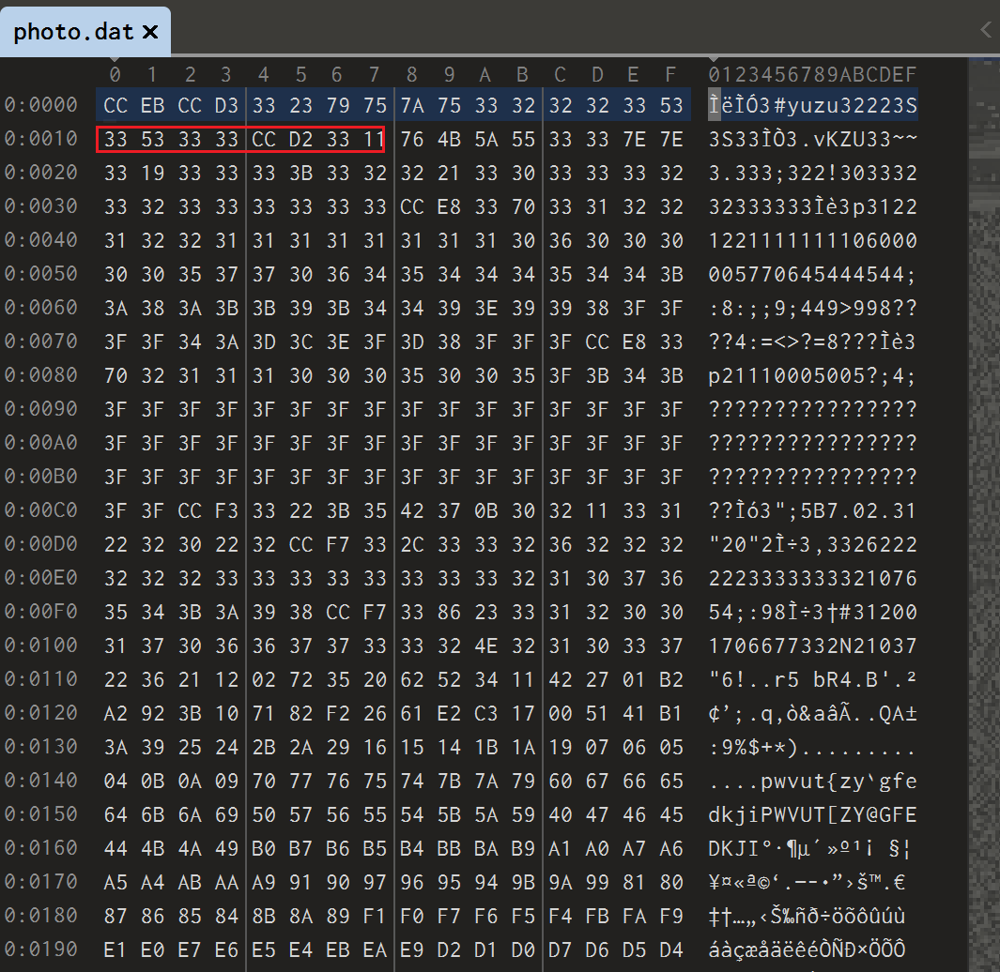
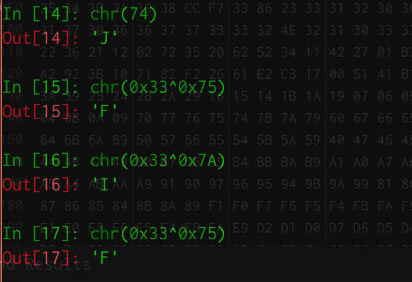

# [GUET-CTF2019]520的暗示

## 知识点

`文件xor异或`

## 解题

打开是一个`photo.dat`文件,发现文件头没啥东西,但是`33`特别多,试试异或一下`0x33`



文件与`0x33`异或，得到一张图片



发现是个`jpg`格式的文件

```python
data = open('photo.dat', 'rb')
strs = data.read()
flag = open("1.jpg",'ab+')
for i in strs:
    flag.write(bytes([i ^ 0x33]))
```


后面其实是根据LTE定位基站地址，最后定位到`桂林电子科技大学花江校区`，也就是flag为`flag{桂林电子科技大学花江校区}`。