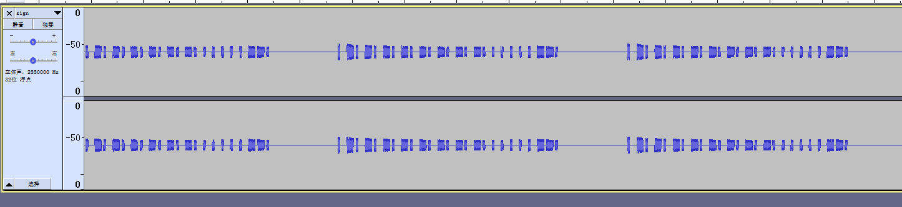
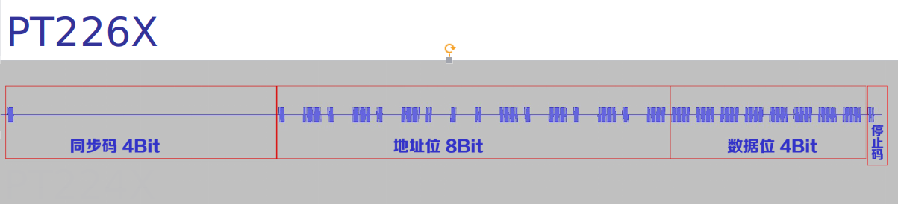
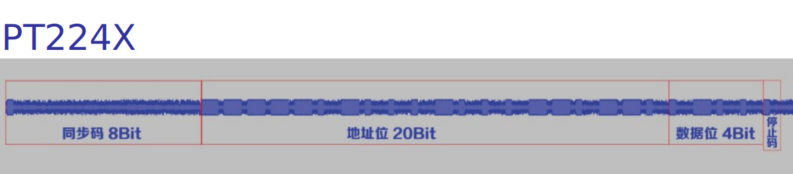
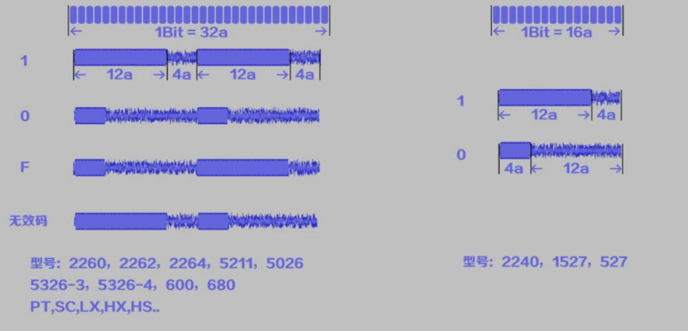
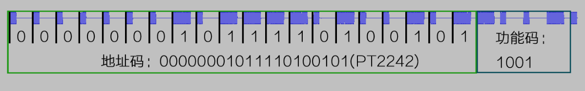
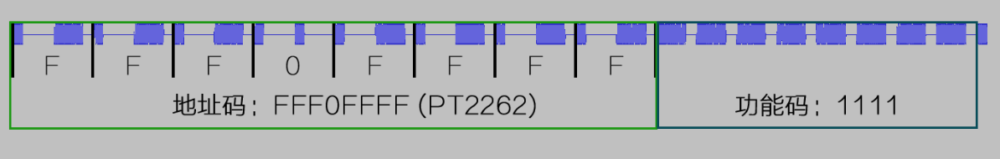
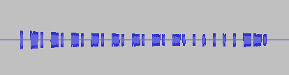
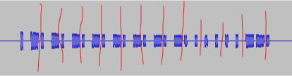

# [HDCTF2019]信号分析

## 知识点

`PT2262`

## 解题

给了个`wav`文件,用`audacity`打开

题目说信号分析



只有这个波形图有内容，并且每段都是一样的











一百零六题是根据这个01的地址码就是PT2242，这题是根据F0就是PT2262这种



我们直接对应一下

FFFFFFFF0001

注意最后一个是停止码



flag{FFFFFFFF0001}

```
一长一短：F
两短：0
两长：1
```

可以参考这篇文章

[https://unicorn.360.com/hackcube/forum.php?mod=viewthread&tid=13&extra=page%3D1](https://unicorn.360.com/hackcube/forum.php?mod=viewthread&tid=13&extra=page=1)

[参考](https://www.onctf.com/posts/d228f8e5.html#%E4%B8%80%E7%99%BE%E5%9B%9B%E5%8D%81%E4%B8%80%E3%80%81-MRCTF2020-%E6%91%87%E6%BB%9ADJ%EF%BC%88%E5%BB%BA%E8%AE%AE%E5%A4%A7%E5%A3%B0%E6%92%AD%E6%94%BE%EF%BC%89)

