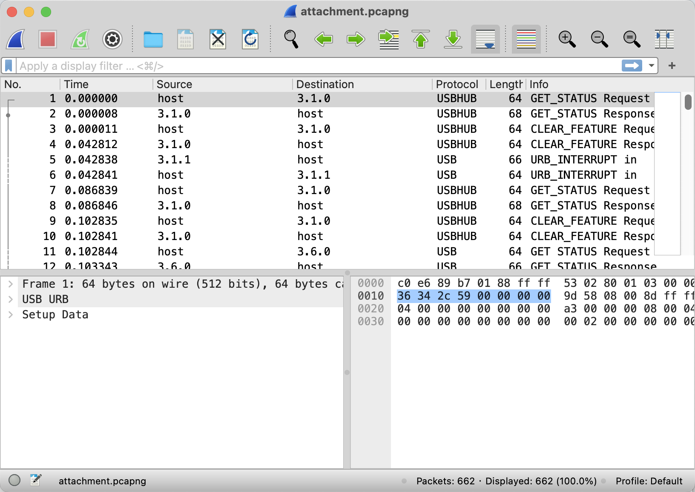
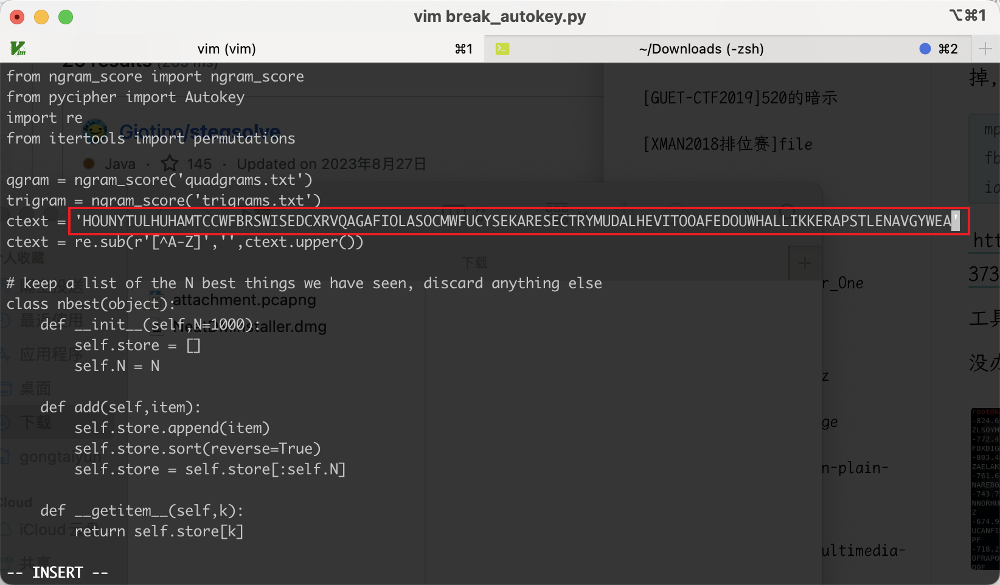
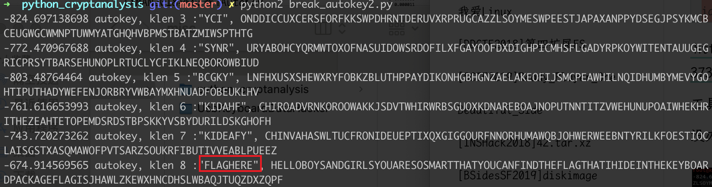

# [XMAN2018排位赛]AutoKey

## 知识点

`UsbKeyBoardDataHacker`

`autokey`

## 解题

题目给了个`pcap`文件，打开发现是`usb`类型的流量



使用`UsbKeyboardDataHacker`解密流量包


去掉`CAP、DEL`，处理`AutoKey`密文时，在删除`DEL`的时候要把`DEL`前面的字符也删掉,得到`autokey`密文

```
mplrvffczeyoujfjkybxgzvdgqaurkxzolkolvtufblrnjesqitwahxnsijxpnmplshcjbtyhzealogviaaissplfhlfswfehjncrwhtinsmambvexpziz
```

[工具使用参考文章](https://www.cnblogs.com/LEOGG321/p/13735458.html)

[代码整合地址](https://github.com/jameslyons/python_cryptanalysis/tree/master)

```
HELLOBOYSANDGIRLSYOUARESOSMARTTHATYOUCANFINDTHEFLAGTHATIHIDEINTHEKEYBOARDPACKAGEFLAGISJHAWLZKEWXHNCDHSLWBAQJTUQZDXZQPF
```

修改脚本内的秘文





`flag{JHAWLZKEWXHNCDHSLWBAQJTUQZDXZQPF}`

