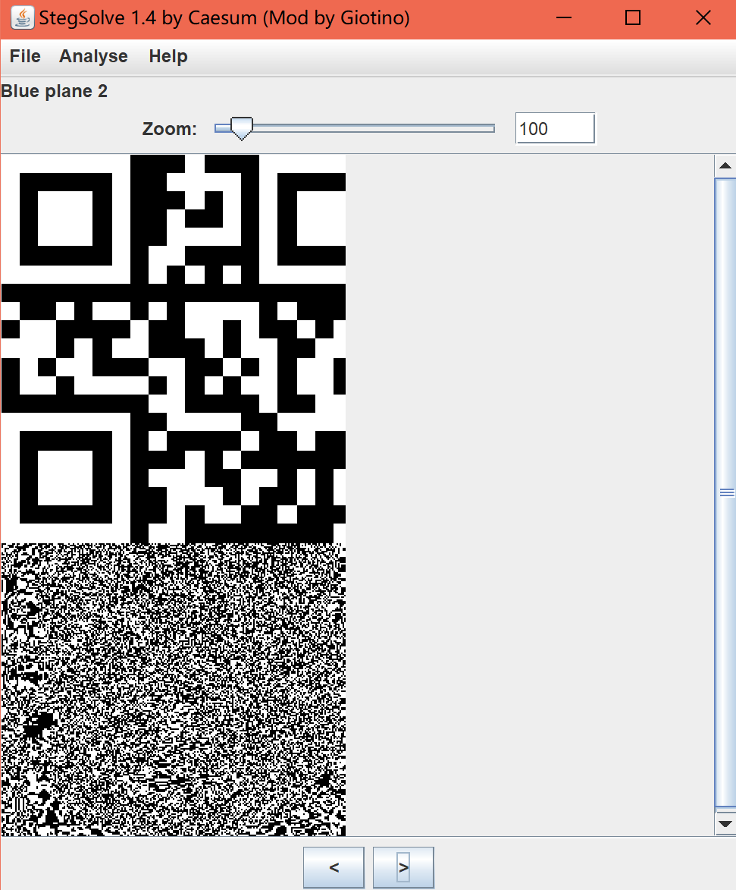

# [湖南省赛2019]Findme

## 知识点

`各文件16进制特征`

## 解题


### 1.png

### 第一张图片打开显示为`CRC`错误


跑脚本改一下

```python
import struct
import binascii
import os

m = open("1.png", "rb").read()
k = 0
for i in range(5000):
    if k == 1:
        break
    for j in range(5000):
        c = m[12:16] + struct.pack('>i', i) + struct.pack('>i', j) + m[24:29]
        crc = binascii.crc32(c) & 0xffffffff
        if crc == 0x000C4ED3:
            k = 1
            print(hex(i), hex(j))
            break
```


 继续往下看 发现了端倪

发现了`chunk2`和`chunk3`都缺少了`IDAT`块

返回直接修改

```
IDAT块的数值是：49 44 41 54
```


保存图片后再次打开图片就已经正常了


然后再用`Stegsolve`打开 在`Blue plane 2`发现了一张二维码



在`blue plane2`发现一个二维码


### 2.png


在`chunk7`后面发现一个`7z`文件头

`binwalk`一下,发现文件不对,`foremost`同样,应该是文件被修改了,复制保存到新文件里看看

再仔细查看发现这是压缩包的头被更改了

那就把`30 7A`->`50 4B`


然后保存 压缩包就能正常打开了


`1000`个文件

含有明文的一定是最大或者最小的

那就按照大小排个序


### 3.png

接下来分析第三张图片

发现了图片的`CRC`有些不同

看了别人的wp得知：chunk[0]-chunk[6]的每一个数据块的crc值都是可打印的Ascii字符

然后用[在线网址](https://coding.tools/cn/hex-to-ascii)转换一下

得到第三段明文：`3RlZ30=`

### 4.png

在chunk[4]发现明文


第四段明文：`cExlX1BsY`

### 5.png

在结尾发现提示


1：`ZmxhZ3s0X3`

2：`1RVcmVfc`

3：`3RlZ30=`

4：`cExlX1BsY`

5：`Yzcllfc0lN`

```python3
import base64
import itertools

l = ['ZmxhZ3s0X3', '1RVcmVfc', '3RlZ30=', 'cExlX1BsY', 'Yzcllfc0lN']
l2 = list(itertools.permutations(l, 5))
for data in l2:
    tmp = ''.join(data)
    try:
        print(base64.b64decode(tmp))
    except:
        continue
```

