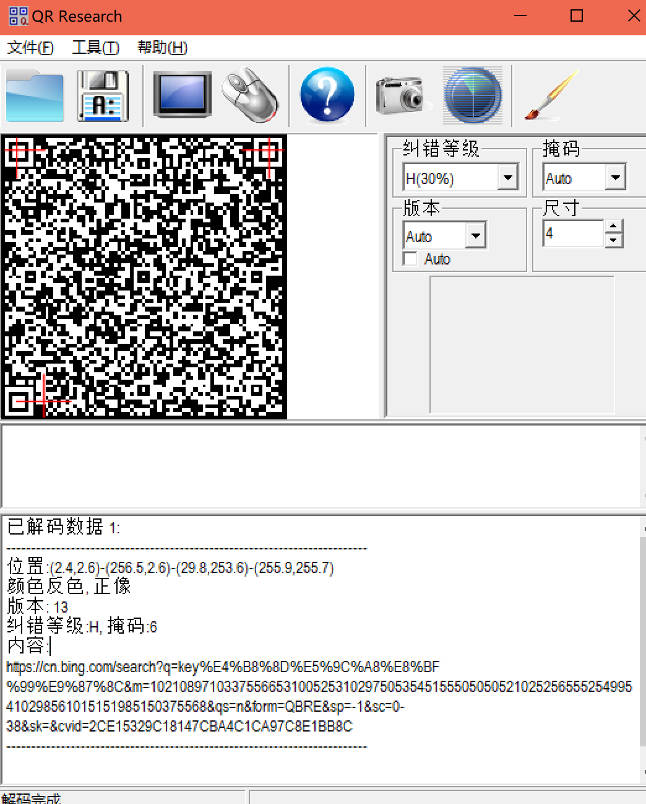

# key不在这里

## 知识点

`ASCII`

## 解题



扫码后`url`解码发现`m`似乎是`ascii`数据

脚本跑一下

```python
from urllib.parse import quote, unquote
s = '10210897103375566531005253102975053545155505050521025256555254995410298561015151985150375568'
temp = ''
 
while len(s):
    if int(s[:3]) < 127:
        temp += chr(int(s[:3]))
        s = s[3:]
    else:
        temp += chr(int(s[:2]))
        s = s[2:]
print(temp)
print(unquote(temp))
```

