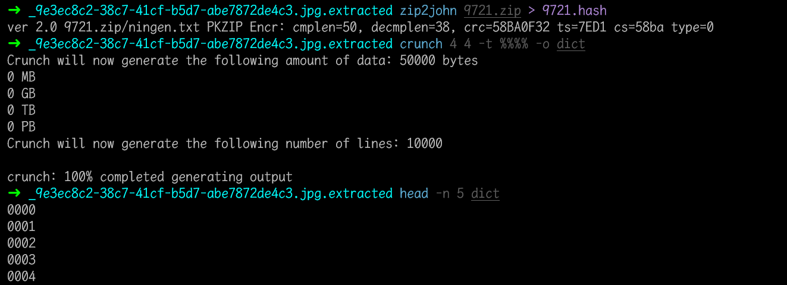
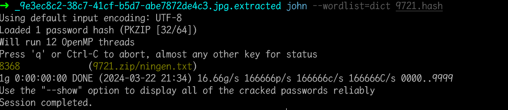

# ningen

## 知识点

`binwalk`

`压缩包密码爆破`

## 解题

得到一个图片，`exiftool`和`strings`没找到什么东西，`binwalk`看一下有没有藏文件


发现有压缩包数据,`binwalk`分离一下

```bash
binwalk -e 9e3ec8c2-38c7-41cf-b5d7-abe7872de4c3.jpg
```

分离后发现`9721.zip`，题目提示`4位纯数字密码`

```bash
# 获取压缩包hash值
[root@localhost]# zip2john 9721.zip > 9721.hash
# 生成四位纯数字字典
[root@localhost]# crunch 4 4 -t %%%% -o dict
#最后john指定字典破解hash获得压缩包密码
[root@localhost]# john --wordlist=dict 9127.hash
```



