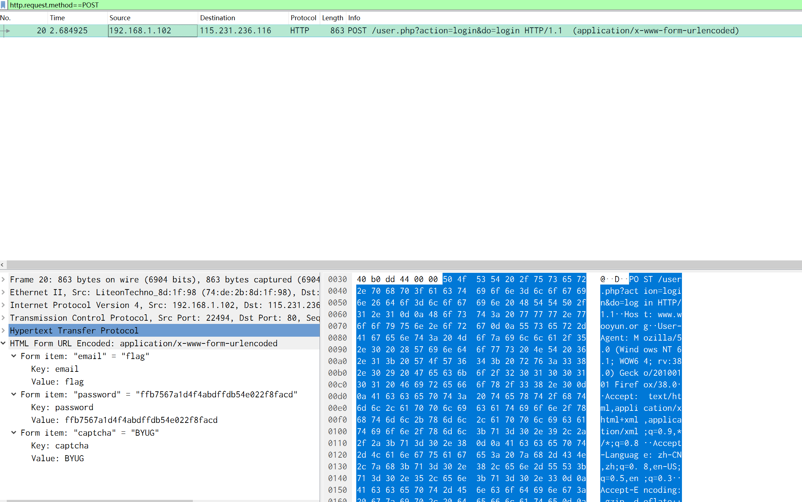

# wireshark

## 知识点

`流量分析`

## 解题

> 黑客通过wireshark抓到管理员登陆网站的一段流量包（管理员的密码即是答案) 

首先解压得到一个`.pcap`文件，即流量包文件，使用`wireshark`进行分析,因为是找登录密码，一般登录传参都是`POST`方式，使用`http.request.method==POST`过滤流量

发现传`password`值，不清晰的话可以再追踪`HTTP`流查看

`flag`为`flag{ffb7567a1d4f4abdffdb54e022f8facd}`