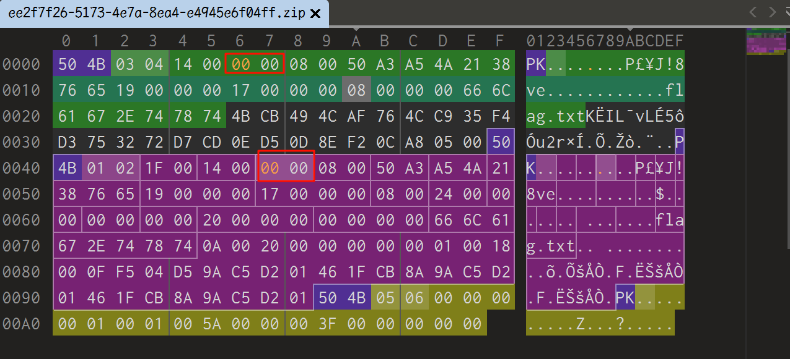

# zip伪加密

## 知识点

`zip伪加密`

## 解题

### 原理

`zip伪加密`是在文件头的加密标志位做修改，进而再打开文件时识被别为加密压缩包。

### zip文件组成

一个 ZIP 文件由三个部分组成：

压缩源文件数据区 + 压缩源文件目录区 + 压缩源文件目录结束标志

#### 压缩源文件数据区

50 4B 03 04：这是 PK 头文件标记（0x04034b50）
14 00：解压文件所需 pkware 版本
09 00：全局方式位标记（图中代表是有加密🔐, 如果是 00 00 就是代表无加密🔐）
08 00：压缩方式
50 A3：最后修改文件时间
A5 4A：最后修改文件日期
21 38 76 65：CRC-32 校验（1480B516）
19 00 00 00：压缩后尺寸（25）
17 00 00 00：未压缩尺寸（23）
08 00：文件名长度
00 00：扩展记录长度

#### 压缩源文件目录区

50 4B 01 02：目录中文件 PK 文件头标记 (0x02014b50)
1F 00：压缩使用的 pkware 版本
14 00：解压文件所需 pkware 版本
09 00：全局方式位标记（图中代表是有加密🔐, 如果是 00 00 就是代表无加密🔐）
08 00：压缩方式
50 A3：最后修改文件时间
A5 4A：最后修改文件日期
21 38 76 65：CRC-32 校验（1480B516）
19 00 00 00：压缩后尺寸（25）
17 00 00 00：未压缩尺寸（23）
08 00：文件名长度
24 00：扩展字段长度
00 00：文件注释长度
00 00：磁盘开始号
00 00：内部文件属性
20 00 00 00：外部文件属性
00 00 00 00：局部头部偏移量

#### 压缩源文件目录结束标志

50 4B 05 06：目录结束标记
00 00：当前磁盘编号
00 00：目录区开始磁盘编号
01 00：本磁盘上纪录总数
01 00：目录区中纪录总数
5A 00 00 00：目录区尺寸大小
3F 00 00 00：目录区对第一张磁盘的偏移量
00 00：ZIP 文件注释长度

然后解压即可获取`flag`

[原理参考文章](https://lanyundev.com/posts/1fb89e8a)