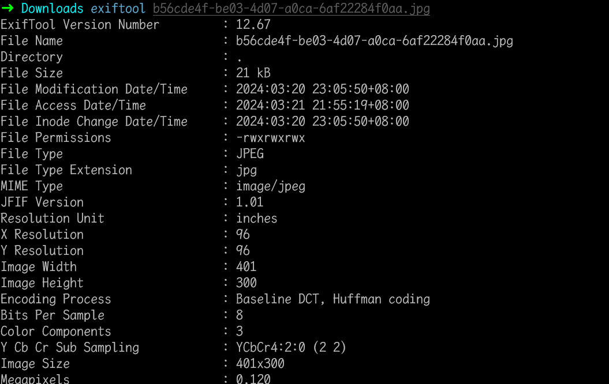
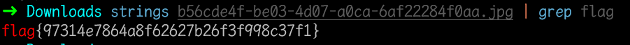

# 乌镇峰会种图

## 知识点

`图片隐写可见字符串`

## 解题

获得一个`png`图片，首先使用`feh`看看图片内容，没有看到什么东西

然后使用`exiftool`看一下图片的元数据，也没有什么特别的信息

使用`strings`看看有没有什么图片里的可打印字符串有没有`flag`关键字

`flag`为`flag{97314e7864a8f62627b26f3f998c37f1}`