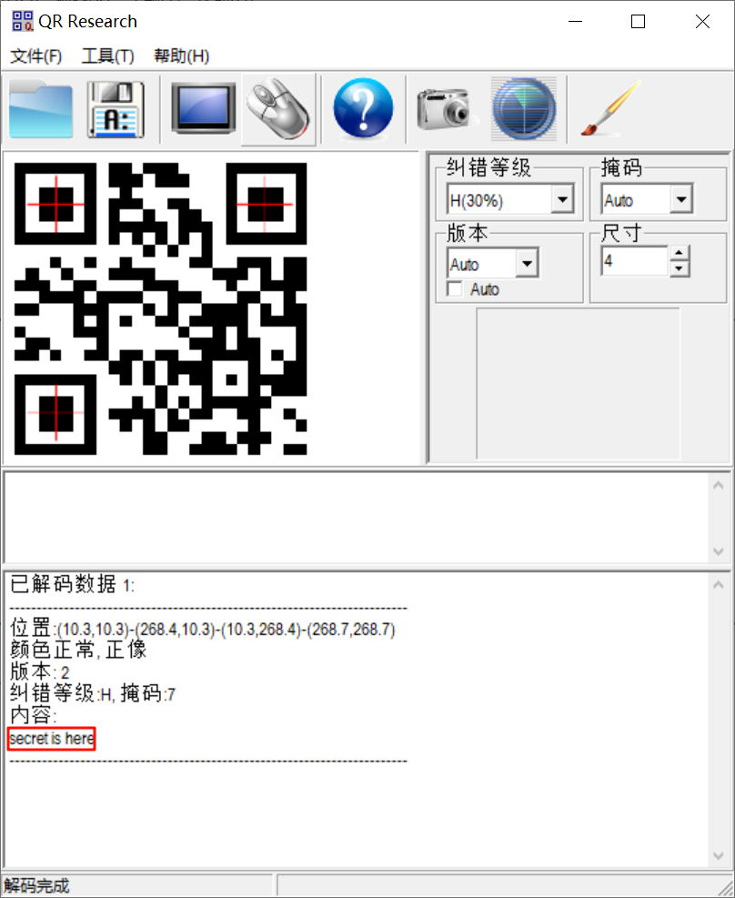
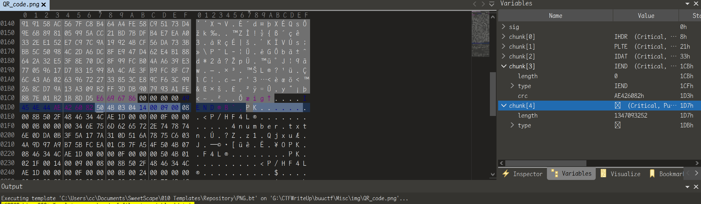
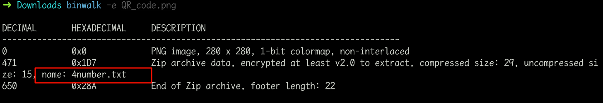
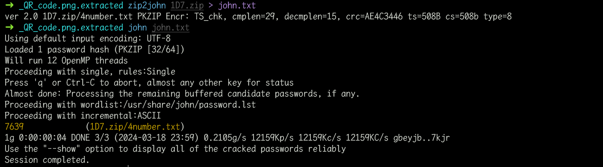
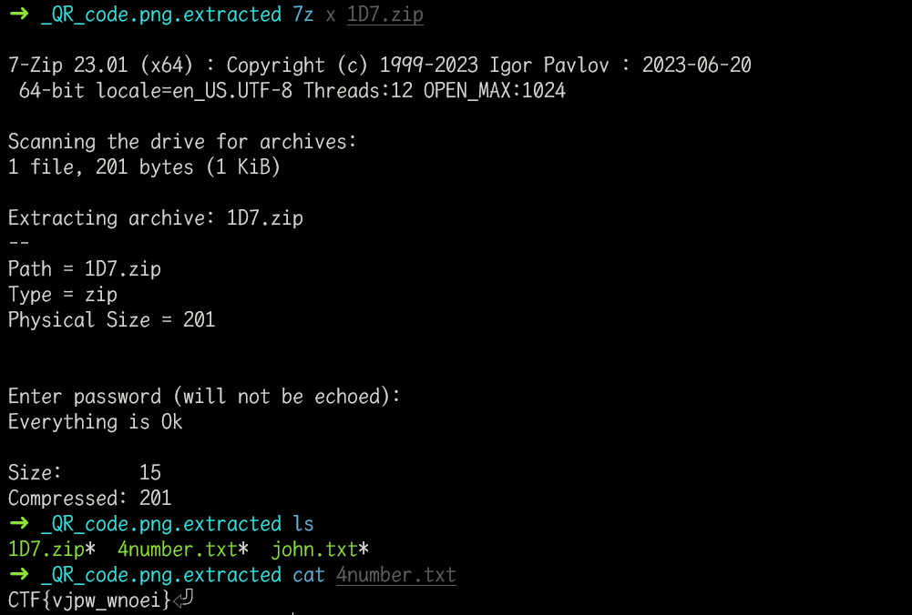

# 二维码

## 知识点

`二维码`

`文件分离binwalk`

`压缩包密码爆破`

## 解题

首先获得了一个二维码,扫描试试

没有发现什么信息，`详细信息`也没什么东西，使用`010editor`查看，在`chunk[4]`部分发现压缩包头

使用`binwalk`分离

发现了压缩包，里面有`4number.txt`文件，解密时发现有密码，而且不是`伪加密`，使用`zip2john`和`john`爆破密码

发现密码为`7639`，解压即可

