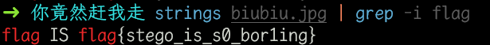
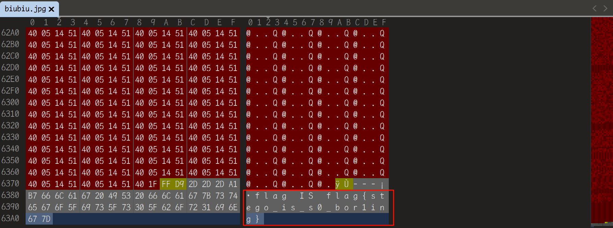

# 你竟然赶我走

## 知识点

`strings`

`010editor`

## 解题

`linux`可以使用`strings`查看字符串

```bash
strings biubiu.jpg | grep -i flag
```



`windows`可以用`010editr`或者`winhex`之类的`hex`编辑器打开



`flag`为`flag{stego_is_s0_bor1ing}`