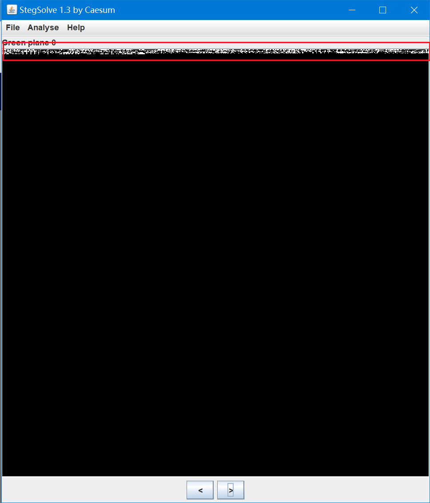
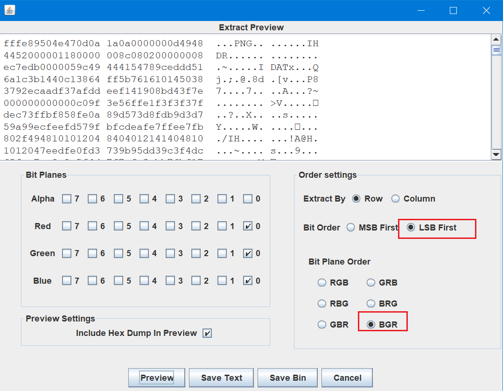
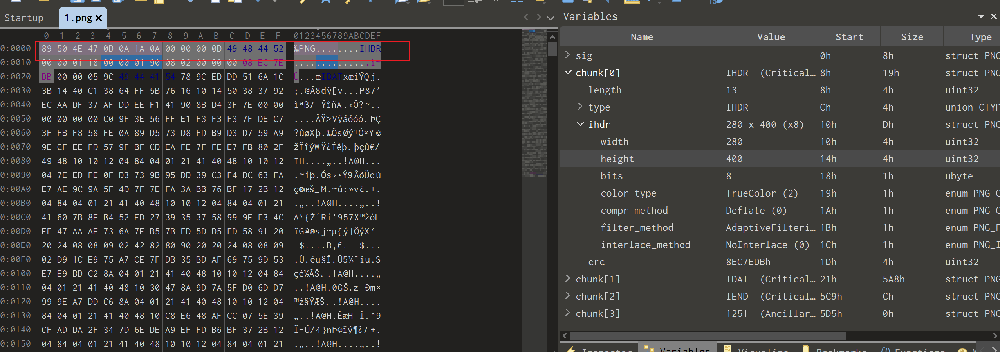
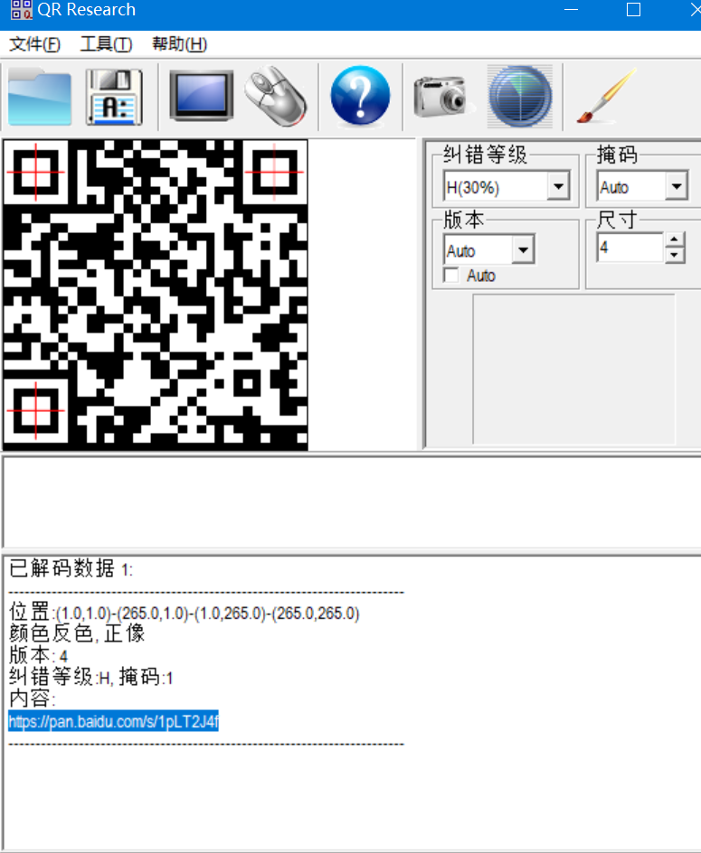
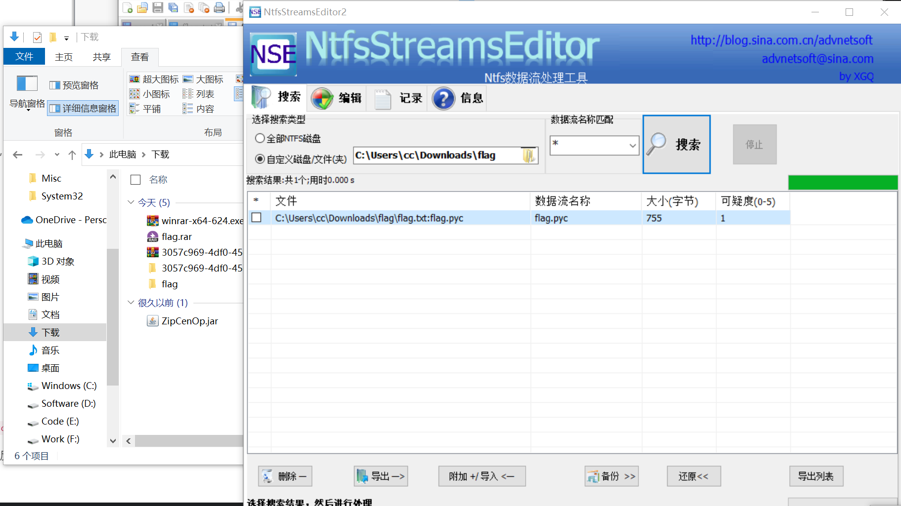

# 喵喵喵

## 知识点

`lsb低位隐写`

`图片高度隐藏`

`NTFS流隐藏文件`

`uncompyle6 pyc`

## 解题

详细信息 `010editor`和`binwalk大法`都没发现什么

上`stegsolve`



应该是`lsb`低位隐写,上`zsteg`看看



修复文件头,发现只显示了一般,修改高度





下载后只有个`flag.txt`,没有`flag`,猜测`NTFS流隐写`



`uncompyle6`转为`python`后为

```python
# uncompyle6 version 3.9.0
# Python bytecode version base 2.7 (62211)
# Decompiled from: Python 3.9.8 (tags/v3.9.8:bb3fdcf, Nov  5 2021, 20:48:33) [MSC v.1929 64 bit (AMD64)]
# Embedded file name: flag.py
# Compiled at: 2017-12-05 23:42:15
import base64

def encode():
    flag = '*************'
    ciphertext = []
    for i in range(len(flag)):
        s = chr(i ^ ord(flag[i]))
        if i % 2 == 0:
            s = ord(s) + 10
        else:
            s = ord(s) - 10
        ciphertext.append(str(s))

    return ciphertext[::-1]


ciphertext = [
 '96', '65', '93', '123', '91', '97', '22', '93', '70', '102', '94', 
 '132', '46', '112', '64', '97', '88', '80', '82', '137', '90', '109', 
 '99', '112']
# okay decompiling flag.pyc
```

解密脚本为

```python
ciphertext = ['96', '65', '93', '123', '91', '97', '22', '93', '70', '102', '94', 
'132', '46', '112', '64', '97', '88', '80', '82', '137', '90', '109', 
'99', '112']


def decode(ciphertext):
    flag = ''
    for i, v in enumerate(ciphertext):
        if i % 2 == 0:
            s = int(v) - 10
        else:
            s = int(v) + 10
        flag += chr(s ^ i)
    print(flag)

if __name__ == '__main__':
    decode(ciphertext[::-1])
```

