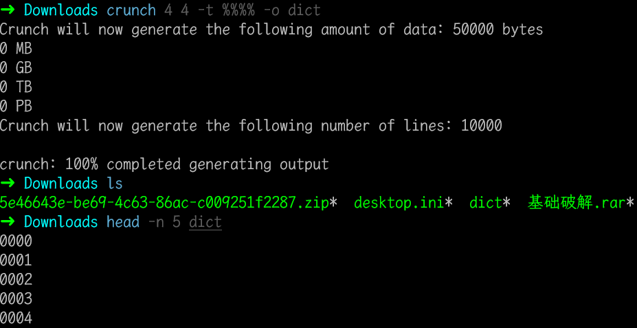
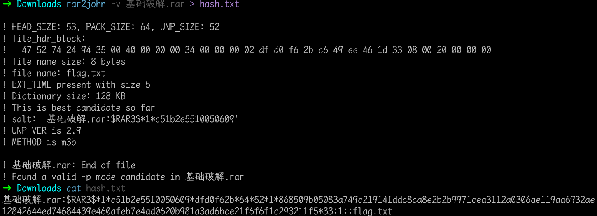

# 基础破解

## 知识点

`压缩包密码爆破`

`字典生成`

## 解题

> 给你一个压缩包，你并不能获得什么，因为他是四位数字加密的

指定了密码范围，那么就生成要求的`字典`，使用`crunch`工具生成`4`位`纯数字`字典的命令为

```bash
crunch 4 4 -t %%%% -o dict
```



查看前几行发现生成字典正常，使用`rar2john`生成`hash`值到`hash.txt`，然后使用`john`来破解密码

```bash
rar2john 基础破解.rar
```



然后使用`john`指定刚才生成的`字典`进行破解

```bash
john --wordlist dict hash.txt
```

运行结束可以看到密码，或者后面使用

```bash
john --show hash.txt
```


解压后得到`ZmxhZ3s3MDM1NDMwMGE1MTAwYmE3ODA2ODgwNTY2MWI5M2E1Y30=``

``base64`解码得到`flag{70354300a5100ba78068805661b93a5c}`