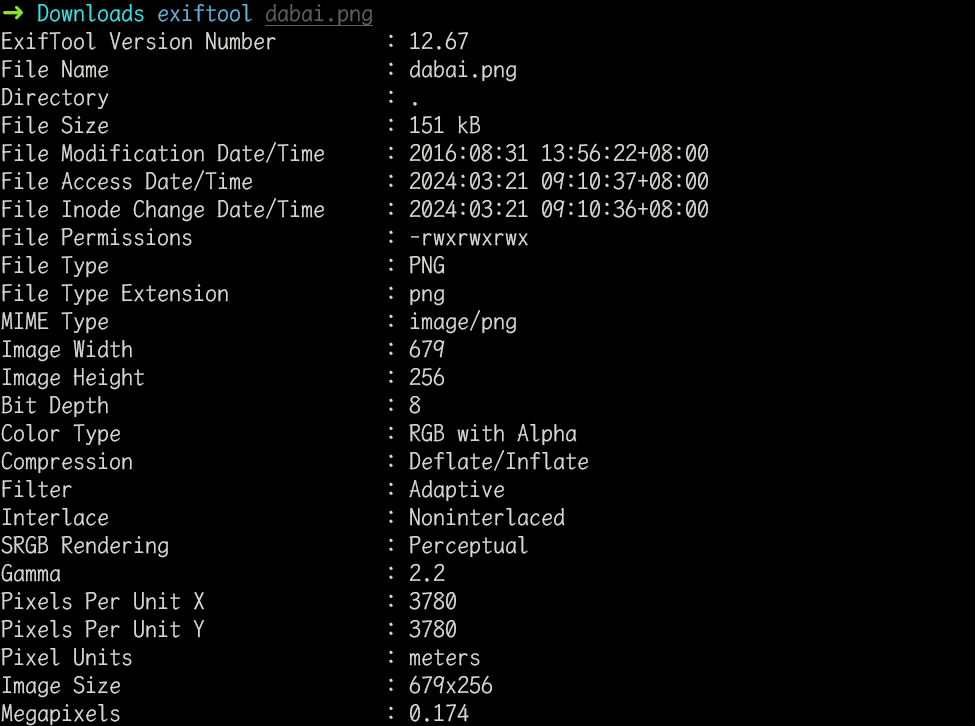
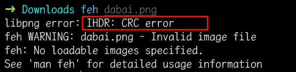
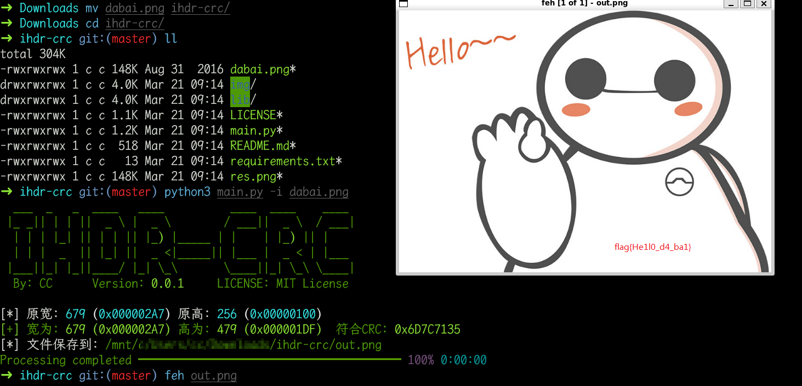

# 大白

## 知识点

`IDHR CRC爆破宽高`

## 解题

附件给了一张图片，看起来没展示全

先用`exiftool`看一下元数据信息

没有发现什么有用的信息，使用`feh`查看图片,发现`IHDR`的`CRC`值错误，说明改动了`宽高`，那我们使用工具爆破`CRC`对应的`宽高`,[工具idhr-crc地址](https://github.com/cmacckk/ihdr-crc)

`flag`为`flag{He1l0_d4_ba1}`