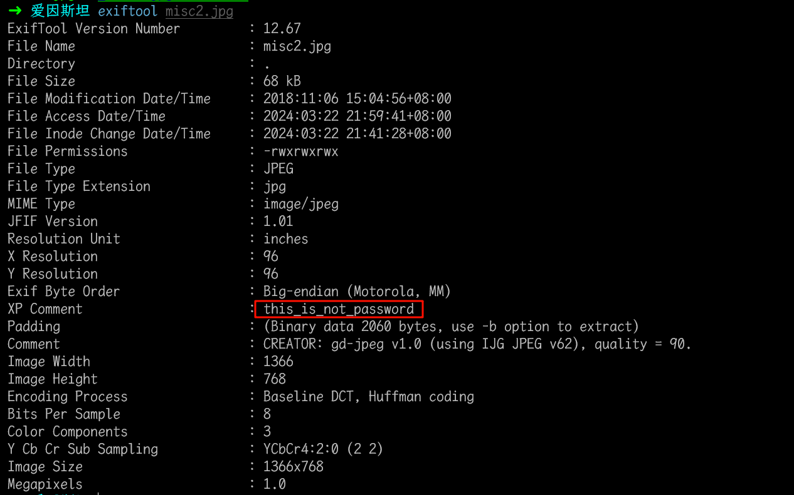
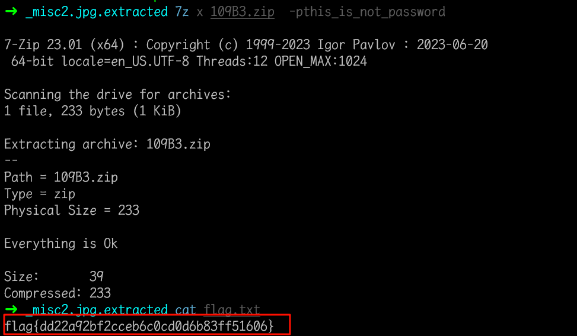

# 爱因斯坦

## 知识点

``

## 解题

给了一张图片`misc2.jpg`,`exiftool`看到了个信息



用`strings`查看可打印字符串时发现了`flag.txt`，猜测应该是图片隐藏了文件

```bash
strings misc2.jpg | grep flag
```


然后`binwalk`查看一下，拼接了一个`zip`文件，使用`binwalk -e`分离，爆破`4`位数字失败，想到前面的`this_is_not_password`,用作密码即可解密

