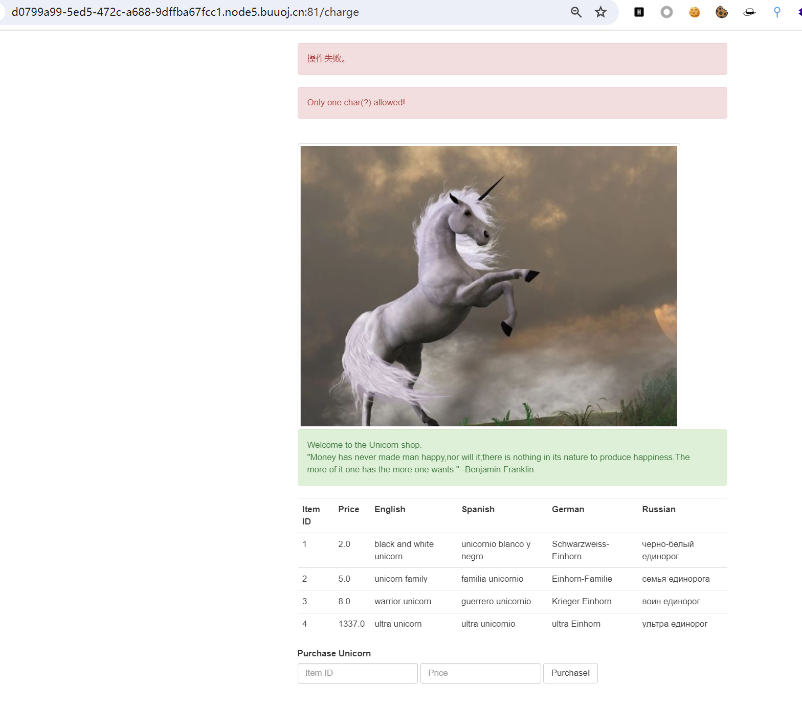
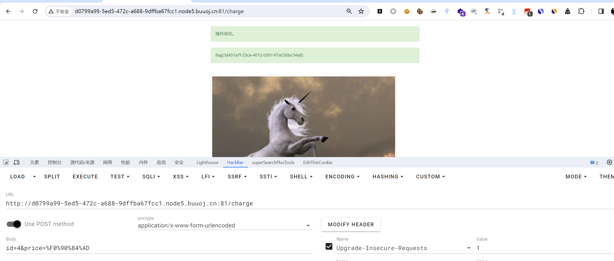
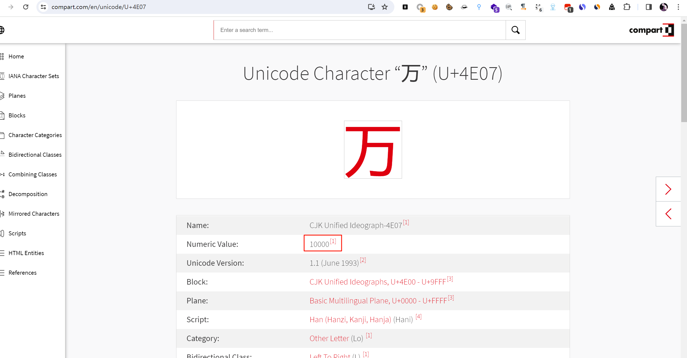
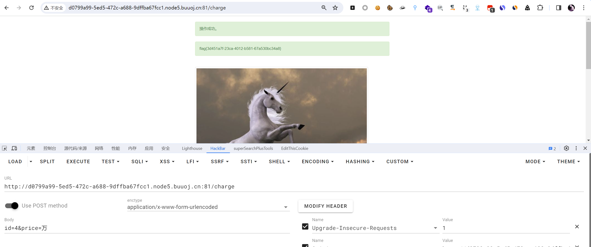

# [ASIS 2019]Unicorn shop

## 知识点

`python`

`unicode`

## 解题

发现只有一中字符运行，结合题目提示，找一下，[Unicode Compart num value 为30000](https://www.compart.com/en/unicode/U+10100)

获得`utf-8`字符串并将其中的`0x`修改为`%`进行提交：`%F0%90%84%AD`

或者直接用中文`万` `亿`

[参考文章1](https://www.cnblogs.com/upfine/p/16444501.html)

[参考文章2](https://blog.csdn.net/weixin_44214568/article/details/123893762)

