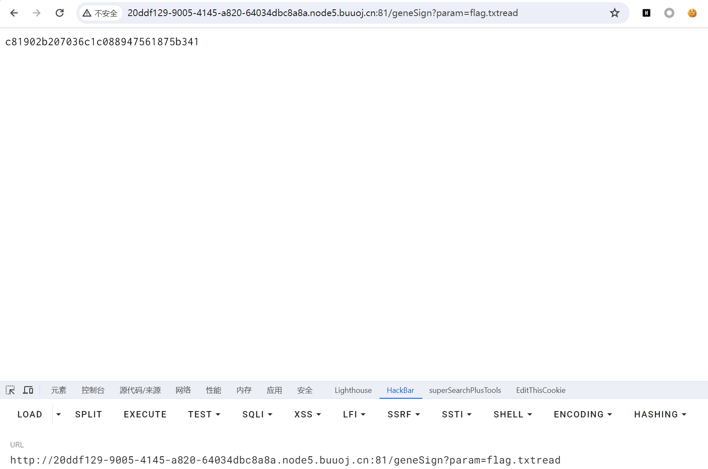
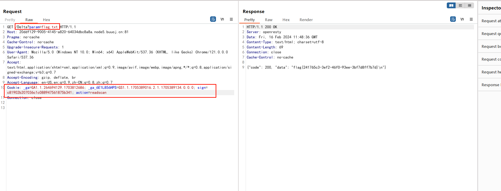

#      [De1CTF 2019]SSRF Me      

## 知识点

`flask`

`python代码审计`

## 解题

进入首页给了源码，但是是乱序的 ，整理之后

```python
#! /usr/bin/env python
#encoding=utf-8
from flask import Flask
from flask import request
import socket
import hashlib
import urllib
import sys
import os
import json
reload(sys)
sys.setdefaultencoding('latin1')
app = Flask(__name__)
secert_key = os.urandom(16)
class Task:
    def __init__(self, action, param, sign, ip):
        self.action = action
        self.param = param
        self.sign = sign
        self.sandbox = md5(ip)
        if(not os.path.exists(self.sandbox)):
            #SandBox For Remote_Addr
            os.mkdir(self.sandbox)
    def Exec(self):
        result = {}
        result['code'] = 500
        if (self.checkSign()):
            if "scan" in self.action:
                tmpfile = open("./%s/result.txt" % self.sandbox, 'w')
                resp = scan(self.param)
                if (resp == "Connection Timeout"):
                    result['data'] = resp
                else:
                    print resp
                    tmpfile.write(resp)
                    tmpfile.close()
                    result['code'] = 200
            if "read" in self.action:
                f = open("./%s/result.txt" % self.sandbox, 'r')
                result['code'] = 200
                result['data'] = f.read()
                if result['code'] == 500:
                    result['data'] = "Action Error"
                else:
                    result['code'] = 500
                    result['msg'] = "Sign Error"
                    return result
    def checkSign(self):
        if (getSign(self.action, self.param) == self.sign):
            return True
        else:
            return False
        #generate Sign For Action Scan.

@app.route("/geneSign", methods=['GET', 'POST'])
def geneSign():
    param = urllib.unquote(request.args.get("param", ""))
    action = "scan"
    return getSign(action, param)

@app.route('/De1ta',methods=['GET','POST'])
def challenge():
    action = urllib.unquote(request.cookies.get("action"))
    param = urllib.unquote(request.args.get("param", ""))
    sign = urllib.unquote(request.cookies.get("sign"))
    ip = request.remote_addr
    if(waf(param)):
        return "No Hacker!!!!"
    task = Task(action, param, sign, ip)
    return json.dumps(task.Exec())

    
@app.route('/')
def index():
    return open("code.txt","r").read()

def scan(param):
    socket.setdefaulttimeout(1)
    try:
        return urllib.urlopen(param).read()[:50]
    except:
        return "Connection Timeout"
    
def getSign(action, param):
    return hashlib.md5(secert_key + param + action).hexdigest()

def md5(content):
    return hashlib.md5(content).hexdigest()

def waf(param):
    check=param.strip().lower()
    if check.startswith("gopher") or check.startswith("file"):
        return True
    else:
        return False

if __name__ == '__main__':
    app.debug = False
    app.run(host='0.0.0.0',port=80) 
```

首先找最终能够得到`flag`的点

```python
if (self.checkSign()):
            if "scan" in self.action:
                tmpfile = open("./%s/result.txt" % self.sandbox, 'w')
                resp = scan(self.param)
                if (resp == "Connection Timeout"):
                    result['data'] = resp
                else:
                    print resp
                    tmpfile.write(resp)
                    tmpfile.close()
                    result['code'] = 200
            if "read" in self.action:
                f = open("./%s/result.txt" % self.sandbox, 'r')
                result['code'] = 200
                result['data'] = f.read()
                if result['code'] == 500:
                    result['data'] = "Action Error"
                else:
                    result['code'] = 500
                    result['msg'] = "Sign Error"
                    return result
```

要能实现`self.action`里面`scan`和`read`都存在，然后`scan`方法是类似读取文件的，传入文件名即可，题目提示`flag`在`./flag.txt`，只要`self.action=scanread`(等号后值顺序可变)且`self.param=flag.txt`，就可以获取到`flag`

要到这一步需要`checkSign`

```python
def checkSign(self):
    if (getSign(self.action, self.param) == self.sign):
        return True
    else:
        return False
```

跟进`getSign`

```python
def getSign(action, param):
    return hashlib.md5(secert_key + param + action).hexdigest()
```

然而`secret_key`为随机数，而且我们拿不到，就需要继续在代码里找如何生成我们需要的`sign`

```python
@app.route("/geneSign", methods=['GET', 'POST'])
def geneSign():
    param = urllib.unquote(request.args.get("param", ""))
    action = "scan"
    return getSign(action, param)

def getSign(action, param):
    return hashlib.md5(secert_key + param + action).hexdigest()
```

在代码里发现`geneSign`可以生成`sign`，根据上面能获取`flag`的条件来生成`sign`

1.`self.action=scanread`(等号后值顺序可变)

2.`self.param=flag.txt`

因为`action`已经被赋值为`scan`,且是`param + action`，也就是`flag.txt + xxxscan`，这里的`xxx`我们就可以填充为`read`，最后找传值的地方就行

```python
@app.route('/De1ta',methods=['GET','POST'])
def challenge():
    action = urllib.unquote(request.cookies.get("action"))
    param = urllib.unquote(request.args.get("param", ""))
    sign = urllib.unquote(request.cookies.get("sign"))
    ip = request.remote_addr
    if(waf(param)):
        return "No Hacker!!!!"
    task = Task(action, param, sign, ip)
    return json.dumps(task.Exec())
```

`bp`传值，首先生成`sign`



最后传值获得`flag`

