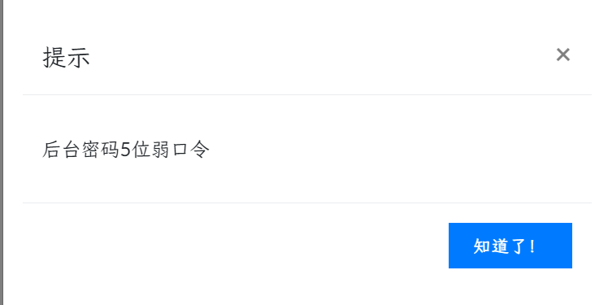
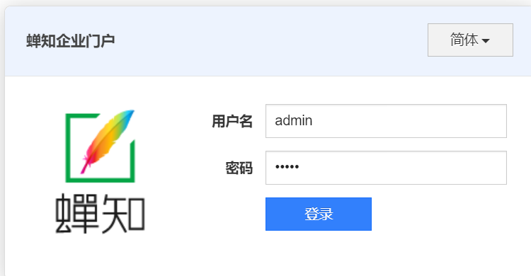
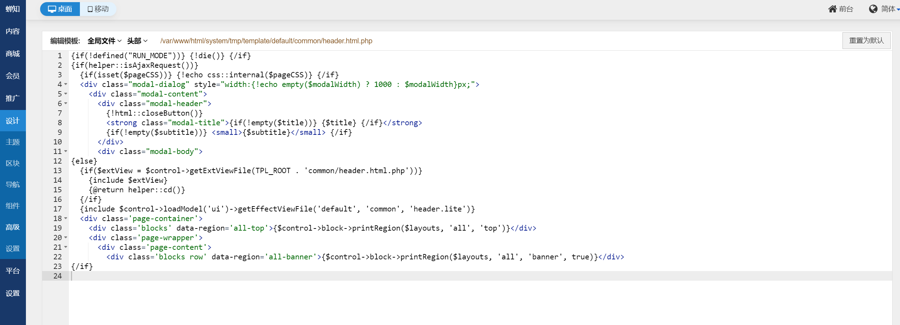
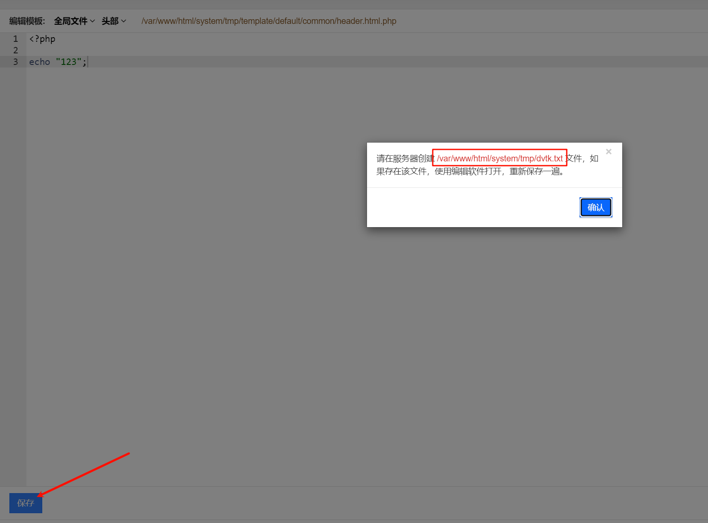
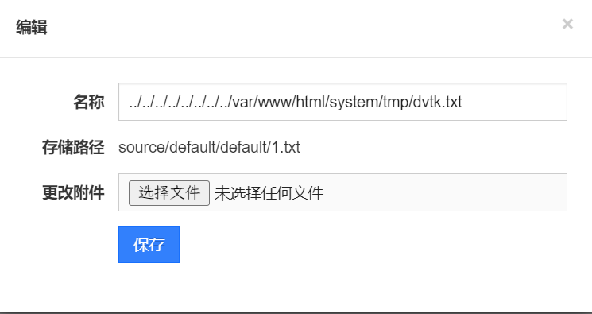
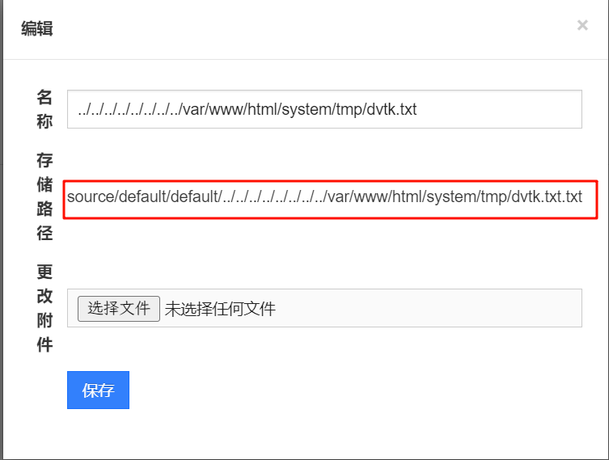
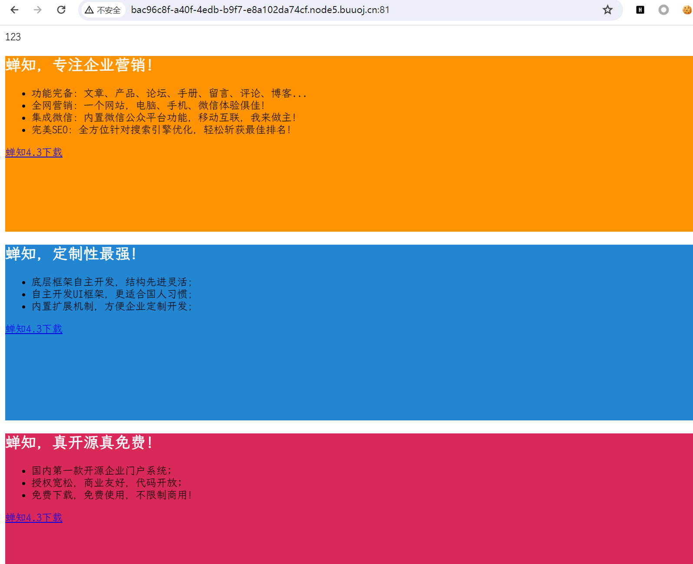

# [GKCTF 2021]easycms

## 知识点

`弱口令`

`模板库文件包含`

## 解题

`BUUCTF`题目提示`后台密码5位弱口令`

那么估计就是找后台，直接手敲找到了`admin.php`，结合提示，尝试`admin/admin`、`admin/12345`发现密码为`12345`

在首页设计发现可以保存`php`文件，尝试写入内容

点击保存后要求创建`txt`文件，找找上传点传入文件

在`设计->组件->素材库`找到上传`txt`的位置，并且可以修改文件名，尝试一下目录穿越

保存后发现还是无法写入，再次查看修改处，发现多了`.txt`，那此处删除`.txt`即可

保存后访问首页发现可以正常写入`php`文件

之后正常读取`flag`即可

