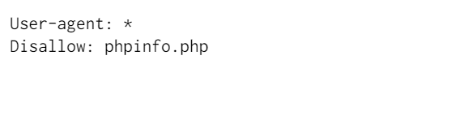
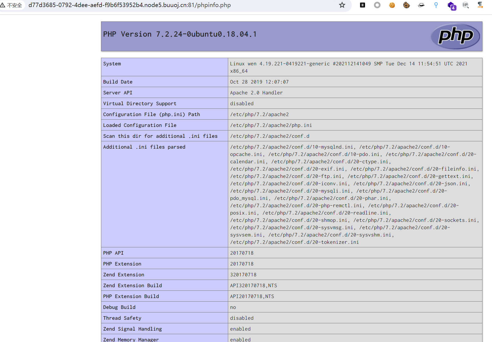
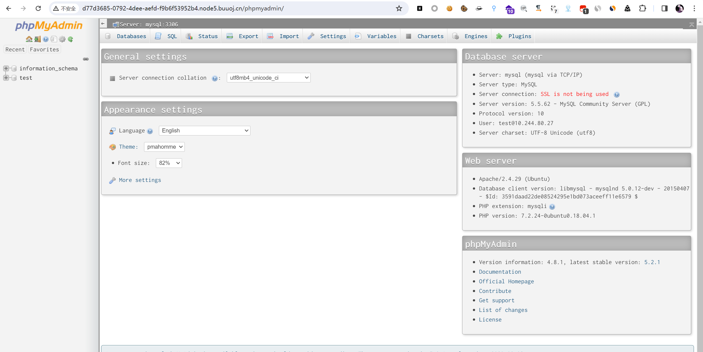
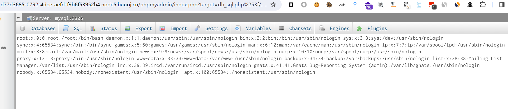
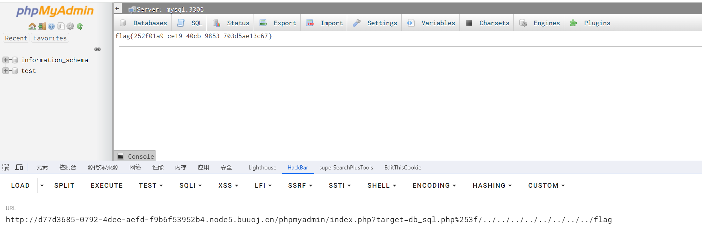

# [GWCTF 2019]我有一个数据库

## 知识点

`phpmyadmin`

`文件包含漏洞`

## 解题

进入首页提示有数据库


源码也没啥信息，先看看有没有`www,zip` `robots.txt` `.git`泄露之类的

发现有个`robots.txt`，提示了`phpinfo.php`



进入`phpinfo.php`没有找到什么东西



因为`buuctf`扫目录一般会奔溃，只能想想其他的路径，比如`phpmyadmin`试了一下发现果然有



没有登录就进入了主界面，发现`phpmyadmin`的版本为`4.8.1`，不是最新版，搜索一下`phpmyadmin4.8.1`的漏洞，发现有一个`文件包含漏洞(CVE-2018-12613)`且能进一步实现`RCE`

利用`payload`

```
/phpmyadmin/index.php?target=db_sql.php%253f/../../../../../../../../etc/passwd
```



直接找`flag`，在根目录下`/flag`就找到了

