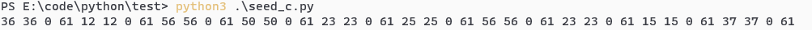
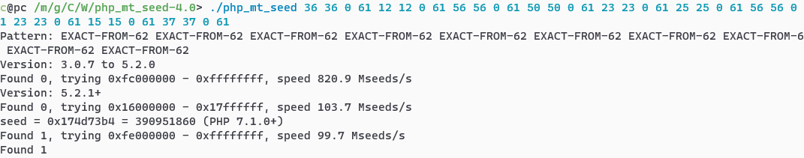
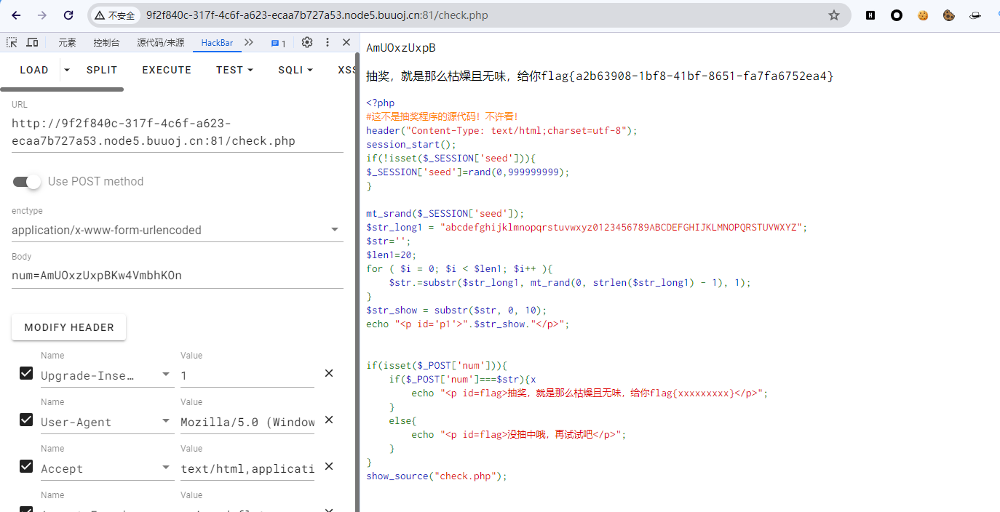

# [GWCTF 2019]枯燥的抽奖

## 知识点

`mt_srand seed爆破`

## 解题

题目首页


源代码中发现`check.php`,看一下`check.php`

```php
AmUOxzUxpB

<?php
#这不是抽奖程序的源代码！不许看！
header("Content-Type: text/html;charset=utf-8");
session_start();
if(!isset($_SESSION['seed'])){
$_SESSION['seed']=rand(0,999999999);
}

mt_srand($_SESSION['seed']);
$str_long1 = "abcdefghijklmnopqrstuvwxyz0123456789ABCDEFGHIJKLMNOPQRSTUVWXYZ";
$str='';
$len1=20;
for ( $i = 0; $i < $len1; $i++ ){
    $str.=substr($str_long1, mt_rand(0, strlen($str_long1) - 1), 1);       
}
$str_show = substr($str, 0, 10);
echo "<p id='p1'>".$str_show."</p>";


if(isset($_POST['num'])){
    if($_POST['num']===$str){x
        echo "<p id=flag>抽奖，就是那么枯燥且无味，给你flag{xxxxxxxxx}</p>";
    }
    else{
        echo "<p id=flag>没抽中哦，再试试吧</p>";
    }
}
show_source("check.php");
```

发现漏洞点在`mt_srand`上,`mt_srand()`函数的作用是给随机数发生器播种，播种会初始化随机数生成器。语法为`mt_srand(seed)`，其`seed`参数为必须。大多数随机数生成器都需要初始种子。在`PHP`中，因为自动完成，所以`mt_srand()`函数的使用是可选的。从 `PHP 4.2.0` 版开始，`seed` 参数变为可选项，当该项为空时，会被设为随时数。播种后`mt_rand`函数就能使用`Mersenne Twister`算法生成随机整数。

但是用这个函数时会存在一些问题，每一次调用`mt_rand()`函数的时候，都会检查一下系统有没有播种,(播种是由`mt_srand()`函数完成的)，当随机种子生成后，后面生成的随机数都会根据这个随机种子生成。所以同一个种子下随机生成的随机数值是相同的。同时，也解释了我们破解随机种子的可行性。如果每次调用`mt_rand()`函数都需要生成一个随机种子的话，那根本就没办法破解。

但现在因为种子值可破解，将目前已知的字符去反推`seed`，首先使用`python`转为`php_mt_seed`可以处理的数据，再利用`php_mt_seed`反推

[参考文章](https://www.cnblogs.com/l0vehzzz/p/16452542.html)

```python
str1='abcdefghijklmnopqrstuvwxyz0123456789ABCDEFGHIJKLMNOPQRSTUVWXYZ'
str2='AmUOxzUxpB'
res=''
for i in range(len(str2)):  
    for j in range(len(str1)):
        if str2[i] == str1[j]:
            res+=str(j)+' '+str(j)+' '+'0'+' '+str(len(str1)-1)+' '
            break
print(res)
```





发现`seed`值为`390951860`,根据之前的源码生成字符串并检验

```php
<?php

mt_srand(390951860);
$str_long1 = "abcdefghijklmnopqrstuvwxyz0123456789ABCDEFGHIJKLMNOPQRSTUVWXYZ";
$str='';
$len1=20;
for ( $i = 0; $i < $len1; $i++ ){
    $str.=substr($str_long1, mt_rand(0, strlen($str_long1) - 1), 1);
}
$str_show = substr($str, 0, 20);
echo "<p id='p1'>".$str_show."</p>";
```



