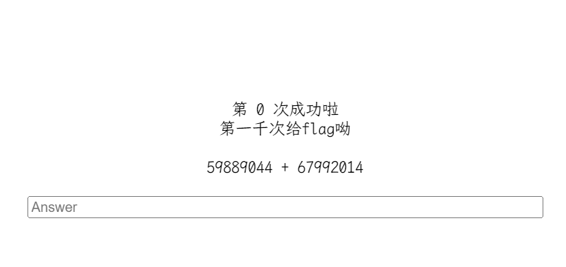

# [GXYCTF2019]StrongestMind

## 知识点

`python`

## 解题

要求计算



抓包看到传值使用`post`传`answer`即可，使用`python`编写脚本 [脚本位置](./Scripts/calc.py)

```python
import requests
from lxml import etree
import time


URL = 'http://eb737ba8-7794-4807-a298-d34f91c43182.node5.buuoj.cn:81/'

answer = ''

def first(session):
    resp = session.get(URL, timeout=8)

    content = resp.content.decode('utf-8')

    xml = etree.HTML(content)

    find_text = xml.xpath('/html/body/center/text()')

    return find_text[3]


def post_answer(calc):
    answer = eval(calc)
    while True:
        resp = session.post(URL, data={"answer": answer}, timeout=8)
        content = resp.content.decode('utf-8')

        xml = etree.HTML(content)

        find_text = xml.xpath('/html/body/center/text()')

        if len(find_text) == 4 or len(find_text) == 5:
            answer = eval(find_text[-1])
            print(f"{find_text[-1]} = {answer}")
            time.sleep(0.29)
        else:
            print(content)
            break

if __name__ == "__main__":
    session = requests.session()
    calc = first(session)
    post_answer(calc)
```

