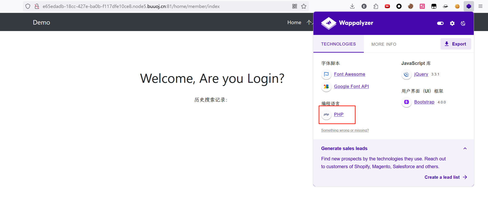
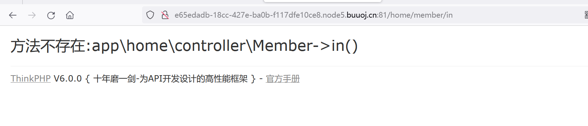
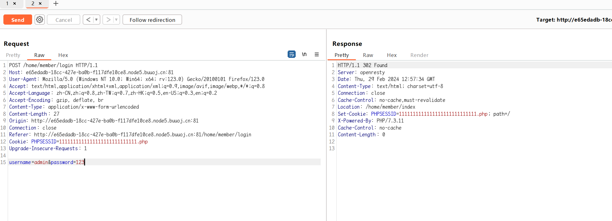
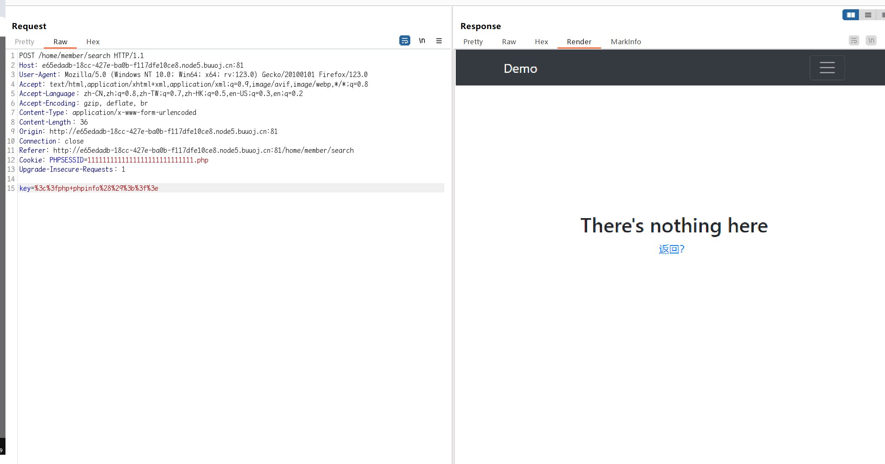
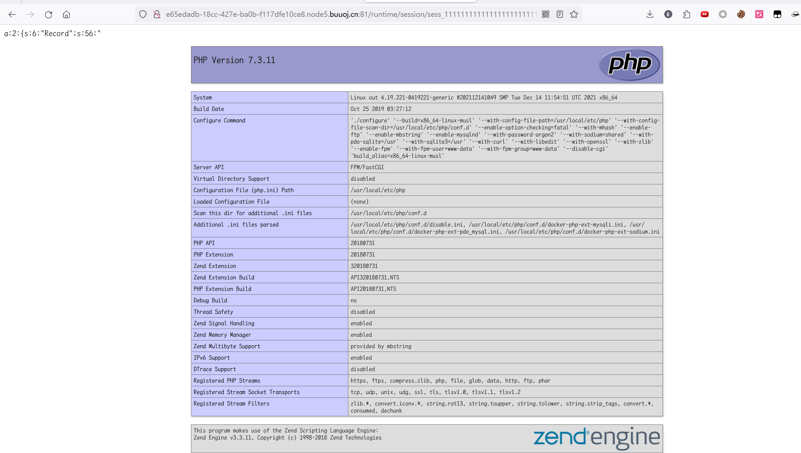
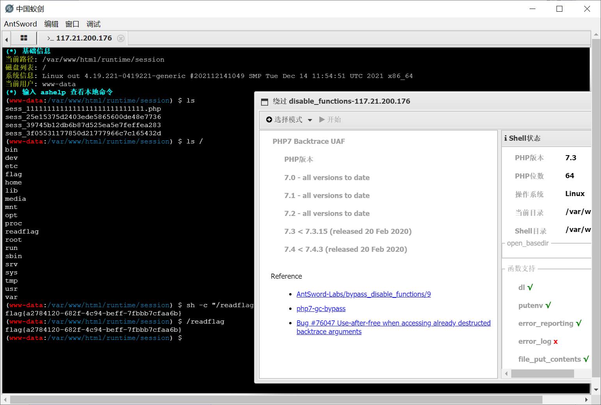

# [GYCTF2020]EasyThinking

## 知识点

`ThinkPHP6.0任意文件写`

## 解题

进入页面发现有`登录`，`注册`，`搜索`


猜测是`二次注入`，构造`payload`发现不是，然后看源码，没有发现什么东西，看了下`url`

```
http://e65edadb-18cc-427e-ba0b-f117dfe10ce8.node5.buuoj.cn:81/home/member/index
```

这样的格式一般是用的`框架`，`wapplyzer`显示编程语言为`php``

`

``php`常见的框架一般是`laravel`和`thinkphp`，输入错的`url`看报错页面



发现是`ThinkPHP V6.0.0`，搜一下历史漏洞发现有任意文件写入漏洞，

[参考文章](https://github.com/Mochazz/ThinkPHP-Vuln/blob/master/ThinkPHP6/ThinkPHP6.0%E4%BB%BB%E6%84%8F%E6%96%87%E4%BB%B6%E5%86%99.md)

[参考文章2](https://syunaht.com/p/3292983066.html)

构造`payload`

登录的时候`PHPSESSID`就需要为`shell`文件名，且加上`.php`长度共为`32`





最后再`runtime/session/sess_1111111111111111111111111111.php`可以看到执行结果



构造`shell`蚁剑连接即可，执行命令时发现被`disable_functions`了，使用蚁剑的插件`bypass`即可

